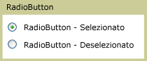

# RadioButton
I controlli <xref:System.Windows.Controls.RadioButton> in genere vengono raggruppati in modo da offrire agli utenti un'unica scelta tra più opzioni; è possibile selezionare solo un pulsante per volta.  
  
 Nell'immagine seguente viene mostrato un esempio di un controllo <xref:System.Windows.Controls.RadioButton>.  
  
   
RadioButton standard  
  
## Riferimenti  
 <xref:System.Windows.Controls.Primitives.ToggleButton>  
  
## Sezioni correlate