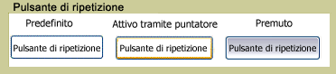

# RepeatButton
<xref:System.Windows.Controls.Primitives.RepeatButton> è simile a <xref:System.Windows.Controls.Button>.  Tuttavia, gli elementi <xref:System.Windows.Controls.Primitives.RepeatButton> consentono di controllare il momento e la modalità in cui viene generato l'evento <xref:System.Windows.Controls.Primitives.ButtonBase.Click>.  
  
 Nell'elemento grafico riportato di seguito viene illustrato un esempio dei tre stati di un controllo dei pulsanti di ripetizione, Default, PointerFocused e Pressed.  Nel primo pulsante viene illustrato lo stato predefinito di <xref:System.Windows.Controls.Primitives.RepeatButton>.  Nel secondo viene illustrato il modo in cui viene modificato l’aspetto del pulsante quando il puntatore del mouse viene posizionato su di esso, impostando lo stato attivo.  Nell’ultimo pulsante viene illustrato l’aspetto di <xref:System.Windows.Controls.Primitives.RepeatButton> quando l'utente preme il pulsante del mouse sul controllo.  
  
   
RepeatButton tipico  
  
## In questa sezione  
  
## Riferimenti  
 <xref:System.Windows.Controls.Primitives.RepeatButton>  
  
## Sezioni correlate