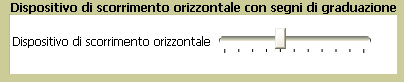

# Dispositivo di scorrimento
L'oggetto <xref:System.Windows.Controls.Slider> consente all'utente di effettuare una selezione da un intervallo di valori spostando un oggetto <xref:System.Windows.Controls.Primitives.Thumb> in un oggetto <xref:System.Windows.Controls.Primitives.Track>.  
  
 Nella figura seguente viene illustrato un esempio di un controllo <xref:System.Windows.Controls.Slider> orizzontale.  
  
   
  
## In questa sezione  
 [Personalizzare i segni di graduazione di un oggetto Slider](../../../../docs/framework/wpf/controls/how-to-customize-the-ticks-on-a-slider.md)  
  
## Riferimenti  
 <xref:System.Windows.Controls.Slider>  
 <xref:System.Windows.Controls.Primitives.Track>  
 <xref:System.Windows.Controls.Primitives.Thumb>