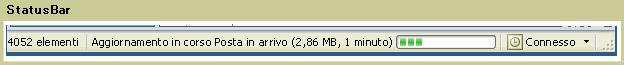

# StatusBar
Un oggetto <xref:System.Windows.Controls.Primitives.StatusBar> è un'area orizzontale situata nella parte inferiore di una finestra in cui un'applicazione può visualizzare le informazioni sullo stato.  
  
 Nella figura seguente viene illustrato un esempio di un oggetto <xref:System.Windows.Controls.Primitives.StatusBar>.  
  
   
  
## In questa sezione  
  
## Riferimenti  
 <xref:System.Windows.Controls.Primitives.StatusBar>  
 <xref:System.Windows.Controls.Primitives.StatusBarItem>  
  
## Sezioni correlate