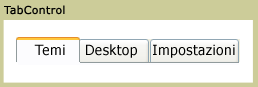

# TabControl
Negli elementi <xref:System.Windows.Controls.TabControl> viene visualizzato il contenuto in pagine discrete a cui si accede selezionando la scheda appropriata.  Ogni scheda contiene <xref:System.Windows.Controls.TabItem>.  
  
 Nell'immagine riportata di seguito viene illustrato <xref:System.Windows.Controls.TabControl>.  
  
   
TabControl tipico  
  
## Riferimenti  
 <xref:System.Windows.Controls.TabControl>  
 <xref:System.Windows.Controls.TabItem>  
  
## Sezioni correlate