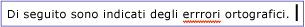
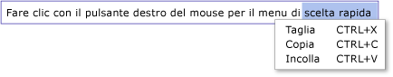

# Cenni preliminari sulla classe TextBox
La classe <xref:System.Windows.Controls.TextBox> consente di visualizzare o modificare testo non formattato.  Un utilizzo comune di un controllo <xref:System.Windows.Controls.TextBox> consiste nel modificare testo non formattato in un form.  Ad esempio, un form in cui viene richiesto di immettere il nome utente, il numero di telefono e così via richiede l'utilizzo dei controlli <xref:System.Windows.Controls.TextBox> per l'input di testo.  In questo argomento viene presentata la classe <xref:System.Windows.Controls.TextBox> e vengono forniti esempi del relativo utilizzo sia in [!INCLUDE[TLA#tla_xaml](../../../../includes/tlasharptla-xaml-md.md)] che in [!INCLUDE[TLA#tla_lhcshrp](../../../../includes/tlasharptla-lhcshrp-md.md)].  
  
   
  
   
## TextBox o RichTextBox?  
 <xref:System.Windows.Controls.TextBox> e <xref:System.Windows.Controls.RichTextBox> consentono entrambi di immettere testo, ma sono applicabili a scenari diversi.  Un controllo <xref:System.Windows.Controls.TextBox> richiede una quantità inferiore di risorse di sistema rispetto a <xref:System.Windows.Controls.RichTextBox>, pertanto è la scelta ideale per la modifica di testo normale \(utilizzo nei form\).  <xref:System.Windows.Controls.RichTextBox> rappresenta una scelta migliore quando è necessario modificare testo formattato, immagini, tabelle o altro contenuto supportato.  Ad esempio, per eseguire la modifica di un documento, di un articolo o di un blog che richiede una formattazione, delle immagini e così via è più opportuno utilizzare un controllo <xref:System.Windows.Controls.RichTextBox>.  Nella tabella riportata di seguito vengono riepilogate le funzionalità principali di <xref:System.Windows.Controls.TextBox> e <xref:System.Windows.Controls.TextBox>.  
  
|Controllo|Controllo ortografico in tempo reale|Menu di scelta rapida|Comandi di formattazione quale <xref:System.Windows.Documents.EditingCommands.ToggleBold%2A> \(Ctr\+B\)|Contenuto <xref:System.Windows.Documents.FlowDocument>, ad esempio immagini, paragrafi, tabelle e così via|  
|---------------|------------------------------------------|---------------------------|------------------------------------------------------------------------------------------------------------------------------------------------------------------------------------------------------------|------------------------------------------------------------------------------------------------------------------------------------------------------------------------------------------------------------------|  
|<xref:System.Windows.Controls.TextBox>|Sì|Sì|No|No.|  
|<xref:System.Windows.Controls.RichTextBox>|Sì|Sì|Sì \(vedere [Cenni generali sul controllo RichTextBox](../../../../docs/framework/wpf/controls/richtextbox-overview.md)\)|Sì \(vedere [Cenni generali sul controllo RichTextBox](../../../../docs/framework/wpf/controls/richtextbox-overview.md)\)|  
  
> [!NOTE]
>  Sebbene <xref:System.Windows.Controls.TextBox> non supporti i comandi di modifica correlati alla formattazione quale <xref:System.Windows.Documents.EditingCommands.ToggleBold%2A> \(Ctr\+B\), molti comandi di base sono supportati da entrambi i controlli, ad esempio <xref:System.Windows.Documents.EditingCommands.MoveToLineEnd%2A>.  Per ulteriori informazioni, vedere <xref:System.Windows.Documents.EditingCommands>.  
  
 Le funzionalità supportate da <xref:System.Windows.Controls.TextBox> vengono illustrate nelle sezioni che seguono.  Per ulteriori informazioni su <xref:System.Windows.Controls.RichTextBox>, vedere [Cenni generali sul controllo RichTextBox](../../../../docs/framework/wpf/controls/richtextbox-overview.md).  
  
### Controllo ortografico in tempo reale  
 È possibile abilitare il controllo ortografico in tempo reale in un controllo <xref:System.Windows.Controls.TextBox> o <xref:System.Windows.Controls.RichTextBox>.  Quando il controllo ortografico è attivo, viene visualizzata una linea rossa sotto le parole che presentano errori ortografici \(vedere l'immagine riportata di seguito\).  
  
   
  
 Per apprendere la modalità di abilitazione del controllo ortografico, vedere [Attivare il controllo ortografico in un controllo di modifica del testo](../../../../docs/framework/wpf/controls/how-to-enable-spell-checking-in-a-text-editing-control.md).  
  
### Menu di scelta rapida  
 Per impostazione predefinita, gli oggetti <xref:System.Windows.Controls.TextBox> e <xref:System.Windows.Controls.RichTextBox> dispongono di un menu di scelta rapida che viene visualizzato quando un utente fa clic con il pulsante destro del mouse nel controllo.  Il menu di scelta rapida consente all'utente di eseguire operazioni come Taglia, Copia o Incolla \(vedere l'immagine di seguito\).  
  
   
  
 È possibile creare un menu di scelta rapida personalizzato per eseguire l'override di quello predefinito.  Per ulteriori informazioni, vedere [Utilizzare un menu di scelta rapida personalizzato con un oggetto TextBox](../../../../docs/framework/wpf/controls/how-to-use-a-custom-context-menu-with-a-textbox.md).  
  
   
## Creazione di caselle di testo  
 Un controllo <xref:System.Windows.Controls.TextBox> può essere dato da una sola riga in altezza o comprendere più righe.  Un controllo <xref:System.Windows.Controls.TextBox> a riga singola è più appropriato per l'immissione di piccole quantità di testo normale \(ovvero "  Nome", "Numero di telefono" e così via  in un form\).  Nell'esempio riportato di seguito viene illustrato come creare un controllo <xref:System.Windows.Controls.TextBox> a riga singola.  
  
 [!code-xml[TextBoxMiscSnippets_snip#BasicTextBoxExampleWholePage](../../../../samples/snippets/csharp/VS_Snippets_Wpf/TextBoxMiscSnippets_snip/csharp/basictextboxexample.xaml#basictextboxexamplewholepage)]  
  
 È anche possibile creare un controllo <xref:System.Windows.Controls.TextBox> che consenta all'utente di immettere più righe di testo.  Se nel form veniva richiesto di immettere alcuni cenni biografici dell'utente, utilizzare un controllo <xref:System.Windows.Controls.TextBox> che supporti più righe di testo.  Nell'esempio riportato di seguito viene illustrato come utilizzare [!INCLUDE[TLA#tla_xaml](../../../../includes/tlasharptla-xaml-md.md)] per definire un controllo <xref:System.Windows.Controls.TextBox> che si espanda automaticamente per inserire più righe di testo.  
  
 [!code-xml[TextBox_MiscCode#_MultilineTextBoxXAML](../../../../samples/snippets/csharp/VS_Snippets_Wpf/TextBox_MiscCode/CSharp/Window1.xaml#_multilinetextboxxaml)]  
  
 Impostando l'attributo <xref:System.Windows.Controls.TextBox.TextWrapping%2A> su `Wrap`, il testo immesso va a capo in una nuova riga quando viene raggiunto il bordo del controllo <xref:System.Windows.Controls.TextBox>, espandendo automaticamente l'altezza del controllo <xref:System.Windows.Controls.TextBox> per includere eventualmente spazio per una riga nuova.  
  
 Impostando l'attributo <xref:System.Windows.Controls.Primitives.TextBoxBase.AcceptsReturn%2A> su `true` viene inserita una nuova riga quando viene premuto il tasto INVIO e anche in questo caso il controllo <xref:System.Windows.Controls.TextBox> si espande automaticamente per inserire, se necessario, una nuova riga.  
  
 L'attributo <xref:System.Windows.Controls.Primitives.TextBoxBase.VerticalScrollBarVisibility%2A> consente di aggiungere una barra di scorrimento al controllo <xref:System.Windows.Controls.TextBox>, affinché sia possibile scorrere il contenuto del controllo <xref:System.Windows.Controls.TextBox> qualora <xref:System.Windows.Controls.TextBox> si espanda oltre il frame o la finestra che lo contiene.  
  
 Per ulteriori informazioni sulle diverse attività correlate all'utilizzo di un controllo <xref:System.Windows.Controls.TextBox>, vedere [Procedure relative](../../../../docs/framework/wpf/controls/textbox-how-to-topics.md).  
  
   
## Rilevare le modifiche di contenuto  
 Per rilevare eventuali modifiche nel testo in un controllo <xref:System.Windows.Controls.TextBox> o <xref:System.Windows.Controls.RichTextBox> viene in genere utilizzato l'evento <xref:System.Windows.Controls.Primitives.TextBoxBase.TextChanged> e non <xref:System.Windows.UIElement.KeyDown>, come ci si potrebbe aspettare.  Per un esempio, vedere [Rilevare eventuali modifiche del testo in un oggetto TextBox](../../../../docs/framework/wpf/controls/how-to-detect-when-text-in-a-textbox-has-changed.md).  
  
## Vedere anche  
 [Procedure relative](../../../../docs/framework/wpf/controls/textbox-how-to-topics.md)   
 [Cenni generali sul controllo RichTextBox](../../../../docs/framework/wpf/controls/richtextbox-overview.md)