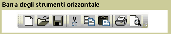
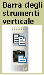

# ToolBar
Il controllo <xref:System.Windows.Controls.ToolBar> è un contenitore di un gruppo di comandi o controlli le cui funzioni sono in genere correlate.  
  
 Nelle figure seguenti vengono illustrati i controlli <xref:System.Windows.Controls.ToolBar> orizzontale e verticale.  
  
   
Barra degli strumenti orizzontale  
  
   
Barra degli strumenti verticale  
  
## In questa sezione  
 [Cenni preliminari sui controlli ToolBar](../../../../docs/framework/wpf/controls/toolbar-overview.md)  
 [Applicare uno stile ai controlli di un oggetto ToolBar](../../../../docs/framework/wpf/controls/how-to-style-controls-on-a-toolbar.md)  
  
## Riferimenti  
 <xref:System.Windows.Controls.ToolBar>  
 <xref:System.Windows.Controls.ToolBarTray>  
  
## Sezioni correlate