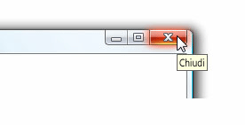

# Descrizione comando
Una descrizione comandi è una piccola finestra popup che viene visualizzata quando l'utente posiziona il puntatore del mouse su un elemento, ad esempio <xref:System.Windows.Controls.Button>.  
  
 Nell'immagine seguente viene mostrato un puntatore del mouse che punta all'oggetto <xref:System.Windows.Controls.Button> **Chiudi**, che quindi visualizza il relativo oggetto <xref:System.Windows.Controls.ToolTip> di identificazione.  
  
 Pulsante Chiudi con la descrizione comandi visualizzata  
  
   
  
## In questa sezione  
 [Panoramica sul controllo ToolTip](../../../../docs/framework/wpf/controls/tooltip-overview.md)  
 [Procedure relative](../../../../docs/framework/wpf/controls/tooltip-how-to-topics.md)  
  
## Riferimenti  
 <xref:System.Windows.Controls.ToolTip>  
 <xref:System.Windows.Controls.ToolTipService>  
 <xref:System.Windows.Controls.Primitives.Popup>  
  
## Sezioni correlate  
 [Cenni preliminari sul controllo Popup](../../../../docs/framework/wpf/controls/popup-overview.md)  
 [Procedure relative](../../../../docs/framework/wpf/controls/popup-how-to-topics.md)