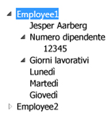

# TreeView
Il controllo <xref:System.Windows.Controls.TreeView> consente di visualizzare informazioni in una struttura gerarchica utilizzando nodi comprimibili.  
  
 La figura seguente è un esempio di un controllo <xref:System.Windows.Controls.TreeView> che dispone di controlli <xref:System.Windows.Controls.TreeViewItem> annidati.  
  
   
  
## In questa sezione  
 [Cenni preliminari sul controllo TreeView](../../../../docs/framework/wpf/controls/treeview-overview.md)  
 [Procedure relative](../../../../docs/framework/wpf/controls/treeview-how-to-topics.md)  
  
## Riferimenti  
 <xref:System.Windows.Controls.TreeView>  
 <xref:System.Windows.Controls.TreeViewItem>  
  
## Sezioni correlate  
 [Cenni preliminari sull'associazione dati](../../../../docs/framework/wpf/data/data-binding-overview.md)  
 [Cenni preliminari sui modelli di dati](../../../../docs/framework/wpf/data/data-templating-overview.md)