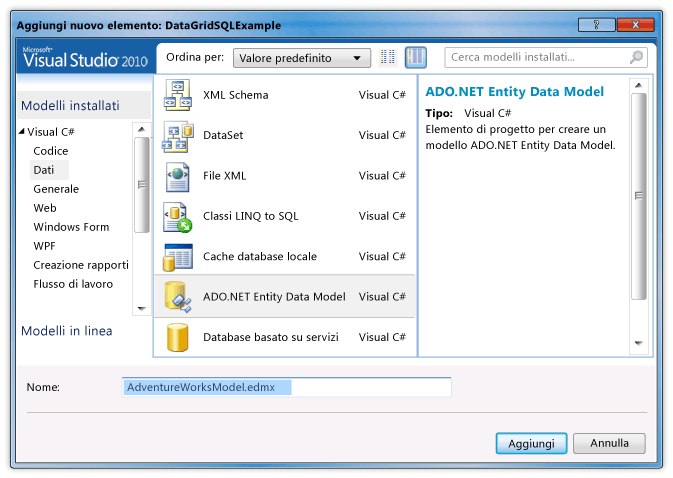
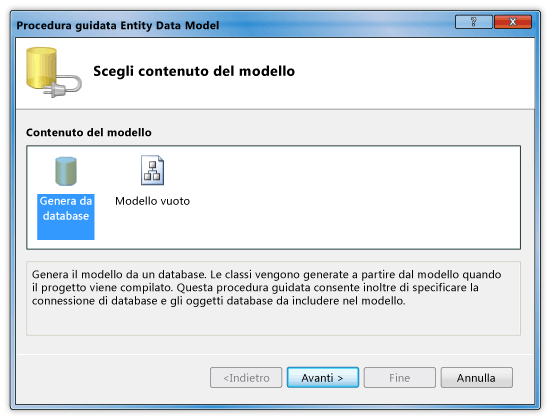
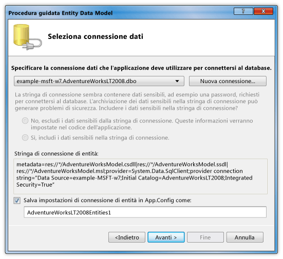
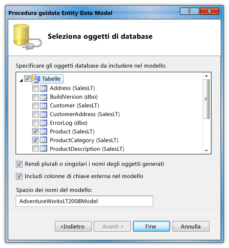
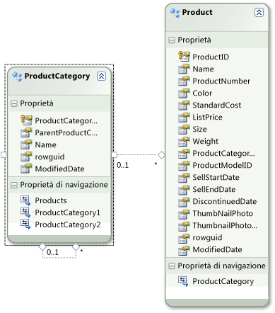
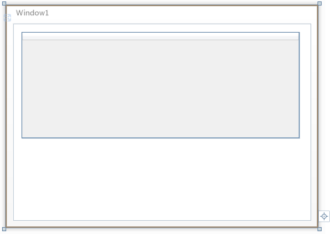

# Procedura dettagliata: aggiunta di dati di un database di SQL Server in un controllo DataGrid
Questa procedura dettagliata consente di recuperare dati da un database di SQL Server e di visualizzarli in un controllo <xref:System.Windows.Controls.DataGrid>.  Si utilizzano ADO.NET Entity Framework per creare le classi di identità che rappresentano i dati e LINQ per scrivere una query che recupera i dati specificati da una classe di identità.  
  
## Prerequisiti  
 Per completare la procedura dettagliata, è necessario disporre dei componenti seguenti:  
  
-   [!INCLUDE[vs_dev11_long](../../../../includes/vs-dev11-long-md.md)].  
  
-   Istanza in esecuzione di SQL Server o SQL Server Express a cui è collegato il database di esempio AdventureWorksLT2008 e cui è possibile accedere.  È possibile scaricare il database AdventureWorksLT2008 dal [sito Web CodePlex](http://go.microsoft.com/fwlink/?LinkId=159848) \(la pagina potrebbe essere in inglese\).  
  
### Per creare le classi di entità  
  
1.  Creare un nuovo progetto di applicazione WPF in Visual Basic o C\# e denominarlo `DataGridSQLExample`.  
  
2.  In Esplora soluzioni fare clic con il pulsante destro del mouse sul progetto, scegliere **Aggiungi**, quindi selezionare **Nuovo elemento**.  
  
     Verrà visualizzata la finestra di dialogo Aggiungi nuovo elemento.  
  
3.  Nel riquadro Modelli installati selezionare **Dati**, quindi selezionare **ADO.NET Entity Data Model** nell'elenco dei modelli.  
  
       
  
4.  Assegnare al file il nome `AdventureWorksModel.edmx`, quindi fare clic su **Aggiungi**.  
  
     Verrà visualizzata la procedura guidata Entity Data Model.  
  
5.  Nella schermata **Scegli contenuto Model** fare clic su **Genera da database**, quindi su Avanti.  
  
       
  
6.  Nella schermata Seleziona connessione dati specificare la connessione al database AdventureWorksLT2008.  Per ulteriori informazioni, vedere [Finestra di dialogo Scegliere la connessione dati](http://go.microsoft.com/fwlink/?LinkId=160190).  
  
       
  
7.  Verificare che il nome sia `AdventureWorksLT2008Entities` e che l'opzione **Salva impostazioni di connessione dell'entità in App.Config come** sia selezionata, quindi fare clic su **Avanti**.  
  
8.  Nella schermata Seleziona oggetti di database espandere il nodo Tabelle e selezionare le tabelle **Product** e **ProductCategory**.  
  
     È possibile generare classi di identità per tutte le tabelle. In questo esempio verranno tuttavia recuperati i dati solo da queste due tabelle.  
  
       
  
9. Fare clic su **Fine**.  
  
     Le entità Product e ProductCategory verranno visualizzate in Entity Designer.  
  
       
  
### Per recuperare e presentare i dati  
  
1.  Aprire il file MainWindow.xaml.  
  
2.  Impostare la proprietà <xref:System.Windows.FrameworkElement.Width%2A> dell'oggetto <xref:System.Windows.Window> su 450.  
  
3.  Nell'editor XAML aggiungere il seguente tag <xref:System.Windows.Controls.DataGrid> tra i tag `<Grid>` e `</Grid>` per aggiungere un oggetto <xref:System.Windows.Controls.DataGrid> denominato `dataGrid1`.  
  
     [!code-xml[DataGrid_SQL_EF_Walkthrough#3](../../../../samples/snippets/csharp/VS_Snippets_Wpf/DataGrid_SQL_EF_Walkthrough/CS/MainWindow.xaml#3)]  
  
       
  
4.  Selezionare <xref:System.Windows.Window>.  
  
5.  Tramite la finestra Proprietà o l'editor XAML, creare un gestore eventi per l'oggetto <xref:System.Windows.Window> denominato `Window_Loaded` per l'evento <xref:System.Windows.FrameworkElement.Loaded>.  Per ulteriori informazioni, vedere [Procedura: creare un gestore eventi semplice](http://msdn.microsoft.com/it-it/b1456e07-9dec-4354-99cf-18666b64f480).  
  
     Di seguito viene illustrato il codice XAML di MainWindow.xaml.  
  
    > [!NOTE]
    >  Se si utilizza Visual Basic, nella prima riga di MainWindow.xaml sostituire `x:Class="DataGridSQLExample.MainWindow"` con `x:Class="MainWindow"`.  
  
     [!code-xml[DataGrid_SQL_EF_Walkthrough#1](../../../../samples/snippets/csharp/VS_Snippets_Wpf/DataGrid_SQL_EF_Walkthrough/CS/MainWindow.xaml#1)]  
  
6.  Aprire il file code\-behind \(MainWindow.xaml.vb o MainWindow.xaml.cs\) per <xref:System.Windows.Window>.  
  
7.  Aggiungere il codice seguente per recuperare solo valori specifici dalle tabelle unite e impostare la proprietà <xref:System.Windows.Controls.ItemsControl.ItemsSource%2A> dell'oggetto <xref:System.Windows.Controls.DataGrid> sui risultati della query.  
  
     [!code-csharp[DataGrid_SQL_EF_Walkthrough#2](../../../../samples/snippets/csharp/VS_Snippets_Wpf/DataGrid_SQL_EF_Walkthrough/CS/MainWindow.xaml.cs#2)]
     [!code-vb[DataGrid_SQL_EF_Walkthrough#2](../../../../samples/snippets/visualbasic/VS_Snippets_Wpf/DataGrid_SQL_EF_Walkthrough/VB/MainWindow.xaml.vb#2)]  
  
8.  Eseguire l'esempio.  
  
     Verrà visualizzato un oggetto <xref:System.Windows.Controls.DataGrid> contenente i dati.  
  
       
  
## Passaggi successivi  
  
## Vedere anche  
 <xref:System.Windows.Controls.DataGrid>   
 [Ricerca per categorie: Iniziare con Entity Framework nelle applicazioni WPF?](http://go.microsoft.com/fwlink/?LinkId=159868)