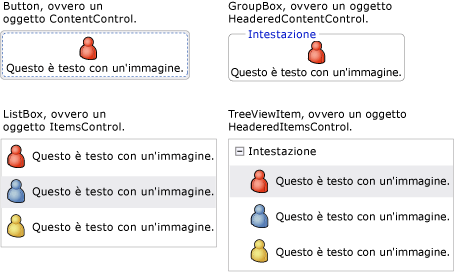
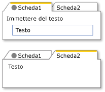
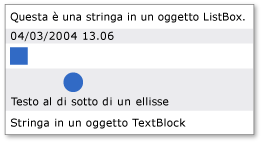
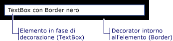

# Modello di contenuto WPF
[!INCLUDE[TLA#tla_winclient](../../../../includes/tlasharptla-winclient-md.md)] è una piattaforma di presentazione che fornisce molti controlli e molti tipi simili ai controlli con lo scopo principale di visualizzare tipi di contenuto diversi.  Per determinare quale controllo utilizzare o da quale controllo eseguire la derivazione, è necessario comprendere i tipi di oggetti che possono essere visualizzati in modo ottimale da un determinato controllo.  
  
 In questo argomento viene riepilogato il modello di contenuto per il controllo [!INCLUDE[TLA2#tla_winclient](../../../../includes/tla2sharptla-winclient-md.md)] e i tipi di controllo simili.  Il modello di contenuto descrive il contenuto che può essere utilizzato in un controllo. In questo argomento sono inoltre elencate le proprietà di contenuto per ogni modello di contenuto.  Una proprietà di contenuto è una proprietà utilizzata per archiviare il contenuto dell'oggetto.  
  
 [!INCLUDE[autoOutline](../Token/autoOutline_md.md)]  
  
   
## Classi che contengono contenuto arbitrario  
 Alcuni controlli possono contenere un oggetto di qualsiasi tipo, ad esempio una stringa, un oggetto <xref:System.DateTime> o un oggetto <xref:System.Windows.UIElement> che rappresenta un contenitore di elementi aggiuntivi.  Un oggetto <xref:System.Windows.Controls.Button> può ad esempio contenere un'immagine e testo, mentre un oggetto <xref:System.Windows.Controls.CheckBox> può contenere il valore di <xref:System.DateTime.Now%2A?displayProperty=fullName>.  
  
 [!INCLUDE[TLA2#tla_winclient](../../../../includes/tla2sharptla-winclient-md.md)] dispone di quattro classi che possono includere contenuto arbitrario.  Nella tabella seguente sono elencate le classi, le quali ereditano da <xref:System.Windows.Controls.Control>.  
  
|Classe che contiene contenuto arbitrario|Contenuto|  
|----------------------------------------------|---------------|  
|<xref:System.Windows.Controls.ContentControl>|Un singolo oggetto arbitrario.|  
|<xref:System.Windows.Controls.HeaderedContentControl>|Un'intestazione e un singolo elemento, costituiti entrambi da oggetti arbitrari.|  
|<xref:System.Windows.Controls.ItemsControl>|Una raccolta di oggetti arbitrari.|  
|<xref:System.Windows.Controls.HeaderedItemsControl>|Un'intestazione e una raccolta di elementi, tutti costituiti da oggetti arbitrari.|  
  
 I controlli che ereditano da queste classi possono contenere lo stesso tipo di contenuto e gestiscono il contenuto nello stesso modo.  Nell'immagine seguente viene illustrato un controllo di ogni modello di contenuto contenente un'immagine e testo.  
  
   
  
### Controlli che contengono un singolo oggetto arbitrario  
 La classe <xref:System.Windows.Controls.ContentControl> contiene una singola parte di contenuto arbitrario.  La proprietà di contenuto corrispondente è <xref:System.Windows.Controls.ContentControl.Content%2A>.  I controlli seguenti ereditano da <xref:System.Windows.Controls.ContentControl> e utilizzano il relativo modello di contenuto:  
  
-   <xref:System.Windows.Controls.Button>  
  
-   <xref:System.Windows.Controls.Primitives.ButtonBase>  
  
-   <xref:System.Windows.Controls.CheckBox>  
  
-   <xref:System.Windows.Controls.ComboBoxItem>  
  
-   <xref:System.Windows.Controls.ContentControl>  
  
-   <xref:System.Windows.Controls.Frame>  
  
-   <xref:System.Windows.Controls.GridViewColumnHeader>  
  
-   <xref:System.Windows.Controls.GroupItem>  
  
-   <xref:System.Windows.Controls.Label>  
  
-   <xref:System.Windows.Controls.ListBoxItem>  
  
-   <xref:System.Windows.Controls.ListViewItem>  
  
-   <xref:System.Windows.Navigation.NavigationWindow>  
  
-   <xref:System.Windows.Controls.RadioButton>  
  
-   <xref:System.Windows.Controls.Primitives.RepeatButton>  
  
-   <xref:System.Windows.Controls.ScrollViewer>  
  
-   <xref:System.Windows.Controls.Primitives.StatusBarItem>  
  
-   <xref:System.Windows.Controls.Primitives.ToggleButton>  
  
-   <xref:System.Windows.Controls.ToolTip>  
  
-   <xref:System.Windows.Controls.UserControl>  
  
-   <xref:System.Windows.Window>  
  
 Nell'illustrazione seguente vengono illustrati quattro pulsanti la cui proprietà <xref:System.Windows.Controls.ContentControl.Content%2A> è impostata su una stringa, un oggetto <xref:System.DateTime>, un oggetto <xref:System.Windows.Shapes.Rectangle> e un oggetto <xref:System.Windows.Controls.Panel> che contengono un oggetto <xref:System.Windows.Shapes.Ellipse> e un oggetto <xref:System.Windows.Controls.TextBlock>.  
  
   
Quattro pulsanti che dispongono di tipi di contenuto diversi  
  
 Per un esempio relativo all'impostazione della proprietà <xref:System.Windows.Controls.ContentControl.Content%2A>, vedere <xref:System.Windows.Controls.ContentControl>.  
  
### Controlli che contengono un'intestazione e un singolo oggetto arbitrario  
 La classe <xref:System.Windows.Controls.HeaderedContentControl> eredita da <xref:System.Windows.Controls.ContentControl> e consente la visualizzazione di contenuto con un'intestazione.  Eredita la proprietà di contenuto, <xref:System.Windows.Controls.ContentControl.Content%2A>, da <xref:System.Windows.Controls.ContentControl> e definisce la proprietà <xref:System.Windows.Controls.HeaderedContentControl.Header%2A>, che è di tipo <xref:System.Object>; pertanto, entrambe possono essere costituite da un oggetto arbitrario.  
  
 I controlli seguenti ereditano da <xref:System.Windows.Controls.HeaderedContentControl> e utilizzano il relativo modello di contenuto:  
  
-   <xref:System.Windows.Controls.Expander>  
  
-   <xref:System.Windows.Controls.GroupBox>  
  
-   <xref:System.Windows.Controls.TabItem>  
  
 Nell'immagine seguente vengono illustrati due oggetti <xref:System.Windows.Controls.TabItem>.  Il primo oggetto <xref:System.Windows.Controls.TabItem> dispone di oggetti <xref:System.Windows.UIElement> come <xref:System.Windows.Controls.HeaderedContentControl.Header%2A> e <xref:System.Windows.Controls.ContentControl.Content%2A>.  <xref:System.Windows.Controls.HeaderedContentControl.Header%2A> è impostato su un oggetto <xref:System.Windows.Controls.StackPanel> che contiene <xref:System.Windows.Shapes.Ellipse> e <xref:System.Windows.Controls.TextBlock>.  <xref:System.Windows.Controls.ContentControl.Content%2A> è impostato su un oggetto <xref:System.Windows.Controls.StackPanel> che contiene <xref:System.Windows.Controls.TextBlock> e <xref:System.Windows.Controls.Label>.  Il secondo oggetto <xref:System.Windows.Controls.TabItem> dispone di una stringa in <xref:System.Windows.Controls.HeaderedContentControl.Header%2A> e di <xref:System.Windows.Controls.TextBlock> in <xref:System.Windows.Controls.ContentControl.Content%2A>.  
  
   
TabControl che utilizza tipi diversi nella proprietà Header  
  
 Per un esempio relativo alla creazione di oggetti <xref:System.Windows.Controls.TabItem>, vedere <xref:System.Windows.Controls.HeaderedContentControl>.  
  
### Controlli che contengono una raccolta di oggetti arbitrari  
 La classe <xref:System.Windows.Controls.ItemsControl> eredita da <xref:System.Windows.Controls.Control> e può contenere più elementi, ad esempio stringhe, oggetti o altri elementi.  Le proprietà di contenuto corrispondenti sono <xref:System.Windows.Controls.ItemsControl.ItemsSource%2A> e <xref:System.Windows.Controls.ItemsControl.Items%2A>.  <xref:System.Windows.Controls.ItemsControl.ItemsSource%2A> viene in genere utilizzato per popolare <xref:System.Windows.Controls.ItemsControl> con una raccolta di dati.  Se non si desidera utilizzare una raccolta per popolare <xref:System.Windows.Controls.ItemsControl>, è possibile aggiungere elementi utilizzando la proprietà <xref:System.Windows.Controls.ItemsControl.Items%2A>.  
  
 I controlli seguenti ereditano da <xref:System.Windows.Controls.ItemsControl> e utilizzano il relativo modello di contenuto:  
  
-   <xref:System.Windows.Controls.Menu>  
  
-   <xref:System.Windows.Controls.Primitives.MenuBase>  
  
-   <xref:System.Windows.Controls.ContextMenu>  
  
-   <xref:System.Windows.Controls.ComboBox>  
  
-   <xref:System.Windows.Controls.ItemsControl>  
  
-   <xref:System.Windows.Controls.ListBox>  
  
-   <xref:System.Windows.Controls.ListView>  
  
-   <xref:System.Windows.Controls.TabControl>  
  
-   <xref:System.Windows.Controls.TreeView>  
  
-   <xref:System.Windows.Controls.Primitives.Selector>  
  
-   <xref:System.Windows.Controls.Primitives.StatusBar>  
  
 Nell'immagine seguente viene illustrato un controllo <xref:System.Windows.Controls.ListBox> contenente i tipi di elementi seguenti:  
  
-   Stringa.  
  
-   Oggetto <xref:System.DateTime>.  
  
-   Oggetto <xref:System.Windows.UIElement>.  
  
-   <xref:System.Windows.Controls.Panel> contenente oggetti <xref:System.Windows.Shapes.Ellipse> e <xref:System.Windows.Controls.TextBlock>.  
  
   
Oggetto ListBox contenente più tipi di oggetti  
  
### Controlli che contengono un'intestazione e una raccolta di oggetti arbitrari  
 La classe <xref:System.Windows.Controls.HeaderedItemsControl> eredita da <xref:System.Windows.Controls.ItemsControl> e può contenere più elementi, ad esempio stringhe, oggetti o altri elementi e un'intestazione.  Eredita le proprietà di contenuto dell'oggetto <xref:System.Windows.Controls.ItemsControl>, ovvero <xref:System.Windows.Controls.ItemsControl.ItemsSource%2A> e <xref:System.Windows.Controls.ItemsControl.Items%2A> e definisce la proprietà <xref:System.Windows.Controls.HeaderedItemsControl.Header%2A> che può essere costituita da un oggetto arbitrario.  
  
 I controlli seguenti ereditano da <xref:System.Windows.Controls.HeaderedItemsControl> e utilizzano il relativo modello di contenuto:  
  
-   <xref:System.Windows.Controls.MenuItem>  
  
-   <xref:System.Windows.Controls.ToolBar>  
  
-   <xref:System.Windows.Controls.TreeViewItem>  
  
   
## Classi che contengono una raccolta di oggetti UIElement  
 La classe <xref:System.Windows.Controls.Panel> consente di posizionare e disporre oggetti <xref:System.Windows.UIElement> figlio.  La proprietà di contenuto corrispondente è <xref:System.Windows.Controls.Panel.Children%2A>.  
  
 Le classi seguenti ereditano dalla classe <xref:System.Windows.Controls.Panel> e utilizzano il relativo modello di contenuto:  
  
-   <xref:System.Windows.Controls.Canvas>  
  
-   <xref:System.Windows.Controls.DockPanel>  
  
-   <xref:System.Windows.Controls.Grid>  
  
-   <xref:System.Windows.Controls.Primitives.TabPanel>  
  
-   <xref:System.Windows.Controls.Primitives.ToolBarOverflowPanel>  
  
-   <xref:System.Windows.Controls.Primitives.ToolBarPanel>  
  
-   <xref:System.Windows.Controls.Primitives.UniformGrid>  
  
-   <xref:System.Windows.Controls.StackPanel>  
  
-   <xref:System.Windows.Controls.VirtualizingPanel>  
  
-   <xref:System.Windows.Controls.VirtualizingStackPanel>  
  
-   <xref:System.Windows.Controls.WrapPanel>  
  
 Per ulteriori informazioni, vedere [Cenni preliminari sugli elementi Panel](../../../../docs/framework/wpf/controls/panels-overview.md).  
  
   
## Classi che influiscono sull'aspetto di un oggetto UIElement  
 La classe <xref:System.Windows.Controls.Decorator> applica effetti visivi a un singolo oggetto <xref:System.Windows.UIElement> figlio o intorno ad esso.  La proprietà di contenuto corrispondente è <xref:System.Windows.Controls.Decorator.Child%2A>.  Le classi seguenti ereditano da <xref:System.Windows.Controls.Decorator> e utilizzano il relativo modello di contenuto:  
  
-   <xref:System.Windows.Documents.AdornerDecorator>  
  
-   <xref:System.Windows.Controls.Border>  
  
-   <xref:System.Windows.Controls.Primitives.BulletDecorator>  
  
-   <xref:Microsoft.Windows.Themes.ButtonChrome>  
  
-   <xref:Microsoft.Windows.Themes.ClassicBorderDecorator>  
  
-   <xref:System.Windows.Controls.InkPresenter>  
  
-   <xref:Microsoft.Windows.Themes.ListBoxChrome>  
  
-   <xref:Microsoft.Windows.Themes.SystemDropShadowChrome>  
  
-   <xref:System.Windows.Controls.Viewbox>  
  
 Nell'immagine seguente viene illustrato un oggetto <xref:System.Windows.Controls.TextBox> che dispone di \(o è decorato con\) un bordo <xref:System.Windows.Controls.Border>.  
  
   
Oggetto TextBlock che dispone di un bordo  
  
   
## Classi che forniscono feedback visivo su un oggetto UIElement  
 La classe <xref:System.Windows.Documents.Adorner> fornisce indicazioni visive a un utente.  Utilizzare ad esempio un oggetto <xref:System.Windows.Documents.Adorner> per aggiungere handle funzionali a elementi o fornire informazioni sullo stato di un controllo.  La classe <xref:System.Windows.Documents.Adorner> fornisce un framework che consente di creare strumenti decorativi visuali personalizzati.  In [!INCLUDE[TLA2#tla_winclient](../../../../includes/tla2sharptla-winclient-md.md)] non sono inclusi strumenti decorativi implementati.  Per ulteriori informazioni, vedere [Cenni preliminari sugli strumenti decorativi visuali](../../../../docs/framework/wpf/controls/adorners-overview.md).  
  
   
## Classi che consentono agli utenti di immettere testo  
 In WPF sono disponibili tre controlli primari che consentono agli utenti di immettere testo.  Ogni controllo determina una visualizzazione diversa del testo.  Nella tabella seguente vengono elencati questi tre controlli correlati al testo, le relative funzionalità per la visualizzazione di testo, nonché le relative proprietà contenenti il testo del controllo.  
  
|Controllo|Il testo viene visualizzato come|Proprietà di contenuto|  
|---------------|--------------------------------------|----------------------------|  
|<xref:System.Windows.Controls.TextBox>|Testo normale|<xref:System.Windows.Controls.TextBox.Text%2A>|  
|<xref:System.Windows.Controls.RichTextBox>|Testo formattato|<xref:System.Windows.Controls.RichTextBox.Document%2A>|  
|<xref:System.Windows.Controls.PasswordBox>|Testo nascosto \(i caratteri sono mascherati\)|<xref:System.Windows.Controls.PasswordBox.Password%2A>|  
  
   
## Classi che consentono di visualizzare il testo dell'utente  
 Per la visualizzazione di testo normale o formattato è possibile utilizzare diverse classi.  È possibile utilizzare <xref:System.Windows.Controls.TextBlock> per visualizzare quantità di testo limitate.  Se si desidera visualizzare le grandi quantità di testo, utilizzare <xref:System.Windows.Controls.FlowDocumentReader>, <xref:System.Windows.Controls.FlowDocumentPageViewer> o i controlli <xref:System.Windows.Controls.FlowDocumentScrollViewer>.  
  
 <xref:System.Windows.Controls.TextBlock> dispone di due proprietà di contenuto, ovvero <xref:System.Windows.Controls.TextBlock.Text%2A> e <xref:System.Windows.Controls.TextBlock.Inlines%2A>.  Quando si desidera visualizzare testo che utilizza una formattazione coerente, la proprietà <xref:System.Windows.Controls.TextBlock.Text%2A> rappresenta spesso la scelta migliore.  Se si prevede di utilizzare testo con formattazioni diverse, utilizzare la proprietà <xref:System.Windows.Controls.TextBlock.Inlines%2A>.  La proprietà <xref:System.Windows.Controls.TextBlock.Inlines%2A> è una raccolta di oggetti <xref:System.Windows.Documents.Inline> che specificano la modalità di formattazione del testo.  
  
 Nella seguente tabella sono elencate le proprietà di contenuto per le classi <xref:System.Windows.Controls.FlowDocumentReader>, <xref:System.Windows.Controls.FlowDocumentPageViewer> e <xref:System.Windows.Controls.FlowDocumentScrollViewer>.  
  
|Controllo|Proprietà di contenuto|Tipo proprietà di contenuto|  
|---------------|----------------------------|---------------------------------|  
|<xref:System.Windows.Controls.FlowDocumentPageViewer>|Documento|<xref:System.Windows.Documents.IDocumentPaginatorSource>|  
|<xref:System.Windows.Controls.FlowDocumentReader>|Documento|<xref:System.Windows.Documents.FlowDocument>|  
|<xref:System.Windows.Controls.FlowDocumentScrollViewer>|Documento|<xref:System.Windows.Documents.FlowDocument>|  
  
 <xref:System.Windows.Documents.FlowDocument> implementa l'interfaccia <xref:System.Windows.Documents.IDocumentPaginatorSource>. Tutte e tre le classi possono pertanto accettare un oggetto <xref:System.Windows.Documents.FlowDocument> come contenuto.  
  
   
## Classi che consentono di formattare il testo dell'utente  
 <xref:System.Windows.Documents.TextElement> e le relativi classi correlate consentono di formattare il testo.  Gli <xref:System.Windows.Documents.TextElement> contengono e consentono di formattare il testo incluso negli oggetti <xref:System.Windows.Controls.TextBlock> e <xref:System.Windows.Documents.FlowDocument>.  I due tipi di oggetti <xref:System.Windows.Documents.TextElement> primari sono costituiti dagli elementi <xref:System.Windows.Documents.Block> e <xref:System.Windows.Documents.Inline>.  Un elemento <xref:System.Windows.Documents.Block> rappresenta un blocco di testo, ad esempio un paragrafo o un elenco.  Un elemento <xref:System.Windows.Documents.Inline> rappresenta una parte di testo in un blocco.  Molte classi <xref:System.Windows.Documents.Inline> specificano la formattazione per il testo al quale vengono applicate.  Ogni oggetto <xref:System.Windows.Documents.TextElement> dispone di un relativo modello di contenuto.  Per ulteriori informazioni, vedere [Cenni preliminari sul modello di contenuto TextElement](../../../../docs/framework/wpf/advanced/textelement-content-model-overview.md).  
  
## Vedere anche  
 [Avanzate](../../../../docs/framework/wpf/advanced/index.md)