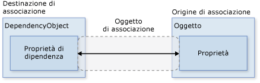
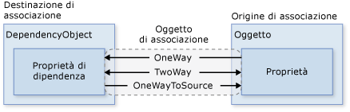
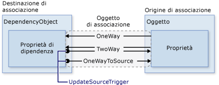
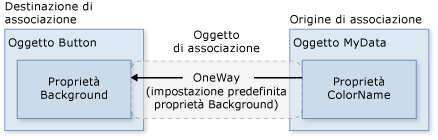
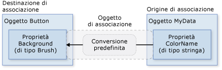
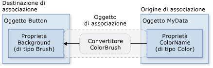
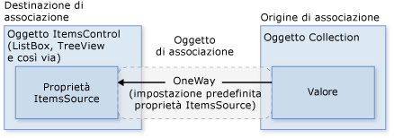

# Cenni preliminari sull&#39;associazione dati
L'associazione dati [!INCLUDE[TLA#tla_winclient](../../../../includes/tlasharptla-winclient-md.md)] rappresenta per le applicazioni un modo semplice e coerente di presentare e interagire con i dati.  È possibile associare gli elementi a numerose origini dati sotto forma di oggetti [!INCLUDE[TLA#tla_clr](../../../../includes/tlasharptla-clr-md.md)] e [!INCLUDE[TLA#tla_xml](../../../../includes/tlasharptla-xml-md.md)].  Gli oggetti <xref:System.Windows.Controls.ContentControl>come ad esempio <xref:System.Windows.Controls.Button> e <xref:System.Windows.Controls.ItemsControl> come ad esempio <xref:System.Windows.Controls.ListBox> e <xref:System.Windows.Controls.ListView> possiedono funzionalità incorporate che consentono un'applicazione di stili flessibile a singoli elementi di dati o a raccolte di elementi di dati.  In cima ai dati è possibile generare visualizzazioni di ordinamento, filtraggio e raggruppamento.  
  
 La funzionalità dell'associazione dati in [!INCLUDE[TLA2#tla_winclient](../../../../includes/tla2sharptla-winclient-md.md)] presenta molti vantaggi rispetto ai modelli tradizionali, tra cui un'ampia gamma di proprietà che supportano implicitamente l'associazione dati, una rappresentazione dei dati mediante [!INCLUDE[TLA2#tla_ui](../../../../includes/tla2sharptla-ui-md.md)] flessibile e una netta separazione tra regola business e [!INCLUDE[TLA2#tla_ui](../../../../includes/tla2sharptla-ui-md.md)].  
  
 In questo argomento vengono innanzitutto trattati i concetti fondamentali dell'associazione dati [!INCLUDE[TLA2#tla_winclient](../../../../includes/tla2sharptla-winclient-md.md)], per poi analizzare l'utilizzo della classe <xref:System.Windows.Data.Binding> e altre funzionalità dell'associazione dati.  
  
 [!INCLUDE[autoOutline](../Token/autoOutline_md.md)]  
  
<a name="what_is_data_binding"></a>   
## Definizione di associazione dati  
 L'associazione dati è il processo mediante il quale viene stabilita una connessione tra l'[!INCLUDE[TLA2#tla_ui](../../../../includes/tla2sharptla-ui-md.md)] dell'applicazione e la regola business.  Se le impostazioni dell'associazione sono corrette e i dati forniscono le notifiche appropriate, quando il valore dei dati viene modificato, gli elementi associati ai dati riflettono automaticamente le modifiche apportate.  Associazione dati significa anche che, se una rappresentazione esterna dei dati in un elemento viene modificata, i dati sottostanti possono essere automaticamente aggiornati per riflettere la modifica.  Ad esempio, se l'utente modifica il valore in un elemento <xref:System.Windows.Controls.TextBox>, il valore dei dati sottostanti viene automaticamente aggiornato per riflettere tale modifica.  
  
 Un utilizzo tipico dell'associazione dati consiste nell'inserimento dei dati di configurazione locali o del server in moduli o in altri controlli dell'[!INCLUDE[TLA2#tla_ui](../../../../includes/tla2sharptla-ui-md.md)].  In [!INCLUDE[TLA2#tla_winclient](../../../../includes/tla2sharptla-winclient-md.md)] questo concetto viene ampliato per includere l'associazione di una vasta gamma di proprietà a varie origini dati.  In [!INCLUDE[TLA2#tla_winclient](../../../../includes/tla2sharptla-winclient-md.md)] le [proprietà di dipendenza](GTMT) degli elementi possono essere associate a oggetti [!INCLUDE[TLA2#tla_clr](../../../../includes/tla2sharptla-clr-md.md)], inclusi oggetti [!INCLUDE[TLA#tla_adonet](../../../../includes/tlasharptla-adonet-md.md)] o oggetti associati a servizi Web e proprietà Web, e a dati [!INCLUDE[TLA2#tla_xml](../../../../includes/tla2sharptla-xml-md.md)].  
  
 Per un esempio di associazione dati, osservare l'[!INCLUDE[TLA2#tla_ui](../../../../includes/tla2sharptla-ui-md.md)] dell'applicazione seguente disponibile in [Demo di associazione dati](http://go.microsoft.com/fwlink/?LinkID=163703) \(la pagina potrebbe essere in inglese\):  
  
   
  
 Si tratta dell'[!INCLUDE[TLA2#tla_ui](../../../../includes/tla2sharptla-ui-md.md)] di un'applicazione in cui viene visualizzato un elenco di articoli venduti all'asta.  Nell'applicazione vengono illustrate le seguenti funzionalità dell'associazione dati:  
  
-   Il contenuto di <xref:System.Windows.Controls.ListBox> è associato a una raccolta di oggetti *AuctionItem*.  Un oggetto *AuctionItem* possiede diverse proprietà, tra cui *Description*, *StartPrice*, *StartDate*, *Category*, *SpecialFeatures* e così via.  
  
-   I dati, ossia gli oggetti *AuctionItem*, visualizzati in <xref:System.Windows.Controls.ListBox> sono basati su modelli, per cui per ogni articolo vengono visualizzati la descrizione e il prezzo corrente.  A tal proposito viene utilizzato <xref:System.Windows.DataTemplate>.  In aggiunta, l'aspetto di ogni articolo dipende dal valore di *SpecialFeatures* dell'oggetto *AuctionItem* visualizzato.  Se il valore di *SpecialFeatures* in *AuctionItem* è *Color*, l'articolo avrà un bordo blu.  Se il valore è *Highlight*, l'articolo avrà un bordo arancione e una stella.  Nella sezione [Modelli di dati](#data_templating) vengono fornite informazioni sull'applicazione dei modelli di dati.  
  
-   L'utente può raggruppare, filtrare o ordinare i dati utilizzando gli oggetti <xref:System.Windows.Controls.CheckBox> forniti.  Nella precedente immagine sono stati selezionati gli oggetti <xref:System.Windows.Controls.CheckBox> "Group by category" e "Sort by category and date".  I dati sono raggruppati in base alla categoria del prodotto e i nomi delle categorie sono riportati in ordine alfabetico.  Benché non risulti evidente dall'immagine, gli elementi sono anche ordinati in base alla data di inizio all'interno di ogni categoria.  A tal proposito viene utilizzata una *visualizzazione di raccolta*.  Nella sezione [Associazione alle raccolte](#binding_to_collections) vengono trattate le visualizzazioni di raccolta.  
  
-   Quando l'utente seleziona un articolo, <xref:System.Windows.Controls.ContentControl> visualizza i dettagli dell'articolo selezionato.  Si parla in tal caso di *scenario Master\-Details*.  Nella sezione [Scenario Master\-Details](#master_detail_scenario) vengono fornite informazioni su questo tipo di scenario di associazione.  
  
-   Il tipo della proprietà *StartDate* è <xref:System.DateTime>, il quale restituisce una data che include l'ora fino al millisecondo.  In questa applicazione è stato utilizzato un convertitore personalizzato in modo tale da visualizzare una stringa della data più corta.  Nella sezione [Conversione dei dati](#data_conversion) vengono fornite informazioni sui convertitori.  
  
 Quando l'utente fa clic sul pulsante *Add Product*, viene visualizzato il seguente modulo:  
  
   
  
 L'utente può modificare i campi nel modulo, visualizzare in anteprima il prodotto utilizzando i riquadri di anteprima breve e anteprima dettagliata, quindi fare clic su *submit* per aggiungere il nuovo prodotto.  Le funzionalità di raggruppamento, filtraggio e ordinamento esistenti verranno applicate alla nuova voce.  In questo caso particolare, l'articolo immesso nell'immagine precedente verrà visualizzato come secondo articolo della categoria *Computer*.  
  
 Nell'immagine non viene illustrata la logica di convalida fornita nell'oggetto <xref:System.Windows.Controls.TextBox> *Start Date*.  Immettendo una data non valida, ovvero una data con formato non valido o una data appartenente al passato, l'utente riceverà una notifica mediante <xref:System.Windows.Controls.ToolTip> e un punto esclamativo rosso verrà visualizzato accanto a <xref:System.Windows.Controls.TextBox>.  Nella sezione [Convalida dei dati](#data_validation) viene illustrato come creare la logica di convalida.  
  
 Prima di illustrare le diverse funzionalità dell'associazione dati delineate finora, nella sezione che segue verranno trattati i concetti fondamentali necessari a comprendere l'associazione dati [!INCLUDE[TLA2#tla_winclient](../../../../includes/tla2sharptla-winclient-md.md)].  
  
<a name="basic_data_binding_concepts"></a>   
## Concetti di base sull'associazione dati  
 [!INCLUDE[autoOutline](../Token/autoOutline_md.md)]  
  
 Indipendentemente dall'elemento associato e dalla natura dell'origine dati, ogni associazione segue sempre il modello illustrato nella figura seguente:  
  
   
  
 Come illustrato nella figura, l'associazione dati funge essenzialmente da ponte tra la [destinazione dell'associazione](GTMT) e l'[origine dell'associazione](GTMT).  Nella figura vengono illustrati i seguenti concetti fondamentali relativi all'associazione dati [!INCLUDE[TLA2#tla_winclient](../../../../includes/tla2sharptla-winclient-md.md)]:  
  
-   In genere, ogni associazione possiede questi quattro componenti: un oggetto [destinazione dell'associazione](GTMT), una proprietà di destinazione, un'[origine dell'associazione](GTMT) e un percorso del valore nell'[origine dell'associazione](GTMT) da utilizzare.  Se ad esempio si desidera associare il contenuto di un oggetto <xref:System.Windows.Controls.TextBox> alla proprietà *Name* di un oggetto *Employee*, l'oggetto destinazione è <xref:System.Windows.Controls.TextBox>, la proprietà di destinazione è <xref:System.Windows.Controls.TextBox.Text%2A>, il valore da utilizzare è *Name* e l'oggetto origine è *Employee*.  
  
-   La proprietà di destinazione deve essere una [proprietà di dipendenza](GTMT).  Gran parte delle proprietà degli oggetti <xref:System.Windows.UIElement> sono [proprietà di dipendenza](GTMT) e gran parte delle [proprietà di dipendenza](GTMT), ad eccezione di quelle di sola lettura, supportano l'associazione dati per impostazione predefinita.  Solo i tipi <xref:System.Windows.DependencyObject> possono definire le [proprietà di dipendenza](GTMT) e tutti gli oggetti <xref:System.Windows.UIElement> derivano da <xref:System.Windows.DependencyObject>.  
  
-   Anche se non specificato nella figura, notare che l'oggetto [origine di associazione](GTMT) non è necessariamente costituito da un oggetto [!INCLUDE[TLA2#tla_clr](../../../../includes/tla2sharptla-clr-md.md)] personalizzato.  L'associazione dati [!INCLUDE[TLA2#tla_winclient](../../../../includes/tla2sharptla-winclient-md.md)] supporta dati nel formato oggetti [!INCLUDE[TLA2#tla_clr](../../../../includes/tla2sharptla-clr-md.md)] e [!INCLUDE[TLA2#tla_xml](../../../../includes/tla2sharptla-xml-md.md)].  Per fornire alcuni esempi, l'origine dell'associazione può essere un oggetto <xref:System.Windows.UIElement>, qualsiasi oggetto elenco, un oggetto [!INCLUDE[TLA2#tla_clr](../../../../includes/tla2sharptla-clr-md.md)] associato a dati [!INCLUDE[TLA#tla_adonet](../../../../includes/tlasharptla-adonet-md.md)] o a servizi Web o un XmlNode contenente i dati [!INCLUDE[TLA2#tla_xml](../../../../includes/tla2sharptla-xml-md.md)] desiderati.  Per ulteriori informazioni, vedere [Cenni preliminari sulle origini di associazione](../../../../docs/framework/wpf/data/binding-sources-overview.md).  
  
 Come detto in altri argomenti concernenti [!INCLUDE[TLA#tla_sdk](../../../../includes/tlasharptla-sdk-md.md)], è importante ricordare che quando si stabilisce un'associazione, si associa una [destinazione dell'associazione](GTMT) *a* un'[origine dell'associazione](GTMT).  Ad esempio, nel caso in cui vengano visualizzati dati [!INCLUDE[TLA2#tla_xml](../../../../includes/tla2sharptla-xml-md.md)] sottostanti in un oggetto <xref:System.Windows.Controls.ListBox> mediante associazione dati, si associa <xref:System.Windows.Controls.ListBox> ai dati [!INCLUDE[TLA2#tla_xml](../../../../includes/tla2sharptla-xml-md.md)].  
  
 Per stabilire un'associazione si utilizza l'oggetto <xref:System.Windows.Data.Binding>.  Nella parte restante di questo argomento vengono illustrati molti dei concetti associati a <xref:System.Windows.Data.Binding>, nonché alcune proprietà e modalità di utilizzo dell'oggetto.  
  
<a name="direction_of_data_flow"></a>   
### Direzione del flusso di dati  
 Come accennato in precedenza e come si evince dalla freccia nella figura precedente, il flusso di dati di un'associazione può andare dalla [destinazione dell'associazione](GTMT) all'[origine dell'associazione](GTMT) \(ad esempio, il valore di origine viene modificato quando un utente modifica il valore di un oggetto <xref:System.Windows.Controls.TextBox>\) e\/o dall'[origine dell'associazione](GTMT) alla [destinazione dell'associazione](GTMT) \(ad esempio, il contenuto di <xref:System.Windows.Controls.TextBox> viene aggiornato in seguito alle modifiche apportate nell'[origine dell'associazione](GTMT)\) se l'origine dell'associazione fornisce le notifiche appropriate.  
  
 È possibile fare in modo che l'applicazione consenta agli utenti di modificare i dati e propagarli all'oggetto origine.  Oppure è possibile fare in modo che gli utenti non aggiornino i dati di origine.  A tal proposito occorre impostare la proprietà <xref:System.Windows.Data.Binding.Mode%2A> dell'oggetto <xref:System.Windows.Data.Binding>.  Nella figura che segue vengono illustrati i diversi tipi di flusso di dati:  
  
   
  
-   L'associazione <xref:System.Windows.Data.BindingMode> fa sì che le modifiche apportate alla proprietà di origine comportino un aggiornamento automatico della proprietà di destinazione. Tuttavia, le modifiche apportate alla proprietà di destinazione non vengono propagate alla proprietà di origine.  Questo tipo di associazione è adatto nel caso in cui il controllo associato sia implicitamente di sola lettura.  Può accadere ad esempio che si effettui un'associazione a un'origine quale un controllo Stock Ticker oppure che la proprietà di destinazione non possieda un'interfaccia di controllo tramite la quale apportare modifiche, come nel caso di un colore di sfondo con associazione a dati di una tabella.  Se non vi è alcuna necessità di controllare le modifiche della proprietà di destinazione, è consigliabile utilizzare la modalità di associazione <xref:System.Windows.Data.BindingMode>, in quanto l'associazione <xref:System.Windows.Data.BindingMode> implicherebbe operazioni inutili.  
  
-   L'associazione <xref:System.Windows.Data.BindingMode> fa sì che le modifiche apportate alla proprietà di origine o alla proprietà di destinazione comportino un aggiornamento automatico dell'altra proprietà.  Questo tipo di associazione è adatto ai moduli modificabili o ad altri scenari di [!INCLUDE[TLA2#tla_ui](../../../../includes/tla2sharptla-ui-md.md)] completamente interattiva.  La maggior parte delle proprietà utilizza per impostazione predefinita l'associazione <xref:System.Windows.Data.BindingMode>. Tuttavia, alcune [proprietà di dipendenza](GTMT), in genere proprietà di controlli modificabili dall'utente quali ad esempio la proprietà <xref:System.Windows.Controls.TextBox.Text%2A> di <xref:System.Windows.Controls.TextBox> e la proprietà <xref:System.Windows.Controls.Primitives.ToggleButton.IsChecked%2A> di <xref:System.Windows.Controls.CheckBox>, utilizzano per impostazione predefinita l'associazione <xref:System.Windows.Data.BindingMode>.  Per stabilire a livello di codice se, per impostazione predefinita, una [proprietà di dipendenza](GTMT) utilizza l'associazione unidirezionale o bidirezionale, è possibile ottenere i metadati della proprietà utilizzando <xref:System.Windows.DependencyProperty.GetMetadata%2A>, quindi controllare il valore booleano della proprietà <xref:System.Windows.FrameworkPropertyMetadata.BindsTwoWayByDefault%2A>.  
  
-   <xref:System.Windows.Data.BindingMode> è la modalità di associazione inversa rispetto a <xref:System.Windows.Data.BindingMode>. Con questa modalità, la proprietà di origine viene aggiornata in seguito a una modifica della proprietà di destinazione.  Può essere utilizzata, ad esempio, nel caso in cui si debba semplicemente rivalutare il valore di origine dall'[!INCLUDE[TLA2#tla_ui](../../../../includes/tla2sharptla-ui-md.md)].  
  
-   Un altro tipo di associazione non illustrato nella figura è l'associazione <xref:System.Windows.Data.BindingMode>, la quale fa sì che la proprietà di origine inizializzi la proprietà di destinazione ma non prevede la propagazione delle successive modifiche.  Ciò significa che se il contesto dati subisce una modifica o l'oggetto nel contesto dati viene modificato, la modifica non si riflette nella proprietà di destinazione.  Questo tipo di associazione è adatto nel caso in cui i dati utilizzati siano effettivamente statici oppure richiedano l'utilizzo di uno snapshot dello stato corrente.  È utile anche nel caso in cui si desideri inizializzare la proprietà di destinazione con un valore derivante da una proprietà di origine senza conoscere in anticipo il contesto dati.  Si tratta essenzialmente di una forma più semplice di associazione <xref:System.Windows.Data.BindingMode>, in grado di garantire prestazioni migliori nei casi in cui il valore di origine non viene modificato.  
  
 Per rilevare le modifiche apportate all'origine, nel caso delle associazioni <xref:System.Windows.Data.BindingMode> e <xref:System.Windows.Data.BindingMode>, l'origine deve implementare un meccanismo appropriato di notifica delle modifiche alle proprietà, quale ad esempio <xref:System.ComponentModel.INotifyPropertyChanged>.  Per un esempio di implementazione di <xref:System.ComponentModel.INotifyPropertyChanged>, vedere [Implementare la notifica di modifiche alle proprietà](../../../../docs/framework/wpf/data/how-to-implement-property-change-notification.md).  
  
 La pagina delle proprietà <xref:System.Windows.Data.Binding.Mode%2A> fornisce ulteriori informazioni sulle modalità di associazione e un esempio in cui viene illustrato come specificare la direzione di un'associazione.  
  
<a name="what_triggers_source_updates"></a>   
### Eventi che generano gli aggiornamenti dell'origine  
 Le associazioni di tipo <xref:System.Windows.Data.BindingMode> o <xref:System.Windows.Data.BindingMode> attendono le modifiche apportate alla proprietà di destinazione e le propagano all'origine.  Questo processo è noto come aggiornamento dell'origine.  Può accadere ad esempio che si modifichi il testo di un oggetto TextBox per modificare il valore di origine sottostante.  Come descritto nella sezione precedente, la direzione del flusso di dati è determinata dal valore della proprietà <xref:System.Windows.Data.Binding.Mode%2A> dell'associazione.  
  
 Ma il valore di origine viene aggiornato durante la modifica del testo o una volta terminata la modifica, quando si sposta il puntatore del mouse da TextBox?  La proprietà <xref:System.Windows.Data.Binding.UpdateSourceTrigger%2A> dell'associazione determina l'evento che genera l'aggiornamento dell'origine.  Nella figura che segue, i puntini delle frecce rivolte verso destra illustrano il ruolo della proprietà <xref:System.Windows.Data.Binding.UpdateSourceTrigger%2A>:  
  
   
  
 Se il valore di <xref:System.Windows.Data.Binding.UpdateSourceTrigger%2A> è <xref:System.Windows.Data.UpdateSourceTrigger>, il valore indicato dalla freccia a destra dell'associazione <xref:System.Windows.Data.BindingMode> o <xref:System.Windows.Data.BindingMode> viene aggiornato non appena si modifica la proprietà di destinazione.  Se invece il valore di <xref:System.Windows.Data.Binding.UpdateSourceTrigger%2A> è <xref:System.Windows.Data.UpdateSourceTrigger>, il valore indicato dalla freccia viene aggiornato con il nuovo valore soltanto quando la proprietà di destinazione perde lo stato attivo.  
  
 Analogamente alla proprietà <xref:System.Windows.Data.Binding.Mode%2A>, diverse [proprietà di dipendenza](GTMT) possiedono valori di <xref:System.Windows.Data.Binding.UpdateSourceTrigger%2A> predefiniti diversi.  Il valore predefinito per la maggior parte delle [proprietà di dipendenza](GTMT) è <xref:System.Windows.Data.UpdateSourceTrigger>, mentre il valore predefinito per la proprietà <xref:System.Windows.Controls.TextBox.Text%2A> è <xref:System.Windows.Data.UpdateSourceTrigger>.  Ciò significa che gli aggiornamenti dell'origine avvengono in genere quando si modifica la proprietà di destinazione. Questo comportamento è appropriato nel caso di oggetti <xref:System.Windows.Controls.CheckBox> e di altri controlli semplici.  Nel caso dei campi di testo, tuttavia, l'esecuzione di un aggiornamento a ogni pressione di tasto può comportare un calo di prestazioni nonché negare all'utente la possibilità di tornare indietro e correggere eventuali errori di digitazione prima di confermare il nuovo valore.  Per questo motivo il valore predefinito della proprietà <xref:System.Windows.Controls.TextBox.Text%2A> è <xref:System.Windows.Data.UpdateSourceTrigger> anziché <xref:System.Windows.Data.UpdateSourceTrigger>.  
  
 Vedere la pagina delle proprietà <xref:System.Windows.Data.Binding.UpdateSourceTrigger%2A> per informazioni su come individuare il valore di <xref:System.Windows.Data.Binding.UpdateSourceTrigger%2A> predefinito di una [proprietà di dipendenza](GTMT).  
  
 Nella tabella che segue viene fornito uno scenario esemplificativo per ogni valore di <xref:System.Windows.Data.Binding.UpdateSourceTrigger%2A> utilizzando <xref:System.Windows.Controls.TextBox> come esempio:  
  
|Valore UpdateSourceTrigger|Aggiornamento del valore di origine|Scenario di esempio per TextBox|  
|--------------------------------|-----------------------------------------|-------------------------------------|  
|LostFocus \(impostazione predefinita per <xref:System.Windows.Controls.TextBox.Text%2A?displayProperty=fullName>\)|Quando il controllo TextBox perde lo stato attivo|Un oggetto <xref:System.Windows.Controls.TextBox> associato alla logica di convalida \(vedere la sezione Convalida dei dati\)|  
|PropertyChanged|Durante la digitazione in <xref:System.Windows.Controls.TextBox>|Controlli <xref:System.Windows.Controls.TextBox> nella finestra di una chat|  
|Explicit|Quando l'applicazione chiama <xref:System.Windows.Data.BindingExpression.UpdateSource%2A>|Controlli <xref:System.Windows.Controls.TextBox> in un modulo modificabile \(aggiorna i valori di origine solo quando l'utente fa clic sul pulsante di invio\)|  
  
 Per un esempio, vedere [Controllare il momento in cui il database di origine viene aggiornato dal testo di TextBox](../../../../docs/framework/wpf/data/how-to-control-when-the-textbox-text-updates-the-source.md).  
  
<a name="creating_a_binding"></a>   
## Creazione di un'associazione  
 [!INCLUDE[autoOutline](../Token/autoOutline_md.md)]  
  
 Per riepilogare alcuni dei concetti illustrati nelle sezioni precedenti, un'associazione viene stabilita utilizzando l'oggetto <xref:System.Windows.Data.Binding> e ogni associazione è costituita in genere da quattro componenti: la destinazione dell'associazione, la proprietà di destinazione, l'origine dell'associazione e un percorso del valore di origine da utilizzare.  In questa sezione viene illustrato come impostare un'associazione.  
  
 Si consideri il seguente esempio, nel quale l'oggetto origine dell'associazione è una classe denominata *MyData* definita nello spazio dei nomi *SDKSample*.  A scopo dimostrativo, la classe *MyData* possiede una proprietà stringa denominata *ColorName* il cui valore è impostato su "Red".  In questo esempio viene quindi generato un pulsante con uno sfondo rosso.  
  
 [!code-xml[BindNonTextProperty#1](../../../../samples/snippets/csharp/VS_Snippets_Wpf/BindNonTextProperty/CS/Page1.xaml#1)]  
  
 Per maggiori dettagli sulla sintassi della dichiarazione di associazione e alcuni esempi di impostazione di un'associazione nel codice, vedere [Cenni preliminari sulle dichiarazioni di associazione](../../../../docs/framework/wpf/data/binding-declarations-overview.md).  
  
 Applicando questo esempio allo schema di base, risulterà una figura analoga alla seguente.  Si tratta di un'associazione <xref:System.Windows.Data.BindingMode> in quanto, per impostazione predefinita, la proprietà Background supporta questo tipo di associazione.  
  
   
  
 Ci si potrebbe chiedere come sia possibile tale associazione, dal momento che la proprietà *ColorName* è di tipo stringa mentre la proprietà <xref:System.Windows.Controls.Control.Background%2A> è di tipo <xref:System.Windows.Media.Brush>.  In questo caso viene utilizzata la conversione di tipi predefinita, illustrata nella sezione [Conversione dei dati](#data_conversion).  
  
<a name="specifying_the_binding_source"></a>   
### Specificazione dell'origine dell'associazione  
 Nell'esempio precedente, l'origine dell'associazione viene specificata impostando la proprietà <xref:System.Windows.FrameworkElement.DataContext%2A> nell'elemento <xref:System.Windows.Controls.DockPanel>.  <xref:System.Windows.Controls.Button> eredita quindi il valore di <xref:System.Windows.FrameworkElement.DataContext%2A> da <xref:System.Windows.Controls.DockPanel>, il quale costituisce l'elemento padre.  Come già detto, l'oggetto origine dell'associazione è uno dei quattro componenti necessari di un'associazione.  Di conseguenza, se non si specifica l'oggetto origine dell'associazione, questa non viene creata.  
  
 Esistono diversi modi per specificare l'oggetto origine dell'associazione.  L'utilizzo della proprietà <xref:System.Windows.FrameworkElement.DataContext%2A> in un elemento padre è utile in caso di associazione di più proprietà alla stessa origine.  In alcuni casi, tuttavia, è preferibile specificare l'origine dell'associazione in singole dichiarazioni di associazione.  Nel caso dell'esempio precedente, anziché utilizzare la proprietà <xref:System.Windows.FrameworkElement.DataContext%2A>, è possibile specificare l'origine dell'associazione impostando la proprietà <xref:System.Windows.Data.Binding.Source%2A> direttamente nella dichiarazione di associazione del pulsante, come avviene nell'esempio che segue:  
  
 [!code-xml[BindNonTextProperty#BackgroundBindingCompact](../../../../samples/snippets/csharp/VS_Snippets_Wpf/BindNonTextProperty/CS/Page2.xaml#backgroundbindingcompact)]  
  
 Oltre a impostare la proprietà <xref:System.Windows.FrameworkElement.DataContext%2A> direttamente in un elemento, ereditare il valore di <xref:System.Windows.FrameworkElement.DataContext%2A> da un predecessore \(si veda il pulsante nel primo esempio\) e specificare in modo esplicito l'origine dell'associazione impostando la proprietà <xref:System.Windows.Data.Binding.Source%2A> in <xref:System.Windows.Data.Binding> \(si veda il pulsante nell'ultimo esempio\), è anche possibile utilizzare la proprietà <xref:System.Windows.Data.Binding.ElementName%2A> o la proprietà <xref:System.Windows.Data.Binding.RelativeSource%2A> per specificare l'origine dell'associazione.  La proprietà <xref:System.Windows.Data.Binding.ElementName%2A> è utile in caso di associazione ad altri elementi nell'applicazione, ad esempio in caso di utilizzo di un dispositivo di scorrimento per regolare la larghezza di un pulsante.  La proprietà <xref:System.Windows.Data.Binding.RelativeSource%2A> è utile nel caso di un'associazione specificata in un oggetto <xref:System.Windows.Controls.ControlTemplate> o <xref:System.Windows.Style>.  Per ulteriori informazioni, vedere [Specificare l'origine di associazione](../../../../docs/framework/wpf/data/how-to-specify-the-binding-source.md).  
  
<a name="specifying_the_path_to_the_value"></a>   
### Specificazione del percorso del valore  
 Se l'origine dell'associazione è un oggetto, si utilizza la proprietà <xref:System.Windows.Data.Binding.Path%2A> per specificare il valore da utilizzare per l'associazione.  In caso di associazione a dati [!INCLUDE[TLA2#tla_xml](../../../../includes/tla2sharptla-xml-md.md)], utilizzare la proprietà <xref:System.Windows.Data.Binding.XPath%2A> per specificare il valore.  In alcuni casi è possibile utilizzare la proprietà <xref:System.Windows.Data.Binding.Path%2A> anche se i dati sono in formato [!INCLUDE[TLA2#tla_xml](../../../../includes/tla2sharptla-xml-md.md)].  Ad esempio, per accedere alla proprietà Name di un XmlNode restituito in seguito a una query XPath, è necessario utilizzare la proprietà <xref:System.Windows.Data.Binding.Path%2A> oltre alla proprietà <xref:System.Windows.Data.Binding.XPath%2A>.  
  
 Per informazioni sulla sintassi e alcuni esempi, vedere le pagine delle proprietà <xref:System.Windows.Data.Binding.Path%2A> e <xref:System.Windows.Data.Binding.XPath%2A>.  
  
 Benché sia stato sottolineato che la proprietà <xref:System.Windows.Data.Binding.Path%2A> del valore da utilizzare è uno dei quattro componenti necessari di un'associazione, negli scenari di associazione a un intero oggetto il valore da utilizzare corrisponde all'oggetto [origine dell'associazione](GTMT).  In tali casi è possibile non specificare <xref:System.Windows.Data.Binding.Path%2A>.  Si consideri l'esempio seguente:  
  
 [!code-xml[MasterDetail#EmptyBinding](../../../../samples/snippets/csharp/VS_Snippets_Wpf/MasterDetail/CSharp/Page1.xaml#emptybinding)]  
  
 Nell'esempio viene utilizzata la sintassi di associazione vuota: {Binding}.  In questo caso, <xref:System.Windows.Controls.ListBox> eredita DataContext da un elemento DockPanel padre, assente nell'esempio.  Quando il percorso non viene specificato, per impostazione predefinita si esegue un'associazione all'intero oggetto.  In altre parole, in questo esempio il percorso è stato tralasciato poiché la proprietà <xref:System.Windows.Controls.ItemsControl.ItemsSource%2A> viene associata all'intero oggetto.  Per informazioni più dettagliate, vedere la sezione [Associazione alle raccolte](#binding_to_collections).  
  
 Diversamente dall'associazione a una raccolta, questo scenario è utile anche in caso di associazione a un intero oggetto anziché a un'unica proprietà di un oggetto.  Si consideri ad esempio un oggetto origine di tipo stringa con un'associazione alla stringa stessa.  Un altro scenario comune riguarda l'associazione di un elemento a un oggetto con diverse proprietà.  
  
 Alcuni scenari richiedono l'applicazione di una logica personalizzata affinché i dati siano significativi per la proprietà di destinazione associata.  Tale logica potrebbe essere un convertitore personalizzato, in assenza della conversione di tipi predefinita.  Per informazioni sui convertitori, vedere [Conversione dei dati](#data_conversion).  
  
<a name="binding_bindingexpression"></a>   
### Binding e BindingExpression  
 Prima di analizzare altre funzionalità e modalità di utilizzo dell'associazione dati, è opportuno introdurre la classe <xref:System.Windows.Data.BindingExpression>.  Come si è visto nelle sezioni precedenti, la classe <xref:System.Windows.Data.Binding> è la classe di alto livello per la dichiarazione di un'associazione e fornisce diverse proprietà che consentono di specificare le caratteristiche dell'associazione.  Una classe correlata, <xref:System.Windows.Data.BindingExpression>, è l'oggetto sottostante che gestisce la connessione tra origine e destinazione.  Un'associazione contiene tutte le informazioni condivisibili tra diverse espressioni di associazione.  <xref:System.Windows.Data.BindingExpression> è un'espressione di istanza non condivisibile e contiene tutte le informazioni sull'istanza di <xref:System.Windows.Data.Binding>.  
  
 Si consideri l'esempio che segue, nel quale *myDataObject* è un'istanza della classe *MyData*, *myBinding* è l'oggetto <xref:System.Windows.Data.Binding> di origine e la classe *MyData* è una classe definita contenente una proprietà stringa denominata *MyDataProperty*.  Nell'esempio viene associato il contenuto di testo di *mytext*, un'istanza di <xref:System.Windows.Controls.TextBlock>, a *MyDataProperty*.  
  
 [!code-csharp[CodeOnlyBinding#1](../../../../samples/snippets/csharp/VS_Snippets_Wpf/CodeOnlyBinding/CSharp/binding.cs#1)]
 [!code-vb[CodeOnlyBinding#1](../../../../samples/snippets/visualbasic/VS_Snippets_Wpf/CodeOnlyBinding/VisualBasic/App.vb#1)]  
  
 È possibile utilizzare lo stesso oggetto *myBinding* per creare altre associazioni.  Ad esempio, è possibile utilizzare l'oggetto *myBinding* per associare il contenuto di testo di una casella di controllo a *MyDataProperty*.  In un simile scenario si avranno due istanze di <xref:System.Windows.Data.BindingExpression> che condividono l'oggetto *myBinding*.  
  
 Un oggetto <xref:System.Windows.Data.BindingExpression> può essere ottenuto tramite il valore restituito di una chiamata a <xref:System.Windows.Data.BindingOperations.GetBindingExpression%2A> in un oggetto con associazione a dati.  Negli argomenti che seguono vengono illustrate alcune modalità di utilizzo della classe <xref:System.Windows.Data.BindingExpression>:  
  
-   [Ottenere l'oggetto di associazione da una proprietà di destinazione associata](../../../../docs/framework/wpf/data/how-to-get-the-binding-object-from-a-bound-target-property.md)  
  
-   [Controllare il momento in cui il database di origine viene aggiornato dal testo di TextBox](../../../../docs/framework/wpf/data/how-to-control-when-the-textbox-text-updates-the-source.md)  
  
<a name="data_conversion"></a>   
## Conversione dei dati  
 Nell'esempio precedente, il pulsante è rosso perché la proprietà <xref:System.Windows.Controls.Control.Background%2A> è associata a una proprietà stringa con valore "Red".  Questa associazione funziona grazie alla presenza di un convertitore di tipi nel tipo <xref:System.Windows.Media.Brush>, il quale converte il valore stringa in un oggetto <xref:System.Windows.Media.Brush>.  
  
 Aggiungendo queste informazioni alla figura della sezione [Creazione di un'associazione](#creating_a_binding), si otterrà uno schema analogo al seguente:  
  
   
  
 Cosa accade però se, anziché avere una proprietà di tipo stringa, l'oggetto origine dell'associazione possiede una proprietà *Color* di tipo <xref:System.Windows.Media.Color>?  In tal caso, per fare in modo che l'associazione funzioni, occorre innanzitutto convertire il valore della proprietà *Color* in un valore accettabile dalla proprietà <xref:System.Windows.Controls.Control.Background%2A>.  Occorre quindi creare un convertitore personalizzato implementando l'interfaccia <xref:System.Windows.Data.IValueConverter>, come avviene nell'esempio seguente:  
  
 [!code-csharp[ColorPicker_snip#16](../../../../samples/snippets/csharp/VS_Snippets_Wpf/ColorPicker_snip/CSharp/ColorPickerLib/ColorPicker.cs#16)]
 [!code-vb[ColorPicker_snip#16](../../../../samples/snippets/visualbasic/VS_Snippets_Wpf/ColorPicker_snip/visualbasic/colorpickerlib/colorpicker.vb#16)]  
  
 Nella pagina di riferimento relativa a <xref:System.Windows.Data.IValueConverter> vengono fornite ulteriori informazioni.  
  
 Ora il convertitore personalizzato viene utilizzato al posto della conversione predefinita e lo schema appare come segue:  
  
   
  
 Come già detto, le conversioni predefinite possono essere disponibili o meno a seconda dei convertitori presenti nel tipo a cui si esegue l'associazione.  Questo comportamento dipenderà dai convertitori di tipi disponibili nella destinazione.  In caso di dubbio, creare un convertitore personalizzato.  
  
 Di seguito vengono riportati alcuni scenari tipici in cui può essere opportuno implementare un convertitore di dati:  
  
-   I dati devono essere visualizzati in modo diverso, a seconda delle impostazioni cultura.  Ad esempio, è possibile implementare un convertitore di valuta o un convertitore di data\/ora nel calendario in base ai valori o agli standard utilizzati in particolari impostazioni cultura.  
  
-   I dati utilizzati non devono necessariamente modificare il valore di testo di una proprietà quanto piuttosto altri valori, ad esempio l'origine di un'immagine oppure il colore o lo stile del testo visualizzato.  I convertitori possono essere utilizzati in questo caso per convertire l'associazione di una proprietà considerata poco appropriata, ad esempio l'associazione di un campo di testo alla proprietà Background della cella di una tabella.  
  
-   Più controlli o più proprietà dei controlli sono associati agli stessi dati.  In questo caso, l'associazione primaria potrebbe semplicemente visualizzare il testo, mentre le altre associazioni gestiscono problemi di visualizzazione specifici, utilizzando comunque la stessa associazione come informazione di origine.  
  
-   Finora non è stato ancora illustrato <xref:System.Windows.Data.MultiBinding>, ovvero il caso di una proprietà di destinazione con una raccolta di associazioni.  Nel caso di <xref:System.Windows.Data.MultiBinding> si utilizza un oggetto <xref:System.Windows.Data.IMultiValueConverter> personalizzato per produrre un valore finale partendo dai valori delle associazioni.  È possibile ad esempio calcolare il colore dai valori rosso, blu e verde, ovvero valori che possono provenire da oggetti origine dell'associazione identici o differenti.  Per esempi e informazioni, vedere la pagina relativa alla classe <xref:System.Windows.Data.MultiBinding>.  
  
<a name="binding_to_collections"></a>   
## Associazione alle raccolte  
 [!INCLUDE[autoOutline](../Token/autoOutline_md.md)]  
  
 Un oggetto origine dell'associazione può essere considerato come un unico oggetto le cui proprietà contengono dati oppure come una raccolta di dati di oggetti polimorfici che spesso vengono raggruppati. Un esempio può essere il risultato di una query in un database.  Finora è stata illustrata soltanto l'associazione a singoli oggetti, tuttavia l'associazione a una raccolta di dati è uno scenario comune.  È possibile ad esempio utilizzare un oggetto <xref:System.Windows.Controls.ItemsControl> quale <xref:System.Windows.Controls.ListBox>, <xref:System.Windows.Controls.ListView> o <xref:System.Windows.Controls.TreeView> per visualizzare una raccolta dati, come avviene nell'applicazione illustrata nella sezione [Definizione di associazione dati](#what_is_data_binding)  
  
 Anche in questo caso è possibile applicare lo schema di base.  In caso di associazione di un oggetto <xref:System.Windows.Controls.ItemsControl> a una raccolta, lo schema appare come segue:  
  
   
  
 Come illustrato in questo schema, l'associazione di <xref:System.Windows.Controls.ItemsControl> a un oggetto Collection richiede l'utilizzo della proprietà <xref:System.Windows.Controls.ItemsControl.ItemsSource%2A>.  La proprietà <xref:System.Windows.Controls.ItemsControl.ItemsSource%2A> può essere considerata il contenuto di <xref:System.Windows.Controls.ItemsControl>.  L'associazione dell'esempio è di tipo <xref:System.Windows.Data.BindingMode>, essendo questo il tipo supportato per impostazione predefinita dalla proprietà <xref:System.Windows.Controls.ItemsControl.ItemsSource%2A>.  
  
<a name="how_to_implement_collections"></a>   
### Procedura per l'implementazione delle raccolte  
 È possibile eseguire enumerazioni in qualsiasi raccolta che implementa l'interfaccia <xref:System.Collections.IEnumerable>.  Tuttavia, per impostare associazioni dinamiche in modo tale che l'[!INCLUDE[TLA2#tla_ui](../../../../includes/tla2sharptla-ui-md.md)] venga automaticamente aggiornata in seguito a operazioni di inserimento o eliminazione nella raccolta, è necessario che questo implementi l'interfaccia <xref:System.Collections.Specialized.INotifyCollectionChanged>.  Questa interfaccia espone un evento che deve essere generato a ogni modifica della raccolta sottostante.  
  
 In [!INCLUDE[TLA2#tla_winclient](../../../../includes/tla2sharptla-winclient-md.md)] viene fornita la classe <xref:System.Collections.ObjectModel.ObservableCollection%601>, un'implementazione incorporata di una raccolta di dati che espone l'interfaccia <xref:System.Collections.Specialized.INotifyCollectionChanged>.  Per supportare pienamente il trasferimento dei valori dei dati dagli oggetti origine alle destinazioni, ogni oggetto nella raccolta che supporta proprietà associabili deve implementare anche l'interfaccia <xref:System.ComponentModel.INotifyPropertyChanged>.  Per ulteriori informazioni, vedere [Cenni preliminari sulle origini di associazione](../../../../docs/framework/wpf/data/binding-sources-overview.md).  
  
 Prima di implementare una raccolta personalizzata, considerare la possibilità di utilizzare <xref:System.Collections.ObjectModel.ObservableCollection%601> o una delle classi di raccolte esistenti, ad esempio <xref:System.Collections.Generic.List%601>, <xref:System.Collections.ObjectModel.Collection%601> e <xref:System.ComponentModel.BindingList%601>.  Se si desidera implementare una raccolta personalizzata in uno scenario avanzato, è opportuno utilizzare <xref:System.Collections.IList>, il quale fornisce una raccolta non generica di oggetti accessibili singolarmente tramite indice e garantisce prestazioni ottimali.  
  
<a name="collection_views"></a>   
### Visualizzazioni di raccolte  
 Una volta associato <xref:System.Windows.Controls.ItemsControl> a una raccolta di dati, è possibile ordinare, filtrare o raggruppare tali dati.  A tale scopo si utilizzano le visualizzazioni di raccolte, ovvero classi che implementano l'interfaccia <xref:System.ComponentModel.ICollectionView>.  
  
 [!INCLUDE[autoOutline](../Token/autoOutline_md.md)]  
  
<a name="what_are_collection_views"></a>   
#### Definizione di visualizzazione di raccolta  
 Una visualizzazione di raccolta rappresenta il livello superiore di una raccolta di origine di associazione che consente di spostarsi e visualizzare la raccolta di origine in base a query di ordinamento, filtro e raggruppamento, il tutto senza modificare la raccolta di origine sottostante.  Una visualizzazione di raccolta mantiene inoltre un puntatore all'elemento corrente nella raccolta.  Se la raccolta di origine implementa l'interfaccia <xref:System.Collections.Specialized.INotifyCollectionChanged>, le modifiche generate dall'evento <xref:System.Collections.Specialized.INotifyCollectionChanged.CollectionChanged> vengono propagate alle visualizzazioni.  
  
 Poiché le visualizzazioni non modificano le raccolte di origine sottostanti, ogni raccolta di origine può disporre di più visualizzazioni associate.  Si consideri ad esempio una raccolta di oggetti *Task*.  Grazie alle visualizzazioni è possibile visualizzare gli stessi dati in modi diversi.  Ad esempio, è possibile visualizzare le attività ordinate in base alla priorità nella parte sinistra della pagina e, contemporaneamente nella parte destra, le stesse attività raggruppate in base all'area.  
  
<a name="how_to_create_a_view"></a>   
#### Procedura per la creazione di una visualizzazione  
 Per creare e utilizzare una visualizzazione, è possibile creare direttamente un'istanza dell'oggetto visualizzazione e utilizzare tale istanza come origine dell'associazione.  Ad esempio, considerare l'applicazione [Demo di associazione dati](http://go.microsoft.com/fwlink/?LinkID=163703) illustrata nella sezione [Definizione di associazione dati](#what_is_data_binding).  L'applicazione viene implementata in modo tale che <xref:System.Windows.Controls.ListBox> venga associato a una visualizzazione della raccolta di dati anziché direttamente alla raccolta in questione.  L'esempio seguente è stato estratto dall'applicazione [Demo di associazione dati](http://go.microsoft.com/fwlink/?LinkID=163703) \(la pagina potrebbe essere in inglese\).  La classe <xref:System.Windows.Data.CollectionViewSource> è il proxy [!INCLUDE[TLA#tla_xaml](../../../../includes/tlasharptla-xaml-md.md)] di una classe che eredita da <xref:System.Windows.Data.CollectionView>.  In questo particolare esempio, l'oggetto <xref:System.Windows.Data.CollectionViewSource.Source%2A> della visualizzazione è associato alla raccolta *AuctionItems*, di tipo <xref:System.Collections.ObjectModel.ObservableCollection%601>, dell'oggetto applicazione corrente.  
  
 [!code-xml[DataBindingLab#WindowResources1](../../../../samples/snippets/csharp/VS_Snippets_Wpf/DataBindingLab/CSharp/MainWindow.xaml#windowresources1)]  
[!code-xml[DataBindingLab#CollectionViewSource](../../../../samples/snippets/csharp/VS_Snippets_Wpf/DataBindingLab/CSharp/MainWindow.xaml#collectionviewsource)]  
[!code-xml[DataBindingLab#WindowResources2](../../../../samples/snippets/csharp/VS_Snippets_Wpf/DataBindingLab/CSharp/MainWindow.xaml#windowresources2)]  
  
 La risorsa *listingDataView* funge quindi da origine dell'associazione per gli elementi nell'applicazione, quale ad esempio <xref:System.Windows.Controls.ListBox>:  
  
 [!code-xml[DataBindingLab#Master1](../../../../samples/snippets/csharp/VS_Snippets_Wpf/DataBindingLab/CSharp/MainWindow.xaml#master1)]  
[!code-xml[DataBindingLab#Master2](../../../../samples/snippets/csharp/VS_Snippets_Wpf/DataBindingLab/CSharp/MainWindow.xaml#master2)]  
  
 Per creare un'altra visualizzazione per la stessa raccolta, è possibile creare una nuova istanza di <xref:System.Windows.Data.CollectionViewSource> e attribuirle un nome `x:Key` diverso.  
  
 Nella tabella seguente vengono illustrati i tipi di dati della visualizzazione creati come visualizzazione di raccolta predefinita o in base a <xref:System.Windows.Data.CollectionViewSource> a seconda del tipo di raccolta di origine.  
  
|Tipo di raccolta di origine|Tipo di visualizzazione di raccolta|Note|  
|---------------------------------|-----------------------------------------|----------|  
|<xref:System.Collections.IEnumerable>|Tipo interno basato su <xref:System.Windows.Data.CollectionView>|Impossibile raggruppare gli elementi.|  
|<xref:System.Collections.IList>|<xref:System.Windows.Data.ListCollectionView>|Più veloce.|  
|<xref:System.ComponentModel.IBindingList>|<xref:System.Windows.Data.BindingListCollectionView>||  
  
##### Utilizzo di una visualizzazione predefinita  
 Specificare una visualizzazione di raccolta come origine di associazione rappresenta un modo per creare e utilizzare una visualizzazione di raccolta.  WPF crea inoltre una visualizzazione di raccolta predefinita per ogni raccolta utilizzata come origine di associazione.  Se si esegue l'associazione direttamente a una raccolta, WPF esegue l'associazione alla relativa visualizzazione predefinita.  Questa visualizzazione predefinita è condivisa da tutte le associazioni alla stessa raccolta, pertanto una modifica apportata a una visualizzazione predefinita da un controllo associato o dal codice, ad esempio l'ordinamento o una modifica al puntatore dell'elemento corrente illustrati più avanti, viene riflessa in tutte le altre associazioni alla stessa raccolta.  
  
 Per ottenere la visualizzazione predefinita, utilizzare il metodo <xref:System.Windows.Data.CollectionViewSource.GetDefaultView%2A>.  Per un esempio, vedere [Ottenere la visualizzazione predefinita di una raccolta dati](../../../../docs/framework/wpf/data/how-to-get-the-default-view-of-a-data-collection.md).  
  
##### Visualizzazioni di raccolta con ADO.NET DataTable  
 Per migliorare le prestazioni, le visualizzazioni di raccolta per gli oggetti ADO.NET <xref:System.Data.DataTable> o <xref:System.Data.DataView> delegano l'ordinamento e il filtraggio all'oggetto <xref:System.Data.DataView>.  In tal modo, l'ordinamento e il filtraggio vengono condivisi in tutte le visualizzazioni di raccolta dell'origine dati.  Per consentire a ogni visualizzazione di raccolta di ordinare e filtrare in modo indipendente, inizializzare ogni visualizzazione di raccolta con il relativo oggetto <xref:System.Data.DataView> personalizzato.  
  
<a name="sorting"></a>   
#### Ordinamento  
 Come detto in precedenza, le visualizzazioni possono applicare un ordinamento a una raccolta.  I dati presenti nella raccolta sottostante possono avere o non avere un ordine intrinseco.  La visualizzazione della raccolta consente di imporre un ordine o di modificare l'ordine predefinito in base a criteri di confronto forniti dall'utente.  Trattandosi di una visualizzazione dei dati basata su client, uno scenario comune prevede che l'utente possa ordinare le colonne di dati tabulari in base al valore al quale corrisponde la colonna.  Grazie alle visualizzazioni, è possibile applicare questo ordinamento gestito dall'utente senza apportare alcuna modifica alla raccolta sottostante né ripetere la query per il contenuto della raccolta.  Per un esempio, vedere [Ordinare una colonna GridView quando si fa clic su un'intestazione](../../../../docs/framework/wpf/controls/how-to-sort-a-gridview-column-when-a-header-is-clicked.md).  
  
 Nell'esempio seguente viene illustrata la logica di ordinamento dell'oggetto <xref:System.Windows.Controls.CheckBox> "Sort by category and date" dell'[!INCLUDE[TLA2#tla_ui](../../../../includes/tla2sharptla-ui-md.md)] dell'applicazione inclusa nella sezione [Definizione di associazione dati](#what_is_data_binding):  
  
 [!code-csharp[DataBindingLab#8](../../../../samples/snippets/csharp/VS_Snippets_Wpf/DataBindingLab/CSharp/MainWindow.xaml.cs#8)]
 [!code-vb[DataBindingLab#8](../../../../samples/snippets/visualbasic/VS_Snippets_Wpf/DataBindingLab/VisualBasic/MainWindow.xaml.vb#8)]  
  
<a name="filtering"></a>   
#### Filtraggio  
 Le visualizzazioni possono anche applicare un filtro a una raccolta.  In altre parole, anche se una raccolta può includere un elemento, una particolare visualizzazione è progettata per visualizzare solo un determinato subset di una raccolta completa.  I dati possono essere filtrati in base a una condizione.  Ad esempio, come accade per l'applicazione nella sezione [Definizione di associazione dati](#what_is_data_binding), l'oggetto <xref:System.Windows.Controls.CheckBox> "Show only bargains" contiene una logica che prevede l'esclusione degli articoli con un costo pari o superiore a $ 25.  Il codice seguente viene eseguito per impostare *ShowOnlyBargainsFilter* come gestore dell'evento <xref:System.Windows.Data.CollectionViewSource.Filter> quando si seleziona l'oggetto <xref:System.Windows.Controls.CheckBox> in questione:  
  
 [!code-csharp[DataBindingLab#10](../../../../samples/snippets/csharp/VS_Snippets_Wpf/DataBindingLab/CSharp/MainWindow.xaml.cs#10)]
 [!code-vb[DataBindingLab#10](../../../../samples/snippets/visualbasic/VS_Snippets_Wpf/DataBindingLab/VisualBasic/MainWindow.xaml.vb#10)]  
  
 L'implementazione del gestore eventi *ShowOnlyBargainsFilter* è la seguente:  
  
 [!code-csharp[DataBindingLab#5](../../../../samples/snippets/csharp/VS_Snippets_Wpf/DataBindingLab/CSharp/MainWindow.xaml.cs#5)]
 [!code-vb[DataBindingLab#5](../../../../samples/snippets/visualbasic/VS_Snippets_Wpf/DataBindingLab/VisualBasic/MainWindow.xaml.vb#5)]  
  
 Se si utilizza direttamente una delle classi <xref:System.Windows.Data.CollectionView> anziché <xref:System.Windows.Data.CollectionViewSource>, occorre utilizzare la proprietà <xref:System.Windows.Data.CollectionView.Filter%2A> per specificare un callback.  Per un esempio, vedere [Filtrare i dati di una visualizzazione](../../../../docs/framework/wpf/data/how-to-filter-data-in-a-view.md).  
  
<a name="grouping"></a>   
#### Raggruppamento  
 A eccezione della classe interna che visualizza una raccolta <xref:System.Collections.IEnumerable>, tutte le visualizzazioni di raccolta supportano la funzionalità di raggruppamento, che consente all'utente di suddividere la raccolta contenuta in una data visualizzazione in gruppi logici.  Se l'utente fornisce un elenco di gruppi, questi saranno espliciti; se invece i gruppi vengono generati in modo dinamico in base ai dati, si avranno gruppi impliciti.  
  
 Nell'esempio che segue viene illustrata la logica dell'oggetto <xref:System.Windows.Controls.CheckBox> "Group by category":  
  
 [!code-csharp[DataBindingLab#6](../../../../samples/snippets/csharp/VS_Snippets_Wpf/DataBindingLab/CSharp/MainWindow.xaml.cs#6)]
 [!code-vb[DataBindingLab#6](../../../../samples/snippets/visualbasic/VS_Snippets_Wpf/DataBindingLab/VisualBasic/MainWindow.xaml.vb#6)]  
  
 Per un altro esempio di raggruppamento, vedere [Raggruppare gli elementi di un controllo ListView che implementa una GridView](../../../../docs/framework/wpf/controls/how-to-group-items-in-a-listview-that-implements-a-gridview.md).  
  
<a name="current_record_pointers"></a>   
#### Puntatori dell'elemento corrente  
 Le visualizzazioni supportano anche la nozione di elemento corrente.  In una visualizzazione di raccolta è possibile spostarsi da un oggetto all'altro.  Durante lo spostamento viene spostato un puntatore dell'elemento che consente di recuperare l'oggetto presente in un particolare percorso nella raccolta.  Per un esempio, vedere [Navigare tra gli oggetti nella visualizzazione di una raccolta dati](../../../../docs/framework/wpf/data/how-to-navigate-through-the-objects-in-a-data-collectionview.md).  
  
 Poiché WPF esegue l'associazione a una raccolta solo tramite una visualizzazione, che può essere sia una visualizzazione specificata dall'utente che la visualizzazione predefinita della raccolta, tutte le associazioni alle raccolte contengono un puntatore dell'elemento corrente.  Quando si esegue l'associazione a una visualizzazione, il carattere barra \("\/"\) in un valore `Path` definisce l'elemento corrente della visualizzazione.  Nell'esempio seguente il contesto dati è una visualizzazione di raccolta.  La prima riga viene associata alla raccolta.  La seconda riga viene associata all'elemento corrente della raccolta.  La terza riga viene associata alla proprietà `Description` dell'elemento corrente nella raccolta.  
  
```xaml  
<Button Content="{Binding }" />  
<Button Content="{Binding Path=/}" />  
<Button Content="{Binding Path=/Description}" />   
```  
  
 La barra e la sintassi della proprietà possono inoltre essere sovrapposte per scorrere una gerarchia di raccolte.  Nell'esempio seguente viene eseguita l'associazione all'elemento corrente di una raccolta denominata `Offices`, che è una proprietà dell'elemento corrente della raccolta di origine.  
  
```xaml  
<Button Content="{Binding /Offices/}" />  
```  
  
 Il puntatore dell'elemento corrente può essere influenzato da un'operazione di ordinamento o filtraggio applicata alla raccolta.  L'ordinamento mantiene il puntatore dell'elemento corrente sull'ultimo elemento selezionato, ma la visualizzazione di raccolta viene ristrutturata in base a tale elemento.  Se in precedenza l'elemento selezionato si trovava all'inizio dell'elenco, ora è possibile che si trovi in posizione centrale. Il filtraggio mantiene l'elemento selezionato se la selezione rimane nella visualizzazione dopo il filtraggio.  In caso contrario, il puntatore dell'elemento corrente viene impostato sul primo elemento della visualizzazione di raccolta filtrata.  
  
<a name="master_detail_scenario"></a>   
#### Scenario di associazione Master\-Details  
 La nozione di elemento corrente è utile non solo per la navigazione degli elementi in una raccolta, bensì anche per lo scenario di associazione Master\-Details.  Si consideri nuovamente l'[!INCLUDE[TLA2#tla_ui](../../../../includes/tla2sharptla-ui-md.md)] della sezione [Definizione di associazione dati](#what_is_data_binding).  In tale applicazione, la selezione all'interno di <xref:System.Windows.Controls.ListBox> determina il contenuto visualizzato in <xref:System.Windows.Controls.ContentControl>.  In altre parole, quando si seleziona un elemento di <xref:System.Windows.Controls.ListBox>, <xref:System.Windows.Controls.ContentControl> visualizza i dettagli dell'elemento selezionato.  
  
 Per implementare lo scenario Master\-Details, occorre semplicemente avere due o più controlli associati alla stessa visualizzazione.  Nell'esempio seguente estratto da [Demo di associazione dati](http://go.microsoft.com/fwlink/?LinkID=163703) viene illustrato il markup degli oggetti <xref:System.Windows.Controls.ListBox> e <xref:System.Windows.Controls.ContentControl> visualizzati nell'[!INCLUDE[TLA2#tla_ui](../../../../includes/tla2sharptla-ui-md.md)] dell'applicazione illustrata nella sezione [Definizione di associazione dati](#what_is_data_binding):  
  
 [!code-xml[DataBindingLab#Master1](../../../../samples/snippets/csharp/VS_Snippets_Wpf/DataBindingLab/CSharp/MainWindow.xaml#master1)]  
[!code-xml[DataBindingLab#Master2](../../../../samples/snippets/csharp/VS_Snippets_Wpf/DataBindingLab/CSharp/MainWindow.xaml#master2)]  
[!code-xml[DataBindingLab#Detail](../../../../samples/snippets/csharp/VS_Snippets_Wpf/DataBindingLab/CSharp/MainWindow.xaml#detail)]  
  
 Entrambi i controlli sono associati alla stessa origine, ovvero la risorsa statica *listingDataView*. Vedere in proposito la definizione di questa risorsa nella sezione [Procedura per la creazione di una visualizzazione](#how_to_create_a_view).  Tutto ciò è possibile in quanto, associando un oggetto Singleton \(<xref:System.Windows.Controls.ContentControl> in questo caso\) a una visualizzazione di raccolta, tale oggetto viene automaticamente associato all'oggetto <xref:System.Windows.Data.CollectionView.CurrentItem%2A> della visualizzazione.  Gli oggetti <xref:System.Windows.Data.CollectionViewSource> sincronizzano automaticamente validità e selezione.  Se l'elenco non è associato a un oggetto <xref:System.Windows.Data.CollectionViewSource> come avviene in questo esempio, sarà necessario impostare la proprietà <xref:System.Windows.Controls.Primitives.Selector.IsSynchronizedWithCurrentItem%2A> su `true` per fare in modo che la procedura funzioni.  
  
 Per altri esempi, vedere [Eseguire l'associazione a una raccolta e visualizzare informazioni in base alla selezione](../../../../docs/framework/wpf/data/how-to-bind-to-a-collection-and-display-information-based-on-selection.md) e [Utilizzare il modello Master\-Details con dati gerarchici](../../../../docs/framework/wpf/data/how-to-use-the-master-detail-pattern-with-hierarchical-data.md).  
  
 Come si può notare, nell'esempio precedente viene utilizzato un modello.  I dati non verrebbero infatti visualizzati come desiderato senza l'utilizzo dei modelli, per la precisione quello utilizzato in modo esplicito da <xref:System.Windows.Controls.ContentControl> e quello utilizzato in modo implicito da <xref:System.Windows.Controls.ListBox>.  Nella sezione che segue vengono illustrati i modelli di dati.  
  
<a name="data_templating"></a>   
## Modelli di dati  
 Senza l'utilizzo di modelli di dati, l'[!INCLUDE[TLA2#tla_ui](../../../../includes/tla2sharptla-ui-md.md)] dell'applicazione illustrata nella sezione [Definizione di associazione dati](#what_is_data_binding) avrebbe un aspetto simile al seguente:  
  
   
  
 Come illustrato nell'esempio incluso nella sezione precedente, sia il controllo <xref:System.Windows.Controls.ListBox> che <xref:System.Windows.Controls.ContentControl> vengono associati all'intero oggetto Collection \(o più specificatamente alla vista sull'oggetto Collection\) di *AuctionItem*.  Senza istruzioni specifiche per la visualizzazione della raccolta di dati, l'oggetto <xref:System.Windows.Controls.ListBox> determinerebbe la visualizzazione di una rappresentazione di stringa di ogni oggetto nella raccolta sottostante e l'oggetto <xref:System.Windows.Controls.ContentControl> determinerebbe la visualizzazione di una rappresentazione di stringa dell'oggetto al quale è associato.  
  
 Per risolvere il problema, nell'applicazione vengono definiti oggetti <xref:System.Windows.DataTemplate>.  Come illustrato nell'esempio incluso nella sezione precedente, <xref:System.Windows.Controls.ContentControl> utilizza in modo esplicito l'oggetto <xref:System.Windows.DataTemplate> *detailsProductListingTemplate*.  Il controllo <xref:System.Windows.Controls.ListBox> utilizza in modo implicito il seguente oggetto <xref:System.Windows.DataTemplate> durante la visualizzazione degli oggetti *AuctionItem* nella raccolta:  
  
 [!code-xml[DataBindingLab#AuctionItemDataTemplate](../../../../samples/snippets/csharp/VS_Snippets_Wpf/DataBindingLab/CSharp/DataBindingLabApp.xaml#auctionitemdatatemplate)]  
  
 Grazie all'utilizzo di questi due oggetti <xref:System.Windows.DataTemplate>, l'interfaccia utente risultante sarà quella illustrata nella sezione [Definizione di associazione dati](#what_is_data_binding).  Come si evince dalla schermata, oltre a consentire di posizionare i dati all'interno dei controlli, gli oggetti <xref:System.Windows.DataTemplate> permettono di conferire ai dati un aspetto visivo gradevole.  Ad esempio, nel precedente <xref:System.Windows.DataTemplate> vengono utilizzati oggetti <xref:System.Windows.DataTrigger> che consentono di visualizzare gli oggetti *AuctionItem* per i quali *SpecialFeatures* è impostato su *HighLight* con un bordo arancione e una stella.  
  
 Per ulteriori informazioni sui modelli di dati, vedere [Cenni preliminari sui modelli di dati](../../../../docs/framework/wpf/data/data-templating-overview.md).  
  
<a name="data_validation"></a>   
## Convalida dei dati  
 [!INCLUDE[autoOutline](../Token/autoOutline_md.md)]  
  
 Gran parte delle applicazioni che accettano input dell'utente devono avere una logica di convalida per garantire che l'utente immetta le informazioni previste.  I controlli di convalida possono basarsi sul tipo, l'intervallo, il formato o altri requisiti specifici dell'applicazione.  In questa sezione viene illustrato il funzionamento della convalida dei dati in [!INCLUDE[TLA2#tla_winclient](../../../../includes/tla2sharptla-winclient-md.md)].  
  
<a name="validation_rules"></a>   
### Associazione di regole di convalida a un'associazione  
 Il modello di associazione dati [!INCLUDE[TLA2#tla_winclient](../../../../includes/tla2sharptla-winclient-md.md)] consente di associare <xref:System.Windows.Data.Binding.ValidationRules%2A> all'oggetto <xref:System.Windows.Data.Binding>.  Nell'esempio seguente viene ad esempio associato un oggetto <xref:System.Windows.Controls.TextBox> a una proprietà denominata `StartPrice` e viene aggiunto un oggetto <xref:System.Windows.Controls.ExceptionValidationRule> alla proprietà <xref:System.Windows.Data.Binding.ValidationRules%2A?displayProperty=fullName>.  
  
 [!code-xml[DataBindingLab#DefaultValidation](../../../../samples/snippets/csharp/VS_Snippets_Wpf/DataBindingLab/CSharp/AddProductWindow.xaml#defaultvalidation)]  
  
 Un oggetto <xref:System.Windows.Controls.ValidationRule> controlla se il valore di una proprietà è valido.  In [!INCLUDE[TLA2#tla_winclient](../../../../includes/tla2sharptla-winclient-md.md)] sono disponibili i due tipi di oggetti <xref:System.Windows.Controls.ValidationRule> incorporati seguenti:  
  
-   Un oggetto <xref:System.Windows.Controls.ExceptionValidationRule> verifica la presenza di eccezioni generate durante l'aggiornamento della proprietà di origine dell'associazione.  Nell'esempio precedente, `StartPrice` è di tipo Integer.  Quando l'utente immette un valore che non può essere convertito in un intero, viene generata un'eccezione e l'associazione viene contrassegnata come non valida.  Una sintassi alternativa all'impostazione esplicita dell'oggetto <xref:System.Windows.Controls.ExceptionValidationRule> è rappresentata dall'impostazione della proprietà <xref:System.Windows.Data.Binding.ValidatesOnExceptions%2A> su `true` per l'oggetto <xref:System.Windows.Data.Binding> o <xref:System.Windows.Data.MultiBinding> corrente.  
  
-   Un <xref:System.Windows.Controls.DataErrorValidationRule> verifica la presenza di errori generati dagli oggetti che implementano l'interfaccia <xref:System.ComponentModel.IDataErrorInfo>.  Per un esempio di utilizzo di questa regola di convalida, vedere <xref:System.Windows.Controls.DataErrorValidationRule>.  Una sintassi alternativa all'impostazione esplicita dell'oggetto <xref:System.Windows.Controls.DataErrorValidationRule> è rappresentata dall'impostazione della proprietà <xref:System.Windows.Data.Binding.ValidatesOnDataErrors%2A> su `true` per l'oggetto <xref:System.Windows.Data.Binding> o <xref:System.Windows.Data.MultiBinding> corrente.  
  
 È anche possibile creare una regola di convalida personalizzata mediante derivazione dalla classe <xref:System.Windows.Controls.ValidationRule> e implementazione del metodo <xref:System.Windows.Controls.ValidationRule.Validate%2A>.  Di seguito viene illustrata la regola utilizzata dall'oggetto <xref:System.Windows.Controls.TextBox> "Start Date" contenuto in *Add Product Listing*, secondo l'esempio riportato nella sezione [Definizione di associazione dati](#what_is_data_binding):  
  
 [!code-csharp[DataBindingLab#2](../../../../samples/snippets/csharp/VS_Snippets_Wpf/DataBindingLab/CSharp/FutureDateRule.cs#2)]
 [!code-vb[DataBindingLab#2](../../../../samples/snippets/visualbasic/VS_Snippets_Wpf/DataBindingLab/VisualBasic/FutureDateRule.vb#2)]  
  
 L'oggetto <xref:System.Windows.Controls.TextBox> *StartDateEntryForm* utilizza *FutureDateRule*, come illustrato nell'esempio che segue:  
  
 [!code-xml[DataBindingLab#CustomValidation](../../../../samples/snippets/csharp/VS_Snippets_Wpf/DataBindingLab/CSharp/AddProductWindow.xaml#customvalidation)]  
  
 Poiché il valore di <xref:System.Windows.Data.Binding.UpdateSourceTrigger%2A> è <xref:System.Windows.Data.UpdateSourceTrigger>, il motore di associazione aggiorna il valore di origine a ogni pressione di tasto, il che significa che controlla anche ogni regola nella raccolta <xref:System.Windows.Data.Binding.ValidationRules%2A> a ogni pressione di tasto.  L'argomento verrà ulteriormente trattato nella sezione Processo di convalida.  
  
<a name="invalidation_feedback"></a>   
### Visualizzazione di un feedback  
 Se l'utente immette un valore non valido, è possibile fornire un feedback relativo all'errore nell'[!INCLUDE[TLA2#tla_ui](../../../../includes/tla2sharptla-ui-md.md)] dell'applicazione.  Un modo per fornire tale feedback consiste nell'impostare la proprietà associata <xref:System.Windows.Controls.Validation.ErrorTemplate%2A?displayProperty=fullName> su un oggetto <xref:System.Windows.Controls.ControlTemplate> personalizzato.  Come illustrato nella sottosezione precedente, l'oggetto <xref:System.Windows.Controls.TextBox> *StartDateEntryForm* utilizza un oggetto <xref:System.Windows.Controls.Validation.ErrorTemplate%2A> definito *validationTemplate*.  Nell'esempio seguente viene illustrata la definizione di *validationTemplate*:  
  
 [!code-xml[DataBindingLab#1](../../../../samples/snippets/csharp/VS_Snippets_Wpf/DataBindingLab/CSharp/AddProductWindow.xaml#1)]  
  
 L'elemento <xref:System.Windows.Controls.AdornedElementPlaceholder> specifica il punto in cui deve essere posizionato il controllo decorato.  
  
 In aggiunta, è anche possibile utilizzare un oggetto <xref:System.Windows.Controls.ToolTip> per visualizzare il messaggio di errore.  Gli oggetti <xref:System.Windows.Controls.TextBox> *StartDateEntryForm* e *StartPriceEntryForm* utilizzano entrambi lo stile *textStyleTextBox*, il quale crea un oggetto <xref:System.Windows.Controls.ToolTip> in cui viene visualizzato il messaggio di errore.  Nell'esempio seguente viene illustrata la definizione di *textStyleTextBox*.  Il valore della [proprietà associata](GTMT) <xref:System.Windows.Controls.Validation.HasError%2A?displayProperty=fullName> è `true` quando una o più associazioni nelle proprietà dell'elemento associato sono in errore.  
  
 [!code-xml[DataBindingLab#14](../../../../samples/snippets/csharp/VS_Snippets_Wpf/DataBindingLab/CSharp/DataBindingLabApp.xaml#14)]  
  
 Utilizzando <xref:System.Windows.Controls.Validation.ErrorTemplate%2A> personalizzato e <xref:System.Windows.Controls.ToolTip>, in caso di errore di convalida l'oggetto <xref:System.Windows.Controls.TextBox> *StartDateEntryForm* appare come segue:  
  
   
  
 Se <xref:System.Windows.Data.Binding> possiede regole di convalida associate ma non viene specificato alcun oggetto <xref:System.Windows.Controls.Validation.ErrorTemplate%2A> nel controllo associato, verrà utilizzato un oggetto <xref:System.Windows.Controls.Validation.ErrorTemplate%2A> predefinito per avvisare gli utenti in caso di errore di convalida.  L'oggetto <xref:System.Windows.Controls.Validation.ErrorTemplate%2A> predefinito è un modello di controllo che definisce un bordo rosso nel livello dello strumento decorativo visuale.  Utilizzando <xref:System.Windows.Controls.Validation.ErrorTemplate%2A> predefinito e <xref:System.Windows.Controls.ToolTip>, in caso di errore di convalida l'[!INCLUDE[TLA2#tla_ui](../../../../includes/tla2sharptla-ui-md.md)] dell'oggetto <xref:System.Windows.Controls.TextBox> *StartPriceEntryForm* appare come segue:  
  
   
  
 Per un esempio di come fornire una logica di convalida per tutti i controlli in una finestra di dialogo, vedere la sezione Finestre di dialogo personalizzate contenuta in [Cenni preliminari sulle finestre di dialogo](../../../../docs/framework/wpf/app-development/dialog-boxes-overview.md).  
  
<a name="validation_process"></a>   
### Processo di convalida  
 La convalida avviene solitamente quando si trasferisce un valore di destinazione alla proprietà di origine dell'associazione.  Ciò si verifica con associazioni <xref:System.Windows.Data.BindingMode> e <xref:System.Windows.Data.BindingMode>.  Come già detto, gli eventi che generano un aggiornamento dell'origine dipendono dal valore della proprietà <xref:System.Windows.Data.Binding.UpdateSourceTrigger%2A>, come descritto nella sezione [Eventi che generano gli aggiornamenti dell'origine](#what_triggers_source_updates).  
  
 Gli elementi seguenti descrivono il processo di *convalida*.  Si noti che se in un qualsiasi momento del processo si verifica un errore di convalida o di altro tipo, il processo viene interrotto.  
  
1.  Successivamente controlla se siano stati definiti oggetti <xref:System.Windows.Controls.ValidationRule> personalizzati con <xref:System.Windows.Controls.ValidationRule.ValidationStep%2A> impostato su <xref:System.Windows.Controls.ValidationStep> per tale oggetto <xref:System.Windows.Data.Binding>, nel qual caso chiama il metodo <xref:System.Windows.Controls.ValidationRule.Validate%2A> su ciascun oggetto <xref:System.Windows.Controls.ValidationRule> fino a che non viene rilevato un errore per uno di essi o finché non restituiscono tutti esito positivo.  
  
2.  Il motore di associazione chiama quindi il convertitore, se presente.  
  
3.  Se il convertitore riesce, il motore di associazione controlla se sono stati definiti oggetti <xref:System.Windows.Controls.ValidationRule> personalizzati il cui valore di <xref:System.Windows.Controls.ValidationRule.ValidationStep%2A> sia impostato su <xref:System.Windows.Controls.ValidationStep> per <xref:System.Windows.Data.Binding>, nel qual caso chiama il metodo <xref:System.Windows.Controls.ValidationRule.Validate%2A> su ciascun oggetto <xref:System.Windows.Controls.ValidationRule> con <xref:System.Windows.Controls.ValidationRule.ValidationStep%2A> impostato su <xref:System.Windows.Controls.ValidationStep> fino a che non viene rilevato un errore per uno di essi o finché non restituiscono tutti esito positivo.  
  
4.  Il motore di associazione imposta la proprietà di origine.  
  
5.  Il motore di associazione controlla se sono stati definiti oggetti <xref:System.Windows.Controls.ValidationRule> personalizzati la cui proprietà <xref:System.Windows.Controls.ValidationRule.ValidationStep%2A> sia impostata su <xref:System.Windows.Controls.ValidationStep> per l'oggetto <xref:System.Windows.Data.Binding> in questione, nel qual caso chiama il metodo <xref:System.Windows.Controls.ValidationRule.Validate%2A> su ciascun oggetto <xref:System.Windows.Controls.ValidationRule> con la proprietà <xref:System.Windows.Controls.ValidationRule.ValidationStep%2A> impostata su <xref:System.Windows.Controls.ValidationStep> fino a che non viene rilevato un errore per uno di essi o finché non restituiscono tutti esito positivo.  Se un oggetto <xref:System.Windows.Controls.DataErrorValidationRule> è associato a un'associazione e la relativa proprietà <xref:System.Windows.Controls.ValidationRule.ValidationStep%2A> è impostata sul valore predefinito, vale a dire <xref:System.Windows.Controls.ValidationStep>, <xref:System.Windows.Controls.DataErrorValidationRule> viene controllato a questo punto.  Si tratta inoltre del momento in cui vengono controllate le associazioni la cui proprietà <xref:System.Windows.Data.Binding.ValidatesOnDataErrors%2A> è impostata su `true`.  
  
6.  Il motore di associazione controlla se sono stati definiti oggetti <xref:System.Windows.Controls.ValidationRule> personalizzati la cui proprietà <xref:System.Windows.Controls.ValidationRule.ValidationStep%2A> sia impostata su <xref:System.Windows.Controls.ValidationStep> per l'oggetto <xref:System.Windows.Data.Binding> in questione, nel qual caso chiama il metodo <xref:System.Windows.Controls.ValidationRule.Validate%2A> su ciascun oggetto <xref:System.Windows.Controls.ValidationRule> con la proprietà <xref:System.Windows.Controls.ValidationRule.ValidationStep%2A> impostata su <xref:System.Windows.Controls.ValidationStep> fino a che non viene rilevato un errore per uno di essi o finché non restituiscono tutti esito positivo.  
  
 Se in un qualsiasi momento del processo l’oggetto <xref:System.Windows.Controls.ValidationRule> restituisce esito negativo, il motore di associazione crea un oggetto <xref:System.Windows.Controls.ValidationError> e lo aggiunge alla raccolta <xref:System.Windows.Controls.Validation.Errors%2A?displayProperty=fullName> dell’elemento associato.  Prima che il motore di associazione venga eseguito sugli oggetti <xref:System.Windows.Controls.ValidationRule> in un determinato passaggio, esso rimuove qualsiasi oggetto <xref:System.Windows.Controls.ValidationError> aggiunto alla [proprietà associata](GTMT) <xref:System.Windows.Controls.Validation.Errors%2A?displayProperty=fullName> dell’elemento associato durante quel passaggio.  Ad esempio, se un oggetto <xref:System.Windows.Controls.ValidationRule> il cui <xref:System.Windows.Controls.ValidationRule.ValidationStep%2A> è impostato su <xref:System.Windows.Controls.ValidationStep> ha avuto esito negativo, la volta successiva in cui si verifica il processo di convalida, il motore di associazione rimuove l'oggetto <xref:System.Windows.Controls.ValidationError> immediatamente prima di chiamare <xref:System.Windows.Controls.ValidationRule> con <xref:System.Windows.Controls.ValidationRule.ValidationStep%2A> impostato su <xref:System.Windows.Controls.ValidationStep>.  
  
 Se la proprietà <xref:System.Windows.Controls.Validation.Errors%2A?displayProperty=fullName> non è vuota, la [proprietà associata](GTMT) <xref:System.Windows.Controls.Validation.HasError%2A?displayProperty=fullName> dell'elemento viene impostata su `true`.  Se, inoltre, la proprietà <xref:System.Windows.Data.Binding.NotifyOnValidationError%2A> dell'oggetto <xref:System.Windows.Data.Binding> è impostata su `true`, il motore di associazione genera l'[evento associato](GTMT) <xref:System.Windows.Controls.Validation.Error?displayProperty=fullName> sull'elemento.  
  
 Il trasferimento di un valore valido in una delle due direzioni \(dalla destinazione all'origine o viceversa\) comporta la cancellazione della [proprietà associata](GTMT) <xref:System.Windows.Controls.Validation.Errors%2A?displayProperty=fullName>.  
  
 Se all’associazione è associato un oggetto <xref:System.Windows.Controls.ExceptionValidationRule> o se la proprietà <xref:System.Windows.Data.Binding.ValidatesOnExceptions%2A> è impostata su `true` e viene generata un’eccezione quando il motore di associazione imposta l’origine, il motore di associazione controlla se è presente un oggetto <xref:System.Windows.Data.Binding.UpdateSourceExceptionFilter%2A>.  È possibile utilizzare il callback <xref:System.Windows.Data.Binding.UpdateSourceExceptionFilter%2A> per fornire un gestore personalizzato per la gestione delle eccezioni.  Se un <xref:System.Windows.Data.Binding.UpdateSourceExceptionFilter%2A> non viene specificato sull'oggetto <xref:System.Windows.Data.Binding>, il modulo di associazione crea un <xref:System.Windows.Controls.ValidationError> con l'eccezione e lo aggiunge alla raccolta <xref:System.Windows.Controls.Validation.Errors%2A?displayProperty=fullName> dell'elemento associato.  
  
<a name="debugging_mechanism"></a>   
## Meccanismo di debug  
 È possibile impostare la proprietà associata <xref:System.Diagnostics.PresentationTraceSources.TraceLevel%2A?displayProperty=fullName> in un oggetto correlato all'associazione per ricevere informazioni sullo stato di una particolare associazione.  
  
## Vedere anche  
 <xref:System.Windows.Controls.DataErrorValidationRule>   
 [Novità di WPF versione 4.5](../../../../docs/framework/wpf/getting-started/whats-new.md)   
 [Eseguire l'associazione ai risultati di una query LINQ](../../../../docs/framework/wpf/data/how-to-bind-to-the-results-of-a-linq-query.md)   
 [Associazione dati](../../../../docs/framework/wpf/advanced/optimizing-performance-data-binding.md)   
 [Demo di associazione dati](http://go.microsoft.com/fwlink/?LinkId=163703)   
 [Procedure relative](../../../../docs/framework/wpf/data/data-binding-how-to-topics.md)   
 [Eseguire l'associazione a un'origine dati ADO.NET](../../../../docs/framework/wpf/data/how-to-bind-to-an-ado-net-data-source.md)