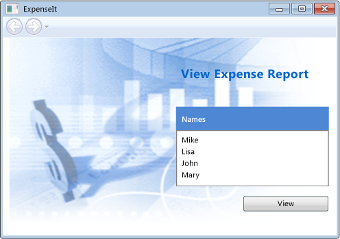
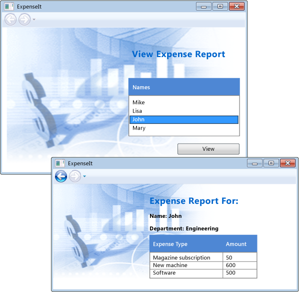

# Procedura dettagliata: introduzione a WPF
 In questa procedura dettagliata viene fornita un'introduzione allo sviluppo di un'applicazione [!INCLUDE[TLA#tla_wpf](../../../../includes/tlasharptla-wpf-md.md)] che include elementi comuni alla maggior parte delle applicazioni [!INCLUDE[TLA2#tla_wpf](../../../../includes/tla2sharptla-wpf-md.md)], ovvero markup [!INCLUDE[TLA#tla_xaml](../../../../includes/tlasharptla-xaml-md.md)], code\-behind, definizioni di applicazioni, controlli, layout, associazioni dati e stili.  
  
 Viene descritto in modo dettagliato lo sviluppo di un'applicazione [!INCLUDE[TLA2#tla_wpf](../../../../includes/tla2sharptla-wpf-md.md)] semplice tramite i passaggi riportati di seguito.  
  
-   Definizione di [!INCLUDE[TLA2#tla_xaml](../../../../includes/tla2sharptla-xaml-md.md)] per la progettazione dell'aspetto dell'[!INCLUDE[TLA#tla_ui](../../../../includes/tlasharptla-ui-md.md)] dell'applicazione.  
  
-   Scrittura di codice per la compilazione del comportamento dell'applicazione.  
  
-   Creazione di una definizione dell'applicazione per la gestione dell'applicazione stessa.  
  
-   Aggiunta di controlli e creazione del layout per la composizione dell'[!INCLUDE[TLA2#tla_ui](../../../../includes/tla2sharptla-ui-md.md)] dell'applicazione.  
  
-   Creazione di stili per la coerenza dell'aspetto dell'[!INCLUDE[TLA2#tla_ui](../../../../includes/tla2sharptla-ui-md.md)] di un'applicazione.  
  
-   Associazione dell'[!INCLUDE[TLA2#tla_ui](../../../../includes/tla2sharptla-ui-md.md)] ai dati con lo scopo di popolare l'[!INCLUDE[TLA2#tla_ui](../../../../includes/tla2sharptla-ui-md.md)] con i dati e di mantenere sincronizzati dati e [!INCLUDE[TLA2#tla_ui](../../../../includes/tla2sharptla-ui-md.md)].  
  
 Al termine della procedura dettagliata, sarà stata completata la compilazione di un'applicazione [!INCLUDE[TLA#tla_mswin](../../../../includes/tlasharptla-mswin-md.md)] autonoma che consente di visualizzare le note spese relative a persone selezionate.  L'applicazione sarà costituita da più pagine [!INCLUDE[TLA2#tla_wpf](../../../../includes/tla2sharptla-wpf-md.md)] ospitate in una finestra di tipo browser.  
  
 Il codice di esempio utilizzato per compilare questa procedura dettagliata è disponibile sia per [!INCLUDE[TLA#tla_visualb](../../../../includes/tlasharptla-visualb-md.md)] che per [!INCLUDE[TLA#tla_cshrp](../../../../includes/tlasharptla-cshrp-md.md)] in [Introduzione alla compilazione di applicazioni WPF](http://go.microsoft.com/fwlink/?LinkID=160008) \(la pagina potrebbe essere in inglese\).  
  
   
## Prerequisiti  
 Per completare la procedura dettagliata, è necessario disporre dei componenti seguenti:  
  
-   [!INCLUDE[vs_dev11_long](../../../../includes/vs-dev11-long-md.md)]  
  
 Per ulteriori informazioni sull'installazione di [!INCLUDE[TLA2#tla_visualstu](../../../../includes/tla2sharptla-visualstu-md.md)], vedere [Installazione di Visual Studio](../Topic/Install%20Visual%20Studio%202015.md).  
  
   
## Creazione di un progetto di applicazione  
 In questa sezione viene creata l'infrastruttura dell'applicazione che include una definizione dell'applicazione, due pagine e un'immagine.  
  
1.  Creare un nuovo progetto Applicazione WPF in Visual Basic o Visual C\# denominato `ExpenseIt`.  Per ulteriori informazioni, vedere [Procedura: creare un nuovo progetto di applicazione WPF](http://msdn.microsoft.com/it-it/1f6aea7a-33e1-4d3f-8555-1daa42e95d82).  
  
    > [!NOTE]
    >  In questa procedura guidata viene utilizzato il controllo <xref:System.Windows.Controls.DataGrid> disponibile in .NET Framework 4.  Assicurarsi che il progetto sia destinato a .NET Framework 4.  Per ulteriori informazioni, vedere [Procedura: destinare una versione di .NET Framework](../Topic/How%20to:%20Target%20a%20Version%20of%20the%20.NET%20Framework.md).  
  
2.  Aprire Application.xaml \(Visual Basic\) o App.xaml \(C\#\).  
  
     Il file [!INCLUDE[TLA2#tla_xaml](../../../../includes/tla2sharptla-xaml-md.md)] definisce un'applicazione [!INCLUDE[TLA2#tla_wpf](../../../../includes/tla2sharptla-wpf-md.md)] ed eventuali risorse dell'applicazione. È inoltre possibile utilizzare questo file per specificare l'[!INCLUDE[TLA2#tla_ui](../../../../includes/tla2sharptla-ui-md.md)] visualizzata automaticamente all'avvio dell'applicazione; in questo caso MainWindow.xaml.  
  
     [!INCLUDE[TLA2#tla_xaml](../../../../includes/tla2sharptla-xaml-md.md)] dovrebbe avere l'aspetto seguente in Visual Basic:  
  
     [!code-xml[ExpenseIt#1_A](../../../../samples/snippets/visualbasic/VS_Snippets_Wpf/ExpenseIt/VB/ExpenseIt1_A/Application.xaml#1_a)]  
  
     Oppure l'aspetto seguente in C\#:  
  
     [!code-xml[ExpenseIt#1](../../../../samples/snippets/csharp/VS_Snippets_Wpf/ExpenseIt/CSharp/ExpenseIt/App.xaml#1)]  
  
3.  Aprire MainWindow.xaml.  
  
     Questo file [!INCLUDE[TLA2#tla_xaml](../../../../includes/tla2sharptla-xaml-md.md)] rappresenta la finestra principale dell'applicazione e visualizza il contenuto creato nelle pagine.  La classe <xref:System.Windows.Window> definisce le proprietà di una finestra quali titolo, dimensione o icona e gestisce eventi quali la chiusura o la disattivazione della visualizzazione.  
  
4.  Modificare l'elemento <xref:System.Windows.Window> in un elemento <xref:System.Windows.Navigation.NavigationWindow>.  
  
     Questa applicazione passerà a contenuto diverso a seconda dell'interazione dell'utente.  Pertanto, è necessario modificare l'elemento <xref:System.Windows.Window> principale in un elemento <xref:System.Windows.Navigation.NavigationWindow>.  <xref:System.Windows.Navigation.NavigationWindow> eredita tutte le proprietà di <xref:System.Windows.Window>.  L'elemento <xref:System.Windows.Navigation.NavigationWindow> nel file XAML crea un'istanza della classe <xref:System.Windows.Navigation.NavigationWindow>.  Per ulteriori informazioni, vedere [Cenni preliminari sulla navigazione](../../../../docs/framework/wpf/app-development/navigation-overview.md).  
  
5.  Modificare le seguenti proprietà dell'elemento <xref:System.Windows.Navigation.NavigationWindow>:  
  
    -   Impostare la proprietà <xref:System.Windows.Window.Title%2A> su "ExpenseIt".  
  
    -   Impostare la proprietà <xref:System.Windows.FrameworkElement.Width%2A> su 500 pixel.  
  
    -   Impostare la proprietà <xref:System.Windows.FrameworkElement.Height%2A> su 350 pixel.  
  
    -   Rimuovere gli elementi <xref:System.Windows.Controls.Grid> inclusi tra i tag <xref:System.Windows.Navigation.NavigationWindow>.  
  
     [!INCLUDE[TLA2#tla_xaml](../../../../includes/tla2sharptla-xaml-md.md)] dovrebbe avere l'aspetto seguente in Visual Basic:  
  
     [!code-xml[ExpenseIt#2_A](../../../../samples/snippets/visualbasic/VS_Snippets_Wpf/ExpenseIt/VB/ExpenseIt/MainWindow.xaml#2_a)]  
  
     Oppure l'aspetto seguente in C\#:  
  
     [!code-xml[ExpenseIt#2](../../../../samples/snippets/csharp/VS_Snippets_Wpf/ExpenseIt/CSharp/ExpenseIt/MainWindow.xaml#2)]  
  
6.  Aprire MainWindow.xaml.vb o MainWindow.xaml.cs.  
  
     Questo è un file code\-behind che contiene il codice per gestire gli eventi dichiarati in MainWindow.xaml.  Il file contiene inoltre una classe parziale per la finestra definita in XAML.  
  
7.  Se si utilizza C\#, modificare la classe `MainWindow` in modo che esegua la derivazione da <xref:System.Windows.Navigation.NavigationWindow>.  
  
     In Visual Basic questo si verifica automaticamente quando si modifica la finestra in XAML.  
  
     Il codice dovrebbe risultare simile a quello mostrato di seguito.  
  
     [!code-csharp[ExpenseIt#3](../../../../samples/snippets/csharp/VS_Snippets_Wpf/ExpenseIt/CSharp/ExpenseIt/MainWindow.xaml.cs#3)]
     [!code-vb[ExpenseIt#3](../../../../samples/snippets/visualbasic/VS_Snippets_Wpf/ExpenseIt/VB/ExpenseIt1_A/MainWindow.xaml.vb#3)]  
  
   
## Aggiunta di file all'applicazione  
 In questa sezione vengono aggiunte all'applicazione due pagine e un'immagine.  
  
1.  Aggiungere una nuova pagina \(WPF\) al progetto denominato `ExpenseItHome.xaml`.  Per ulteriori informazioni, vedere [Procedura: aggiungere nuovi elementi a un progetto WPF](http://msdn.microsoft.com/it-it/17e6b238-fc32-4385-98ef-2f66ca09d9ad).  
  
     Questa è la pagina iniziale visualizzata al primo avvio dell'applicazione.  La pagina mostrerà un elenco di persone in cui è possibile selezionare la persona desiderata per la visualizzazione della nota spese.  
  
2.  Aprire ExpenseItHome.xaml.  
  
3.  Impostare la proprietà <xref:System.Windows.Controls.Page.Title%2A> su "ExpenseIt \- Home".  
  
     [!INCLUDE[TLA2#tla_xaml](../../../../includes/tla2sharptla-xaml-md.md)] dovrebbe avere l'aspetto seguente in Visual Basic:  
  
     [!code-xml[ExpenseIt#6_A](../../../../samples/snippets/visualbasic/VS_Snippets_Wpf/ExpenseIt/VB/ExpenseIt1_A/ExpenseItHome.xaml#6_a)]  
  
     Oppure l'aspetto seguente in C\#:  
  
     [!code-xml[ExpenseIt#6](../../../../samples/snippets/csharp/VS_Snippets_Wpf/ExpenseIt/CSharp/ExpenseIt2/ExpenseItHome.xaml#6)]  
  
4.  Aprire MainWindow.xaml.  
  
5.  Impostare la proprietà <xref:System.Windows.Navigation.NavigationWindow.Source%2A> in <xref:System.Windows.Navigation.NavigationWindow> su "ExpenseItHome.xaml".  
  
     Questo passaggio consente di impostare ExpenseItHome.xaml come prima pagina aperta all'avvio dell'applicazione.  [!INCLUDE[TLA2#tla_xaml](../../../../includes/tla2sharptla-xaml-md.md)] dovrebbe avere l'aspetto seguente in Visual Basic:  
  
     [!code-xml[ExpenseIt#7_A](../../../../samples/snippets/visualbasic/VS_Snippets_Wpf/ExpenseIt/VB/ExpenseIt1_A/MainWindow.xaml#7_a)]  
  
     Oppure l'aspetto seguente in C\#:  
  
     [!code-xml[ExpenseIt#7](../../../../samples/snippets/csharp/VS_Snippets_Wpf/ExpenseIt/CSharp/ExpenseIt2/MainWindow.xaml#7)]  
  
6.  Aggiungere una nuova pagina \(WPF\) al progetto denominato `ExpenseReportPage.xaml`.  
  
     La pagina visualizzerà la nota spese relativa alla persona selezionata in ExpenseItHome.xaml.  
  
7.  Aprire il file ExpenseReportPage.xaml.  
  
8.  Impostare <xref:System.Windows.Controls.Page.Title%2A> su "ExpenseIt \- View Expense".  
  
     [!INCLUDE[TLA2#tla_xaml](../../../../includes/tla2sharptla-xaml-md.md)] dovrebbe avere l'aspetto seguente in Visual Basic:  
  
     [!code-xml[ExpenseIt#4_A](../../../../samples/snippets/visualbasic/VS_Snippets_Wpf/ExpenseIt/VB/ExpenseIt1_A/ExpenseReportPage.xaml#4_a)]  
  
     Oppure l'aspetto seguente in C\#:  
  
     [!code-xml[ExpenseIt#4](../../../../samples/snippets/csharp/VS_Snippets_Wpf/ExpenseIt/CSharp/ExpenseIt/ExpenseReportPage.xaml#4)]  
  
9. Aprire ExpenseItHome.xaml.vb ed ExpenseReportPage.xaml.vb oppure ExpenseItHome.xaml.cs ed ExpenseReportPage.xaml.cs.  
  
     Quando si crea un nuovo file di pagina, Visual Studio crea automaticamente un file code\-behind.  Questi file code\-behind gestiscono la logica per rispondere all'input dell'utente.  
  
     Il codice dovrebbe risultare simile a quello mostrato di seguito.  
  
     [!code-csharp[ExpenseIt#2_5](../../../../samples/snippets/csharp/VS_Snippets_Wpf/ExpenseIt/CSharp/ExpenseIt2/ExpenseItHome.xaml.cs#2_5)]
     [!code-vb[ExpenseIt#2_5](../../../../samples/snippets/visualbasic/VS_Snippets_Wpf/ExpenseIt/VB/ExpenseIt1_A/ExpenseItHome.xaml.vb#2_5)]  
  
     [!code-csharp[ExpenseIt#5](../../../../samples/snippets/csharp/VS_Snippets_Wpf/ExpenseIt/CSharp/ExpenseIt/ExpenseReportPage.xaml.cs#5)]
     [!code-vb[ExpenseIt#5](../../../../samples/snippets/visualbasic/VS_Snippets_Wpf/ExpenseIt/VB/ExpenseIt1_A/ExpenseReportPage.xaml.vb#5)]  
  
10. Aggiungere al progetto un'immagine denominata watermark.png.  È possibile creare un'immagine personalizzata oppure copiare il file dal codice di esempio.  Per ulteriori informazioni, vedere [NIB:How to: Add Existing Items to a Project](http://msdn.microsoft.com/it-it/15f4cfb7-78ab-457f-9f14-099a25a6a2d3).  
  
   
## Compilazione ed esecuzione dell'applicazione  
 In questa sezione l'applicazione viene compilata ed eseguita.  
  
1.  Compilare ed eseguire l'applicazione premendo F5 oppure selezionare **Avvia debug** dal menu **Debug**.  
  
     Nell'illustrazione che segue viene mostrata l'applicazione con i pulsanti <xref:System.Windows.Navigation.NavigationWindow>.  
  
       
  
2.  Chiudere l'applicazione per tornare a [!INCLUDE[vsprvs](../../../../includes/vsprvs-md.md)].  
  
   
## Creazione del layout  
 Il layout consente di posizionare gli elementi dell'[!INCLUDE[TLA2#tla_ui](../../../../includes/tla2sharptla-ui-md.md)] in modo ordinato e gestisce le dimensioni e la posizione di tali elementi quando un'[!INCLUDE[TLA2#tla_ui](../../../../includes/tla2sharptla-ui-md.md)] viene ridimensionata.  In genere, è possibile creare un layout tramite uno dei seguenti controlli di layout:  
  
-   <xref:System.Windows.Controls.Canvas>  
  
-   <xref:System.Windows.Controls.DockPanel>  
  
-   <xref:System.Windows.Controls.Grid>  
  
-   <xref:System.Windows.Controls.StackPanel>  
  
-   <xref:System.Windows.Controls.VirtualizingStackPanel>  
  
-   <xref:System.Windows.Controls.WrapPanel>  
  
 Ciascuno di questi controlli di layout supporta un tipo speciale di layout per gli elementi figlio correlati.  È possibile ridimensionare le pagine ExpenseIt; ciascuna pagina contiene elementi disposti in orizzontale e in verticale accanto ad altri elementi.  Di conseguenza, il controllo <xref:System.Windows.Controls.Grid> costituisce l'elemento di layout ideale per l'applicazione.  
  
> [!NOTE]
>  Per ulteriori informazioni sugli elementi <xref:System.Windows.Controls.Panel>, vedere [Cenni preliminari sugli elementi Panel](../../../../docs/framework/wpf/controls/panels-overview.md).  Per ulteriori informazioni sul layout, vedere [Layout](../../../../docs/framework/wpf/advanced/layout.md).  
  
 In questa sezione viene creata una tabella a colonna singola con tre righe e un margine di 10 pixel tramite l'aggiunta di definizioni di colonne e righe all'oggetto <xref:System.Windows.Controls.Grid> di ExpenseItHome.xaml.  
  
1.  Aprire ExpenseItHome.xaml.  
  
2.  Impostare la proprietà <xref:System.Windows.FrameworkElement.Margin%2A> dell'elemento <xref:System.Windows.Controls.Grid> su "10,0,10,10", valori corrispondenti rispettivamente al margine sinistro, superiore, destro e inferiore.  
  
3.  Aggiungere il seguente [!INCLUDE[TLA2#tla_xaml](../../../../includes/tla2sharptla-xaml-md.md)] tra i tag <xref:System.Windows.Controls.Grid> per creare le definizioni di righe e di colonne.  
  
     [!code-xml[ExpenseIt#8](../../../../samples/snippets/csharp/VS_Snippets_Wpf/ExpenseIt/CSharp/ExpenseIt3/ExpenseItHome.xaml#8)]  
  
     La proprietà <xref:System.Windows.Controls.RowDefinition.Height%2A> di due righe è impostata su <xref:System.Windows.GridLength.Auto%2A>, ovvero le righe saranno ridimensionate in base al rispettivo contenuto.  La proprietà <xref:System.Windows.Controls.RowDefinition.Height%2A> predefinita corrisponde al ridimensionamento <xref:System.Windows.GridUnitType>, ovvero la riga presenterà una proporzione ponderata dello spazio disponibile.  Ad esempio se due righe hanno ciascuna altezza "\*", ognuna di esse disporrà di un'altezza pari alla metà dello spazio disponibile.  
  
     Il controllo <xref:System.Windows.Controls.Grid> dovrebbe ora essere simile al seguente XAML:  
  
     [!code-xml[ExpenseIt#9](../../../../samples/snippets/csharp/VS_Snippets_Wpf/ExpenseIt/CSharp/ExpenseIt3/ExpenseItHome.xaml#9)]  
  
   
## Aggiunta di controlli  
 In questa sezione viene aggiornata l'[!INCLUDE[TLA2#tla_ui](../../../../includes/tla2sharptla-ui-md.md)] della home page in modo da mostrare un elenco in cui è possibile selezionare la persona per la quale si desidera visualizzare la nota spese.  I controlli sono oggetti dell'interfaccia utente che consentono agli utenti di interagire con l'applicazione.  Per ulteriori informazioni, vedere [Controlli](../../../../docs/framework/wpf/controls/index.md).  
  
 Per creare questa [!INCLUDE[TLA2#tla_ui](../../../../includes/tla2sharptla-ui-md.md)], vengono aggiunti a ExpenseItHome.xaml i seguenti elementi:  
  
-   <xref:System.Windows.Controls.ListBox> \(per l'elenco di persone\).  
  
-   <xref:System.Windows.Controls.Label> \(per l'intestazione dell'elenco\).  
  
-   <xref:System.Windows.Controls.Button> \(su cui fare clic per visualizzare il report di spesa relativo alla persona selezionata nell'elenco\).  
  
 Ogni controllo viene posizionato in una riga dell'oggetto <xref:System.Windows.Controls.Grid> mediante l'impostazione della proprietà associata <xref:System.Windows.Controls.Grid.Row%2A?displayProperty=fullName>.  Per ulteriori informazioni sulle proprietà associate, vedere [Cenni preliminari sulle proprietà associate](../../../../docs/framework/wpf/advanced/attached-properties-overview.md).  
  
1.  Aprire ExpenseItHome.xaml.  
  
2.  Aggiungere il seguente [!INCLUDE[TLA2#tla_xaml](../../../../includes/tla2sharptla-xaml-md.md)] tra i tag <xref:System.Windows.Controls.Grid>.  
  
     [!code-xml[ExpenseIt#10](../../../../samples/snippets/csharp/VS_Snippets_Wpf/ExpenseIt/CSharp/ExpenseIt4/ExpenseItHome.xaml#10)]  
  
3.  Compilare ed eseguire l'applicazione.  
  
 Nell'illustrazione che segue vengono mostrati i controlli creati da XAML in questa sezione.  
  
   
  
   
## Aggiunta di un'immagine e di un titolo  
 In questa sezione viene aggiornata l'[!INCLUDE[TLA2#tla_ui](../../../../includes/tla2sharptla-ui-md.md)] della home page con un'immagine e un titolo di pagina.  
  
1.  Aprire ExpenseItHome.xaml.  
  
2.  Aggiungere un'altra colonna a <xref:System.Windows.Controls.Grid.ColumnDefinitions%2A> con una proprietà <xref:System.Windows.Controls.ColumnDefinition.Width%2A> fissa di 230 pixel.  
  
     [!code-xml[ExpenseIt#11](../../../../samples/snippets/csharp/VS_Snippets_Wpf/ExpenseIt/CSharp/ExpenseIt5/ExpenseItHome.xaml#11)]  
  
3.  Aggiungere un'altra riga a <xref:System.Windows.Controls.Grid.RowDefinitions%2A>.  
  
     [!code-xml[ExpenseIt#11b](../../../../samples/snippets/csharp/VS_Snippets_Wpf/ExpenseIt/CSharp/ExpenseIt5/ExpenseItHome.xaml#11b)]  
  
4.  Spostare i controlli nella seconda colonna impostando <xref:System.Windows.Controls.Grid.Column%2A?displayProperty=fullName> su 1.  Spostare ciascun controllo di una riga verso il basso aumentando <xref:System.Windows.Controls.Grid.Row%2A?displayProperty=fullName> di 1.  
  
     [!code-xml[ExpenseIt#12](../../../../samples/snippets/csharp/VS_Snippets_Wpf/ExpenseIt/CSharp/ExpenseIt5/ExpenseItHome.xaml#12)]  
  
5.  Impostare la proprietà <xref:System.Windows.Controls.Panel.Background%2A> dell'oggetto <xref:System.Windows.Controls.Grid> come file di immagine watermark.png.  
  
     [!code-xml[ExpenseIt#14](../../../../samples/snippets/csharp/VS_Snippets_Wpf/ExpenseIt/CSharp/ExpenseIt5/ExpenseItHome.xaml#14)]  
  
6.  Prima di <xref:System.Windows.Controls.Border> aggiungere un oggetto <xref:System.Windows.Controls.Label> con il contenuto "View Expense Report" come il titolo della pagina.  
  
     [!code-xml[ExpenseIt#13](../../../../samples/snippets/csharp/VS_Snippets_Wpf/ExpenseIt/CSharp/ExpenseIt5/ExpenseItHome.xaml#13)]  
  
7.  Compilare ed eseguire l'applicazione.  
  
 Nell'illustrazione che segue vengono mostrati i risultati di questa sezione.  
  
   
  
   
## Aggiunta di codice per la gestione degli eventi  
  
1.  Aprire ExpenseItHome.xaml.  
  
2.  Aggiungere un gestore eventi <xref:System.Windows.Controls.Primitives.ButtonBase.Click> all'elemento <xref:System.Windows.Controls.Button>.  Per ulteriori informazioni, vedere [Procedura: creare un gestore eventi semplice](http://msdn.microsoft.com/it-it/b1456e07-9dec-4354-99cf-18666b64f480).  
  
     [!code-xml[ExpenseIt#15](../../../../samples/snippets/csharp/VS_Snippets_Wpf/ExpenseIt/CSharp/ExpenseIt6/ExpenseItHome.xaml#15)]  
  
3.  Aprire ExpenseItHome.xaml.vb o ExpenseItHome.xaml.cs.  
  
4.  Aggiungere il codice mostrato di seguito al gestore eventi <xref:System.Windows.Controls.Primitives.ButtonBase.Click>. Ciò consente di passare al file ExpenseReportPage.xaml all'interno della finestra.  
  
     [!code-csharp[ExpenseIt#16](../../../../samples/snippets/csharp/VS_Snippets_Wpf/ExpenseIt/CSharp/ExpenseIt6/ExpenseItHome.xaml.cs#16)]
     [!code-vb[ExpenseIt#16](../../../../samples/snippets/visualbasic/VS_Snippets_Wpf/ExpenseIt/VB/ExpenseIt6/ExpenseItHome.xaml.vb#16)]  
  
   
## Creazione dell'interfaccia utente per ExpenseReportPage  
 Nel file ExpenseReportPage.xaml viene visualizzata la nota spese relativa alla persona selezionata nel file ExpenseItHome.xaml.  In questa sezione vengono aggiunti i controlli e viene creata l'[!INCLUDE[TLA2#tla_ui](../../../../includes/tla2sharptla-ui-md.md)] per ExpenseReportPage.xaml.  In questa sezione vengono inoltre aggiunti sfondo e colori di riempimento ai diversi elementi dell'[!INCLUDE[TLA2#tla_ui](../../../../includes/tla2sharptla-ui-md.md)].  
  
1.  Aprire il file ExpenseReportPage.xaml.  
  
2.  Aggiungere il seguente XAML tra i tag <xref:System.Windows.Controls.Grid>.  
  
     Questa interfaccia utente è simile all'interfaccia utente creata in ExpenseItHome.xaml tranne per il fatto che i dati del rapporto sono visualizzati in un oggetto <xref:System.Windows.Controls.DataGrid>.  
  
     [!code-xml[ExpenseIt#17](../../../../samples/snippets/csharp/VS_Snippets_Wpf/ExpenseIt/CSharp/ExpenseIt6/ExpenseReportPage.xaml#17)]  
  
3.  Compilare ed eseguire l'applicazione.  
  
    > [!NOTE]
    >  Se viene generato un errore che indica che <xref:System.Windows.Controls.DataGrid> non è stato trovato o non esiste, verificare che il progetto sia destinato a .NET Framework 4.  Per ulteriori informazioni, vedere [Procedura: destinare una versione di .NET Framework](../Topic/How%20to:%20Target%20a%20Version%20of%20the%20.NET%20Framework.md).  
  
4.  Fare clic sul pulsante **Visualizza**.  
  
     Verrà visualizzata la pagina della nota spese.  
  
 Nell'illustrazione che segue vengono mostrati gli elementi dell'[!INCLUDE[TLA2#tla_ui](../../../../includes/tla2sharptla-ui-md.md)] aggiunti al file ExpenseReportPage.xaml.  Si noti che il pulsante di navigazione Indietro è abilitato.  
  
   
  
   
## Applicazione di uno stile ai controlli  
 Spesso, in un'[!INCLUDE[TLA2#tla_ui](../../../../includes/tla2sharptla-ui-md.md)], l'aspetto dei diversi elementi può essere identico per tutti gli elementi di uno stesso tipo.  Per rendere riutilizzabile l'aspetto tra più elementi, nell'[!INCLUDE[TLA2#tla_ui](../../../../includes/tla2sharptla-ui-md.md)] vengono utilizzati gli stili.  La possibilità di riutilizzo consente di semplificare la creazione e la gestione di [!INCLUDE[TLA2#tla_xaml](../../../../includes/tla2sharptla-xaml-md.md)].  Per ulteriori informazioni sugli stili, vedere [Applicazione di stili e modelli](../../../../docs/framework/wpf/controls/styling-and-templating.md).  In questa sezione vengono sostituiti con gli stili gli attributi per elemento definiti nei passaggi precedenti:  
  
1.  Aprire Application.xaml o App.xaml.  
  
2.  Aggiungere il seguente XAML tra i tag <xref:System.Windows.Application.Resources%2A?displayProperty=fullName>.  
  
     [!code-xml[ExpenseIt#18](../../../../samples/snippets/csharp/VS_Snippets_Wpf/ExpenseIt/CSharp/ExpenseIt7/App.xaml#18)]  
  
     Grazie a questo markup [!INCLUDE[TLA2#tla_xaml](../../../../includes/tla2sharptla-xaml-md.md)] è possibile aggiungere i seguenti stili:  
  
    -   `headerTextStyle`: per formattare l'oggetto <xref:System.Windows.Controls.Label> del titolo della pagina.  
  
    -   `labelStyle`: per formattare i controlli <xref:System.Windows.Controls.Label>.  
  
    -   `columnHeaderStyle`: per formattare <xref:System.Windows.Controls.Primitives.DataGridColumnHeader>.  
  
    -   `listHeaderStyle`: per formattare i controlli <xref:System.Windows.Controls.Border> dell'intestazione dell'elenco.  
  
    -   `listHeaderTextStyle`: per formattare l'oggetto <xref:System.Windows.Controls.Label> dell'intestazione dell'elenco.  
  
    -   `buttonStyle`: per formattare l'oggetto <xref:System.Windows.Controls.Button> in ExpenseItHome.xaml.  
  
     Si noti che gli stili sono risorse ed elementi figlio dell'elemento proprietà <xref:System.Windows.Application.Resources%2A?displayProperty=fullName>.  In questa sede, gli stili vengono applicati a tutti gli elementi presenti in un'applicazione.  Per un esempio di utilizzo delle risorse in un'applicazione [!INCLUDE[TLA2#tla_winfx](../../../../includes/tla2sharptla-winfx-md.md)], vedere [Utilizzare le risorse delle applicazioni](../../../../docs/framework/wpf/advanced/how-to-use-application-resources.md).  
  
3.  Aprire ExpenseItHome.xaml.  
  
4.  Sostituire tutti i dati inclusi tra gli elementi <xref:System.Windows.Controls.Grid> con il seguente XAML.  
  
     [!code-xml[ExpenseIt#19](../../../../samples/snippets/csharp/VS_Snippets_Wpf/ExpenseIt/CSharp/ExpenseIt7/ExpenseItHome.xaml#19)]  
  
     Proprietà quali <xref:System.Windows.VerticalAlignment> e <xref:System.Windows.Media.FontFamily> che definiscono l'aspetto di ogni controllo verranno rimosse e sostituite mediante l'applicazione degli stili.  Ad esempio `headerTextStyle` verrà applicato all'oggetto <xref:System.Windows.Controls.Label> "View Expense Report".  
  
5.  Aprire il file ExpenseReportPage.xaml.  
  
6.  Sostituire tutti i dati inclusi tra gli elementi <xref:System.Windows.Controls.Grid> con il seguente XAML.  
  
     [!code-xml[ExpenseIt#20](../../../../samples/snippets/csharp/VS_Snippets_Wpf/ExpenseIt/CSharp/ExpenseIt7/ExpenseReportPage.xaml#20)]  
  
     Ciò consente di aggiungere gli stili agli elementi <xref:System.Windows.Controls.Label> e <xref:System.Windows.Controls.Border>.  
  
7.  Compilare ed eseguire l'applicazione.  
  
     Dopo aver aggiunto l'[!INCLUDE[TLA2#tla_xaml](../../../../includes/tla2sharptla-xaml-md.md)] in questa sezione, l'aspetto dell'applicazione sarà di nuovo quello precedente all'aggiornamento con gli stili.  
  
   
## Associazione di dati a un controllo  
 In questa sezione vengono creati i dati [!INCLUDE[TLA#tla_xml](../../../../includes/tlasharptla-xml-md.md)] che vengono associati a diversi controlli.  
  
1.  Aprire ExpenseItHome.xaml.  
  
2.  Dopo l'apertura dell'elemento <xref:System.Windows.Controls.Grid> aggiungere il seguente XAML per creare un oggetto <xref:System.Windows.Data.XmlDataProvider> contenente i dati per ogni persona.  
  
     I dati vengono creati come risorsa <xref:System.Windows.Controls.Grid>.  In genere i dati verrebbero caricati come file, ma per semplicità vengono aggiunti inline.  
  
     [!code-xml[ExpenseIt#21](../../../../samples/snippets/csharp/VS_Snippets_Wpf/ExpenseIt/CSharp/ExpenseIt8/ExpenseItHome.xaml#21)]  
    [!code-xml[ExpenseIt#23](../../../../samples/snippets/csharp/VS_Snippets_Wpf/ExpenseIt/CSharp/ExpenseIt8/ExpenseItHome.xaml#23)]  
    [!code-xml[ExpenseIt#22](../../../../samples/snippets/csharp/VS_Snippets_Wpf/ExpenseIt/CSharp/ExpenseIt8/ExpenseItHome.xaml#22)]  
  
3.  Nella risorsa <xref:System.Windows.Controls.Grid> aggiungere il seguente oggetto <xref:System.Windows.DataTemplate> che definisce la modalità di visualizzazione dei dati in <xref:System.Windows.Controls.ListBox>.  Per ulteriori informazioni sui modelli di dati, vedere [Cenni preliminari sui modelli di dati](../../../../docs/framework/wpf/data/data-templating-overview.md).  
  
     [!code-xml[ExpenseIt#21](../../../../samples/snippets/csharp/VS_Snippets_Wpf/ExpenseIt/CSharp/ExpenseIt8/ExpenseItHome.xaml#21)]  
    [!code-xml[ExpenseIt#24](../../../../samples/snippets/csharp/VS_Snippets_Wpf/ExpenseIt/CSharp/ExpenseIt8/ExpenseItHome.xaml#24)]  
    [!code-xml[ExpenseIt#22](../../../../samples/snippets/csharp/VS_Snippets_Wpf/ExpenseIt/CSharp/ExpenseIt8/ExpenseItHome.xaml#22)]  
  
4.  Sostituire l'oggetto <xref:System.Windows.Controls.ListBox> esistente con il seguente XAML.  
  
     [!code-xml[ExpenseIt#25](../../../../samples/snippets/csharp/VS_Snippets_Wpf/ExpenseIt/CSharp/ExpenseIt8/ExpenseItHome.xaml#25)]  
  
     Questo XAML associa la proprietà <xref:System.Windows.Controls.ItemsControl.ItemsSource%2A> di <xref:System.Windows.Controls.ListBox> all'origine dati e applica il modello di dati come <xref:System.Windows.Controls.ItemsControl.ItemTemplate%2A>.  
  
   
## Connessione dei dati ai controlli  
 In questa sezione viene scritto il codice che consente di recuperare l'elemento corrente selezionato nell'elenco di persone nella pagina ExpenseItHome.xaml e passarne il riferimento al costruttore di `ExpenseReportPage` durante la creazione di istanze.  `ExpenseReportPage` imposta il contesto dati con l'elemento passato a cui verranno associati i controlli definiti in ExpenseReportPage.xaml.  
  
1.  Aprire ExpenseReportPage.xaml.vb o ExpenseReportPage.xaml.cs.  
  
2.  Aggiungere un costruttore che accetti un oggetto in modo da passare i dati della nota spese della persona selezionata.  
  
     [!code-csharp[ExpenseIt#26](../../../../samples/snippets/csharp/VS_Snippets_Wpf/ExpenseIt/CSharp/ExpenseIt8/ExpenseReportPage.xaml.cs#26)]
     [!code-vb[ExpenseIt#26](../../../../samples/snippets/visualbasic/VS_Snippets_Wpf/ExpenseIt/VB/ExpenseIt8/ExpenseReportPage.xaml.vb#26)]  
  
3.  Aprire ExpenseItHome.xaml.vb o ExpenseItHome.xaml.cs.  
  
4.  Modificare il gestore eventi <xref:System.Windows.Controls.Primitives.ButtonBase.Click> per chiamare il nuovo costruttore che passa i dati della nota spese relativa alla persona selezionata.  
  
     [!code-csharp[ExpenseIt#27](../../../../samples/snippets/csharp/VS_Snippets_Wpf/ExpenseIt/CSharp/ExpenseIt8/ExpenseItHome.xaml.cs#27)]
     [!code-vb[ExpenseIt#27](../../../../samples/snippets/visualbasic/VS_Snippets_Wpf/ExpenseIt/VB/ExpenseIt8/ExpenseItHome.xaml.vb#27)]  
  
   
## Aggiunta di stili ai dati con i modelli di dati  
 In questa sezione viene aggiornata l'[!INCLUDE[TLA2#tla_ui](../../../../includes/tla2sharptla-ui-md.md)] per ciascun elemento presente negli elenchi associati ai dati tramite i modelli di dati:  
  
1.  Aprire il file ExpenseReportPage.xaml.  
  
2.  Associare il contenuto degli elementi <xref:System.Windows.Controls.Label> "Name" e "Department" alla proprietà di origine dati adeguata.  Per ulteriori informazioni sull'associazione dati, vedere [Cenni preliminari sull'associazione dati](../../../../docs/framework/wpf/data/data-binding-overview.md).  
  
     [!code-xml[ExpenseIt#31](../../../../samples/snippets/csharp/VS_Snippets_Wpf/ExpenseIt/CSharp/ExpenseIt9/ExpenseReportPage.xaml#31)]  
  
3.  Dopo l'apertura dell'elemento <xref:System.Windows.Controls.Grid>, aggiungere i modelli di dati seguenti che definiscono le modalità di visualizzazione dei dati della nota spese.  
  
     [!code-xml[ExpenseIt#30](../../../../samples/snippets/csharp/VS_Snippets_Wpf/ExpenseIt/CSharp/ExpenseIt9/ExpenseReportPage.xaml#30)]  
  
4.  Applicare i modelli alle colonne <xref:System.Windows.Controls.DataGrid> in cui sono visualizzati i dati della nota spese.  
  
     [!code-xml[ExpenseIt#32](../../../../samples/snippets/csharp/VS_Snippets_Wpf/ExpenseIt/CSharp/ExpenseIt9/ExpenseReportPage.xaml#32)]  
  
5.  Compilare ed eseguire l'applicazione.  
  
6.  Selezionare una persona e fare clic sul pulsante **Visualizza**.  
  
 Nella figura seguente vengono illustrate entrambe le pagine dell'applicazione ExpenseIt a cui sono stati applicati i controlli, il layout, gli stili, l'associazione dati e i modelli di dati.  
  
   
  
   
## Suggerimenti  
 In questo esempio viene illustrata una funzionalità specifica di WPF e, di conseguenza, non vengono seguite le procedure consigliate per lo sviluppo di applicazioni.  Per una descrizione completa delle procedure consigliate per lo sviluppo di applicazioni [!INCLUDE[TLA2#tla_winclient](../../../../includes/tla2sharptla-winclient-md.md)] e [!INCLUDE[TLA2#tla_winfx](../../../../includes/tla2sharptla-winfx-md.md)], vedere gli argomenti riportati di seguito scegliendo in base alle esigenze:  
  
-   Accesso facilitato \- [Procedure consigliate per l'accesso facilitato](../../../../docs/framework/ui-automation/accessibility-best-practices.md)  
  
-   Sicurezza \- [Sicurezza](../../../../docs/framework/wpf/security-wpf.md)  
  
-   Localizzazione \- [Cenni preliminari sulla globalizzazione e localizzazione WPF](../../../../docs/framework/wpf/advanced/wpf-globalization-and-localization-overview.md)  
  
-   Prestazioni \- [Ottimizzazione delle prestazioni di applicazioni WPF](../../../../docs/framework/wpf/advanced/optimizing-wpf-application-performance.md)  
  
   
## Argomenti successivi  
 A questo punto si dispone di un gran numero tecniche di creazione di un'[!INCLUDE[TLA2#tla_ui](../../../../includes/tla2sharptla-ui-md.md)] mediante [!INCLUDE[TLA#tla_winclient](../../../../includes/tlasharptla-winclient-md.md)].  È stata acquisita una conoscenza approfondita dei blocchi predefiniti di base di un'applicazione [!INCLUDE[TLA2#tla_winfx](../../../../includes/tla2sharptla-winfx-md.md)] associata ai dati.  Questo argomento non è da intendersi come esaustivo, ma intende fornire un'idea delle possibilità di scoprire altre tecniche al di là di quelle presentate.  
  
 Per ulteriori informazioni sull'architettura WPF e sui modelli di programmazione, vedere gli argomenti seguenti:  
  
-   [Architettura WPF](../../../../docs/framework/wpf/advanced/wpf-architecture.md)  
  
-   [Cenni preliminari su XAML \(WPF\)](../../../../docs/framework/wpf/advanced/xaml-overview-wpf.md)  
  
-   [Cenni preliminari sulle proprietà di dipendenza](../../../../docs/framework/wpf/advanced/dependency-properties-overview.md)  
  
-   [Layout](../../../../docs/framework/wpf/advanced/layout.md)  
  
 Per ulteriori informazioni sulla creazione di applicazioni, vedere gli argomenti seguenti:  
  
-   [Sviluppo di applicazioni](../../../../docs/framework/wpf/app-development/index.md)  
  
-   [Controlli](../../../../docs/framework/wpf/controls/index.md)  
  
-   [Cenni preliminari sull'associazione dati](../../../../docs/framework/wpf/data/data-binding-overview.md)  
  
-   [Grafica e funzionalità multimediali](../../../../docs/framework/wpf/graphics-multimedia/index.md)  
  
-   [Documenti in WPF](../../../../docs/framework/wpf/advanced/documents-in-wpf.md)  
  
## Vedere anche  
 [Cenni preliminari sugli elementi Panel](../../../../docs/framework/wpf/controls/panels-overview.md)   
 [Cenni preliminari sui modelli di dati](../../../../docs/framework/wpf/data/data-templating-overview.md)   
 [Compilazione di un'applicazione WPF](../../../../docs/framework/wpf/app-development/building-a-wpf-application-wpf.md)   
 [Stili e modelli](../../../../docs/framework/wpf/controls/styles-and-templates.md)