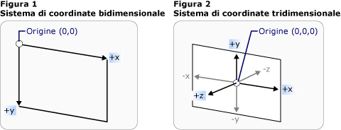
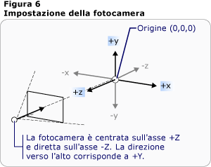
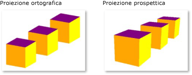

# Cenni preliminari sulla grafica tridimensionale
 La funzionalità di [!INCLUDE[TLA2#tla_3d](../../../../includes/tla2sharptla-3d-md.md)] in [!INCLUDE[TLA#tla_winclient](../../../../includes/tlasharptla-winclient-md.md)] consente agli sviluppatori di creare, trasformare e animare grafica 3D nel markup e nel codice procedurale.  Gli sviluppatori possono combinare grafica [!INCLUDE[TLA#tla_2d](../../../../includes/tlasharptla-2d-md.md)] e [!INCLUDE[TLA2#tla_3d](../../../../includes/tla2sharptla-3d-md.md)] per creare controlli dettagliati, fornire illustrazioni complesse di dati o migliorare l'esperienza utente dell'interfaccia di un'applicazione. Il supporto [!INCLUDE[TLA2#tla_3d](../../../../includes/tla2sharptla-3d-md.md)] in [!INCLUDE[TLA2#tla_winclient](../../../../includes/tla2sharptla-winclient-md.md)] non è progettato come piattaforma per lo sviluppo di giochi con funzionalità complete. In questo argomento vengono forniti cenni preliminari sulla funzionalità di [!INCLUDE[TLA#tla_3d](../../../../includes/tlasharptla-3d-md.md)] nel sistema grafico di [!INCLUDE[TLA2#tla_winclient](../../../../includes/tla2sharptla-winclient-md.md)].  
  
   
  
   
## Grafica 3D in un contenitore bidimensionale  
 Il contenuto grafico [!INCLUDE[TLA2#tla_3d](../../../../includes/tla2sharptla-3d-md.md)] in [!INCLUDE[TLA2#tla_winclient](../../../../includes/tla2sharptla-winclient-md.md)] è incapsulato nell'elemento <xref:System.Windows.Controls.Viewport3D>, che può far parte della struttura dell'elemento bidimensionale.  Il sistema grafico considera <xref:System.Windows.Controls.Viewport3D> come un elemento visivo bidimensionale come molti altri in [!INCLUDE[TLA2#tla_winclient](../../../../includes/tla2sharptla-winclient-md.md)].  <xref:System.Windows.Controls.Viewport3D> funziona come una finestra, o un riquadro di visualizzazione, in una scena tridimensionale.  Più precisamente, si tratta di una superficie sulla quale viene proiettata una scena [!INCLUDE[TLA2#tla_3d](../../../../includes/tla2sharptla-3d-md.md)].  
  
 In un'applicazione [!INCLUDE[TLA2#tla_2d](../../../../includes/tla2sharptla-2d-md.md)] convenzionale, utilizzare <xref:System.Windows.Controls.Viewport3D> come qualsiasi altro elemento contenitore, ad esempio Grid o Canvas.  Benché sia possibile utilizzare <xref:System.Windows.Controls.Viewport3D> con altri oggetti disegno [!INCLUDE[TLA2#tla_2d](../../../../includes/tla2sharptla-2d-md.md)] nello stesso grafico, non è possibile inserire oggetti [!INCLUDE[TLA2#tla_2d](../../../../includes/tla2sharptla-2d-md.md)] e [!INCLUDE[TLA2#tla_3d](../../../../includes/tla2sharptla-3d-md.md)] all'interno di un oggetto <xref:System.Windows.Controls.Viewport3D>.  In questo argomento verrà illustrato come disegnare grafica [!INCLUDE[TLA2#tla_3d](../../../../includes/tla2sharptla-3d-md.md)] in <xref:System.Windows.Controls.Viewport3D>.  
  
   
## Spazio della Coordinata tridimensionale  
 Il sistema di coordinate [!INCLUDE[TLA2#tla_winclient](../../../../includes/tla2sharptla-winclient-md.md)] per la grafica [!INCLUDE[TLA2#tla_2d](../../../../includes/tla2sharptla-2d-md.md)] individua l'origine nella parte superiore sinistra dell'area di rendering, in genere lo schermo.  Nel sistema [!INCLUDE[TLA2#tla_2d](../../../../includes/tla2sharptla-2d-md.md)], i valori positivi dell'asse x procedono verso destra, mentre i valori positivi dell'asse y procedono in direzione discendente.  Nel sistema di coordinate [!INCLUDE[TLA2#tla_3d](../../../../includes/tla2sharptla-3d-md.md)], tuttavia, l'origine viene individuata al centro dell'area di rendering, con i valori positivi dell'asse x che procedono verso destra, i valori positivi dell'asse y che procedono verso l'alto e i valori positivi dell'asse z che procedono verso l'esterno dell'origine, in direzione del visualizzatore.  
  
   
Rappresentazioni convenzionali dei sistemi di coordinate bidimensionali e tridimensionali  
  
 Lo spazio definito da questi assi è il frame di riferimento fisso per oggetti [!INCLUDE[TLA2#tla_3d](../../../../includes/tla2sharptla-3d-md.md)] in [!INCLUDE[TLA2#tla_winclient](../../../../includes/tla2sharptla-winclient-md.md)].  Quando si compilano modelli in questo spazio e si creano luci e fotocamere per visualizzarli, è consigliabile distinguere il frame di riferimento fisso, o "spazio globale", dal frame di riferimento locale creato per ciascun modello quando si applicano delle trasformazioni.  Si ricordi inoltre che gli oggetti dello spazio globale possono avere un aspetto completamente diverso, o non essere visibile a tutti, a seconda delle impostazioni di luce e fotocamera, tuttavia la posizione della fotocamera non modifica la posizione degli oggetti nello spazio globale.  
  
   
## Fotocamere e proiezioni  
 Gli sviluppatori che lavorano in [!INCLUDE[TLA2#tla_2d](../../../../includes/tla2sharptla-2d-md.md)] sono abituati a posizionare le primitive del disegno su uno schermo bidimensionale.  Nella creazione di una scena [!INCLUDE[TLA2#tla_3d](../../../../includes/tla2sharptla-3d-md.md)], è importante tenere presente che in realtà si sta creando una rappresentazione [!INCLUDE[TLA2#tla_2d](../../../../includes/tla2sharptla-2d-md.md)] di oggetti [!INCLUDE[TLA2#tla_3d](../../../../includes/tla2sharptla-3d-md.md)].  Poiché una scena [!INCLUDE[TLA2#tla_3d](../../../../includes/tla2sharptla-3d-md.md)] ha un aspetto diverso a seconda del punto di vista dello spettatore, è necessario specificare tale punto di vista.  La classe <xref:System.Windows.Media.Media3D.Camera> consente di specificare il punto di vista per una scena [!INCLUDE[TLA2#tla_3d](../../../../includes/tla2sharptla-3d-md.md)].  
  
 Per comprendere la modalità di rappresentazione di una scena [!INCLUDE[TLA2#tla_3d](../../../../includes/tla2sharptla-3d-md.md)] su una superficie [!INCLUDE[TLA2#tla_2d](../../../../includes/tla2sharptla-2d-md.md)] è inoltre possibile descrivere la scena come proiezione sulla superficie di visualizzazione.  <xref:System.Windows.Media.Media3D.ProjectionCamera> consente di specificare proiezioni diverse e le relative proprietà per modificare la modalità di visualizzazione dei modelli [!INCLUDE[TLA2#tla_3d](../../../../includes/tla2sharptla-3d-md.md)] da parte dello spettatore.  Un oggetto <xref:System.Windows.Media.Media3D.PerspectiveCamera> specifica una proiezione che rappresenta uno scorcio della scena.  In altre parole, <xref:System.Windows.Media.Media3D.PerspectiveCamera> offre la prospettiva del punto di fuga.  È possibile specificare la posizione della fotocamera nello spazio delle coordinate della scena, la direzione e il campo visivo per la fotocamera e un vettore che definisce la direzione verso l'alto nella scena.  Nel diagramma riportato di seguito viene illustrata la proiezione dell'oggetto <xref:System.Windows.Media.Media3D.PerspectiveCamera>.  
  
 Le proprietà <xref:System.Windows.Media.Media3D.ProjectionCamera.NearPlaneDistance%2A> e <xref:System.Windows.Media.Media3D.ProjectionCamera.FarPlaneDistance%2A> di <xref:System.Windows.Media.Media3D.ProjectionCamera> limitano l'intervallo della proiezione della fotocamera.  Poiché le fotocamere si possono trovare in qualunque punto della scena, è possibile che la fotocamera venga posizionata all'interno di un modello o accanto a esso, rendendo difficile distinguere correttamente gli oggetti.  <xref:System.Windows.Media.Media3D.ProjectionCamera.NearPlaneDistance%2A> consente di specificare una distanza minima dalla fotocamera oltre la quale non verranno disegnati oggetti.  Al contrario, <xref:System.Windows.Media.Media3D.ProjectionCamera.FarPlaneDistance%2A> consente di specificare una distanza dalla fotocamera oltre la quale non verranno disegnati oggetti per garantire che non vengano inclusi nella scena oggetti troppo lontani per essere riconoscibili.  
  
   
Posizione della fotocamera  
  
 <xref:System.Windows.Media.Media3D.OrthographicCamera> specifica una proiezione ortogonale di un modello [!INCLUDE[TLA2#tla_3d](../../../../includes/tla2sharptla-3d-md.md)] su una superficie visiva [!INCLUDE[TLA2#tla_2d](../../../../includes/tla2sharptla-2d-md.md)].  Analogamente ad altre fotocamere, specifica una posizione, una direzione di visualizzazione e una direzione verso l'alto.  A differenza di <xref:System.Windows.Media.Media3D.PerspectiveCamera>, tuttavia, la classe <xref:System.Windows.Media.Media3D.OrthographicCamera> descrive una proiezione che non include lo scorcio prospettico.  In altri termini, <xref:System.Windows.Media.Media3D.OrthographicCamera> descrive un riquadro di visualizzazione con i lati paralleli, anziché un riquadro i cui lati si incontrano in un punto in corrispondenza della fotocamera.  Nell'immagine riportata di seguito viene illustrato lo stesso modello visualizzato tramite <xref:System.Windows.Media.Media3D.PerspectiveCamera> e <xref:System.Windows.Media.Media3D.OrthographicCamera>.  
  
   
Proiezioni prospettiche e ortografiche  
  
 Nel codice riportato di seguito vengono illustrate alcune impostazioni tipiche della fotocamera.  
  
 [!code-csharp[3dgallery_procedural_snip#Basic3DShapeCodeExampleInline1](../../../../samples/snippets/csharp/VS_Snippets_Wpf/3DGallery_procedural_snip/CSharp/Basic3DShapeExample.cs#basic3dshapecodeexampleinline1)]
 [!code-vb[3dgallery_procedural_snip#Basic3DShapeCodeExampleInline1](../../../../samples/snippets/visualbasic/VS_Snippets_Wpf/3DGallery_procedural_snip/visualbasic/basic3dshapeexample.vb#basic3dshapecodeexampleinline1)]  
  
   
## Modello e primitive mesh  
 <xref:System.Windows.Media.Media3D.Model3D> è la classe base astratta che rappresenta un oggetto [!INCLUDE[TLA2#tla_3d](../../../../includes/tla2sharptla-3d-md.md)] generico.  Per compilare una scena [!INCLUDE[TLA2#tla_3d](../../../../includes/tla2sharptla-3d-md.md)] sono necessari alcuni oggetti da visualizzare e gli oggetti che compongono il grafico della scena derivano da <xref:System.Windows.Media.Media3D.Model3D>.  Attualmente, [!INCLUDE[TLA2#tla_winclient](../../../../includes/tla2sharptla-winclient-md.md)] supporta le geometrie di modellazione con <xref:System.Windows.Media.Media3D.GeometryModel3D>.  La proprietà <xref:System.Windows.Media.Media3D.GeometryModel3D.Geometry%2A> di questo modello accetta una primitiva mesh.  
  
 Per compilare un modello, iniziare dalla compilazione di una primitiva o mesh.  Una primitiva [!INCLUDE[TLA2#tla_3d](../../../../includes/tla2sharptla-3d-md.md)] è una raccolta di vertici che costituiscono una sola entità [!INCLUDE[TLA2#tla_3d](../../../../includes/tla2sharptla-3d-md.md)].  La maggior parte dei sistemi [!INCLUDE[TLA2#tla_3d](../../../../includes/tla2sharptla-3d-md.md)] offre primitive modellate sulla figura chiusa più semplice, ovvero un triangolo definito da tre vertici.  Poiché i tre punti di un triangolo sono complanari, è possibile continuare ad aggiungere triangoli per modellare forme più complesse, dette mesh.  
  
 Nel sistema [!INCLUDE[TLA2#tla_3d](../../../../includes/tla2sharptla-3d-md.md)] [!INCLUDE[TLA2#tla_winclient](../../../../includes/tla2sharptla-winclient-md.md)] è disponibile attualmente la classe <xref:System.Windows.Media.Media3D.MeshGeometry3D> che consente di specificare qualsiasi geometria. Attualmente, non sono supportate primitive [!INCLUDE[TLA2#tla_3d](../../../../includes/tla2sharptla-3d-md.md)] predefinite, quali sfere e forme cubiche.  Creare un oggetto <xref:System.Windows.Media.Media3D.MeshGeometry3D> specificando un elenco di vertici di triangolo come proprietà <xref:System.Windows.Media.Media3D.MeshGeometry3D.Positions%2A>.  Ciascun vertice viene specificato come <xref:System.Windows.Media.Media3D.Point3D>.  In [!INCLUDE[TLA#tla_xaml](../../../../includes/tlasharptla-xaml-md.md)], specificare questa proprietà come elenco di numeri in gruppi di tre che rappresentano le coordinate di ciascun vertice. A seconda della geometria, la mesh potrebbe essere composta da molti triangoli, alcuni dei quali condividono gli stessi angoli \(vertici\).  Per disegnare correttamente la mesh, in [!INCLUDE[TLA2#tla_winclient](../../../../includes/tla2sharptla-winclient-md.md)] sono necessarie informazioni sui vertici condivisi e sui triangoli che li condividono.  Fornire queste informazioni specificando un elenco di indici di triangoli con la proprietà <xref:System.Windows.Media.Media3D.MeshGeometry3D.TriangleIndices%2A>.  In questo elenco viene specificato in quale ordine i punti definiti nell'elenco <xref:System.Windows.Media.Media3D.MeshGeometry3D.Positions%2A> determinano un triangolo.  
  
 [!code-xml[basic3d#Basic3DXAML3DN3](../../../../samples/snippets/xaml/VS_Snippets_Wpf/Basic3D/XAML/Window1.xaml#basic3dxaml3dn3)]  
  
 Nell'elenco <xref:System.Windows.Media.Media3D.MeshGeometry3D.Positions%2A> dell'esempio precedente vengono specificati otto vertici per definire una mesh a forma di cubo.  Tramite la proprietà <xref:System.Windows.Media.Media3D.MeshGeometry3D.TriangleIndices%2A> viene specificato un elenco di dodici gruppi di tre indici.  Ogni numero nell'elenco fa riferimento a un offset nell'elenco <xref:System.Windows.Media.Media3D.MeshGeometry3D.Positions%2A>.  Ad esempio, i primi tre vertici specificati dall'elenco <xref:System.Windows.Media.Media3D.MeshGeometry3D.Positions%2A> sono \(1,1,0\), \(0,1,0\) e \(0,0,0\).  I primi tre indici specificati dall'elenco <xref:System.Windows.Media.Media3D.MeshGeometry3D.TriangleIndices%2A> sono 0, 2 e 1, che corrispondono al primo, terzo e secondo punto nell'elenco <xref:System.Windows.Media.Media3D.MeshGeometry3D.Positions%2A>.  Di conseguenza, il primo triangolo che costituisce il modello di cubo sarà composto da \(1,1,0\) a \(0,1,0\) a \(0,0,0\) e gli undici triangoli rimanenti saranno determinati in modo analogo.  
  
 È possibile continuare a definire il modello specificando i valori delle proprietà <xref:System.Windows.Media.Media3D.MeshGeometry3D.Normals%2A> e <xref:System.Windows.Media.Media3D.MeshGeometry3D.TextureCoordinates%2A>.  Per eseguire il rendering della superficie del modello, è necessario che il sistema grafico disponga delle informazioni per stabilire in quale direzione è rivolta la superficie in corrispondenza di tutti i triangoli specificati.  Tali informazioni vengono utilizzate dal sistema per eseguire calcoli di illuminazione per il modello, con le superfici rivolte direttamente verso una sorgente di luce più brillanti rispetto a quelle angolate rispetto alla luce.  Sebbene [!INCLUDE[TLA2#tla_winclient](../../../../includes/tla2sharptla-winclient-md.md)] sia in grado di determinare i vettori normali predefiniti utilizzando le coordinate di posizione, è anche possibile specificare vettori normali diversi per avvicinarsi all'aspetto delle superfici curve.  
  
 La proprietà <xref:System.Windows.Media.Media3D.MeshGeometry3D.TextureCoordinates%2A> specifica una raccolta di <xref:System.Windows.Point> che fornisce al sistema grafico la modalità di mapping delle coordinate che determinano in che modo viene disegnata una trama sui vertici della mesh.  <xref:System.Windows.Media.Media3D.MeshGeometry3D.TextureCoordinates%2A> viene specificata come valore compreso tra zero e 1, inclusi.  Analogamente a quanto avviene con la proprietà <xref:System.Windows.Media.Media3D.MeshGeometry3D.Normals%2A>, le coordinate di trama predefinite possono essere calcolate dal sistema grafico, ma è possibile decidere di impostare coordinate di trama diverse per controllare, ad esempio, il mapping di una trama che include parte di un pattern ripetitivo.  Per ulteriori informazioni sulle coordinate di trama, vedere gli argomenti successivi o Managed Direct3D SDK.  
  
 Nell'esempio riportato di seguito viene illustrato come creare una faccia del modello di cubo in codice procedurale.  Si noti che è possibile disegnare l'intero cubo come oggetto GeometryModel3D singolo. In questo esempio viene disegnata la faccia del cubo come modello distinto per applicare in un secondo momento trame separate a ogni faccia.  
  
 [!code-csharp[3doverview#3DOverview3DN6](../../../../samples/snippets/csharp/VS_Snippets_Wpf/3DOverview/CSharp/Window1.xaml.cs#3doverview3dn6)]
 [!code-vb[3doverview#3DOverview3DN6](../../../../samples/snippets/visualbasic/VS_Snippets_Wpf/3DOverview/visualbasic/window1.xaml.vb#3doverview3dn6)]  
  
 [!code-csharp[3doverview#3DOverview3DN7](../../../../samples/snippets/csharp/VS_Snippets_Wpf/3DOverview/CSharp/Window1.xaml.cs#3doverview3dn7)]
 [!code-vb[3doverview#3DOverview3DN7](../../../../samples/snippets/visualbasic/VS_Snippets_Wpf/3DOverview/visualbasic/window1.xaml.vb#3doverview3dn7)]  
  
   
## Applicazione di materiali al modello  
 Affinché una mesh assuma l'aspetto di oggetto tridimensionale, è necessario che a essa venga applicata una trama per coprire la superficie definita dai relativi vertici e triangoli, in modo che possa essere illuminata e proiettata dalla fotocamera.  In [!INCLUDE[TLA2#tla_2d](../../../../includes/tla2sharptla-2d-md.md)], utilizzare la classe <xref:System.Windows.Media.Brush> per applicare colori, modelli, sfumature o altro contenuto visivo alle aree dello schermo.  L'aspetto degli oggetti [!INCLUDE[TLA2#tla_3d](../../../../includes/tla2sharptla-3d-md.md)], tuttavia, è una funzione del modello di illuminazione, non solo del colore o del pattern applicato.  Gli oggetti reali riflettono la luce in modo diverso a seconda della qualità delle superfici. Le superfici lucide e brillanti non hanno infatti lo stesso aspetto delle superfici grezze o opache. Alcuni oggetti, inoltre, sembrano assorbire la luce, mentre altri la riflettono.  È possibile applicare agli oggetti [!INCLUDE[TLA2#tla_3d](../../../../includes/tla2sharptla-3d-md.md)] gli stessi pennelli applicabili agli oggetti [!INCLUDE[TLA2#tla_2d](../../../../includes/tla2sharptla-2d-md.md)], ma non direttamente.  
  
 Per definire le caratteristiche di superficie di un modello, in [!INCLUDE[TLA2#tla_winclient](../../../../includes/tla2sharptla-winclient-md.md)] viene utilizzata la classe astratta <xref:System.Windows.Media.Media3D.Material>.  Le sottoclassi concrete di Material determinano alcune delle caratteristiche di aspetto della superficie del modello e ognuna fornisce anche una proprietà Brush alla quale è possibile passare un oggetto SolidColorBrush, TileBrush o VisualBrush.  
  
-   <xref:System.Windows.Media.Media3D.DiffuseMaterial> specifica che il pennello verrà applicato al modello come se tale modello fosse illuminato in modo diffuso.  L'utilizzo di DiffuseMaterial è simile all'utilizzo diretto di pennelli su modelli [!INCLUDE[TLA2#tla_2d](../../../../includes/tla2sharptla-2d-md.md)]. Le superfici dei modelli non riflettono luce come se fossero brillanti.  
  
-   <xref:System.Windows.Media.Media3D.SpecularMaterial> specifica che il pennello verrà applicato al modello come se la superficie del modello fosse dura o brillante, in grado di riflettere le evidenziazioni.  È possibile impostare il grado di qualità riflettente, o luminosità, della trama specificando un valore per la proprietà <xref:System.Windows.Media.Media3D.SpecularMaterial.SpecularPower%2A>.  
  
-   <xref:System.Windows.Media.Media3D.EmissiveMaterial> consente di specificare che la trama sarà applicata come se il modello emettesse una luce uguale al colore del pennello.  In questo modo, il modello non viene trasformato in luce ma partecipa in modo diverso allo shadowing rispetto a quanto accade nel caso di trama applicata con DiffuseMaterial o SpecularMaterial.  
  
 Per prestazioni ottimali, le facce posteriori di un oggetto <xref:System.Windows.Media.Media3D.GeometryModel3D>, ovvero le facce esterne alla visualizzazione poiché si trovano sul lato opposto del modello rispetto alla fotocamera, vengono rimosse dalla scena.  Per specificare un oggetto <xref:System.Windows.Media.Media3D.Material> da applicare alla faccia posteriore di un modello come un piano, impostare la proprietà <xref:System.Windows.Media.Media3D.GeometryModel3D.BackMaterial%2A> del modello.  
  
 Per ottenere alcune qualità della superficie, come l'effetto alone o riflettente, è necessario applicare in successione a un modello più pennelli diversi.  È possibile applicare e riutilizzare più materiali tramite la classe <xref:System.Windows.Media.Media3D.MaterialGroup>.  Gli elementi figlio di MaterialGroup vengono applicati dal primo all'ultimo in più passaggi di rendering.  
  
 Negli esempi di codice riportati di seguito viene illustrato come applicare un colore a tinta unita e un disegno come pennelli ai modelli [!INCLUDE[TLA2#tla_3d](../../../../includes/tla2sharptla-3d-md.md)].  
  
 [!code-xml[basic3d#Basic3DXAML3DN5](../../../../samples/snippets/xaml/VS_Snippets_Wpf/Basic3D/XAML/Window1.xaml#basic3dxaml3dn5)]  
  
 [!code-xml[3doverview#3DOverview3DN9](../../../../samples/snippets/csharp/VS_Snippets_Wpf/3DOverview/CSharp/app.xaml#3doverview3dn9)]  
  
 [!code-csharp[3doverview#3DOverview3DN8](../../../../samples/snippets/csharp/VS_Snippets_Wpf/3DOverview/CSharp/Window1.xaml.cs#3doverview3dn8)]
 [!code-vb[3doverview#3DOverview3DN8](../../../../samples/snippets/visualbasic/VS_Snippets_Wpf/3DOverview/visualbasic/window1.xaml.vb#3doverview3dn8)]  
  
   
## Illuminazione della scena  
 Le luci nella grafica [!INCLUDE[TLA2#tla_3d](../../../../includes/tla2sharptla-3d-md.md)] hanno la stessa funzione delle luci reali, rendono visibili le superfici.  Più precisamente, le luci determinano quale parte di una scena verrà inclusa nella proiezione.  Gli oggetti luce in [!INCLUDE[TLA2#tla_winclient](../../../../includes/tla2sharptla-winclient-md.md)] creano una varietà di luci e di effetti di ombreggiatura e sono modellati in base al comportamento di varie luci reali.  È necessario includere almeno una luce nella scena, altrimenti nessun modello sarà visibile.  
  
 Le luci elencate di seguito derivano dalla classe base <xref:System.Windows.Media.Media3D.Light>:  
  
-   <xref:System.Windows.Media.Media3D.AmbientLight>: fornisce illuminazione di ambiente che illumina tutti gli oggetti in modo uniforme indipendentemente dalla posizione o dall'orientamento.  
  
-   <xref:System.Windows.Media.Media3D.DirectionalLight>: illumina come una sorgente di luce lontana.  Le luci direzionali hanno una proprietà <xref:System.Windows.Media.Media3D.DirectionalLight.Direction%2A> specificata come Vector3D, ma nessuna posizione.  
  
-   <xref:System.Windows.Media.Media3D.PointLight>: illumina come una sorgente di luce vicina.  Gli oggetti PointLight hanno una posizione dalla quale proiettano la luce.  Gli oggetti nella scena vengono illuminati a seconda della posizione e della distanza rispetto alla luce.  <xref:System.Windows.Media.Media3D.PointLightBase> espone una proprietà <xref:System.Windows.Media.Media3D.PointLightBase.Range%2A> che determina una distanza oltre la quale i modelli non verranno illuminati dalla luce.  PointLight espone anche proprietà di attenuazione che determinano la modalità in cui l'intensità della luce diminuisce a distanza.  È possibile specificare interpolazioni costanti, lineari o quadratiche per l'attenuazione della luce.  
  
-   <xref:System.Windows.Media.Media3D.SpotLight>: eredita da <xref:System.Windows.Media.Media3D.PointLight>.  Gli oggetti Spotlight illuminano come gli oggetti PointLight e dispongono di posizione e direzione.  Proiettano luce in un'area a forma di cono impostata dalle proprietà <xref:System.Windows.Media.Media3D.SpotLight.InnerConeAngle%2A> e <xref:System.Windows.Media.Media3D.SpotLight.OuterConeAngle%2A>, specificate in gradi.  
  
 Le luci sono oggetti <xref:System.Windows.Media.Media3D.Model3D>, pertanto è possibile trasformarne e animarne le proprietà, tra cui posizione, colore, direzione e intervallo.  
  
 [!code-xml[hittest3d#HitTest3D3DN6](../../../../samples/snippets/csharp/VS_Snippets_Wpf/HitTest3D/CSharp/Window1.xaml#hittest3d3dn6)]  
  
 [!code-csharp[basic3d#Basic3D3DN11](../../../../samples/snippets/csharp/VS_Snippets_Wpf/Basic3D/CSharp/Window1.xaml.cs#basic3d3dn11)]
 [!code-vb[basic3d#Basic3D3DN11](../../../../samples/snippets/visualbasic/VS_Snippets_Wpf/Basic3D/visualbasic/window1.xaml.vb#basic3d3dn11)]  
  
 [!code-csharp[basic3d#Basic3D3DN12](../../../../samples/snippets/csharp/VS_Snippets_Wpf/Basic3D/CSharp/Window1.xaml.cs#basic3d3dn12)]
 [!code-vb[basic3d#Basic3D3DN12](../../../../samples/snippets/visualbasic/VS_Snippets_Wpf/Basic3D/visualbasic/window1.xaml.vb#basic3d3dn12)]  
  
 [!code-csharp[basic3d#Basic3D3DN13](../../../../samples/snippets/csharp/VS_Snippets_Wpf/Basic3D/CSharp/Window1.xaml.cs#basic3d3dn13)]
 [!code-vb[basic3d#Basic3D3DN13](../../../../samples/snippets/visualbasic/VS_Snippets_Wpf/Basic3D/visualbasic/window1.xaml.vb#basic3d3dn13)]  
  
   
## Trasformazione di modelli  
 Quando vengono creati, i modelli hanno una determinata posizione nella scena.  Per spostare i modelli nella scena, ruotarli, o modificarne la dimensione, è poco pratico modificare i vertici che li definiscono.  Vengono invece applicate trasformazioni ai modelli, come in [!INCLUDE[TLA2#tla_2d](../../../../includes/tla2sharptla-2d-md.md)].  
  
 Ogni modello di oggetto dispone di una proprietà <xref:System.Windows.Media.Media3D.Model3D.Transform%2A> con la quale è possibile spostare, orientare nuovamente o ridimensionare il modello.  Quando si applica una trasformazione, si esegue in effetti l'offset di tutti i punti del modello con qualsiasi vettore o valore specificato dalla trasformazione.  In altre parole, viene trasformato lo spazio delle coordinate nel quale il modello è definito \("spazio modello"\), ma non vengono modificati i valori che costituiscono la geometria del modello nel sistema di coordinate dell'intera scena \("spazio globale"\).  
  
 Per ulteriori informazioni sulla trasformazione dei modelli, vedere [Cenni preliminari sulle trasformazioni tridimensionali](../../../../docs/framework/wpf/graphics-multimedia/3-d-transformations-overview.md).  
  
   
## Animazione di modelli  
 L'implementazione [!INCLUDE[TLA2#tla_3d](../../../../includes/tla2sharptla-3d-md.md)] di [!INCLUDE[TLA2#tla_winclient](../../../../includes/tla2sharptla-winclient-md.md)] fa parte dello stesso sistema di temporizzazione e animazione della grafica [!INCLUDE[TLA2#tla_2d](../../../../includes/tla2sharptla-2d-md.md)].  In altre parole, per animare una scena tridimensionale, è necessario animare le proprietà dei relativi modelli.  È possibile animare direttamente proprietà di primitive, ma generalmente è più semplice animare trasformazioni che modificano la posizione o l'aspetto di modelli.  Poiché le trasformazioni possono essere applicate a oggetti <xref:System.Windows.Media.Media3D.Model3DGroup> oltre che a singoli modelli, è possibile applicare un insieme di animazioni a un elemento figlio di un oggetto Model3DGroup e un altro insieme di animazioni a un gruppo di oggetti figlio.  Inoltre, è possibile realizzare numerosi effetti visivi animando le proprietà dell'illuminazione della scena.  È infine possibile scegliere di animare la proiezione stessa animando la posizione della fotocamera o il campo visivo.  Per informazioni di base sul sistema di temporizzazione e di animazione [!INCLUDE[TLA2#tla_winclient](../../../../includes/tla2sharptla-winclient-md.md)], vedere gli argomenti [Cenni preliminari sull'animazione](../../../../docs/framework/wpf/graphics-multimedia/animation-overview.md), [Cenni preliminari sugli storyboard](../../../../docs/framework/wpf/graphics-multimedia/storyboards-overview.md) e [Cenni preliminari sugli oggetti Freezable](../../../../docs/framework/wpf/advanced/freezable-objects-overview.md).  
  
 Per animare un oggetto in [!INCLUDE[TLA2#tla_winclient](../../../../includes/tla2sharptla-winclient-md.md)], creare una sequenza temporale, definire un'animazione \(che rappresenti una modifica reale del valore di alcune proprietà nel tempo\) e specificare la proprietà alla quale applicare l'animazione.  Poiché tutti gli oggetti in una scena [!INCLUDE[TLA2#tla_3d](../../../../includes/tla2sharptla-3d-md.md)] sono elementi figlio di <xref:System.Windows.Controls.Viewport3D>, le proprietà interessate da qualsiasi animazione che si desidera applicare alla scena sono proprietà di proprietà di Viewport3D.  
  
 Si supponga di voler fare in modo che un modello oscilli sul posto.  È possibile scegliere di applicare un oggetto <xref:System.Windows.Media.Media3D.RotateTransform3D> al modello e animare l'asse di rotazione da un vettore a un altro.  Nell'esempio di codice riportato di seguito viene illustrata l'applicazione di un oggetto Vector3DAnimation alla proprietà Axis dell'oggetto Rotation3D della trasformazione, presupponendo che RotateTransform3D sia una delle numerose trasformazioni applicate al modello con un oggetto TransformGroup.  
  
 [!code-csharp[3doverview#3DOverview3DN1](../../../../samples/snippets/csharp/VS_Snippets_Wpf/3DOverview/CSharp/Window1.xaml.cs#3doverview3dn1)]
 [!code-vb[3doverview#3DOverview3DN1](../../../../samples/snippets/visualbasic/VS_Snippets_Wpf/3DOverview/visualbasic/window1.xaml.vb#3doverview3dn1)]  
  
 [!code-csharp[3doverview#3DOverview3DN3](../../../../samples/snippets/csharp/VS_Snippets_Wpf/3DOverview/CSharp/Window1.xaml.cs#3doverview3dn3)]
 [!code-vb[3doverview#3DOverview3DN3](../../../../samples/snippets/visualbasic/VS_Snippets_Wpf/3DOverview/visualbasic/window1.xaml.vb#3doverview3dn3)]  
  
 [!code-csharp[3doverview#3DOverview3DN4](../../../../samples/snippets/csharp/VS_Snippets_Wpf/3DOverview/CSharp/Window1.xaml.cs#3doverview3dn4)]
 [!code-vb[3doverview#3DOverview3DN4](../../../../samples/snippets/visualbasic/VS_Snippets_Wpf/3DOverview/visualbasic/window1.xaml.vb#3doverview3dn4)]  
  
 [!code-csharp[3doverview#3DOverview3DN5](../../../../samples/snippets/csharp/VS_Snippets_Wpf/3DOverview/CSharp/Window1.xaml.cs#3doverview3dn5)]
 [!code-vb[3doverview#3DOverview3DN5](../../../../samples/snippets/visualbasic/VS_Snippets_Wpf/3DOverview/visualbasic/window1.xaml.vb#3doverview3dn5)]  
  
   
## Aggiungere contenuto tridimensionale alla finestra  
 Per eseguire il rendering della scena, aggiungere modelli e luci a un oggetto <xref:System.Windows.Media.Media3D.Model3DGroup>, quindi impostare <xref:System.Windows.Media.Media3D.Model3DGroup> come proprietà <xref:System.Windows.Media.Media3D.ModelVisual3D.Content%2A> di un oggetto <xref:System.Windows.Media.Media3D.ModelVisual3D>.  Aggiungere <xref:System.Windows.Media.Media3D.ModelVisual3D> alla raccolta <xref:System.Windows.Controls.Viewport3D.Children%2A> di <xref:System.Windows.Controls.Viewport3D>.  Aggiungere fotocamere a <xref:System.Windows.Controls.Viewport3D> impostandone la proprietà <xref:System.Windows.Controls.Viewport3D.Camera%2A>.  
  
 Infine, aggiungere <xref:System.Windows.Controls.Viewport3D> alla finestra.  Quando si include <xref:System.Windows.Controls.Viewport3D> come contenuto di un elemento di layout quale Canvas, specificare le dimensioni di Viewport3D impostandone le proprietà <xref:System.Windows.FrameworkElement.Height%2A> e <xref:System.Windows.FrameworkElement.Width%2A> \(ereditate da <xref:System.Windows.FrameworkElement>\).  
  
 [!code-xml[hostingwpfusercontrolinwf#1](../../../../samples/snippets/csharp/VS_Snippets_Wpf/HostingWpfUserControlInWf/CSharp/HostingWpfUserControlInWf/ConeControl.xaml#1)]  
  
## Vedere anche  
 <xref:System.Windows.Controls.Viewport3D>   
 <xref:System.Windows.Media.Media3D.PerspectiveCamera>   
 <xref:System.Windows.Media.Media3D.DirectionalLight>   
 <xref:System.Windows.Media.Media3D.Material>   
 [Cenni preliminari sulle trasformazioni tridimensionali](../../../../docs/framework/wpf/graphics-multimedia/3-d-transformations-overview.md)   
 [Ottimizzazione delle prestazioni tridimensionali di WPF](../../../../docs/framework/wpf/graphics-multimedia/maximize-wpf-3d-performance.md)   
 [Procedure relative](../../../../docs/framework/wpf/graphics-multimedia/3-d-graphics-how-to-topics.md)   
 [Cenni preliminari sugli oggetti Shape e sulle funzionalità di disegno di base di WPF](../../../../docs/framework/wpf/graphics-multimedia/shapes-and-basic-drawing-in-wpf-overview.md)   
 [Disegnare con oggetti Image, Drawing e Visual](../../../../docs/framework/wpf/graphics-multimedia/painting-with-images-drawings-and-visuals.md)