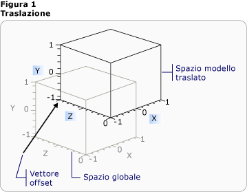
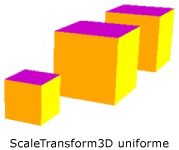
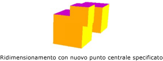
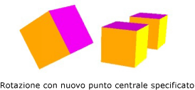
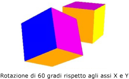

# Cenni preliminari sulle trasformazioni tridimensionali
In questo argomento viene descritto come applicare trasformazioni a modelli tridimensionali nel sistema grafico [!INCLUDE[TLA#tla_winclient](../../../../includes/tlasharptla-winclient-md.md)].  Le trasformazioni consentono allo sviluppatore di riposizionare, ridimensionare e orientare nuovamente i modelli senza modificare i valori di base che li definiscono.  
  
   
  
## Spazio della Coordinata tridimensionale  
 Il contenuto grafico tridimensionale in [!INCLUDE[TLA#tla_winclient](../../../../includes/tlasharptla-winclient-md.md)] è incapsulato in un elemento, <xref:System.Windows.Controls.Viewport3D>, che può far parte della struttura dell'elemento bidimensionale.  Il sistema grafico considera Viewport3D come un elemento visivo bidimensionale come molti altri in [!INCLUDE[TLA#tla_winclient](../../../../includes/tlasharptla-winclient-md.md)].  Viewport3D funziona come una finestra, un riquadro di visualizzazione, in una scena tridimensionale.  Più precisamente, è una superficie sulla quale è proiettata una scena tridimensionale.  Anche se è possibile utilizzare Viewport3D con altri oggetti disegno bidimensionali nello stesso grafico della scena, non si possono inserire oggetti bidimensionali e tridimensionali all'interno di un Viewport3D.  Nella discussione seguente, lo spazio delle coordinate descritto è contenuto nell'elemento Viewport3D.  
  
 Il sistema di coordinate [!INCLUDE[TLA#tla_winclient](../../../../includes/tlasharptla-winclient-md.md)] per la grafica bidimensionale individua l'origine nella parte superiore sinistra della superficie di rendering, in genere lo schermo.  Nel sistema bidimensionale i valori positivi dell'asse x proseguono verso destra mentre i valori positivi dell'asse y proseguono in direzione discendente.  Nel sistema di coordinate tridimensionale, tuttavia, l'origine viene individuata al centro dell'area di rendering, con i valori positivi dell'asse x che proseguono verso destra, i valori positivi dell'asse y che proseguono verso l'alto e i valori positivi dell'asse z che proseguono verso l'esterno dell'origine, in direzione del visualizzatore.  
  
   
Confronto tra sistemi di coordinate  
  
 Lo spazio definito da questi assi è il frame di riferimento stazionario per gli oggetti tridimensionali in [!INCLUDE[TLA#tla_winclient](../../../../includes/tlasharptla-winclient-md.md)].  Quando si compilano modelli in questo spazio e si creano luci e fotocamere per visualizzarli, è consigliabile distinguere il frame di riferimento fisso, o "spazio globale", dal frame di riferimento locale creato per ciascun modello quando si applicano delle trasformazioni.  Si ricordi inoltre che gli oggetti dello spazio globale possono avere un aspetto completamente diverso, o non essere visibile a tutti, a seconda delle impostazioni di luce e fotocamera, tuttavia la posizione della fotocamera non modifica la posizione degli oggetti nello spazio globale.  
  
## Trasformazione di modelli  
 Quando vengono creati, i modelli hanno una determinata posizione nella scena.  Per spostare i modelli nella scena, ruotarli, o modificarne la dimensione, è poco pratico modificare i vertici che li definiscono.  Vengono invece applicate trasformazioni ai modelli, come nel sistema bidimensionale.  
  
 Ogni modello di oggetto dispone di una proprietà <xref:System.Windows.Media.Media3D.Model3D.Transform%2A> con la quale è possibile spostare, orientare nuovamente o ridimensionare il modello.  Quando si applica una trasformazione, si esegue in effetti l'offset di tutti i punti del modello con qualsiasi vettore o valore specificato dalla trasformazione.  In altre parole, viene trasformato lo spazio delle coordinate nel quale il modello è definito \("spazio modello"\), ma non vengono modificati i valori che costituiscono la geometria del modello nel sistema di coordinate dell'intera scena \("spazio globale"\).  
  
## Trasformazioni delle traslazioni  
 Le trasformazioni tridimensionali ereditano dalla classe base astratta <xref:System.Windows.Media.Media3D.Transform3D> e includono le classi di trasformazione affini <xref:System.Windows.Media.Media3D.TranslateTransform3D>, <xref:System.Windows.Media.Media3D.ScaleTransform3D> e <xref:System.Windows.Media.Media3D.RotateTransform3D>.  Il sistema tridimensionale [!INCLUDE[TLA#tla_winclient](../../../../includes/tlasharptla-winclient-md.md)] fornisce inoltre una classe <xref:System.Windows.Media.Media3D.MatrixTransform3D> che consente di specificare le stesse trasformazioni in più concise operazioni della matrice.  
  
 <xref:System.Windows.Media.Media3D.TranslateTransform3D> consente di spostare tutti i punti nel Model3D in direzione del vettore offset che viene specificato con le proprietà <xref:System.Windows.Media.Media3D.TranslateTransform3D.OffsetX%2A>, <xref:System.Windows.Media.Media3D.TranslateTransform3D.OffsetY%2A> e <xref:System.Windows.Media.Media3D.TranslateTransform3D.OffsetZ%2A>.  Ad esempio, dato il vertice di un cubo a \(2,2,2\), il vettore offset di \(0,1.6,1\) sposta quel vertice da \(2,2,2\) a \(2,3.6,3\).  Il vertice del cubo è ancora \(2,2,2\) nello spazio modello, ma, dal momento che è stata modificata la relazione tra tale spazio e lo spazio globale, risulta che \(2,2,2\) nello spazio modello diventa \(2,3.6,3\) nello spazio globale.  
  
   
Traslazione con offset  
  
 Nell'esempio di codice riportato di seguito viene illustrato come applicare una traslazione.  
  
 [!code-xml[animation3dgallery_snip#Translation3DAnimationExampleWholePage](../../../../samples/snippets/csharp/VS_Snippets_Wpf/Animation3DGallery_snip/CS/Translation3DAnimationExample.xaml#translation3danimationexamplewholepage)]  
  
## Trasformazioni a scala  
 <xref:System.Windows.Media.Media3D.ScaleTransform3D> consente di modificare la scala del modello con un vettore di ridimensionamento specificato con riferimento a un punto centrale.  Specificare una scala uniforme, che adatta il modello con lo stesso valore sugli assi X, Y e Z, in modo da modificare proporzionalmente la dimensione del modello.  Ad esempio, impostando le proprietà <xref:System.Windows.Media.ScaleTransform.ScaleX%2A>, <xref:System.Windows.Media.ScaleTransform.ScaleY%2A> e <xref:System.Windows.Media.Media3D.ScaleTransform3D.ScaleZ%2A> delle trasformazioni su 0,5 si dimezza la dimensione del modello; impostando le stesse proprietà su 2 si raddoppia la scala su tutti e tre gli assi.  
  
   
Esempio di ScaleVector  
  
 Specificando una trasformazione di scala non uniforme \(in cui i valori X, Y e Z non sono tutti uguali\), è possibile generare un modello da estendere o comprimere in una o due dimensioni senza influire sugli altri.  Ad esempio, impostando <xref:System.Windows.Media.ScaleTransform.ScaleX%2A> su 1, <xref:System.Windows.Media.ScaleTransform.ScaleY%2A> su 2 e <xref:System.Windows.Media.Media3D.ScaleTransform3D.ScaleZ%2A> su 1 viene generato il modello trasformato con l'altezza raddoppiata ma invariato lunglo gli assi X e Z.  
  
 Per impostazione predefinita, ScaleTransform3D provoca vertici per espandere o contrarre sull'origine \(0,0,0\).  Se, tuttavia, il modello che si desidera trasformare non è stato creato dall'origine, il ridimensionamento del modello dall'origine non si adatterà al modello "sul posto". Quando invece i vertici del modello sono moltiplicati per il vettore di ridimensionamento, l'operazione di ridimensionamento avrà l'effetto di traslazione sul modello nonché di ridimensionamemto.  
  
   
Esempio di centro di ridimensionamento  
  
 Per ridimensionare un modello "sul posto," specificare il centro del modello impostando le proprietà <xref:System.Windows.Media.ScaleTransform.CenterX%2A>, <xref:System.Windows.Media.ScaleTransform.CenterY%2A> e <xref:System.Windows.Media.Media3D.ScaleTransform3D.CenterZ%2A> di ScaleTransform3D.  In tal modo il sistema grafico ridimensiona lo spazio modello, quindi ne esegue la traslazione verso il centro sul <xref:System.Windows.Media.Media3D.Point3D> specificato.  Se, al contrario, il modello è stato compilato intorno all'origine e si specifica un punto centrale diverso, ne deriva il modello traslato lontano dall'origine.  
  
## Trasformazioni della rotazione  
 È possibile ruotare un modello in 3D in molti modi.  Una trasformazione tipica della rotazione specifica un asse e un angolo di rotazione intorno all'asse.  La classe <xref:System.Windows.Media.Media3D.RotateTransform3D> consente di definire un oggetto <xref:System.Windows.Media.Media3D.Rotation3D> con la relativa proprietà <xref:System.Windows.Media.Media3D.RotateTransform3D.Rotation%2A>.  Quindi si specificano le proprietà <xref:System.Windows.Media.Media3D.AxisAngleRotation3D.Axis%2A> e <xref:System.Windows.Media.Media3D.AxisAngleRotation3D.Angle%2A> su Rotation3D, in questo caso <xref:System.Windows.Media.Media3D.AxisAngleRotation3D>, per definire la trasformazione.  Negli esempi seguenti viene ruotato un modello di 60 gradi intorno all'asse Y.  
  
 [!code-xml[animation3dgallery_snip#Rotate3DUsingAxisAngleRotation3DExampleWholePage](../../../../samples/snippets/csharp/VS_Snippets_Wpf/Animation3DGallery_snip/CS/Rotat3DUsingAxisAngleRotation3DExample.xaml#rotate3dusingaxisanglerotation3dexamplewholepage)]  
  
 Nota:[!INCLUDE[TLA#tla_winclient](../../../../includes/tlasharptla-winclient-md.md)] 3\-D è un sistema con origine nell'angolo inferiore destro, che implica che un valore positivo dell'angolo di una rotazione genera una rotazione in senso antiorario rispetto all'asse.  
  
 Le rotazioni asse\-angolo presumono una rotazione rispetto all'origine se non si specifica un valore per le proprietà <xref:System.Windows.Media.Media3D.RotateTransform3D.CenterX%2A>, <xref:System.Windows.Media.Media3D.RotateTransform3D.CenterY%2A> e <xref:System.Windows.Media.Media3D.RotateTransform3D.CenterZ%2A> su RotateTransform3D.  Come per il ridimensionamento, è opportuno ricordare che la rotazione trasforma l'intero spazio delle coordinate del modello.  Se il modello è stato creato intorno all'origine, oppure è stato traslato in precedenza, la rotazione potrebbe "girare" rispetto all'origine invece di ruotare sul posto.  
  
   
Rotazione con un nuove centro specificato  
  
 Per ruotare il modello "sul posto", specificare il centro effettivo del modello come centro di rotazione.  Poiché in genere la geometria si basa sull'origine, molto spesso è possibile ottenere il risultato previsto di un insieme di trasformazioni innanzitutto adattando il modello \(ridimensionandolo\), quindi impostando l'orientamento \(ruotandolo\) e, infine, spostandolo nella posizione desiderata \(traslandolo\).  
  
   
Esempi di rotazione  
  
 Le rotazioni asse\-angolo sono utili per le trasformazioni statiche e per alcune animazioni.  Si consiglia tuttavia di ruotare il modello di un cubo di 60 gradi rispetto all'asse X, quindi di 45 gradi rispetto all'asse Z.  È possibile descrivere questa trasformazione come due distinte trasformazioni affini o come una matrice.  Potrebbe tuttavia essere difficile animare correttamente una rotazione definita in questo modo.  Sebbene le posizioni iniziale e finale del modello calcolate da uno dei due approcci siano le stesse, le posizioni intermedie assunte dal modello non sono definite dal punto di vista del calcolo.  I quaternioni rappresentano un modo alternativo di calcolare l'interpolazione tra l'inizio e la fine di una rotazione.  
  
 Un quaternione rappresenta un asse nello spazio tridimensionale e una rotazione intorno a questo.  Ad esempio, un quaternione può rappresentare un asse \(1,1,2\) e una rotazione di 50 gradi.  La capacità dei quaternioni di definire le rotazioni deriva dalle due operazioni che è possibile eseguire su di essi: composizione e interpolazione.  La composizione di due quaternioni applicata alla geometria significa "ruotare la geometria intorno all'asse2 con la rotazione2, quindi ruotarla intorno all'asse1 con la rotazione1". Con l'utilizzo della composizione è possibile combinare le due rotazioni relative alla geometria per ottenere un singolo quaternione che rappresenta il risultato.  Dal momento che l'interpolazione dei quaternioni consente di calcolare un percorso corretto e adeguato da un asse e da un orientamento all'altro, è possibile eseguire l'interpolazione dal quaternione originale a quello composto per ottenere una transizione corretta dall'uno all'altro, con la possibilità di animare la trasformazione.  Relativamente ai modelli che si desidera animare, è possibile specificare una destinazione <xref:System.Windows.Media.Media3D.Quaternion> per la rotazione utilizzando <xref:System.Windows.Media.Media3D.QuaternionRotation3D> per la proprietà <xref:System.Windows.Media.Media3D.RotateTransform3D.Rotation%2A>.  
  
## Utilizzo di raccolte di trasformazione  
 Durante la compilazione di una scena, è normale applicare più di una trasformazione a un modello.  Aggiungere trasformazioni alla raccolta <xref:System.Windows.Media.Media3D.Transform3DGroup.Children%2A> della classe <xref:System.Windows.Media.Media3D.Transform3DGroup> per raggruppare opportunamente le trasformazioni da applicare a vari modelli della scena.  È spesso consigliabile riutilizzare una trasformazione in vari gruppi differenti, in modo molto simile a quanto avviene per il riutilizzo di un modello applicando un insieme diverso di trasformazioni a ciascuna istanza.  Notare che l'ordine in cui le trasformazioni vengono aggiunte alle raccolte è significativo: le trasformazioni nella raccolta vengono applicate dalla prima all'ultima.  
  
## Animazione delle trasformazioni  
 L'implementazione [!INCLUDE[TLA#tla_winclient](../../../../includes/tlasharptla-winclient-md.md)] 3\-D fa parte dello stesso sistema di temporizzazione e animazione della grafica bidimensionale.  In altre parole, per animare una scena tridimensionale, è necessario animare le proprietà dei relativi modelli.  È possibile animare direttamente proprietà di primitive, ma generalmente è più semplice animare trasformazioni che modificano la posizione o l'aspetto di modelli.  Poiché le trasformazioni possono essere applicate agli oggetti <xref:System.Windows.Media.Media3D.Model3DGroup> oltre che ai modelli singoli, è possibile applicare uno insieme di animazioni a un elemento figlio di un oggetto Model3DGroup e un altro insieme di animazioni a un gruppo di oggetti.  Per informazioni di base sul sistema di temporizzazione e di animazione [!INCLUDE[TLA#tla_winclient](../../../../includes/tlasharptla-winclient-md.md)], vedere [Cenni preliminari sull'animazione](../../../../docs/framework/wpf/graphics-multimedia/animation-overview.md) e [Cenni preliminari sugli storyboard](../../../../docs/framework/wpf/graphics-multimedia/storyboards-overview.md).  
  
 Per animare un oggetto in [!INCLUDE[TLA#tla_winclient](../../../../includes/tlasharptla-winclient-md.md)], creare una sequenza temporale, definire un'animazione \(che rappresenti una vera modifica del valore di alcune proprietà nel tempo\) e specificare la proprietà alla quale applicare l'animazione.  Questa deve essere una proprietà di un oggetto FrameworkElement.  Poiché tutti gli oggetti in una scena tridimensionale sono elementi figlio di Viewport3D, le proprietà interessate da qualsiasi animazione che si desidera applicare alla scena sono proprietà delle proprietà di Viewport3D.  È importante elaborare attentamente il percorso di proprietà per l'animazione, in quanto la sintassi può risultare prolissa.  
  
 Si supponga di voler ruotare un oggetto sul posto, ma anche di applicare un movimento oscillante per esporre un'area maggiore dell'oggetto da visualizzare.  È possibile scegliere di applicare un oggetto RotateTransform3D al modello e animare l'asse di rotazione da uno vettore a un altro.  Nell'esempio di codice riportato di seguito viene illustrata l'applicazione di un oggetto <xref:System.Windows.Media.Animation.Vector3DAnimation> alla proprietà Axis dell’oggetto Rotation3D della trasformazione, presupponendo che RotateTransform3D sia una delle numerose trasformazioni applicate al modello con un oggetto <xref:System.Windows.Media.TransformGroup>.  
  
 [!code-csharp[3doverview#3DOverview3DN1](../../../../samples/snippets/csharp/VS_Snippets_Wpf/3DOverview/CSharp/Window1.xaml.cs#3doverview3dn1)]
 [!code-vb[3doverview#3DOverview3DN1](../../../../samples/snippets/visualbasic/VS_Snippets_Wpf/3DOverview/visualbasic/window1.xaml.vb#3doverview3dn1)]  
  
 [!code-csharp[3doverview#3DOverview3DN3](../../../../samples/snippets/csharp/VS_Snippets_Wpf/3DOverview/CSharp/Window1.xaml.cs#3doverview3dn3)]
 [!code-vb[3doverview#3DOverview3DN3](../../../../samples/snippets/visualbasic/VS_Snippets_Wpf/3DOverview/visualbasic/window1.xaml.vb#3doverview3dn3)]  
  
 Utilizzare una sintassi simile per gestire altre proprietà di trasformazione in modo da spostare o ridimensionare l'oggetto.  Ad esempio è possibile applicare un oggetto <xref:System.Windows.Media.Animation.Point3DAnimation> alla proprietà ScaleCenter su una trasformazione di scala in modo da generare un modello per modificare correttamente la forma.  
  
 Anche se negli esempi riportati in precedenza vengono trasformate le proprietà di <xref:System.Windows.Media.Media3D.GeometryModel3D>, è inoltre possibile trasformare le proprietà di altri modelli nella scena.  Animando le traslazioni applicate agli oggetti luce, è possibile ad esempio creare luci mobili ed effetti di ombreggiatura che possono cambiare notevolmente l'aspetto grafico dei modelli.  
  
 Poiché anche le fotocamere sono modelli, è possibile trasformare anche le proprietà delle fotocamere.  Sebbene sia possibile modificare l'aspetto grafico della scena trasformando la posizione della fotocamera o le distanze del piano, trasformando di fatto l'intera proiezione della scena, notare che molti degli effetti raggiungibili in questo modo non hanno molto "senso visivo" per il visualizzatore rispetto alle trasformazioni applicate al percorso o alla posizione dei modelli nella scena.  
  
## Vedere anche  
 [Cenni preliminari sulla grafica tridimensionale](../../../../docs/framework/wpf/graphics-multimedia/3-d-graphics-overview.md)   
 [Cenni preliminari sulle trasformazioni](../../../../docs/framework/wpf/graphics-multimedia/transforms-overview.md)   
 [Esempio di trasformazione 2D](http://go.microsoft.com/fwlink/?LinkID=158252)