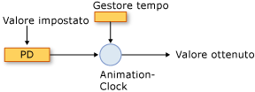
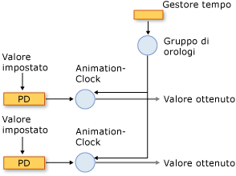
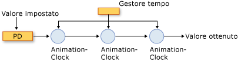

# Cenni preliminari sull&#39;animazione e sul sistema di temporizzazione
In questo argomento viene illustrato come il sistema di temporizzazione utilizza l'animazione, le classi <xref:System.Windows.Media.Animation.Timeline>e <xref:System.Windows.Media.Animation.Clock> per animare le proprietà.  
  
   
   
## Prerequisiti  
 Per la comprensione di questo argomento, è necessario essere in grado di utilizzare le animazioni [!INCLUDE[TLA2#tla_winclient](../../../../includes/tla2sharptla-winclient-md.md)] per animare le proprietà, come illustrato in [Cenni preliminari sull'animazione](../../../../docs/framework/wpf/graphics-multimedia/animation-overview.md).  È inoltre utile conoscere le [proprietà di dipendenza](GTMT). Per ulteriori informazioni, vedere [Cenni preliminari sulle proprietà di dipendenza](../../../../docs/framework/wpf/advanced/dependency-properties-overview.md).  
  
   
## Sequenze temporali e orologi  
 Nell'argomento [Cenni preliminari sull'animazione](../../../../docs/framework/wpf/graphics-multimedia/animation-overview.md) viene illustrato il modo in cui un oggetto <xref:System.Windows.Media.Animation.Timeline> rappresenta un segmento di tempo e viene indicato che un'animazione è un tipo di <xref:System.Windows.Media.Animation.Timeline> che produce valori di output.  Da solo un oggetto <xref:System.Windows.Media.Animation.Timeline> si limita a descrivere un segmento di tempo.  È l'oggetto <xref:System.Windows.Media.Animation.Clock> della sequenza temporale a svolgere le funzioni fondamentali.  L'animazione non anima le proprietà in modo vero e proprio: una classe di animazione descrive il calcolo dei valori di output, ma è l'oggetto <xref:System.Windows.Media.Animation.Clock> creato per l'animazione a controllare l'output di animazione e ad applicarlo alle proprietà.  
  
 <xref:System.Windows.Media.Animation.Clock> è un tipo speciale di oggetto che gestisce lo stato di runtime correlato alla temporizzazione per l'oggetto <xref:System.Windows.Media.Animation.Timeline>.  Fornisce tre informazioni essenziali per l'animazione e il sistema di temporizzazione: <xref:System.Windows.Media.Animation.Clock.CurrentTime%2A>, <xref:System.Windows.Media.Animation.Clock.CurrentProgress%2A> e <xref:System.Windows.Media.Animation.Clock.CurrentState%2A>.  Un oggetto <xref:System.Windows.Media.Animation.Clock> consente di determinare l'ora corrente, lo stato di avanzamento e lo stato utilizzando i comportamenti di temporizzazione descritti dal relativo oggetto <xref:System.Windows.Media.Animation.Timeline>: <xref:System.Windows.Media.Animation.Timeline.Duration%2A>, <xref:System.Windows.Media.Animation.Timeline.RepeatBehavior%2A>, <xref:System.Windows.Media.Animation.Timeline.AutoReverse%2A>e così via.  
  
 Nella maggior parte dei casi, un oggetto <xref:System.Windows.Media.Animation.Clock> viene creato automaticamente per la sequenza temporale.  Quando si esegue un'animazione tramite uno <xref:System.Windows.Media.Animation.Storyboard> o il metodo <xref:System.Windows.Media.Animation.Animatable.BeginAnimation%2A>, gli orologi vengono creati automaticamente per le sequenze temporali e le animazioni e applicati alle proprietà di destinazione.  È inoltre possibile creare in modo esplicito un oggetto <xref:System.Windows.Media.Animation.Clock> tramite il metodo <xref:System.Windows.Media.Animation.Timeline.CreateClock%2A> dell'oggetto <xref:System.Windows.Media.Animation.Timeline>.  Il metodo <xref:System.Windows.Media.MediaTimeline.CreateClock%2A?displayProperty=fullName> consente di creare un orologio del tipo appropriato per l'oggetto <xref:System.Windows.Media.Animation.Timeline> sul quale viene chiamato.  Se l'oggetto <xref:System.Windows.Media.Animation.Timeline> contiene sequenze temporali figlio, vengono creati oggetti <xref:System.Windows.Media.Animation.Clock> anche per tali elementi figlio.  Gli oggetti <xref:System.Windows.Media.Animation.Clock> risultanti vengono disposti in strutture ad albero corrispondenti alla struttura degli oggetti <xref:System.Windows.Media.Animation.Timeline> da cui vengono creati.  
  
 Esistono tipi di orologi diversi per tipi di sequenze temporali diversi.  Nella tabella riportata di seguito vengono illustrati i tipi di oggetti <xref:System.Windows.Media.Animation.Clock> corrispondenti ad alcuni dei tipi di <xref:System.Windows.Media.Animation.Timeline> diversi.  
  
|Tipo di sequenza temporale|Tipi di orologio|Scopo dell'orologio|  
|--------------------------------|----------------------|-------------------------|  
|Animazione \(eredita da <xref:System.Windows.Media.Animation.AnimationTimeline>\)|<xref:System.Windows.Media.Animation.AnimationClock>|Genera valori di output per una proprietà di dipendenza.|  
|<xref:System.Windows.Media.MediaTimeline>|<xref:System.Windows.Media.MediaClock>|Elabora un file multimediale.|  
|<xref:System.Windows.Media.Animation.ParallelTimeline>|<xref:System.Windows.Media.Animation.ClockGroup>|Raggruppa e controlla gli oggetti <xref:System.Windows.Media.Animation.Clock> figlio|  
|<xref:System.Windows.Media.Animation.Storyboard>|<xref:System.Windows.Media.Animation.ClockGroup>|Raggruppa e controlla gli oggetti <xref:System.Windows.Media.Animation.Clock> figlio|  
  
 È possibile applicare qualsiasi oggetto <xref:System.Windows.Media.Animation.AnimationClock> creato a proprietà di dipendenza compatibili tramite il metodo <xref:System.Windows.Media.Animation.IAnimatable.ApplyAnimationClock%2A>.  
  
 Negli scenari in cui le prestazioni sono critiche, ad esempio l'animazione di un numero elevato di oggetti simili, la gestione dell'utilizzo dell'oggetto <xref:System.Windows.Media.Animation.Clock> può fornire vantaggi in termini di prestazioni.  
  
   
## Orologi e gestore del tempo  
 Quando si animano oggetti in [!INCLUDE[TLA2#tla_winclient](../../../../includes/tla2sharptla-winclient-md.md)], il gestore del tempo gestisce gli oggetti <xref:System.Windows.Media.MediaPlayer.Clock%2A> creati per le sequenze temporali.  Il gestore del tempo è la radice di una struttura ad albero di oggetti <xref:System.Windows.Media.MediaPlayer.Clock%2A> e controlla il flusso di tempo nella struttura.  Il gestore del tempo viene creato automaticamente per ogni applicazione [!INCLUDE[TLA2#tla_winclient](../../../../includes/tla2sharptla-winclient-md.md)] ed è invisibile allo sviluppatore di applicazioni. Ogni secondo vengono emessi molti tick di temporizzazione. Il numero effettivo di tick emessi ogni secondo varia a seconda delle risorse di sistema disponibili.  Durante ognuno di questi tick, viene calcolato lo stato di tutti gli oggetti <xref:System.Windows.Media.Animation.ClockState><xref:System.Windows.Media.Animation.Clock> nella struttura ad albero di temporizzazione.  
  
 Di seguito viene illustrata la relazione tra il gestore del tempo e <xref:System.Windows.Media.Animation.AnimationClock> e una proprietà di dipendenza animata.  
  
   
Animazione di una proprietà  
  
 A ogni tick viene aggiornata l'ora di ogni <xref:System.Windows.Media.Animation.ClockState><xref:System.Windows.Media.Animation.Clock> nell'applicazione.  Se l'oggetto <xref:System.Windows.Media.Animation.Clock> è <xref:System.Windows.Media.Animation.AnimationClock>, utilizza il metodo <xref:System.Windows.Media.Animation.AnimationTimeline.GetCurrentValue%2A> dell'oggetto <xref:System.Windows.Media.Animation.AnimationTimeline> da cui era stato creato per calcolare il valore di output corrente.  <xref:System.Windows.Media.Animation.AnimationClock> fornisce l'oggetto <xref:System.Windows.Media.Animation.AnimationTimeline> con l'ora locale corrente, un valore di input che in genere è il valore di base della proprietà e un valore di destinazione predefinito.  Quando si recupera il valore di una proprietà by animata utilizzando il metodo <xref:System.Windows.DependencyObject.GetValue%2A> o la relativa funzione di accesso CLR, si ottiene l'output dell'oggetto <xref:System.Windows.Media.Animation.AnimationClock>.  
  
#### Gruppi di orologi  
 Nella sezione precedente è stato specificato che esistono tipi diversi di oggetti <xref:System.Windows.Media.Animation.Clock> per tipi diversi di sequenze temporali.  Di seguito viene illustrata la relazione tra il gestore del tempo, un oggetto <xref:System.Windows.Media.Animation.ClockGroup>, un oggetto <xref:System.Windows.Media.Animation.AnimationClock> e una proprietà di dipendenza animata.  Un oggetto <xref:System.Windows.Media.Animation.ClockGroup> viene creato per le sequenze temporali che raggruppano altre sequenze, ad esempio la classe <xref:System.Windows.Media.Animation.Storyboard> che raggruppa animazioni e altre sequenze temporali.  
  
   
ClockGroup  
  
#### Composizione  
 È possibile associare più orologi a una singola proprietà, nel qual caso ogni orologio utilizza il valore di output dell'orologio precedente come relativo valore di base.  Di seguito vengono illustrati tre oggetti <xref:System.Windows.Media.Animation.AnimationClock> applicati alla stessa proprietà.  L'orologio 1 utilizza il valore di base della proprietà animata come relativo input e lo utilizza per generare l'output.  L'orologio 2 accetta l'output dall'orologio 1 come relativo input e lo utilizza per generare l'output.  L'orologio 3 accetta l'output dall'orologio 2 come relativo input e lo utilizza per generare l'output.  Quando più orologi influiscono simultaneamente sulla stessa proprietà, formano una catena di composizione.  
  
   
Una catena di composizione  
  
 Si noti che anche se una relazione viene creata tra l'input e l'output degli oggetti <xref:System.Windows.Media.Animation.AnimationClock> nella catena di composizione, i relativi comportamenti di temporizzazione non subiscono alterazioni; gli oggetti <xref:System.Windows.Media.Animation.Clock> \(inclusi gli oggetti <xref:System.Windows.Media.Animation.AnimationClock>\) presentano una dipendenza gerarchica sugli oggetti <xref:System.Windows.Media.Animation.Clock> padre.  
  
 Per applicare più orologi alla stessa proprietà, utilizzare <xref:System.Windows.Media.Animation.HandoffBehavior><xref:System.Windows.Media.Animation.HandoffBehavior>quando si applica un oggetto <xref:System.Windows.Media.Animation.Storyboard>, un'animazione o <xref:System.Windows.Media.Animation.AnimationClock>.  
  
#### Tick e consolidamento degli eventi  
 Oltre a calcolare i valori di output, il gestore del tempo determina lo stato di ogni orologio e genera gli eventi appropriati.  
  
 Sebbene gli eventi Tick siano piuttosto frequenti, è possibile che tra essi avvengano vari eventi.  Ad esempio, è possibile interrompere, avviare e nuovamente interrompere un oggetto <xref:System.Windows.Media.Animation.Clock>, nel qual caso il relativo valore <xref:System.Windows.Media.Animation.Clock.CurrentState%2A> sarà cambiato tre volte.  In teoria, l'evento <xref:System.Windows.Media.Animation.Clock.CurrentStateInvalidated> può essere generato in un singolo tick; il motore di temporizzazione, tuttavia, consolida eventi, in modo che l'evento <xref:System.Windows.Media.Animation.Clock.CurrentStateInvalidated> venga generato al massimo una volta per tick.  Ciò si verifica per tutti gli eventi di temporizzazione: al massimo un evento di ogni tipo viene generato per un determinato oggetto <xref:System.Windows.Media.Animation.Clock>.  
  
 Quando un oggetto <xref:System.Windows.Media.Animation.Clock> cambia stato e torna allo stato originale tra i tick \(ad esempio passa da <xref:System.Windows.Media.Animation.ClockState> a <xref:System.Windows.Media.Animation.ClockState> e di nuovo a <xref:System.Windows.Media.Animation.ClockState>\), l'evento associato viene nuovamente generato.  
  
 Per ulteriori informazioni sugli eventi di temporizzazione, vedere [Cenni preliminari sugli eventi di tempo](../../../../docs/framework/wpf/graphics-multimedia/timing-events-overview.md).  
  
   
## Valori correnti e valori di base di proprietà  
 La proprietà che è possibile animare può presentare due valori: un valore di base e un valore corrente.  Quando si imposta la proprietà utilizzando la relativa funzione di accesso CLR o il metodo <xref:System.Windows.DependencyObject.SetValue%2A>, se ne imposta il valore di base.  Quando una proprietà non è animata, i valori di base e corrente relativi sono gli stessi.  
  
 Quando si anima una proprietà, l'oggetto <xref:System.Windows.Media.Animation.AnimationClock> imposta il valore *corrente* della proprietà.  Quando si recupera il valore della proprietà utilizzando la relativa funzione di accesso CLR o il metodo <xref:System.Windows.DependencyObject.GetValue%2A>, viene restituito l'output dell'oggetto <xref:System.Windows.Media.Animation.AnimationClock> se l'oggetto <xref:System.Windows.Media.Animation.AnimationClock> è <xref:System.Windows.Media.Animation.ClockState> o <xref:System.Windows.Media.Animation.ClockState>.  È possibile recuperare il valore di base della proprietà utilizzando il metodo <xref:System.Windows.Media.Animation.IAnimatable.GetAnimationBaseValue%2A>.  
  
## Vedere anche  
 [Cenni preliminari sull'animazione](../../../../docs/framework/wpf/graphics-multimedia/animation-overview.md)   
 [Cenni preliminari sugli eventi di tempo](../../../../docs/framework/wpf/graphics-multimedia/timing-events-overview.md)   
 [Cenni preliminari sui comportamenti temporali](../../../../docs/framework/wpf/graphics-multimedia/timing-behaviors-overview.md)