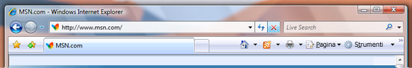

# Estendere l&#39;effetto cristallo a un&#39;applicazione WPF
In questo argomento viene illustrato come estendere il frame effetto cristallo di [!INCLUDE[TLA#tla_winvista](../../../../includes/tlasharptla-winvista-md.md)] all'area client di un'applicazione [!INCLUDE[TLA#tla_wpf](../../../../includes/tlasharptla-wpf-md.md)].  
  
> [!NOTE]
>  Questo esempio funziona solo in un computer [!INCLUDE[TLA2#tla_winvista](../../../../includes/tla2sharptla-winvista-md.md)] in cui è in esecuzione Gestione finestre desktop con l'effetto cristallo abilitato.  In [!INCLUDE[TLA2#tla_winvista](../../../../includes/tla2sharptla-winvista-md.md)] Home Basic non è supportata la trasparenza effetto cristallo.  Le aree sottoposte generalmente a rendering con la trasparenza effetto cristallo nella altre versioni di [!INCLUDE[TLA2#tla_winvista](../../../../includes/tla2sharptla-winvista-md.md)] risultano opache.  
  
## Esempio  
 Nell'immagine seguente viene illustrato il frame effetto cristallo esteso alla barra degli indirizzi di Internet Explorer 7.  
  
 **IE7 con il frame effetto cristallo esteso dietro la barra degli indirizzi**  
  
   
  
 Per estendere il frame effetto cristallo a un'applicazione [!INCLUDE[TLA2#tla_wpf](../../../../includes/tla2sharptla-wpf-md.md)], è necessario l'accesso all'[!INCLUDE[TLA#tla_api](../../../../includes/tlasharptla-api-md.md)] non gestita.  Nell'esempio di codice seguente viene utilizzato Platform Invoke \(pinvoke\) per le due [!INCLUDE[TLA2#tla_api](../../../../includes/tla2sharptla-api-md.md)] necessarie per estendere il frame all'area client.  Queste [!INCLUDE[TLA2#tla_api](../../../../includes/tla2sharptla-api-md.md)] sono entrambe dichiarate in una classe denominata **NonClientRegionAPI**.  
  
<!-- TODO: review snippet reference  [!CODE [AvalonClientGlass#DWMExtendFramePInvokeAPI](AvalonClientGlass#DWMExtendFramePInvokeAPI)]  -->  
  
 [DwmExtendFrameIntoClientArea](_udwm_dwmextendframeintoclientarea)  è la funzione di Gestione finestre desktop che estende il frame all'area client.  Vengono accettati due parametri, ovvero un handle di finestra e una struttura [MARGINS](inet_MARGINS).  [MARGINS](inet_MARGINS) viene utilizzato per indicare a Gestione finestre desktop l'ulteriore estensione del frame richiesta nell'area client.  
  
## Esempio  
 Per utilizzare la funzione [DwmExtendFrameIntoClientArea](_udwm_dwmextendframeintoclientarea), è necessario ottenere un handle di finestra.  In [!INCLUDE[TLA2#tla_wpf](../../../../includes/tla2sharptla-wpf-md.md)] l'handle di finestra può essere ottenuto dalla proprietà <xref:System.Windows.Interop.HwndSource.Handle%2A> di un oggetto <xref:System.Windows.Interop.HwndSource>.  Nell'esempio seguente il frame viene esteso all'area client nell'evento <xref:System.Windows.FrameworkElement.Loaded> della finestra.  
  
<!-- TODO: review snippet reference  [!CODE [AvalonClientGlass#AvalonGlassOnLoadedCSharp](AvalonClientGlass#AvalonGlassOnLoadedCSharp)]  -->  
  
## Esempio  
 Nell'esempio seguente viene illustrata una finestra semplice in cui il frame viene esteso all'area client.  Il frame viene esteso dietro il bordo superiore contenente i due oggetti <xref:System.Windows.Controls.TextBox>.  
  
<!-- TODO: review snippet reference  [!CODE [AvalonClientGlass#AvalonGlassFullWindowXAML](AvalonClientGlass#AvalonGlassFullWindowXAML)]  -->  
  
 Nell'immagine seguente viene illustrato il frame effetto cristallo esteso a un'applicazione [!INCLUDE[TLA2#tla_wpf](../../../../includes/tla2sharptla-wpf-md.md)].  
  
 **Estensione dell'effetto cristallo a un'applicazione**  [!INCLUDE[TLA2#tla_wpf](../../../../includes/tla2sharptla-wpf-md.md)] **.**  
  
   
  
## Vedere anche  
 [Cenni preliminari su Gestione finestre desktop](_udwm_overview)   
 [Cenni preliminari sulla sfocatura in Gestione finestre desktop](_udwm_blur_ovw)   
 [DwmExtendFrameIntoClientArea](_udwm_dwmextendframeintoclientarea)