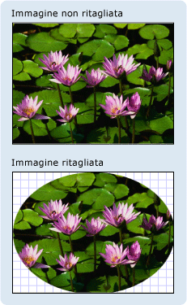

# Cenni preliminari sulle classi Geometry
In questi cenni preliminari viene descritto come utilizzare le classi <xref:System.Windows.Media.Geometry> di [!INCLUDE[TLA#tla_winclient](../../../../includes/tlasharptla-winclient-md.md)] per descrivere le forme.  In questo argomento vengono confrontate le differenze tra gli oggetti <xref:System.Windows.Media.Geometry> e gli elementi <xref:System.Windows.Shapes.Shape>.  
  
   
  
   
## Definizione di Geometry  
 La classe <xref:System.Windows.Media.Geometry> e le classi che ne derivano, come <xref:System.Windows.Media.EllipseGeometry>, <xref:System.Windows.Media.PathGeometry> e <xref:System.Windows.Media.CombinedGeometry>, consentono di descrivere la geometria di una forma 2D.  Queste descrizioni geometriche hanno molti impieghi, come la definizione di una forma da disegnare sullo schermo o la definizione delle aree dell'hit test e di ritaglio.  È persino possibile utilizzare un oggetto Geometry per definire un percorso di animazione.  
  
 Gli oggetti <xref:System.Windows.Media.Geometry> possono essere semplici, come rettangoli e cerchi, oppure composti e creati con due o più oggetti Geometry.  Oggetti Geometry più complessi possono essere creati mediante le classi <xref:System.Windows.Media.PathGeometry> e <xref:System.Windows.Media.StreamGeometry>, che consentono di descrivere archi e curve.  
  
 Poiché <xref:System.Windows.Media.Geometry> è un tipo di oggetto <xref:System.Windows.Freezable>, gli oggetti <xref:System.Windows.Media.Geometry> forniscono diverse funzionalità speciali: gli oggetti possono essere dichiarati come [risorse](../../../../docs/framework/wpf/advanced/xaml-resources.md), condivisi tra più oggetti, impostati in sola lettura per migliorare le prestazioni, duplicati e resi thread\-safe.  Per ulteriori informazioni sulle diverse funzionalità disponibili per gli oggetti <xref:System.Windows.Freezable>, vedere [Cenni preliminari sugli oggetti Freezable](../../../../docs/framework/wpf/advanced/freezable-objects-overview.md).  
  
   
## Oggetti Geometry eforme a confronto  
 Le classi <xref:System.Windows.Media.Geometry> e <xref:System.Windows.Shapes.Shape> sembrano simili in quanto descrivono entrambe le forme 2D \(confrontare ad esempio <xref:System.Windows.Media.EllipseGeometry> e <xref:System.Windows.Shapes.Ellipse>\), ma esistono differenze importanti.  
  
 Innanzitutto la classe <xref:System.Windows.Media.Geometry> eredita dalla classe <xref:System.Windows.Freezable> mentre la classe <xref:System.Windows.Shapes.Shape> eredita dalla classe <xref:System.Windows.FrameworkElement>.  Poiché si tratta di elementi, è possibile eseguire il rendering degli oggetti <xref:System.Windows.Shapes.Shape> stessi che possono anche partecipare al sistema di layout, al contrario degli oggetti <xref:System.Windows.Media.Geometry>.  
  
 Anche se gli oggetti <xref:System.Windows.Shapes.Shape> possono essere utilizzati più prontamente rispetto agli oggetti <xref:System.Windows.Media.Geometry>, gli oggetti <xref:System.Windows.Media.Geometry> sono più versatili.  Mentre un oggetto <xref:System.Windows.Shapes.Shape> viene utilizzato per il rendering di elementi grafici 2D, un oggetto <xref:System.Windows.Media.Geometry> può essere ad esempio utilizzato per definire l'area geometrica per gli elementi grafici 2D, un'area per il ritaglio o un'area per l'hit test.  
  
### La forma del percorso  
 Un oggetto <xref:System.Windows.Shapes.Shape>, la classe <xref:System.Windows.Shapes.Path>, utilizza in realtà un oggetto <xref:System.Windows.Media.Geometry> per descriverne il contenuto.  Impostando la proprietà <xref:System.Windows.Shapes.Path.Data%2A> della classe <xref:System.Windows.Shapes.Path> con un oggetto <xref:System.Windows.Media.Geometry> e impostandone le proprietà <xref:System.Windows.Shapes.Shape.Fill%2A> e <xref:System.Windows.Shapes.Shape.Stroke%2A>, è possibile eseguire il rendering di un oggetto <xref:System.Windows.Media.Geometry>.  
  
   
## Proprietà comuni che richiedono un oggetto Geometry  
 Nelle sezioni precedenti è stato menzionato che gli oggetti Geometry possono essere utilizzati con altri oggetti per scopi diversi, come disegnare forme, animare e ritagliare.  Nella tabella riportata di seguito vengono elencate numerose classi che dispongono di proprietà che richiedono un oggetto <xref:System.Windows.Media.Geometry>.  
  
|Type|Proprietà|  
|----------|---------------|  
|<xref:System.Windows.Media.Animation.DoubleAnimationUsingPath>|<xref:System.Windows.Media.Animation.DoubleAnimationUsingPath.PathGeometry%2A>|  
|<xref:System.Windows.Media.DrawingGroup>|<xref:System.Windows.Media.DrawingGroup.ClipGeometry%2A>|  
|<xref:System.Windows.Media.GeometryDrawing>|<xref:System.Windows.Media.GeometryDrawing.Geometry%2A>|  
|<xref:System.Windows.Shapes.Path>|<xref:System.Windows.Shapes.Path.Data%2A>|  
|<xref:System.Windows.UIElement>|<xref:System.Windows.UIElement.Clip%2A>|  
  
   
## Tipi di geometrie semplici  
 La classe base per tutti gli oggetti Geometry è la classe astratta <xref:System.Windows.Media.Geometry>.  Le classi che derivano dalla classe <xref:System.Windows.Media.Geometry> possono essere approssimativamente raggruppate in tre categorie, geometrie semplici, geometrie di percorso e geometrie composte.  
  
 Tra le classi di geometrie semplici sono comprese <xref:System.Windows.Media.LineGeometry>, <xref:System.Windows.Media.RectangleGeometry> e <xref:System.Windows.Media.EllipseGeometry> e sono utilizzate per creare forme geometriche di base, come linee, rettangoli e cerchi.  
  
-   Un oggetto <xref:System.Windows.Media.LineGeometry> viene definito specificando il punto iniziale della linea e il punto finale.  
  
-   Un oggetto <xref:System.Windows.Media.RectangleGeometry> viene definito con una struttura <xref:System.Windows.Rect> che specifica la posizione relativa, l'altezza e la larghezza.  È possibile creare un rettangolo arrotondato impostando le proprietà <xref:System.Windows.Media.RectangleGeometry.RadiusX%2A> e <xref:System.Windows.Media.RectangleGeometry.RadiusY%2A>.  
  
-   Un oggetto <xref:System.Windows.Media.EllipseGeometry> viene definito da un punto centrale, un raggio x e un raggio y.  Negli esempi riportati di seguito viene spiegato come creare semplici geometrie per il rendering e per il ritaglio.  
  
 Queste stesse forme, oltre a forme più complesse, possono essere create mediante un oggetto <xref:System.Windows.Media.PathGeometry> o combinando oggetti Geometry, ma queste classi forniscono un mezzo più semplice di creare queste forme geometriche di base.  
  
 Nell'esempio riportato di seguito viene illustrato come creare ed eseguire il rendering di <xref:System.Windows.Media.LineGeometry>.  Come indicato in precedenza, è impossibile che un oggetto <xref:System.Windows.Media.Geometry> disegni se stesso, pertanto l'esempio utilizza una forma <xref:System.Windows.Shapes.Path> per il rendering della linea.  Dato che una linea non ha un'area, l'impostazione della proprietà <xref:System.Windows.Shapes.Shape.Fill%2A> dell'oggetto <xref:System.Windows.Shapes.Path> non avrebbe alcun effetto. Al contrario vengono specificate solo le proprietà <xref:System.Windows.Shapes.Shape.Stroke%2A> e <xref:System.Windows.Shapes.Shape.StrokeThickness%2A>.  Nella figura riportata di seguito viene illustrato l'output dell'esempio.  
  
   
Un oggetto LineGeometry tracciato da \(10,20\) a \(100,130\)  
  
 [!code-xml[GeometryOverviewSamples_snip#GraphicsMMLineGeometryExample](../../../../samples/snippets/csharp/VS_Snippets_Wpf/GeometryOverviewSamples_snip/CS/GeometryExamples.xaml#graphicsmmlinegeometryexample)]  
  
 [!code-csharp[GeometryOverviewSamples_procedural_snip#GraphicsMMLineGeometryExample](../../../../samples/snippets/csharp/VS_Snippets_Wpf/GeometryOverviewSamples_procedural_snip/CSharp/GeometryExamples.cs#graphicsmmlinegeometryexample)]
 [!code-vb[GeometryOverviewSamples_procedural_snip#GraphicsMMLineGeometryExample](../../../../samples/snippets/visualbasic/VS_Snippets_Wpf/GeometryOverviewSamples_procedural_snip/visualbasic/geometryexamples.vb#graphicsmmlinegeometryexample)]  
  
 Nell'esempio successivo viene illustrato come creare ed eseguire il rendering di un oggetto <xref:System.Windows.Media.EllipseGeometry>.  L'esempio fa sì che l'oggetto <xref:System.Windows.Media.EllipseGeometry.Center%2A> di <xref:System.Windows.Media.EllipseGeometry> sia impostato sul punto `50,50` e che il raggio x e il raggio y siano entrambi impostati su `50`, per creare un cerchio con un diametro pari a 100.  La parte interna dell'ellisse viene disegnata assegnando un valore alla proprietà Fill dell'elemento Path, in questo caso <xref:System.Windows.Media.Brushes.Gold%2A>.  Nella figura riportata di seguito viene illustrato l'output dell'esempio.  
  
   
Un oggetto EllipseGeometry tracciato a \(50,50\)  
  
 [!code-xml[GeometryOverviewSamples_snip#GraphicsMMEllipseGeometryExample](../../../../samples/snippets/csharp/VS_Snippets_Wpf/GeometryOverviewSamples_snip/CS/GeometryExamples.xaml#graphicsmmellipsegeometryexample)]  
  
 [!code-csharp[GeometryOverviewSamples_procedural_snip#GraphicsMMEllipseGeometryExample](../../../../samples/snippets/csharp/VS_Snippets_Wpf/GeometryOverviewSamples_procedural_snip/CSharp/GeometryExamples.cs#graphicsmmellipsegeometryexample)]
 [!code-vb[GeometryOverviewSamples_procedural_snip#GraphicsMMEllipseGeometryExample](../../../../samples/snippets/visualbasic/VS_Snippets_Wpf/GeometryOverviewSamples_procedural_snip/visualbasic/geometryexamples.vb#graphicsmmellipsegeometryexample)]  
  
 Nell'esempio riportato di seguito viene illustrato come creare ed eseguire il rendering di un oggetto <xref:System.Windows.Media.RectangleGeometry>.  La posizione e le dimensioni del rettangolo vengono definite da una struttura <xref:System.Windows.Rect>.  La posizione è `50,50` e l'altezza e la larghezza sono entrambi `25`, valori che consentono la creazione di un quadrato.  Nella figura riportata di seguito viene illustrato l'output dell'esempio.  
  
   
Un oggetto RectangleGeometry tracciato a 50,50  
  
 [!code-xml[GeometryOverviewSamples_snip#GraphicsMMRectangleGeometryExample](../../../../samples/snippets/csharp/VS_Snippets_Wpf/GeometryOverviewSamples_snip/CS/GeometryExamples.xaml#graphicsmmrectanglegeometryexample)]  
  
 [!code-csharp[GeometryOverviewSamples_procedural_snip#GraphicsMMRectangleGeometryExample](../../../../samples/snippets/csharp/VS_Snippets_Wpf/GeometryOverviewSamples_procedural_snip/CSharp/GeometryExamples.cs#graphicsmmrectanglegeometryexample)]
 [!code-vb[GeometryOverviewSamples_procedural_snip#GraphicsMMRectangleGeometryExample](../../../../samples/snippets/visualbasic/VS_Snippets_Wpf/GeometryOverviewSamples_procedural_snip/visualbasic/geometryexamples.vb#graphicsmmrectanglegeometryexample)]  
  
 Nell'esempio riportato di seguito viene illustrato come utilizzare un oggetto <xref:System.Windows.Media.EllipseGeometry> come area di ritaglio per un'immagine.  Un oggetto <xref:System.Windows.Controls.Image> viene definito con un valore di <xref:System.Windows.FrameworkElement.Width%2A> pari a 200 e un valore di <xref:System.Windows.FrameworkElement.Height%2A> pari a 150.  Un oggetto <xref:System.Windows.Media.EllipseGeometry> con un valore di <xref:System.Windows.Media.EllipseGeometry.RadiusX%2A> pari a 100, un valore di  <xref:System.Windows.Media.EllipseGeometry.RadiusY%2A> pari a 75 e un valore di <xref:System.Windows.Media.EllipseGeometry.Center%2A> pari 100,75 viene impostato sulla proprietà <xref:System.Windows.UIElement.Clip%2A> dell'immagine.  Verrà visualizzata solo la parte dell'immagine che rientra nell'area dell'ellisse.  Nella figura riportata di seguito viene illustrato l'output dell'esempio.  
  
   
Un oggetto EllipseGeometry utilizzato per ritagliare un controllo Image  
  
 [!code-xml[GeometryOverviewSamples_snip#GraphicsMMImageClipGeometryExample](../../../../samples/snippets/csharp/VS_Snippets_Wpf/GeometryOverviewSamples_snip/CS/GeometryExamples.xaml#graphicsmmimageclipgeometryexample)]  
  
 [!code-csharp[GeometryOverviewSamples_procedural_snip#GraphicsMMImageClipGeometryExample](../../../../samples/snippets/csharp/VS_Snippets_Wpf/GeometryOverviewSamples_procedural_snip/CSharp/GeometryExamples.cs#graphicsmmimageclipgeometryexample)]
 [!code-vb[GeometryOverviewSamples_procedural_snip#GraphicsMMImageClipGeometryExample](../../../../samples/snippets/visualbasic/VS_Snippets_Wpf/GeometryOverviewSamples_procedural_snip/visualbasic/geometryexamples.vb#graphicsmmimageclipgeometryexample)]  
  
   
## Geometrie di percorso  
 La classe <xref:System.Windows.Media.PathGeometry> e l'equivalente più semplice, vale a dire la classe <xref:System.Windows.Media.StreamGeometry>, forniscono il mezzo per descrivere figure più complesse costituite da archi, curve e linee.  
  
 L'oggetto <xref:System.Windows.Media.PathGeometry> è basato su una raccolta di oggetti <xref:System.Windows.Media.PathFigure>, denominati in questo modo perché ogni figura descrive una forma discreta nell'oggetto <xref:System.Windows.Media.PathGeometry>.  Ciascun oggetto <xref:System.Windows.Media.PathFigure> è a sua volta composto da uno o più oggetti <xref:System.Windows.Media.PathSegment>, ognuno dei quali descrive un segmento della figura.  
  
 Esistono diversi tipi di segmento.  
  
|Tipo di segmento|Descrizione|Esempio|  
|----------------------|-----------------|-------------|  
|<xref:System.Windows.Media.ArcSegment>|Crea un arco ellittico tra due punti.|[Creare un arco ellittico](../../../../docs/framework/wpf/graphics-multimedia/how-to-create-an-elliptical-arc.md).|  
|<xref:System.Windows.Media.BezierSegment>|Crea una curva di Bezier cubica tra due punti.|[Creare una curva di Bezier cubica](../../../../docs/framework/wpf/graphics-multimedia/how-to-create-a-cubic-bezier-curve.md).|  
|<xref:System.Windows.Media.LineSegment>|Crea una linea tra due punti.|[Creare un oggetto LineSegment in un oggetto PathGeometry](../../../../docs/framework/wpf/graphics-multimedia/how-to-create-a-linesegment-in-a-pathgeometry.md)|  
|<xref:System.Windows.Media.PolyBezierSegment>|Crea una serie di curve di Bezier cubiche.|Vedere la pagina del tipo <xref:System.Windows.Media.PolyBezierSegment>.|  
|<xref:System.Windows.Media.PolyLineSegment>|Crea una serie di linee.|Vedere la pagina del tipo <xref:System.Windows.Media.PolyLineSegment>.|  
|<xref:System.Windows.Media.PolyQuadraticBezierSegment>|Crea una serie di curve di Bezier quadratiche.|Vedere la pagina <xref:System.Windows.Media.PolyQuadraticBezierSegment>.|  
|<xref:System.Windows.Media.QuadraticBezierSegment>|Crea una curva di Bezier quadratica.|[Creare una curva di Bezier quadratica.](../../../../docs/framework/wpf/graphics-multimedia/how-to-create-a-quadratic-bezier-curve.md).|  
  
 I segmenti all'interno di una classe <xref:System.Windows.Media.PathFigure> vengono combinati in una singola forma geometrica, che utilizza il punto finale di ciascun segmento come punto iniziale del segmento successivo.  La proprietà <xref:System.Windows.Media.PathFigure.StartPoint%2A> di <xref:System.Windows.Media.PathFigure> specifica il punto da cui viene tracciato il primo segmento.  Ogni segmento successivo inizia dal punto finale di quello precedente.  Ad esempio, una linea verticale da `10,50` a `10,150` può essere definita impostando la proprietà <xref:System.Windows.Media.PathFigure.StartPoint%2A> su `10,50` e creando un oggetto <xref:System.Windows.Media.LineSegment> con la proprietà <xref:System.Windows.Media.LineSegment.Point%2A> impostata su `10,150`.  
  
 Nell'esempio riportato di seguito viene creata una classe <xref:System.Windows.Media.PathGeometry> semplice costituita da un singolo oggetto <xref:System.Windows.Media.PathFigure> con un oggetto <xref:System.Windows.Media.LineSegment> e viene visualizzata mediante un elemento <xref:System.Windows.Shapes.Path>.  L'oggetto <xref:System.Windows.Media.PathFigure.StartPoint%2A> dell'oggetto <xref:System.Windows.Media.PathFigure> viene impostato su `10,20` e <xref:System.Windows.Media.LineSegment> viene definito con un punto finale di `100,130`.  Nella figura riportata di seguito viene illustrato l'oggetto <xref:System.Windows.Media.PathGeometry> creato da questo esempio.  
  
   
Un oggetto PathGeometry che contiene un singolo LineSegment  
  
 [!code-xml[GeometryOverviewSamples_snip#GraphicsMMPathGeometryLineExample](../../../../samples/snippets/csharp/VS_Snippets_Wpf/GeometryOverviewSamples_snip/CS/GeometryExamples.xaml#graphicsmmpathgeometrylineexample)]  
  
 [!code-csharp[GeometryOverviewSamples_procedural_snip#GraphicsMMPathGeometryLineExample](../../../../samples/snippets/csharp/VS_Snippets_Wpf/GeometryOverviewSamples_procedural_snip/CSharp/GeometryExamples.cs#graphicsmmpathgeometrylineexample)]
 [!code-vb[GeometryOverviewSamples_procedural_snip#GraphicsMMPathGeometryLineExample](../../../../samples/snippets/visualbasic/VS_Snippets_Wpf/GeometryOverviewSamples_procedural_snip/visualbasic/geometryexamples.vb#graphicsmmpathgeometrylineexample)]  
  
 È utile confrontare questo esempio con il precedente esempio relativo a <xref:System.Windows.Media.LineGeometry>.  La sintassi utilizzata per <xref:System.Windows.Media.PathGeometry> è molto più dettagliata di quella utilizzata per la classe <xref:System.Windows.Media.LineGeometry> semplice e potrebbe essere più vantaggioso utilizzare la classe <xref:System.Windows.Media.LineGeometry> in questo caso, ma la sintassi dettagliata di <xref:System.Windows.Media.PathGeometry> consente aree geometriche estremamente intricate e complesse.  
  
 Si possono creare geometrie più complesse mediante una combinazione di oggetti <xref:System.Windows.Media.PathSegment>.  
  
 Nell'esempio successivo vengono utilizzate le classi <xref:System.Windows.Media.BezierSegment>, <xref:System.Windows.Media.LineSegment> e <xref:System.Windows.Media.ArcSegment> per creare la forma.  L'esempio consente innanzitutto di creare una curva di Bezier cubica definendo quattro punti, vale a dire un punto iniziale, che rappresenta il punto finale del segmento precedente, un punto finale \(<xref:System.Windows.Media.BezierSegment.Point3%2A>\) e due punti di controllo \(<xref:System.Windows.Media.BezierSegment.Point1%2A> e <xref:System.Windows.Media.BezierSegment.Point2%2A>\).  I due punti di controllo di una curva di Bezier cubica si comportano come magneti, ovvero attraggono determinate parti della linea che sarebbe altrimenti una linea retta producendo una curva.  Il primo punto di controllo, <xref:System.Windows.Media.BezierSegment.Point1%2A>, influisce sulla parte iniziale della curva, mentre il secondo punto di controllo, <xref:System.Windows.Media.BezierSegment.Point2%2A>, interessa la parte finale della curva.  
  
 Nell'esempio viene quindi aggiunto <xref:System.Windows.Media.LineSegment>, che viene tracciato tra il punto finale dell'oggetto <xref:System.Windows.Media.BezierSegment> precedente e il punto specificato dalla proprietà <xref:System.Windows.Media.LineSegment>.  
  
 Nell'esempio viene quindi aggiunto <xref:System.Windows.Media.ArcSegment>, che viene tracciato dal punto finale dell'oggetto<xref:System.Windows.Media.LineSegment> precedente al punto specificato dalla proprietà <xref:System.Windows.Media.ArcSegment.Point%2A>.  Nell'esempio vengono inoltre specificati i raggi x e y dell'arco \(<xref:System.Windows.Media.ArcSegment.Size%2A>\), un angolo di rotazione \(<xref:System.Windows.Media.ArcSegment.RotationAngle%2A>\), un flag che indica l'ampiezza dell'angolo dell'arco risultante \(<xref:System.Windows.Media.ArcSegment.IsLargeArc%2A>\) e un valore che indica in quale direzione viene tracciato l'arco \(<xref:System.Windows.Media.ArcSegment.SweepDirection%2A>\).  Nella figura riportata di seguito viene illustrata la forma creata da questo esempio.  
  
   
Un oggetto PathGeometry  
  
 [!code-xml[GeometryOverviewSamples_snip#GraphicsMMPathGeometryComplexExample](../../../../samples/snippets/csharp/VS_Snippets_Wpf/GeometryOverviewSamples_snip/CS/GeometryExamples.xaml#graphicsmmpathgeometrycomplexexample)]  
  
 [!code-csharp[GeometryOverviewSamples_procedural_snip#GraphicsMMPathGeometryComplexExample](../../../../samples/snippets/csharp/VS_Snippets_Wpf/GeometryOverviewSamples_procedural_snip/CSharp/GeometryExamples.cs#graphicsmmpathgeometrycomplexexample)]
 [!code-vb[GeometryOverviewSamples_procedural_snip#GraphicsMMPathGeometryComplexExample](../../../../samples/snippets/visualbasic/VS_Snippets_Wpf/GeometryOverviewSamples_procedural_snip/visualbasic/geometryexamples.vb#graphicsmmpathgeometrycomplexexample)]  
  
 Si possono creare geometrie ancora più complesse utilizzando più oggetti <xref:System.Windows.Media.PathFigure> all'interno di <xref:System.Windows.Media.PathGeometry>.  
  
 Nell'esempio riportato di seguito viene creato un oggetto <xref:System.Windows.Media.PathGeometry> con due oggetti <xref:System.Windows.Media.PathFigure>, ciascuno contenente più oggetti <xref:System.Windows.Media.PathSegment>.  Vengono utilizzati l'oggetto <xref:System.Windows.Media.PathFigure> dell'esempio precedente e un oggetto <xref:System.Windows.Media.PathFigure> con <xref:System.Windows.Media.PolyLineSegment> e <xref:System.Windows.Media.QuadraticBezierSegment>.  <xref:System.Windows.Media.PolyLineSegment> viene definito con una matrice di punti e <xref:System.Windows.Media.QuadraticBezierSegment> è definito da un punto di controllo e da un punto finale.  Nella figura riportata di seguito viene illustrata la forma creata da questo esempio.  
  
   
Un oggetto PathGeometry con più figure  
  
 [!code-xml[GeometryOverviewSamples_snip#GraphicsMMPathGeometryComplexMultiExample](../../../../samples/snippets/csharp/VS_Snippets_Wpf/GeometryOverviewSamples_snip/CS/GeometryExamples.xaml#graphicsmmpathgeometrycomplexmultiexample)]  
  
 [!code-csharp[GeometryOverviewSamples_procedural_snip#GraphicsMMPathGeometryComplexMultiExample](../../../../samples/snippets/csharp/VS_Snippets_Wpf/GeometryOverviewSamples_procedural_snip/CSharp/GeometryExamples.cs#graphicsmmpathgeometrycomplexmultiexample)]
 [!code-vb[GeometryOverviewSamples_procedural_snip#GraphicsMMPathGeometryComplexMultiExample](../../../../samples/snippets/visualbasic/VS_Snippets_Wpf/GeometryOverviewSamples_procedural_snip/visualbasic/geometryexamples.vb#graphicsmmpathgeometrycomplexmultiexample)]  
  
### StreamGeometry  
 Come la classe <xref:System.Windows.Media.PathGeometry>, <xref:System.Windows.Media.StreamGeometry> definisce una forma geometrica complessa che potrebbe contenere curve, archi e linee.  A differenza di <xref:System.Windows.Media.PathGeometry>, il contenuto di <xref:System.Windows.Media.StreamGeometry> non supporta l'associazione dati, l'animazione o la modifica.  Utilizzare <xref:System.Windows.Media.StreamGeometry> per descrivere una geometria complessa senza il sovraccarico dovuto al supporto dell'associazione dati, dell'animazione o della modifica.  Grazie alla sua efficienza, la classe <xref:System.Windows.Media.StreamGeometry> rappresenta una scelta ottimale per la descrizione degli strumenti decorativi visuali.  
  
 Per un esempio, vedere [Creare una forma utilizzando un oggetto StreamGeometry](../../../../docs/framework/wpf/graphics-multimedia/how-to-create-a-shape-using-a-streamgeometry.md).  
  
### Sintassi di markup del percorso  
 I tipi <xref:System.Windows.Media.PathGeometry> e <xref:System.Windows.Media.StreamGeometry> supportano la sintassi dell'attributo [!INCLUDE[TLA#tla_xaml](../../../../includes/tlasharptla-xaml-md.md)] mediante una serie speciale di comandi di spostamento e di disegno.  Per ulteriori informazioni, vedere [Sintassi di markup del percorso](../../../../docs/framework/wpf/graphics-multimedia/path-markup-syntax.md).  
  
   
## Geometrie composte  
 Gli oggetti Geometry composti possono essere creati utilizzando <xref:System.Windows.Media.GeometryGroup>, <xref:System.Windows.Media.CombinedGeometry> o richiamando il metodo statico <xref:System.Windows.Media.Geometry.Combine%2A> dell'oggetto <xref:System.Windows.Media.Geometry>.  
  
-   L'oggetto <xref:System.Windows.Media.CombinedGeometry> e il metodo <xref:System.Windows.Media.Geometry.Combine%2A> consentono di eseguire un'operazione booleana per combinare l'area definita da due geometrie.  Gli <xref:System.Windows.Media.Geometry> che non dispongono di alcuna area vengono ignorati.  Solo due oggetti <xref:System.Windows.Media.Geometry> possono essere combinati \(anche se queste due geometrie possono anche essere composte\).  
  
-   La classe <xref:System.Windows.Media.GeometryGroup> consente di creare una combinazione degli oggetti <xref:System.Windows.Media.Geometry> in essa contenuti senza combinarne l'area.  È possibile aggiungere qualsiasi numero di oggetti <xref:System.Windows.Media.Geometry> a <xref:System.Windows.Media.GeometryGroup>.  Per un esempio, vedere [Creare una forma composta](../../../../docs/framework/wpf/graphics-multimedia/how-to-create-a-composite-shape.md).  
  
 Poiché non viene eseguita un'operazione di combinazione, l'utilizzo degli oggetti <xref:System.Windows.Media.GeometryGroup> fornisce vantaggi in termini di prestazioni rispetto all'utilizzo degli oggetti <xref:System.Windows.Media.CombinedGeometry> o del metodo <xref:System.Windows.Media.Geometry.Combine%2A>.  
  
   
## Geometrie combinate  
 Nella sezione precedente è stato spiegato che l'oggetto <xref:System.Windows.Media.CombinedGeometry> e il metodo <xref:System.Windows.Media.Geometry.Combine%2A> combinano l'area definita dalle geometrie in essi contenute.  L'enumerazione <xref:System.Windows.Media.GeometryCombineMode> specifica come vengono combinate le geometrie.  Tra i possibili valori per la proprietà <xref:System.Windows.Media.CombinedGeometry.GeometryCombineMode%2A> sono compresi <xref:System.Windows.Media.GeometryCombineMode>, <xref:System.Windows.Media.GeometryCombineMode>, <xref:System.Windows.Media.GeometryCombineMode> e <xref:System.Windows.Media.GeometryCombineMode>.  
  
 Nell'esempio riportato di seguito viene definito un oggetto <xref:System.Windows.Media.CombinedGeometry> con una modalità di combinazione di unione.  Entrambi gli oggetti <xref:System.Windows.Media.CombinedGeometry.Geometry1%2A> e <xref:System.Windows.Media.CombinedGeometry.Geometry2%2A> sono definiti come cerchi dello stesso raggio, ma con offset dei centri di 50.  
  
 [!code-xml[GeometrySample#23](../../../../samples/snippets/csharp/VS_Snippets_Wpf/GeometrySample/CS/combininggeometriesexample.xaml#23)]  
  
   
  
 Nell'esempio riportato di seguito viene definito un oggetto <xref:System.Windows.Media.CombinedGeometry> con una modalità di combinazione <xref:System.Windows.Media.GeometryCombineMode>.  Entrambi gli oggetti <xref:System.Windows.Media.CombinedGeometry.Geometry1%2A> e <xref:System.Windows.Media.CombinedGeometry.Geometry2%2A> sono definiti come cerchi dello stesso raggio, ma con offset dei centri di 50.  
  
 [!code-xml[GeometrySample#24](../../../../samples/snippets/csharp/VS_Snippets_Wpf/GeometrySample/CS/combininggeometriesexample.xaml#24)]  
  
   
  
 Per ulteriori esempi, vedere [Creare una forma composta](../../../../docs/framework/wpf/graphics-multimedia/how-to-create-a-composite-shape.md) e [Creare una geometria combinata](../../../../docs/framework/wpf/graphics-multimedia/how-to-create-a-combined-geometry.md).  
  
   
## Funzionalità dell'oggetto Freezable  
 Poiché eredita dalla classe <xref:System.Windows.Freezable>, la classe <xref:System.Windows.Media.Geometry> fornisce numerose funzionalità speciali: gli oggetti <xref:System.Windows.Media.Geometry> possono essere dichiarati come [Risorse XAML](../../../../docs/framework/wpf/advanced/xaml-resources.md), condivisi tra più oggetti, impostati in sola lettura per migliorare le prestazioni, duplicati e resi thread\-safe.  Per ulteriori informazioni sulle diverse funzionalità disponibili per gli oggetti <xref:System.Windows.Freezable>, vedere [Cenni preliminari sugli oggetti Freezable](../../../../docs/framework/wpf/advanced/freezable-objects-overview.md).  
  
   
## Ulteriori funzionalità degli oggetti Geometry  
 La classe <xref:System.Windows.Media.Geometry> fornisce inoltre metodi dell'utilità vantaggiosi, come i seguenti:  
  
-   <xref:System.Windows.Media.Geometry.GetArea%2A> \- Ottiene l'area dell'oggetto <xref:System.Windows.Media.Geometry>.  
  
-   <xref:System.Windows.Media.Geometry.FillContains%2A> \- Consente di determinare se l'oggetto Geometry contiene un altro oggetto <xref:System.Windows.Media.Geometry>.  
  
-   <xref:System.Windows.Media.Geometry.StrokeContains%2A> \- Consente di determinare se il tratto dell'oggetto <xref:System.Windows.Media.Geometry> contiene un punto specificato.  
  
 Per un elenco completo dei metodi, vedere la classe <xref:System.Windows.Media.Geometry>.  
  
## Vedere anche  
 <xref:System.Windows.Media.Geometry>   
 <xref:System.Windows.Media.PathGeometry>   
 <xref:System.Windows.Shapes.Path>   
 <xref:System.Windows.Media.GeometryDrawing>   
 [Grafica bidimensionale e creazione di immagini](../../../../docs/framework/wpf/advanced/optimizing-performance-2d-graphics-and-imaging.md)   
 [Sintassi di markup del percorso](../../../../docs/framework/wpf/graphics-multimedia/path-markup-syntax.md)   
 [Procedure relative](../../../../docs/framework/wpf/graphics-multimedia/geometries-how-to-topics.md)   
 [Cenni preliminari sull'animazione](../../../../docs/framework/wpf/graphics-multimedia/animation-overview.md)   
 [Cenni preliminari sugli oggetti Shape e sulle funzionalità di disegno di base di WPF](../../../../docs/framework/wpf/graphics-multimedia/shapes-and-basic-drawing-in-wpf-overview.md)   
 [Cenni preliminari sugli oggetti Drawing](../../../../docs/framework/wpf/graphics-multimedia/drawing-objects-overview.md)