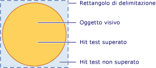
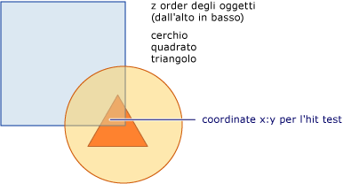

# Hit testing a livello visivo
In questo argomento vengono forniti dei cenni preliminari sulle funzionalità di hit testing fornite dal livello visivo.  Il supporto per l'hit testing consente di determinare se il valore di una geometria o di un punto è compreso all'interno del contenuto di rendering di un oggetto <xref:System.Windows.Media.Visual>, rendendo possibile l'implementazione di un comportamento dell'interfaccia utente, ad esempio un rettangolo per la selezione di più oggetti.  
  
   
  
   
## Scenari di hit testing  
 La classe <xref:System.Windows.UIElement> fornisce il metodo <xref:System.Windows.UIElement.InputHitTest%2A> che consente di eseguire un hit test su un elemento utilizzando un valore di coordinate specificato.  In molti casi, il metodo <xref:System.Windows.UIElement.InputHitTest%2A> fornisce le funzionalità richieste per l'implementazione dell'hit testing degli elementi.  Esistono tuttavia diversi scenari nei quali potrebbe essere necessario implementare l'hit testing a livello visivo.  
  
-   Hit testing su oggetti diversi da <xref:System.Windows.UIElement>: applicabile se si esegue l'hit test su oggetti che non sono <xref:System.Windows.UIElement>, ad esempio <xref:System.Windows.Media.DrawingVisual> oppure oggetti grafici.  
  
-   Hit testing tramite una geometria: applicabile quando è necessario eseguire un hit test utilizzando un oggetto Geometry anziché il valore delle coordinate di un punto.  
  
-   Hit testing su più oggetti: applicabile quando è necessario eseguire un hit test su più oggetti, ad esempio oggetti sovrapposti.  È possibile ottenere risultati per tutti gli elementi visivi che intersecano una geometria o un punto, non solo il primo di essi.  
  
-   Criteri di hit testing di oggetti <xref:System.Windows.UIElement> ignorati: applicabile quando è necessario ignorare i criteri di hit testing di oggetti <xref:System.Windows.UIElement>, che prendono in considerazione fattori quali l'eventuale disabilitazione o invisibilità di un elemento.  
  
> [!NOTE]
>  Per un esempio di codice completo che illustri l'hit testing a livello visivo, vedere [Esempio di hit test mediante DrawingVisual](http://go.microsoft.com/fwlink/?LinkID=159994) e [Esempio di hit test con interoperatività Win32](http://go.microsoft.com/fwlink/?LinkID=159995) \(le pagine potrebbero essere in inglese\).  
  
   
## Supporto per l'hit testing  
 Lo scopo dei metodi <xref:System.Windows.Media.VisualTreeHelper.HitTest%2A> della classe <xref:System.Windows.Media.VisualTreeHelper> consiste nel determinare se il valore delle coordinate di un punto o di una geometria è compreso all'interno del contenuto di rendering di un determinato oggetto, ad esempio un controllo o un elemento grafico.  Ad esempio, è possibile utilizzare l'hit testing per determinare se un clic del mouse all'interno del rettangolo di delimitazione di un oggetto viene eseguito all'interno della geometria di un cerchio.  Inoltre, è possibile scegliere di sottoporre a override l'implementazione predefinita dell'hit testing per eseguire calcoli di hit testing personalizzati.  
  
 Nell'illustrazione seguente viene mostrata la relazione tra l'area di un oggetto non rettangolare e il relativo rettangolo di delimitazione.  
  
   
Diagramma dell'area di hit testing valida  
  
   
## Hit testing e ordine Z  
 Il livello visivo di [!INCLUDE[TLA#tla_winclient](../../../../includes/tlasharptla-winclient-md.md)] supporta l'hit testing su tutti gli oggetti relativi a un punto oppure a una geometria, non solo sull'oggetto di primo livello.  I risultati vengono restituiti nell'[ordine Z](GTMT).  Tuttavia, l'oggetto visivo che viene passato come parametro al metodo <xref:System.Windows.Media.VisualTreeHelper.HitTest%2A> determina la porzione della [struttura ad albero visuale](GTMT) che sarà sottoposta all'hit testing.  È possibile eseguire l'hit testing sull'intera struttura ad albero visuale o su qualsiasi parte di essa.  
  
 Nell'illustrazione seguente, l'oggetto cerchio è sovrapposto sia al quadrato che al triangolo.  Se si desidera sottoporre a hit testing solo l'oggetto visivo il cui valore dell'[ordine Z](GTMT) corrisponde al livello superiore, è possibile impostare l'enumerazione dell'hit test visiva in modo che l'oggetto <xref:System.Windows.Media.HitTestResultCallback> restituisca <xref:System.Windows.Media.HitTestResultBehavior> per interrompere lo scorrimento dell'hit test dopo il primo elemento.  
  
   
Diagramma dell'ordine Z di una struttura ad albero visuale  
  
 Se si desidera enumerare tutti gli oggetti visivi in un punto o in una geometria specifica, è necessario che l'oggetto <xref:System.Windows.Media.HitTestResultCallback> restituisca <xref:System.Windows.Media.HitTestResultBehavior>.  Ciò significa che è possibile sottoporre a hit testing oggetti visivi che si trovano al di sotto di altri oggetti, anche se sono completamente nascosti.  Per ulteriori informazioni, vedere il codice di esempio nella sezione "Utilizzo del callback dei risultati di un hit test".  
  
> [!NOTE]
>  È possibile eseguire l'hit test anche su un oggetto visivo trasparente.  
  
   
## Utilizzo dell'hit testing predefinito  
 È possibile individuare se un punto è compreso all'interno della geometria di un oggetto visivo utilizzando il metodo <xref:System.Windows.Media.VisualTreeHelper.HitTest%2A> per specificare un oggetto visivo e il valore delle coordinate di un punto rispetto ai quali eseguire il test.  Il parametro dell'oggetto visivo identifica il punto di avvio della ricerca dell'hit test nella struttura ad albero visuale.  Se viene rilevato un oggetto visivo nella struttura ad albero visuale la cui geometria contiene la coordinata, questo sarà impostato sulla proprietà <xref:System.Windows.Media.HitTestResult.VisualHit%2A> di un oggetto <xref:System.Windows.Media.HitTestResult>.  L'oggetto <xref:System.Windows.Media.HitTestResult> viene quindi restituito dal metodo <xref:System.Windows.Media.VisualTreeHelper.HitTest%2A>.  Se il punto non è contenuto all'interno della sottostruttura ad albero visuale sottoposta a hit testing, il metodo <xref:System.Windows.Media.VisualTreeHelper.HitTest%2A> restituisce `null`.  
  
> [!NOTE]
>  L'hit testing predefinito restituisce sempre l'oggetto di livello superiore nell'[ordine Z](GTMT).  Per identificare tutti gli oggetti visivi, compresi quelli che potrebbero essere parzialmente o completamente nascosti, utilizzare un callback dei risultati dell'hit test.  
  
 Il valore delle coordinate che viene passato come parametro del punto per il metodo <xref:System.Windows.Media.VisualTreeHelper.HitTest%2A> deve essere relativo allo spazio delle coordinate dell'oggetto visivo sottoposto a hit testing.  Ad esempio, se sono stati annidati degli oggetti visivi definiti in corrispondenza delle coordinate \(100, 100\) nello spazio di coordinate dell'elemento padre, l'hit testing su un oggetto visivo figlio di coordinate \(0, 0\) sarà equivalente all'hit testing per le coordinate \(100, 100\) nello spazio di coordinate dell'elemento padre.  
  
 Nel codice seguente viene mostrato come configurare i gestori di eventi del mouse per un oggetto <xref:System.Windows.UIElement> utilizzato per acquisire gli eventi adoperati per l'hit testing.  
  
 [!code-csharp[HitTestingOverview#100](../../../../samples/snippets/csharp/VS_Snippets_Wpf/HitTestingOverview/CSharp/Window1.xaml.cs#100)]
 [!code-vb[HitTestingOverview#100](../../../../samples/snippets/visualbasic/VS_Snippets_Wpf/HitTestingOverview/visualbasic/window1.xaml.vb#100)]  
  
### Effetti della struttura ad albero visuale sull'hit testing  
 Il punto iniziale della struttura ad albero visuale determina gli oggetti che saranno restituiti durante l'enumerazione degli oggetti dell'hit test.  Se si desidera sottoporre a hit testing più oggetti, l'oggetto visivo utilizzato come punto iniziale della struttura ad albero visuale deve essere il predecessore comune di tutti gli oggetti in questione.  Se, ad esempio, si desidera eseguire l'hit test sia sull'elemento pulsante, sia sull'elemento visivo di disegno del diagramma riportato di seguito, è necessario impostare il punto iniziale della struttura ad albero visuale in corrispondenza del predecessore comune a entrambi.  In questo caso, l'elemento area di disegno è il predecessore comune per l'elemento pulsante e per l'elemento visivo di disegno.  
  
   
Diagramma della gerarchia di una struttura ad albero visuale  
  
> [!NOTE]
>  La proprietà <xref:System.Windows.UIElement.IsHitTestVisible%2A> ottiene o imposta un valore che dichiara se un oggetto derivato da <xref:System.Windows.UIElement> può eventualmente essere restituito come risultato dell'hit test da qualche porzione del relativo contenuto di rendering.  In questo modo è possibile modificare selettivamente la struttura ad albero visuale per determinare quali oggetti visivi sono coinvolti in un hit test.  
  
   
## Utilizzo del callback dei risultati di un hit test  
 È possibile enumerare tutti gli oggetti visivi di una struttura ad albero visuale la cui geometria contiene un valore di coordinate specificato.  Ciò consente di identificare tutti gli oggetti visivi, compresi quelli che potrebbero essere parzialmente o completamente nascosti da altri oggetti visivi.  Per enumerare gli oggetti visivi di una struttura ad albero visuale, utilizzare il metodo <xref:System.Windows.Media.VisualTreeHelper.HitTest%2A> con una funzione di callback dell'hit test.  La funzione di callback dell'hit test viene chiamata dal sistema quando il valore delle coordinate specificato è compreso in un oggetto visivo.  
  
 Durante l'enumerazione dei risultati dell'hit test, evitare di eseguire qualsiasi operazione che modifichi la struttura ad albero visuale.  L'aggiunta o la rimozione di un oggetto dalla struttura ad albero visuale mentre quest'ultima viene attraversata può produrre un comportamento imprevedibile.  È possibile modificare la struttura ad albero visuale senza correre rischi dopo la restituzione dei risultati da parte del metodo <xref:System.Windows.Media.VisualTreeHelper.HitTest%2A>.  È necessario fornire una struttura dei dati, ad esempio un oggetto <xref:System.Collections.ArrayList>, per archiviare i valori durante l'enumerazione dei risultati dell'hit test.  
  
 [!code-csharp[HitTestingOverview#101](../../../../samples/snippets/csharp/VS_Snippets_Wpf/HitTestingOverview/CSharp/Window1.xaml.cs#101)]
 [!code-vb[HitTestingOverview#101](../../../../samples/snippets/visualbasic/VS_Snippets_Wpf/HitTestingOverview/visualbasic/window1.xaml.vb#101)]  
  
 Il metodo di callback dell'hit test definisce le azioni eseguite quando viene identificato un hit test su un determinato oggetto visivo nella struttura ad albero visuale.  Una volta eseguite queste azioni, viene restituito un valore di <xref:System.Windows.Media.HitTestResultBehavior> che consente di determinare se continuare o meno l'enumerazione di altri eventuali oggetti visivi.  
  
 [!code-csharp[HitTestingOverview#102](../../../../samples/snippets/csharp/VS_Snippets_Wpf/HitTestingOverview/CSharp/Window1.xaml.cs#102)]
 [!code-vb[HitTestingOverview#102](../../../../samples/snippets/visualbasic/VS_Snippets_Wpf/HitTestingOverview/visualbasic/window1.xaml.vb#102)]  
  
> [!NOTE]
>  La sequenza di enumerazione degli oggetti visivi sottoposti a hit testing è basata sull'[ordine Z](GTMT).  L'oggetto visivo di livello superiore nell'[ordine Z](GTMT) viene enumerato per primo.  Gli altri oggetti visivi vengono enumerati secondo livelli decrescenti dell'[ordine Z](GTMT).  Tale ordine di enumerazione corrisponde all'ordine di rendering degli elementi visivi.  
  
 È possibile interrompere l'enumerazione di oggetti visivi in qualsiasi momento nella funzione di callback dell'hit test restituendo <xref:System.Windows.Media.HitTestResultBehavior>.  
  
 [!code-csharp[HitTestingOverview#103](../../../../samples/snippets/csharp/VS_Snippets_Wpf/HitTestingOverview/CSharp/Window1.xaml.cs#103)]
 [!code-vb[HitTestingOverview#103](../../../../samples/snippets/visualbasic/VS_Snippets_Wpf/HitTestingOverview/visualbasic/window1.xaml.vb#103)]  
  
   
## Utilizzo del callback di un filtro dell'hit test  
 È possibile utilizzare un filtro dell'hit test facoltativo per limitare gli oggetti passati ai risultati dell'hit test.  Ciò consente di ignorare le parti della struttura ad albero visuale che non si desidera elaborare nei risultati dell'hit test.  Per implementare un filtro dell'hit test, definire una funzione di callback del filtro dell'hit test e passarla come valore del parametro quando si chiama il metodo <xref:System.Windows.Media.VisualTreeHelper.HitTest%2A>.  
  
 [!code-csharp[HitTestingOverview#104](../../../../samples/snippets/csharp/VS_Snippets_Wpf/HitTestingOverview/CSharp/Window1.xaml.cs#104)]
 [!code-vb[HitTestingOverview#104](../../../../samples/snippets/visualbasic/VS_Snippets_Wpf/HitTestingOverview/visualbasic/window1.xaml.vb#104)]  
  
 Se non si desidera specificare la funzione di callback del filtro dell'hit test facoltativo, passare un valore `null` come parametro per il metodo <xref:System.Windows.Media.VisualTreeHelper.HitTest%2A>.  
  
 [!code-csharp[HitTestingOverview#105](../../../../samples/snippets/csharp/VS_Snippets_Wpf/HitTestingOverview/CSharp/Window1.xaml.cs#105)]
 [!code-vb[HitTestingOverview#105](../../../../samples/snippets/visualbasic/VS_Snippets_Wpf/HitTestingOverview/visualbasic/window1.xaml.vb#105)]  
  
   
Eliminazione di oggetti da una struttura ad albero visuale  
  
 La funzione di callback del filtro dell'hit test consente di enumerare tutti gli oggetti visivi il cui contenuto di rendering include le coordinate specificate.  Tuttavia è possibile che talvolta si decida di ignorare determinate diramazioni che non si desidera elaborare nella funzione di callback dei risultati dell'hit test.  Il valore restituito dalla funzione di richiamata del filtro dell'hit test determina il tipo di azione che deve essere eseguito dall'enumerazione degli oggetti visivi.  Se, ad esempio, viene restituito il valore <xref:System.Windows.Media.HitTestFilterBehavior>, è possibile rimuovere l'oggetto visivo corrente e i relativi elementi figlio dall'enumerazione dei risultati dell'hit test.  In questo modo, la funzione di callback dei risultati dell'hit test non visualizzerà tali oggetti nell'enumerazione.  L'eliminazione di oggetti dalla struttura ad albero visuale consente di ridurre l'elaborazione durante il passaggio dell'enumerazione dei risultati dell'hit test.  Nell'esempio di codice seguente, il filtro ignora le etichette e i relativi discendenti e sottopone a hit test tutti gli altri elementi.  
  
 [!code-csharp[HitTestingOverview#106](../../../../samples/snippets/csharp/VS_Snippets_Wpf/HitTestingOverview/CSharp/Window1.xaml.cs#106)]
 [!code-vb[HitTestingOverview#106](../../../../samples/snippets/visualbasic/VS_Snippets_Wpf/HitTestingOverview/visualbasic/window1.xaml.vb#106)]  
  
> [!NOTE]
>  Talvolta il callback del filtro dell'hit test sarà chiamato nei casi in cui non viene chiamato il callback dei risultati dell'hit test.  
  
   
## Override dell'hit testing predefinito  
 È possibile eseguire l'override del supporto dell'hit testing predefinito di un oggetto visivo tramite l'override del metodo <xref:System.Windows.Media.Visual.HitTestCore%2A>.  In questo modo, quando si richiama il metodo <xref:System.Windows.Media.VisualTreeHelper.HitTest%2A>, viene chiamata l'implementazione di <xref:System.Windows.Media.Visual.HitTestCore%2A> di cui è stato eseguito l'override.  Il metodo sottoposto a override viene chiamato quando un hit test viene eseguito all'interno del rettangolo di delimitazione dell'oggetto visivo, anche se la coordinata non rientra nel contenuto di rendering dell'oggetto visivo.  
  
 [!code-csharp[HitTestingOverview#107](../../../../samples/snippets/csharp/VS_Snippets_Wpf/HitTestingOverview/CSharp/Window1.xaml.cs#107)]
 [!code-vb[HitTestingOverview#107](../../../../samples/snippets/visualbasic/VS_Snippets_Wpf/HitTestingOverview/visualbasic/window1.xaml.vb#107)]  
  
 A volte può essere opportuno eseguire un hit test sia sul rettangolo di delimitazione, sia sul contenuto di rendering di un oggetto visivo.  Utilizzando il valore del parametro `PointHitTestParameters` nel metodo <xref:System.Windows.Media.Visual.HitTestCore%2A> sottoposto a override come parametro per il metodo di base <xref:System.Windows.Media.Visual.HitTestCore%2A>, è possibile effettuare operazioni basate su un'occorrenza del rettangolo di delimitazione di un oggetto visivo ed eseguire quindi un secondo hit test sul contenuto sottoposto a rendering dell'oggetto visivo.  
  
 [!code-csharp[HitTestingOverview#108](../../../../samples/snippets/csharp/VS_Snippets_Wpf/HitTestingOverview/CSharp/Window1.xaml.cs#108)]
 [!code-vb[HitTestingOverview#108](../../../../samples/snippets/visualbasic/VS_Snippets_Wpf/HitTestingOverview/visualbasic/window1.xaml.vb#108)]  
  
## Vedere anche  
 <xref:System.Windows.Media.VisualTreeHelper.HitTest%2A>   
 <xref:System.Windows.Media.HitTestResult>   
 <xref:System.Windows.Media.HitTestResultCallback>   
 <xref:System.Windows.Media.HitTestFilterCallback>   
 <xref:System.Windows.UIElement.IsHitTestVisible%2A>   
 [Esempio di hit test mediante DrawingVisuals](http://go.microsoft.com/fwlink/?LinkID=159994)   
 [Esempio di hit test con interoperatività Win32](http://go.microsoft.com/fwlink/?LinkID=159995)   
 [Eseguire un hit test della geometria in un oggetto Visual](../../../../docs/framework/wpf/graphics-multimedia/how-to-hit-test-geometry-in-a-visual.md)   
 [Eseguire un hit test utilizzando un contenitore host Win32](../../../../docs/framework/wpf/graphics-multimedia/how-to-hit-test-using-a-win32-host-container.md)