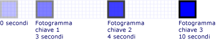
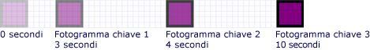
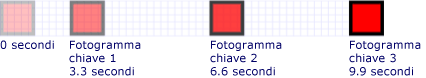
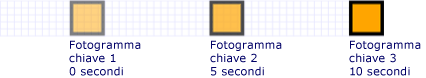

# Procedura: controllare la durata delle animazioni con fotogrammi chiave
In questo esempio viene illustrato come controllare la durata dei fotogrammi chiave all'interno di un'animazione con fotogrammi chiave.  Analogamente alle altre animazioni, le animazioni con fotogrammi chiave includono una proprietà <xref:System.Windows.Media.Animation.Timeline.Duration%2A>.  Oltre a specificare la durata di un'animazione, è necessario specificare quale parte della durata è assegnata a ognuno dei relativi fotogrammi chiave.  Per assegnare il tempo, specificare un oggetto <xref:System.Windows.Media.Animation.KeyTime> per ogni fotogramma chiave nell'animazione.  
  
 L'oggetto <xref:System.Windows.Media.Animation.KeyTime> specifica quando termina ogni fotogramma chiave \(non specifica la durata di riproduzione di un fotogramma chiave\).  È possibile specificare un oggetto <xref:System.Windows.Media.Animation.KeyTime> come valore <xref:System.TimeSpan>, espresso in percentuale, o come valore speciale <xref:System.Windows.Media.Animation.KeyTime.Uniform%2A> o <xref:System.Windows.Media.Animation.KeyTime.Paced%2A>.  
  
## Esempio  
 Nell'esempio seguente viene utilizzato un oggetto <xref:System.Windows.Media.Animation.DoubleAnimationUsingKeyFrames> per animare un rettangolo attraverso lo schermo.  Le chiavi temporali dei fotogrammi chiave vengono impostate con i valori <xref:System.TimeSpan>.  
  
 [!code-csharp[keyframes_snip#KeyTimesTimeSpanExample](../../../../samples/snippets/csharp/VS_Snippets_Wpf/keyframes_snip/CSharp/KeyTimesExample.cs#keytimestimespanexample)]
 [!code-vb[keyframes_snip#KeyTimesTimeSpanExample](../../../../samples/snippets/visualbasic/VS_Snippets_Wpf/keyframes_snip/visualbasic/keytimesexample.vb#keytimestimespanexample)]
 [!code-xml[keyframes_snip#KeyTimesTimeSpanExample](../../../../samples/snippets/xaml/VS_Snippets_Wpf/keyframes_snip/XAML/KeyTimesExample.xaml#keytimestimespanexample)]  
  
 Nell'immagine seguente è illustrato il momento in cui viene raggiunto il valore di ogni fotogramma chiave.  
  
   
  
 Nell'esempio successivo è illustrata un'animazione identica, tranne per il fatto che le chiavi temporali dei fotogrammi chiave vengono impostate con valori in percentuale.  
  
 [!code-csharp[keyframes_snip#KeyTimesPercentageExample](../../../../samples/snippets/csharp/VS_Snippets_Wpf/keyframes_snip/CSharp/KeyTimesExample.cs#keytimespercentageexample)]
 [!code-vb[keyframes_snip#KeyTimesPercentageExample](../../../../samples/snippets/visualbasic/VS_Snippets_Wpf/keyframes_snip/visualbasic/keytimesexample.vb#keytimespercentageexample)]
 [!code-xml[keyframes_snip#KeyTimesPercentageExample](../../../../samples/snippets/xaml/VS_Snippets_Wpf/keyframes_snip/XAML/KeyTimesExample.xaml#keytimespercentageexample)]  
  
 Nell'immagine seguente è illustrato il momento in cui viene raggiunto il valore di ogni fotogramma chiave.  
  
   
  
 Nell'esempio successivo vengono utilizzati i valori delle chiavi temporali <xref:System.Windows.Media.Animation.KeyTime.Uniform%2A>.  
  
 [!code-csharp[keyframes_snip#KeyTimesUniformExample](../../../../samples/snippets/csharp/VS_Snippets_Wpf/keyframes_snip/CSharp/KeyTimesExample.cs#keytimesuniformexample)]
 [!code-vb[keyframes_snip#KeyTimesUniformExample](../../../../samples/snippets/visualbasic/VS_Snippets_Wpf/keyframes_snip/visualbasic/keytimesexample.vb#keytimesuniformexample)]
 [!code-xml[keyframes_snip#KeyTimesUniformExample](../../../../samples/snippets/xaml/VS_Snippets_Wpf/keyframes_snip/XAML/KeyTimesExample.xaml#keytimesuniformexample)]  
  
 Nell'immagine seguente è illustrato il momento in cui viene raggiunto il valore di ogni fotogramma chiave.  
  
   
  
 Nell'esempio finale vengono utilizzati i valori delle chiavi temporali <xref:System.Windows.Media.Animation.KeyTime.Paced%2A>.  
  
 [!code-csharp[keyframes_snip#KeyTimesPacedExample](../../../../samples/snippets/csharp/VS_Snippets_Wpf/keyframes_snip/CSharp/KeyTimesExample.cs#keytimespacedexample)]
 [!code-vb[keyframes_snip#KeyTimesPacedExample](../../../../samples/snippets/visualbasic/VS_Snippets_Wpf/keyframes_snip/visualbasic/keytimesexample.vb#keytimespacedexample)]
 [!code-xml[keyframes_snip#KeyTimesPacedExample](../../../../samples/snippets/xaml/VS_Snippets_Wpf/keyframes_snip/XAML/KeyTimesExample.xaml#keytimespacedexample)]  
  
 Nell'immagine seguente è illustrato il momento in cui viene raggiunto il valore di ogni fotogramma chiave.  
  
   
  
 Per semplicità, nelle versioni di codice di questo esempio vengono utilizzate animazioni locali, non storyboard, perché viene applicata una singola animazione a una singola proprietà, ma gli esempi potrebbero essere modificati per l'utilizzo di storyboard.  Per un esempio in cui viene illustrato come dichiarare uno storyboard nel codice, vedere [Animare una proprietà utilizzando uno storyboard](../../../../docs/framework/wpf/graphics-multimedia/how-to-animate-a-property-by-using-a-storyboard.md).  
  
 Per l'esempio completo, vedere [Esempio di animazione con fotogrammi chiave](http://go.microsoft.com/fwlink/?LinkID=160012) \(la pagina potrebbe essere in inglese\).  Per ulteriori informazioni sulle animazioni con fotogrammi chiave, vedere [Cenni preliminari sulle animazioni con fotogrammi chiave](../../../../docs/framework/wpf/graphics-multimedia/key-frame-animations-overview.md).  
  
## Vedere anche  
 [Cenni preliminari sulle animazioni con fotogrammi chiave](../../../../docs/framework/wpf/graphics-multimedia/key-frame-animations-overview.md)   
 [Cenni preliminari sull'animazione](../../../../docs/framework/wpf/graphics-multimedia/animation-overview.md)   
 [Procedure relative](../../../../docs/framework/wpf/graphics-multimedia/animation-and-timing-how-to-topics.md)