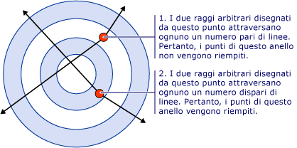
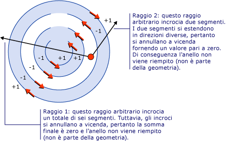
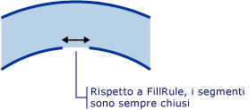

# Procedura: controllare il riempimento di una forma composta
Il <xref:System.Windows.Media.GeometryGroup.FillRule%2A> proprietà di un <xref:System.Windows.Media.GeometryGroup> o <xref:System.Windows.Media.PathGeometry>, specifica una "regola" utilizzata dalla forma composta per determinare se un determinato punto fa parte della geometria. Esistono due possibili valori per <xref:System.Windows.Media.FillRule>: <xref:System.Windows.Media.FillRule> e <xref:System.Windows.Media.FillRule>. Le sezioni seguenti descrivono come utilizzare queste due regole.  
  
 **EvenOdd:** questa regola determina se un punto si trova nell'area di riempimento tracciando un raggio da tale punto all'infinito in qualsiasi direzione e contando il numero di segmenti di percorso all'interno della forma specificata incrociati dal raggio. Se questo numero è dispari, il punto è all'interno. Se invece è pari, il punto è all'esterno.  
  
 Ad esempio, il codice XAML seguente crea una forma composta costituita da una serie di anelli concentrici (destinazione) con un <xref:System.Windows.Media.GeometryGroup.FillRule%2A> impostato su <xref:System.Windows.Media.FillRule>.  
  
 [!code-xml[GeometriesMiscSnippets_snip#FillRuleEvenOddValue](../../../../samples/snippets/xaml/VS_Snippets_Wpf/GeometriesMiscSnippets_snip/XAML/FillRuleExample.xaml#fillruleevenoddvalue)]  
  
 Nella figura seguente viene illustrata la forma creata nell'esempio precedente.  
  
   
  
 Nell'illustrazione precedente, si noti che il centro e ring 3 non sono stati compilati. In questo modo un raggio tracciato da qualsiasi punto all'interno di uno di questi due anelli passa attraverso un numero pari di segmenti. Vedere la figura seguente:  
  
   
  
 **NonZero:** questa regola determina se un punto si trova nell'area di riempimento del percorso tracciando un raggio da tale punto all'infinito in qualsiasi direzione ed esaminando le posizioni in un segmento della forma incrocia il raggio. A partire da un conteggio pari a zero, aggiungere uno ogni volta che un segmento incrocia il raggio da sinistra a destra e sottrarre uno ogni volta che un percorso segmento incrocia il raggio da destra a sinistra. Contare le intersezioni. Se il risultato è zero, il punto è all'esterno del percorso. In caso contrario, è all'interno.  
  
 [!code-xml[GeometriesMiscSnippets_snip#FillRuleNonZeroValueEllipseGeometry](../../../../samples/snippets/xaml/VS_Snippets_Wpf/GeometriesMiscSnippets_snip/XAML/FillRuleExample.xaml#fillrulenonzerovalueellipsegeometry)]  
  
 Nell'esempio precedente, un valore di <xref:System.Windows.Media.FillRule> per <xref:System.Windows.Media.GeometryGroup.FillRule%2A> restituisce come risultato nella figura seguente:  
  
   
  
 Come può notare, tutti gli anelli sono riempiti. Questo è dovuto al fatto tutti i segmenti sono in esecuzione nella stessa direzione e un raggio tracciato da qualsiasi punto attraversi uno o più segmenti e la somma degli incroci non sarà uguale a zero. Ad esempio, nell'illustrazione seguente, le frecce rosse rappresentano la direzione in cui che vengono disegnati i segmenti e freccia bianca rappresenta un raggio qualsiasi che da un punto dell'anello più interno. A partire da un valore pari a zero, per ogni segmento raggio, viene aggiunto un valore di uno perché il segmento incrocia il raggio da sinistra a destra.  
  
   
  
 Per illustrare il comportamento di <xref:System.Windows.Media.FillRule> regola una forma più complessa con segmenti in esecuzione in direzioni diverse è necessaria. Il codice XAML seguente crea una forma simile all'esempio precedente, ad eccezione del fatto che viene creato con un <xref:System.Windows.Media.PathGeometry> anziché un <xref:System.Windows.Media.EllipseGeometry> che consente di creare quattro archi concentrici completamente chiusi cerchi concentrici.  
  
 [!code-xml[GeometriesMiscSnippets_snip#FillRuleNonZeroValuePathGeometry](../../../../samples/snippets/xaml/VS_Snippets_Wpf/GeometriesMiscSnippets_snip/XAML/FillRuleExample.xaml#fillrulenonzerovaluepathgeometry)]  
  
 Nella figura seguente viene illustrata la forma creata nell'esempio precedente.  
  
   
  
 Si noti che il terzo arco dall'area non viene compilato. Motivo è illustrato nella figura seguente. Nell'illustrazione, le frecce rosse rappresentano la direzione in cui che vengono disegnati i segmenti. Le due frecce bianche rappresentano due raggi che partono da un punto nell'area "non riempita". Come si può notare dalla figura, la somma dei valori che attraversano i segmenti nel percorso di un raggio specificato è zero. Come definito in precedenza, una somma pari a zero indica che il punto non fa parte della geometria (non fa parte del riempimento) mentre una somma che *non* zero, compresi i valori negativi, fa parte della geometria.  
  
   
  
 **Nota:** ai fini di <xref:System.Windows.Media.FillRule>, tutte le forme sono considerate chiuse. Se è presente un'interruzione in un segmento, disegnare una linea immaginaria per chiuderla. Nell'esempio precedente, sono presenti interruzioni piccole negli anelli. Detto questo, si potrebbe prevedere un raggio che attraversa il gap per produrre un risultato diverso, quindi un raggio in un'altra direzione. Di seguito è riportata un'immagine ingrandita di uno di questi spazi vuoti e "segmento immaginario" (tracciato allo scopo di applicare il <xref:System.Windows.Media.FillRule>) che lo chiude.  
  
   
  
## Esempio  
  
## Vedere anche  
 [Creare una forma composta](../../../../docs/framework/wpf/graphics-multimedia/how-to-create-a-composite-shape.md)   
 [Panoramica di geometria](../../../../docs/framework/wpf/graphics-multimedia/geometry-overview.md)