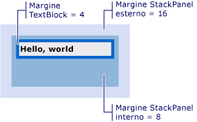

# Procedura: ottenere l&#39;offset di un oggetto Visual
In questi esempi viene mostrato come recuperare il valore di offset di un oggetto Visual relativo al padre o a qualsiasi predecessore o discendente.  
  
## Esempio  
 Nell'esempio di markup seguente viene mostrato un oggetto <xref:System.Windows.Controls.TextBlock> definito con un valore <xref:System.Windows.FrameworkElement.Margin%2A> pari a 4.  
  
 [!code-xml[VisualSnippets#VisualSnippet1](../../../../samples/snippets/csharp/VS_Snippets_Wpf/VisualSnippets/CSharp/Window1.xaml#visualsnippet1)]  
  
 Nell'esempio di codice riportato di seguito viene illustrato l'utilizzo del metodo <xref:System.Windows.Media.VisualTreeHelper.GetOffset%2A> per recuperare l'offset dell'oggetto <xref:System.Windows.Controls.TextBlock>.  I valori di offset sono contenuti all'interno del valore <xref:System.Windows.Vector> restituito.  
  
 [!code-csharp[VisualSnippets#VisualSnippet2](../../../../samples/snippets/csharp/VS_Snippets_Wpf/VisualSnippets/CSharp/Window1.xaml.cs#visualsnippet2)]
 [!code-vb[VisualSnippets#VisualSnippet2](../../../../samples/snippets/visualbasic/VS_Snippets_Wpf/VisualSnippets/visualbasic/window1.xaml.vb#visualsnippet2)]  
  
 L'offset prende in considerazione il valore <xref:System.Windows.FrameworkElement.Margin%2A>.  In questo caso, <xref:System.Windows.Vector.X%2A> e <xref:System.Windows.Vector.Y%2A> sono pari a 4.  
  
 Il valore di offset restituito è relativo all'elemento padre dell'oggetto <xref:System.Windows.Media.Visual>.  Se si desidera restituire un valore di offset non relativo all'elemento padre dell'oggetto <xref:System.Windows.Media.Visual>, utilizzare il metodo <xref:System.Windows.Media.Visual.TransformToAncestor%2A>.  
  
## Acquisizione dell'offset relativo a un predecessore  
 Nell'esempio di markup seguente viene mostrato un oggetto <xref:System.Windows.Controls.TextBlock> annidato all'interno di due oggetti <xref:System.Windows.Controls.StackPanel>.  
  
 [!code-xml[VisualSnippets#VisualSnippet7](../../../../samples/snippets/csharp/VS_Snippets_Wpf/VisualSnippets/CSharp/Window2.xaml#visualsnippet7)]  
  
 Nella figura seguente vengono illustrati i risultati del markup.  
  
   
TextBlock annidato all'interno di due StackPanel  
  
 Nell'esempio di codice seguente viene mostrato come utilizzare il metodo <xref:System.Windows.Media.Visual.TransformToAncestor%2A> per recuperare l'offset dell'oggetto <xref:System.Windows.Controls.TextBlock> relativo all'oggetto <xref:System.Windows.Window> che lo contiene.   I valori di offset sono contenuti all'interno del valore <xref:System.Windows.Media.GeneralTransform> restituito.  
  
 [!code-csharp[VisualSnippets#VisualSnippet5](../../../../samples/snippets/csharp/VS_Snippets_Wpf/VisualSnippets/CSharp/Window1.xaml.cs#visualsnippet5)]
 [!code-vb[VisualSnippets#VisualSnippet5](../../../../samples/snippets/visualbasic/VS_Snippets_Wpf/VisualSnippets/visualbasic/window1.xaml.vb#visualsnippet5)]  
  
 L'offset prende in considerazione i valori <xref:System.Windows.FrameworkElement.Margin%2A> per tutti gli oggetti all'interno dell'oggetto <xref:System.Windows.Window> che li contiene.  In questo caso, <xref:System.Windows.Vector.X%2A> è pari a 28 \(16 \+ 8 \+ 4\) e <xref:System.Windows.Vector.Y%2A> è pari a 28.  
  
 Il valore di offset restituito è relativo al predecessore dell'oggetto <xref:System.Windows.Media.Visual>.  Se si desidera restituire un valore di offset relativo al discendente di <xref:System.Windows.Media.Visual>, utilizzare il metodo <xref:System.Windows.Media.Visual.TransformToDescendant%2A>.  
  
## Acquisizione dell'offset relativo a un discendente  
 Nell'esempio di markup seguente viene mostrato un oggetto <xref:System.Windows.Controls.TextBlock> contenuto all'interno di un oggetto <xref:System.Windows.Controls.StackPanel>.  
  
 [!code-xml[VisualSnippets#VisualSnippet4](../../../../samples/snippets/csharp/VS_Snippets_Wpf/VisualSnippets/CSharp/Window1.xaml#visualsnippet4)]  
  
 Nell’esempio di codice seguente viene illustrato l’utilizzo del metodo <xref:System.Windows.Media.Visual.TransformToDescendant%2A> per recuperare l’offset dell’oggetto <xref:System.Windows.Controls.StackPanel> relativo al proprio elemento figlio <xref:System.Windows.Controls.TextBlock>.  I valori di offset sono contenuti all'interno del valore <xref:System.Windows.Media.GeneralTransform> restituito.  
  
 [!code-csharp[VisualSnippets#VisualSnippet9](../../../../samples/snippets/csharp/VS_Snippets_Wpf/VisualSnippets/CSharp/Window1.xaml.cs#visualsnippet9)]
 [!code-vb[VisualSnippets#VisualSnippet9](../../../../samples/snippets/visualbasic/VS_Snippets_Wpf/VisualSnippets/visualbasic/window1.xaml.vb#visualsnippet9)]  
  
 L'offset prende in considerazione i valori <xref:System.Windows.FrameworkElement.Margin%2A> per tutti gli oggetti.  In questo caso, <xref:System.Windows.Vector.X%2A> e <xref:System.Windows.Vector.Y%2A> sono pari a \-4.  I valori di offset sono valori negativi, poiché l'oggetto padre viene spostato negativamente rispetto all'oggetto figlio.  
  
## Vedere anche  
 <xref:System.Windows.Media.Visual>   
 <xref:System.Windows.Media.VisualTreeHelper>   
 [Cenni preliminari sul rendering della grafica WPF](../../../../docs/framework/wpf/graphics-multimedia/wpf-graphics-rendering-overview.md)