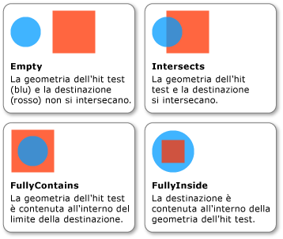

# Procedura: eseguire un hit test utilizzando la geometria come parametro
In questo esempio viene illustrato come eseguire un [hit test](GTMT) su un oggetto visivo utilizzando un <xref:System.Windows.Media.Geometry> come parametro di hit test.  
  
## Esempio  
 Nell'esempio seguente viene mostrato come configurare un hit test utilizzando <xref:System.Windows.Media.GeometryHitTestParameters> per il metodo <xref:System.Windows.Media.VisualTreeHelper.HitTest%2A>.  Il valore <xref:System.Windows.Point> passato al metodo `OnMouseDown` viene utilizzato per creare un oggetto <xref:System.Windows.Media.Geometry> per poter espandere l'intervallo dell'hit test.  
  
 [!code-csharp[HitTestingOverview#HitTestingOverviewSnippet10](../../../../samples/snippets/csharp/VS_Snippets_Wpf/HitTestingOverview/CSharp/GeometryHitTest.cs#hittestingoverviewsnippet10)]
 [!code-vb[HitTestingOverview#HitTestingOverviewSnippet10](../../../../samples/snippets/visualbasic/VS_Snippets_Wpf/HitTestingOverview/visualbasic/geometryhittest.vb#hittestingoverviewsnippet10)]  
  
 La proprietà <xref:System.Windows.Media.GeometryHitTestResult.IntersectionDetail%2A> di <xref:System.Windows.Media.GeometryHitTestResult> fornisce informazioni sui risultati di un hit test che utilizza <xref:System.Windows.Media.Geometry> come parametro.  Di seguito è illustrata la relazione tra la geometria dell'hit test, vale a dire il cerchio blu, e il contenuto sottoposto a rendering dell'oggetto visivo di destinazione, ovvero il quadrato rosso.  
  
   
Intersezione tra geometria dell'hit test e oggetto visivo di destinazione  
  
 Nell'esempio seguente viene illustrato come implementare un callback dell'hit test se come parametro di hit test si utilizza <xref:System.Windows.Media.Geometry>.  Viene eseguito il cast del parametro `result` a <xref:System.Windows.Media.GeometryHitTestResult> per recuperare il valore della proprietà <xref:System.Windows.Media.GeometryHitTestResult.IntersectionDetail%2A>.  Il valore della proprietà consente di determinare se il parametro di hit test <xref:System.Windows.Media.Geometry> è contenuto completamente o parzialmente all'interno del contenuto della destinazione dell'hit test di cui è stato eseguito il rendering.  In questo caso, il codice di esempio aggiunge all'elenco solo i risultati dell'hit test relativi agli elementi visivi contenuti completamente all'interno del limite della destinazione.  
  
 [!code-csharp[HitTestingOverview#HitTestingOverviewSnippet11](../../../../samples/snippets/csharp/VS_Snippets_Wpf/HitTestingOverview/CSharp/GeometryHitTest.cs#hittestingoverviewsnippet11)]
 [!code-vb[HitTestingOverview#HitTestingOverviewSnippet11](../../../../samples/snippets/visualbasic/VS_Snippets_Wpf/HitTestingOverview/visualbasic/geometryhittest.vb#hittestingoverviewsnippet11)]  
  
> [!NOTE]
>  Il callback <xref:System.Windows.Media.HitTestResult> non deve essere chiamato quando il dettaglio dell'intersezione è <xref:System.Windows.Media.IntersectionDetail>.  
  
## Vedere anche  
 [Hit testing a livello visivo](../../../../docs/framework/wpf/graphics-multimedia/hit-testing-in-the-visual-layer.md)   
 [Eseguire un hit test della geometria in un oggetto Visual](../../../../docs/framework/wpf/graphics-multimedia/how-to-hit-test-geometry-in-a-visual.md)