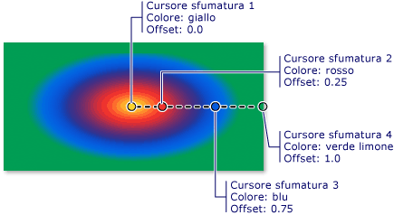

# Procedura: disegnare un&#39;area con una sfumatura radiale
In questo esempio viene illustrato l'utilizzo della classe <xref:System.Windows.Media.RadialGradientBrush> per disegnare un'area con una sfumatura radiale.  
  
## Esempio  
 Nell'esempio seguente viene utilizzato un oggetto <xref:System.Windows.Media.RadialGradientBrush> per disegnare un rettangolo con una sfumatura radiale che passa dal giallo al rosso al blu al verde limone.  
  
 [!code-csharp[BrushesIntroduction_snip#SimpleRadialGradientExampleWholePage](../../../../samples/snippets/csharp/VS_Snippets_Wpf/BrushesIntroduction_snip/CSharp/RadialGradientBrushSnippet.cs#simpleradialgradientexamplewholepage)]
 [!code-vb[BrushesIntroduction_snip#SimpleRadialGradientExampleWholePage](../../../../samples/snippets/visualbasic/VS_Snippets_Wpf/BrushesIntroduction_snip/visualbasic/radialgradientbrushsnippet.vb#simpleradialgradientexamplewholepage)]
 [!code-xml[BrushesIntroduction_snip#SimpleRadialGradientExampleWholePage](../../../../samples/snippets/xaml/VS_Snippets_Wpf/BrushesIntroduction_snip/XAML/RadialGradientBrushSnippet.xaml#simpleradialgradientexamplewholepage)]  
  
 Nell'immagine seguente viene mostrata la sfumatura creata nell'esempio precedente.  I cursori sfumatura sono stati evidenziati.  
  
   
  
> [!NOTE]
>  Negli esempi di questo argomento viene utilizzato il sistema di coordinate predefinito per impostare i punti di controllo.  Il sistema di coordinate predefinito è relativo a un riquadro delimitatore del testo, dove 0 e 1 indicano rispettivamente lo 0% e il 100% del riquadro delimitatore del testo.  Tale sistema di coordinate può essere modificato impostando la proprietà <xref:System.Windows.Media.GradientBrush.MappingMode%2A> sul valore <xref:System.Windows.Media.BrushMappingMode>.  Un sistema di coordinate assoluto non è relativo a un riquadro delimitatore del testo.  I valori vengono interpretati direttamente nello spazio locale.  
  
 Per ulteriori esempi di <xref:System.Windows.Media.RadialGradientBrush>, vedere [Esempio Brush](http://go.microsoft.com/fwlink/?LinkID=159973) \(la pagina potrebbe essere in inglese\).  Per ulteriori informazioni sulle sfumature e su altri tipi di pennelli, vedere [Cenni sul disegno con colori a tinta unita e sfumature](../../../../docs/framework/wpf/graphics-multimedia/painting-with-solid-colors-and-gradients-overview.md).