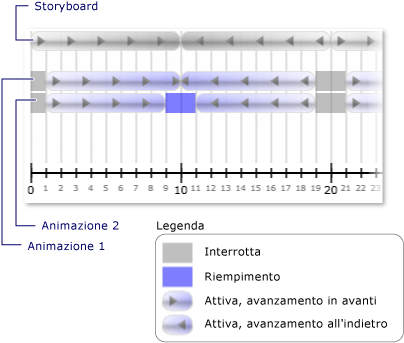

# Procedura: ricevere una notifica quando uno stato dell&#39;orologio viene modificato
L'evento <xref:System.Windows.Media.Animation.Clock.CurrentStateInvalidated> di un orologio si verifica quando il relativo oggetto <xref:System.Windows.Media.Animation.Clock.CurrentState%2A> diventa non valido, ad esempio quando l'orologio viene avviato o interrotto.  È possibile eseguire la registrazione per questo evento utilizzando direttamente un oggetto <xref:System.Windows.Media.Animation.Clock> oppure è possibile eseguire la registrazione tramite un oggetto <xref:System.Windows.Media.Animation.Timeline>.  
  
 Nell'esempio seguente, un oggetto <xref:System.Windows.Media.Animation.Storyboard> e due oggetti <xref:System.Windows.Media.Animation.DoubleAnimation> vengono utilizzati per aggiungere un'animazione alla larghezza di due rettangoli.  L'evento <xref:System.Windows.Media.Animation.Timeline.CurrentStateInvalidated> viene utilizzato per essere in ascolto dei cambiamenti di stato dell'orologio.  
  
## Esempio  
 [!code-xml[timingbehaviors_snip#_graphicsmm_StateExampleMarkupWholePage](../../../../samples/snippets/csharp/VS_Snippets_Wpf/timingbehaviors_snip/CSharp/StateExample.xaml#_graphicsmm_stateexamplemarkupwholepage)]  
  
 [!code-csharp[timingbehaviors_snip#_graphicsmm_StateEventHandlers](../../../../samples/snippets/csharp/VS_Snippets_Wpf/timingbehaviors_snip/CSharp/StateExample.xaml.cs#_graphicsmm_stateeventhandlers)]
 [!code-vb[timingbehaviors_snip#_graphicsmm_StateEventHandlers](../../../../samples/snippets/visualbasic/VS_Snippets_Wpf/timingbehaviors_snip/visualbasic/stateexample.xaml.vb#_graphicsmm_stateeventhandlers)]  
  
 Nell'immagine seguente vengono mostrati i diversi stati attraversati dalle animazioni man mano che la sequenza temporale padre \(*Storyboard*\) avanza.  
  
   
  
 Nella tabella seguente vengono mostrati i momenti in cui l'evento <xref:System.Windows.Media.Animation.Timeline.CurrentStateInvalidated> dell'*Animazione1* viene generato:  
  
||||||||  
|-|-|-|-|-|-|-|  
|Tempo \(secondi\)|1|10|19|21|30|39|  
|Stato|Active|Active|Stopped|Active|Active|Stopped|  
  
 Nella tabella seguente vengono mostrati i momenti in cui l'evento <xref:System.Windows.Media.Animation.Timeline.CurrentStateInvalidated> dell'*Animazione2* viene generato:  
  
||||||||||  
|-|-|-|-|-|-|-|-|-|  
|Tempo \(secondi\)|1|9|11|19|21|29|31|39|  
|Stato|Active|Riempimento|Active|Stopped|Active|Riempimento|Active|Stopped|  
  
 Tenere presente che l'evento <xref:System.Windows.Media.Animation.Timeline.CurrentStateInvalidated> dell'*Animazione1* viene generato a 10 secondi, anche se il relativo stato rimane <xref:System.Windows.Media.Animation.ClockState>.  Questa situazione si verifica perché lo stato è cambiato a 10 secondi, ma è stato modificato da <xref:System.Windows.Media.Animation.ClockState> a <xref:System.Windows.Media.Animation.ClockState> e quindi nuovamente riportato a <xref:System.Windows.Media.Animation.ClockState> nello stesso ciclo.