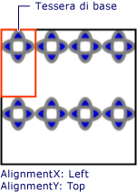
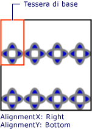

# Procedura: impostare l&#39;allineamento orizzontale e verticale di un TileBrush
In questo esempio viene illustrato come controllare l'allineamento orizzontale e verticale del contenuto in un elemento affiancato.  Per controllare l'allineamento orizzontale e verticale di un oggetto <xref:System.Windows.Media.TileBrush>, utilizzare le relative proprietà <xref:System.Windows.Media.TileBrush.AlignmentX%2A> e <xref:System.Windows.Media.TileBrush.AlignmentY%2A>.  
  
 Le proprietà <xref:System.Windows.Media.TileBrush.AlignmentX%2A> e <xref:System.Windows.Media.TileBrush.AlignmentY%2A> di un oggetto <xref:System.Windows.Media.TileBrush> vengono utilizzate quando vengono soddisfatte le condizioni seguenti:  
  
-   Il valore della proprietà <xref:System.Windows.Media.TileBrush.Stretch%2A> è <xref:System.Windows.Media.Stretch> o <xref:System.Windows.Media.Stretch> e le proprietà <xref:System.Windows.Media.TileBrush.Viewbox%2A> e <xref:System.Windows.Media.TileBrush.Viewport%2A> presentano [proporzioni](GTMT) diverse.  
  
-   Il valore della proprietà <xref:System.Windows.Media.TileBrush.Stretch%2A> è <xref:System.Windows.Media.Stretch> e le proprietà <xref:System.Windows.Media.TileBrush.Viewbox%2A> e <xref:System.Windows.Media.TileBrush.Viewport%2A> presentano dimensioni diverse.  
  
## Esempio  
 Nell'esempio riportato di seguito viene allineato il contenuto di un oggetto <xref:System.Windows.Media.DrawingBrush> che è un tipo di <xref:System.Windows.Media.TileBrush>, all'angolo superiore sinistro del relativo elemento affiancato.  Per allineare il contenuto, nell'esempio viene impostata la proprietà <xref:System.Windows.Media.TileBrush.AlignmentX%2A> dell'oggetto <xref:System.Windows.Media.DrawingBrush> su <xref:System.Windows.Media.AlignmentX> e la proprietà <xref:System.Windows.Media.TileBrush.AlignmentY%2A> su <xref:System.Windows.Media.AlignmentY>.  Questo esempio produce l'output che segue.  
  
   
TileBrush con contenuto allineato all'angolo superiore sinistro  
  
 [!code-csharp[brushoverviewexamples_snip#TileBrushTopLeftAlignmentInline](../../../../samples/snippets/csharp/VS_Snippets_Wpf/BrushOverviewExamples_snip/CSharp/TileBrushAlignmentExample.cs#tilebrushtopleftalignmentinline)]
 [!code-vb[brushoverviewexamples_snip#TileBrushTopLeftAlignmentInline](../../../../samples/snippets/visualbasic/VS_Snippets_Wpf/BrushOverviewExamples_snip/visualbasic/tilebrushalignmentexample.vb#tilebrushtopleftalignmentinline)]
 [!code-xml[brushoverviewexamples_snip#TileBrushTopLeftAlignmentInline](../../../../samples/snippets/xaml/VS_Snippets_Wpf/BrushOverviewExamples_snip/XAML/TileBrushAlignmentExample.xaml#tilebrushtopleftalignmentinline)]  
  
## Esempio  
 Nell'esempio successivo viene allineato il contenuto di un oggetto <xref:System.Windows.Media.DrawingBrush> all'angolo inferiore destro del relativo elemento affiancato impostando la proprietà <xref:System.Windows.Media.TileBrush.AlignmentX%2A> su <xref:System.Windows.Media.AlignmentX> e la proprietà <xref:System.Windows.Media.TileBrush.AlignmentY%2A> su <xref:System.Windows.Media.AlignmentY>.  Nell'esempio viene prodotto il seguente output.  
  
   
TileBrush con contenuto allineato all'angolo inferiore destro  
  
 [!code-csharp[brushoverviewexamples_snip#TileBrushBottomRightAlignmentInline](../../../../samples/snippets/csharp/VS_Snippets_Wpf/BrushOverviewExamples_snip/CSharp/TileBrushAlignmentExample.cs#tilebrushbottomrightalignmentinline)]
 [!code-vb[brushoverviewexamples_snip#TileBrushBottomRightAlignmentInline](../../../../samples/snippets/visualbasic/VS_Snippets_Wpf/BrushOverviewExamples_snip/visualbasic/tilebrushalignmentexample.vb#tilebrushbottomrightalignmentinline)]
 [!code-xml[brushoverviewexamples_snip#TileBrushBottomRightAlignmentInline](../../../../samples/snippets/xaml/VS_Snippets_Wpf/BrushOverviewExamples_snip/XAML/TileBrushAlignmentExample.xaml#tilebrushbottomrightalignmentinline)]  
  
## Esempio  
 Nell'esempio successivo viene allineato il contenuto di un oggetto <xref:System.Windows.Media.DrawingBrush> all'angolo superiore sinistro del relativo elemento affiancato impostando la proprietà <xref:System.Windows.Media.TileBrush.AlignmentX%2A> su <xref:System.Windows.Media.AlignmentX> e la proprietà <xref:System.Windows.Media.TileBrush.AlignmentY%2A> su <xref:System.Windows.Media.AlignmentY>.  Vengono inoltre impostati <xref:System.Windows.Media.TileBrush.Viewport%2A> e <xref:System.Windows.Media.TileBrush.TileMode%2A> dell'oggetto <xref:System.Windows.Media.DrawingBrush> affinché producano un modello di elementi affiancati.  Nell'esempio viene prodotto il seguente output.  
  
   
Modello di elementi affiancati con contenuto allineato all'elemento base in alto a sinistra  
  
 Nella figura viene evidenziato un elemento base per illustrare in che modo viene allineato il contenuto.  Si noti che l'impostazione della proprietà <xref:System.Windows.Media.TileBrush.AlignmentX%2A> non ha effetto poiché il contenuto dell'oggetto <xref:System.Windows.Media.DrawingBrush> riempie completamente l'elemento base in orizzontale.  
  
 [!code-csharp[brushoverviewexamples_snip#TileBrushTopLeftAlignmentTiledInline](../../../../samples/snippets/csharp/VS_Snippets_Wpf/BrushOverviewExamples_snip/CSharp/TileBrushAlignmentExample.cs#tilebrushtopleftalignmenttiledinline)]
 [!code-vb[brushoverviewexamples_snip#TileBrushTopLeftAlignmentTiledInline](../../../../samples/snippets/visualbasic/VS_Snippets_Wpf/BrushOverviewExamples_snip/visualbasic/tilebrushalignmentexample.vb#tilebrushtopleftalignmenttiledinline)]
 [!code-xml[brushoverviewexamples_snip#TileBrushTopLeftAlignmentTiledInline](../../../../samples/snippets/xaml/VS_Snippets_Wpf/BrushOverviewExamples_snip/XAML/TileBrushAlignmentExample.xaml#tilebrushtopleftalignmenttiledinline)]  
  
## Esempio  
 Nell'esempio finale viene allineato il contenuto di un oggetto <xref:System.Windows.Media.DrawingBrush> affiancato all'angolo inferiore destro del relativo elemento base impostando la proprietà <xref:System.Windows.Media.TileBrush.AlignmentX%2A> su <xref:System.Windows.Media.AlignmentX> e la proprietà <xref:System.Windows.Media.TileBrush.AlignmentY%2A> su <xref:System.Windows.Media.AlignmentY>.  Nell'esempio viene prodotto il seguente output.  
  
   
Modello di elementi affiancati con contenuto allineato all'elemento base in basso a destra  
  
 Anche in questo caso l'impostazione della proprietà <xref:System.Windows.Media.TileBrush.AlignmentX%2A> non ha effetto poiché il contenuto dell'oggetto <xref:System.Windows.Media.DrawingBrush> riempie completamente l'elemento base in orizzontale.  
  
 [!code-csharp[brushoverviewexamples_snip#TileBrushBottomRightAlignmentInline](../../../../samples/snippets/csharp/VS_Snippets_Wpf/BrushOverviewExamples_snip/CSharp/TileBrushAlignmentExample.cs#tilebrushbottomrightalignmentinline)]
 [!code-vb[brushoverviewexamples_snip#TileBrushBottomRightAlignmentInline](../../../../samples/snippets/visualbasic/VS_Snippets_Wpf/BrushOverviewExamples_snip/visualbasic/tilebrushalignmentexample.vb#tilebrushbottomrightalignmentinline)]
 [!code-xml[brushoverviewexamples_snip#TileBrushBottomRightAlignmentInline](../../../../samples/snippets/xaml/VS_Snippets_Wpf/BrushOverviewExamples_snip/XAML/TileBrushAlignmentExample.xaml#tilebrushbottomrightalignmentinline)]  
  
 Negli esempi vengono utilizzati oggetti <xref:System.Windows.Media.DrawingBrush> per illustrare le modalità di utilizzo delle proprietà <xref:System.Windows.Media.TileBrush.AlignmentX%2A> e <xref:System.Windows.Media.TileBrush.AlignmentY%2A>.  Queste proprietà si comportano in modo identico per tutti i pennelli di elementi affiancati: <xref:System.Windows.Media.DrawingBrush>, <xref:System.Windows.Media.ImageBrush> e <xref:System.Windows.Media.VisualBrush>.  Per ulteriori informazioni sui pennelli di elementi affiancati, vedere [Disegnare con oggetti Image, Drawing e Visual](../../../../docs/framework/wpf/graphics-multimedia/painting-with-images-drawings-and-visuals.md).  
  
## Vedere anche  
 <xref:System.Windows.Media.DrawingBrush>   
 <xref:System.Windows.Media.ImageBrush>   
 <xref:System.Windows.Media.VisualBrush>   
 [Disegnare con oggetti Image, Drawing e Visual](../../../../docs/framework/wpf/graphics-multimedia/painting-with-images-drawings-and-visuals.md)