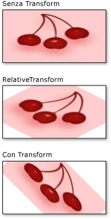

# Procedura: trasformare un oggetto Brush
In questo esempio viene illustrato come trasformare gli oggetti <xref:System.Windows.Media.Brush> utilizzando le due proprietà di trasformazione <xref:System.Windows.Media.Brush.RelativeTransform%2A> e <xref:System.Windows.Media.Brush.Transform%2A>.  
  
 Negli esempi seguenti viene utilizzato un oggetto <xref:System.Windows.Media.RotateTransform> per ruotare di 45 gradi il contenuto di un oggetto <xref:System.Windows.Media.ImageBrush>.  
  
 Nell'immagine seguente è illustrato l'oggetto <xref:System.Windows.Media.ImageBrush> senza <xref:System.Windows.Media.RotateTransform>, con <xref:System.Windows.Media.RotateTransform> applicato alla proprietà <xref:System.Windows.Media.Brush.RelativeTransform%2A> e con <xref:System.Windows.Media.RotateTransform> applicato alla proprietà <xref:System.Windows.Media.Brush.Transform%2A>.  
  
   
  
## Esempio  
 Nel primo esempio viene applicato un oggetto <xref:System.Windows.Media.RotateTransform> alla proprietà <xref:System.Windows.Media.Brush.RelativeTransform%2A> di un oggetto <xref:System.Windows.Media.ImageBrush>.  Le proprietà <xref:System.Windows.Media.RotateTransform.CenterX%2A> e <xref:System.Windows.Media.RotateTransform.CenterY%2A> di un oggetto <xref:System.Windows.Media.RotateTransform> sono entrambe impostate su 0,5 che è la coordinata relativa del punto centrale di questo contenuto.  Di conseguenza, il contenuto <xref:System.Windows.Media.ImageBrush> ruota intorno al relativo centro.  
  
 [!code-csharp[BrushesIntroduction_snip#ImageBrushRelativeTransformExample](../../../../samples/snippets/csharp/VS_Snippets_Wpf/BrushesIntroduction_snip/CSharp/BrushTransformExample.cs#imagebrushrelativetransformexample)]
 [!code-vb[BrushesIntroduction_snip#ImageBrushRelativeTransformExample](../../../../samples/snippets/visualbasic/VS_Snippets_Wpf/BrushesIntroduction_snip/visualbasic/brushtransformexample.vb#imagebrushrelativetransformexample)]
 [!code-xml[BrushesIntroduction_snip#ImageBrushRelativeTransformExample](../../../../samples/snippets/xaml/VS_Snippets_Wpf/BrushesIntroduction_snip/XAML/BrushTransformExample.xaml#imagebrushrelativetransformexample)]  
  
 Anche nel secondo esempio viene applicato un oggetto <xref:System.Windows.Media.RotateTransform> a un oggetto <xref:System.Windows.Media.ImageBrush>, ma viene utilizzata la proprietà <xref:System.Windows.Media.Brush.Transform%2A> anziché la proprietà <xref:System.Windows.Media.Brush.RelativeTransform%2A>.  
  
 Per ruotare il pennello intorno al relativo centro, le proprietà <xref:System.Windows.Media.RotateTransform.CenterX%2A> e <xref:System.Windows.Media.RotateTransform.CenterY%2A> dell'oggetto <xref:System.Windows.Media.RotateTransform> vengono impostate su coordinate assolute.  Poiché il pennello disegna un rettangolo di 175 per 90 [pixel](GTMT), il punto centrale del rettangolo è \(87,5, 45\).  
  
 [!code-csharp[BrushesIntroduction_snip#ImageBrushTransformExample](../../../../samples/snippets/csharp/VS_Snippets_Wpf/BrushesIntroduction_snip/CSharp/BrushTransformExample.cs#imagebrushtransformexample)]
 [!code-vb[BrushesIntroduction_snip#ImageBrushTransformExample](../../../../samples/snippets/visualbasic/VS_Snippets_Wpf/BrushesIntroduction_snip/visualbasic/brushtransformexample.vb#imagebrushtransformexample)]
 [!code-xml[BrushesIntroduction_snip#ImageBrushTransformExample](../../../../samples/snippets/xaml/VS_Snippets_Wpf/BrushesIntroduction_snip/XAML/BrushTransformExample.xaml#imagebrushtransformexample)]  
  
 Per una descrizione del funzionamento delle proprietà <xref:System.Windows.Media.Brush.RelativeTransform%2A> e <xref:System.Windows.Media.Brush.Transform%2A>, vedere [Cenni preliminari sulle proprietà di trasformazione Brush](../../../../docs/framework/wpf/graphics-multimedia/brush-transformation-overview.md).  
  
 Per l'esempio completo, vedere [Esempio Brush](http://go.microsoft.com/fwlink/?LinkID=159973) \(la pagina potrebbe essere in inglese\).  Per ulteriori informazioni sui pennelli, vedere [Cenni sul disegno con colori a tinta unita e sfumature](../../../../docs/framework/wpf/graphics-multimedia/painting-with-solid-colors-and-gradients-overview.md).  
  
## Vedere anche  
 [Cenni preliminari sulle proprietà di trasformazione Brush](../../../../docs/framework/wpf/graphics-multimedia/brush-transformation-overview.md)   
 [Cenni sul disegno con colori a tinta unita e sfumature](../../../../docs/framework/wpf/graphics-multimedia/painting-with-solid-colors-and-gradients-overview.md)   
 [Cenni preliminari sulle trasformazioni](../../../../docs/framework/wpf/graphics-multimedia/transforms-overview.md)