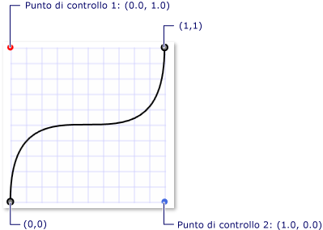
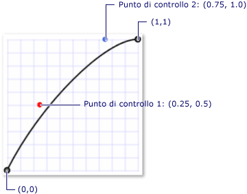

# Cenni preliminari sulle animazioni con fotogrammi chiave
In questo argomento vengono introdotte le animazioni con fotogrammi chiave.  Le animazioni con fotogrammi chiave consentono di utilizzare più di due valori di destinazione e di controllare il metodo di interpolazione dell'animazione.  
  
 Di seguito sono elencate le diverse sezioni di questo argomento.  
  
   
-   [Prerequisiti](#prerequisites)  
  
-   [Utilizzo delle animazioni con fotogrammi chiave](#keyframeanimations)  
  
-   [Argomenti correlati](#seeAlsoToggle)  
  
   
## Prerequisiti  
 Per comprendere questi cenni preliminari è necessario avere acquisito familiarità con i concetti di animazione e sequenza temporale di [!INCLUDE[TLA#tla_winclient](../../../../includes/tlasharptla-winclient-md.md)].  Per un'introduzione alle animazioni, vedere [Cenni preliminari sull'animazione](../../../../docs/framework/wpf/graphics-multimedia/animation-overview.md). Consente inoltre di acquisire familiarità con le animazioni From\/To\/By.  Per ulteriori informazioni, vedere [Cenni preliminari sulle animazioni From\/To\/By](../../../../docs/framework/wpf/graphics-multimedia/from-to-by-animations-overview.md).  
  
   
## Definizione di animazione con fotogrammi chiave  
 Analogamente a un'animazione From\/To\/By, un'animazione con fotogrammi chiave anima il valore di una proprietà di destinazione.  Crea una transizione tra i relativi valori di destinazione sulla proprietà <xref:System.Windows.Media.Animation.Timeline.Duration%2A>.  Tuttavia, se un'animazione From\/To\/by crea una transizione tra due valori, una singola animazione con fotogrammi chiave può creare transizioni tra qualsiasi numero di valori di destinazione.  A differenza di un'animazione From\/To\/By, un'animazione con fotogrammi chiave non presenta alcuna proprietà From, To e By con la quale impostare i relativi valori di destinazione.  I valori di destinazione di un'animazione con fotogrammi chiave vengono descritti utilizzando oggetti fotogrammi chiave \(da qui il termine "animazione con fotogrammi chiave"\).  Per specificare i valori di destinazione dell'animazione, vengono creati oggetti fotogrammi chiave da aggiungere alla raccolta <xref:System.Windows.Media.Animation.DoubleAnimationUsingKeyFrames.KeyFrames%2A> dell'animazione.  Quando viene eseguita l'animazione, viene creata una transizione tra i fotogrammi specificati.  
  
 Oltre a supportare più valori di destinazione, alcuni metodi basati su fotogrammi chiave supportano più metodi di interpolazione.  Il metodo di interpolazione di un'animazione definisce la modalità di transizione da un valore a quello successivo.  Esistono tre tipi di interpolazione: [discreta](GTMT), [lineare](GTMT)e [spline](GTMT).  
  
 Per eseguire un'animazione con fotogrammi chiave, è necessario completare i passaggi riportati di seguito.  
  
-   Dichiarare l'animazione e specificare la relativa proprietà <xref:System.Windows.Media.Animation.Timeline.Duration%2A>, come se si trattasse di un'animazione From\/To\/By.  
  
-   Per ogni valore di destinazione, creare un fotogramma chiave del tipo appropriato, impostarne il valore e l'oggetto <xref:System.Windows.Media.Animation.KeyTime>, quindi aggiungerlo alla raccolta <xref:System.Windows.Media.Animation.DoubleAnimationUsingKeyFrames.KeyFrames%2A> dell'animazione.  
  
-   Associare l'animazione a una proprietà, come se si trattasse di un'animazione From\/To\/By.  Per ulteriori informazioni sull'applicazione di un'animazione a una proprietà utilizzando uno storyboard, vedere [Cenni preliminari sugli storyboard](../../../../docs/framework/wpf/graphics-multimedia/storyboards-overview.md).  
  
 Nell'esempio riportato di seguito viene utilizzato un oggetto <xref:System.Windows.Media.Animation.DoubleAnimationUsingKeyFrames> per animare un elemento <xref:System.Windows.Shapes.Rectangle> in quattro diverse posizioni.  
  
 <!-- TODO: review snippet reference [!code-xml[keyframes_ovw_snip#BasicKeyFrameExampleWholePage](../../../../samples/snippets/csharp/VS_Snippets_Wpf/keyframes_ovw_snip/CS/KeyFramesIntroduction.xaml#basickeyframeexamplewholepage)]  -->
 <!-- TODO: review snippet reference [!code-xml[keyframes_ovw_snip#BasicKeyFrameExampleWholePage](../../../../samples/snippets/xaml/VS_Snippets_Wpf/keyframes_ovw_snip/XAML/KeyFramesIntroduction.xaml#basickeyframeexamplewholepage)]  -->  
  
 Analogamente a un'animazione From\/To\/By, è possibile applicare un'animazione con fotogrammi chiave a una proprietà tramite uno <xref:System.Windows.Media.Animation.Storyboard> nel markup e nel codice oppure tramite il metodo <xref:System.Windows.Media.Animation.Animatable.BeginAnimation%2A> nel codice.  È inoltre possibile utilizzare un'animazione con fotogrammi chiave per creare un oggetto <xref:System.Windows.Media.Animation.AnimationClock> e applicarlo a una o più proprietà.  Per ulteriori informazioni sui diversi metodi per l'applicazione delle animazioni, vedere [Cenni preliminari sulle tecniche di animazione delle proprietà](../../../../docs/framework/wpf/graphics-multimedia/property-animation-techniques-overview.md).  
  
   
## Tipi di animazione con fotogrammi chiave  
 Poiché le animazioni generano valori di proprietà, sono disponibili tipi di animazione diversi per i diversi tipi di proprietà.  Per animare una proprietà che accetta un valore <xref:System.Double>, ad esempio la proprietà <xref:System.Windows.FrameworkElement.Width%2A> di un elemento, si utilizza un'animazione che produce valori <xref:System.Double>.  Per animare una proprietà che accetta <xref:System.Windows.Point>, utilizzare un'animazione che produce valori <xref:System.Windows.Point> e così via.  
  
 Le classi di animazione con fotogrammi chiave appartengono allo spazio dei nomi <xref:System.Windows.Media.Animation> e seguono la convenzione di denominazione indicata di seguito:  
  
 *\<Tipo\>* `AnimationUsingKeyFrames`  
  
 Dove *\<Tipo\>* è il tipo di valore animato dalla classe.  
  
 In [!INCLUDE[TLA2#tla_winclient](../../../../includes/tla2sharptla-winclient-md.md)] vengono fornite le classi di animazione con fotogrammi chiave riportate di seguito.  
  
|Tipo proprietà|Classe di animazione From\/To\/By corrispondente|Metodi di interpolazione supportati|  
|--------------------|------------------------------------------------------|-----------------------------------------|  
|<xref:System.Boolean>|<xref:System.Windows.Media.Animation.BooleanAnimationUsingKeyFrames>|Discreta|  
|<xref:System.Byte>|<xref:System.Windows.Media.Animation.ByteAnimationUsingKeyFrames>|Discreta, lineare, spline|  
|<xref:System.Windows.Media.Color>|<xref:System.Windows.Media.Animation.ColorAnimationUsingKeyFrames>|Discreta, lineare, spline|  
|<xref:System.Decimal>|<xref:System.Windows.Media.Animation.DecimalAnimationUsingKeyFrames>|Discreta, lineare, spline|  
|<xref:System.Double>|<xref:System.Windows.Media.Animation.DoubleAnimationUsingKeyFrames>|Discreta, lineare, spline|  
|<xref:System.Int16>|<xref:System.Windows.Media.Animation.Int16AnimationUsingKeyFrames>|Discreta, lineare, spline|  
|<xref:System.Int32>|<xref:System.Windows.Media.Animation.Int32AnimationUsingKeyFrames>|Discreta, lineare, spline|  
|<xref:System.Int64>|<xref:System.Windows.Media.Animation.Int64AnimationUsingKeyFrames>|Discreta, lineare, spline|  
|<xref:System.Windows.Media.Matrix>|<xref:System.Windows.Media.Animation.MatrixAnimationUsingKeyFrames>|Discreta|  
|<xref:System.Object>|<xref:System.Windows.Media.Animation.ObjectAnimationUsingKeyFrames>|Discreta|  
|<xref:System.Windows.Point>|<xref:System.Windows.Media.Animation.PointAnimationUsingKeyFrames>|Discreta, lineare, spline|  
|<xref:System.Windows.Media.Media3D.Quaternion>|<xref:System.Windows.Media.Animation.QuaternionAnimationUsingKeyFrames>|Discreta, lineare, spline|  
|<xref:System.Windows.Rect>|<xref:System.Windows.Media.Animation.RectAnimationUsingKeyFrames>|Discreta, lineare, spline|  
|<xref:System.Windows.Media.Media3D.Rotation3D>|<xref:System.Windows.Media.Animation.Rotation3DAnimationUsingKeyFrames>|Discreta, lineare, spline|  
|<xref:System.Single>|<xref:System.Windows.Media.Animation.SingleAnimationUsingKeyFrames>|Discreta, lineare, spline|  
|<xref:System.String>|<xref:System.Windows.Media.Animation.StringAnimationUsingKeyFrames>|Discreta|  
|<xref:System.Windows.Size>|<xref:System.Windows.Media.Animation.SizeAnimationUsingKeyFrames>|Discreta, lineare, spline|  
|<xref:System.Windows.Thickness>|<xref:System.Windows.Media.Animation.ThicknessAnimationUsingKeyFrames>|Discreta, lineare, spline|  
|<xref:System.Windows.Media.Media3D.Vector3D>|<xref:System.Windows.Media.Animation.Vector3DAnimationUsingKeyFrames>|Discreta, lineare, spline|  
|<xref:System.Windows.Vector>|<xref:System.Windows.Media.Animation.VectorAnimationUsingKeyFrames>|Discreta, lineare, spline|  
  
   
## Valori di destinazione \(fotogrammi chiave\) e chiavi temporali  
 Proprio come esistono tipi diversi di animazioni con fotogrammi chiave per animare tipi di proprietà diversi, esistono anche tipi diversi di fotogramma chiave: uno per ogni tipo di valore animato e metodo di interpolazione supportato.  I tipi di fotogrammi chiave seguono la convenzione di denominazione indicata di seguito:  
  
 *\<Metodo di interpolazione\>\<Tipo\>* `KeyFrame`  
  
 Dove *\<Metodo di interpolazione\>* è il metodo di interpolazione utilizzato dal fotogramma chiave e *\<Tipo\>* è il tipo di valore animato dalla classe.  Un'animazione con fotogrammi chiave che supporta tutti e tre i metodi di interpolazione fornisce tre tipi di fotogramma chiave utilizzabili.  È ad esempio possibile utilizzare tre tipi di fotogramma chiave con un <xref:System.Windows.Media.Animation.DoubleAnimationUsingKeyFrames>: <xref:System.Windows.Media.Animation.DiscreteDoubleKeyFrame>, <xref:System.Windows.Media.Animation.LinearDoubleKeyFrame>e <xref:System.Windows.Media.Animation.SplineDoubleKeyFrame>.  \(I metodi di interpolazione sono descritti in dettaglio in una sezione successiva.\)  
  
 Lo scopo principale di un fotogramma chiave consiste nello specificare una proprietà <xref:System.Windows.Media.Animation.IKeyFrame.KeyTime%2A> e una proprietà <xref:System.Windows.Media.Animation.IKeyFrame.Value%2A>.  Ogni tipo di fotogramma chiave fornisce queste due proprietà.  
  
-   La proprietà <xref:System.Windows.Media.Animation.IKeyFrame.Value%2A> specifica il valore di destinazione per quel fotogramma chiave.  
  
-   La proprietà <xref:System.Windows.Media.Animation.IKeyFrame.KeyTime%2A> specifica quando viene raggiunta la proprietà <xref:System.Windows.Media.Animation.IKeyFrame.Value%2A> di un fotogramma chiave \(all'interno della proprietà <xref:System.Windows.Media.Animation.Timeline.Duration%2A>dell'animazione\).  
  
 Al suo avvio, un'animazione con fotogrammi chiave scorre i relativi fotogrammi chiave nell'ordine definito dalle proprietà <xref:System.Windows.Media.Animation.IKeyFrame.KeyTime%2A>.  
  
-   Se all'ora 0 non è presente alcun fotogramma chiave, viene creata una transizione tra il valore corrente della proprietà di destinazione e la proprietà <xref:System.Windows.Media.Animation.IKeyFrame.Value%2A> del primo fotogramma chiave. In caso contrario, il valore di output dell'animazione diventa il valore del primo fotogramma chiave.  
  
-   Viene creata una transizione tra la proprietà <xref:System.Windows.Media.Animation.IKeyFrame.Value%2A> del primo e del secondo fotogramma chiave tramite il metodo di interpolazione specificato dal secondo fotogramma chiave.  La transizione ha inizio in corrispondenza della proprietà <xref:System.Windows.Media.Animation.IKeyFrame.KeyTime%2A> del primo fotogramma chiave e termina al raggiungimento della proprietà <xref:System.Windows.Media.Animation.IKeyFrame.KeyTime%2A> del secondo fotogramma chiave.  
  
-   L'animazione continua con la creazione di transizioni tra ogni fotogramma chiave successivo e quello precedente.  
  
-   Viene infine creata una transizione al valore del fotogramma chiave con la chiave temporale più elevata uguale o inferiore alla proprietà <xref:System.Windows.Media.Animation.Timeline.Duration%2A> dell'animazione.  
  
 Se la proprietà <xref:System.Windows.Media.Animation.Timeline.Duration%2A> dell'animazione è <xref:System.Windows.Duration.Automatic%2A> oppure la relativa proprietà <xref:System.Windows.Media.Animation.Timeline.Duration%2A> è uguale all'ora dell'ultimo fotogramma chiave, l'animazione viene terminata.  In caso contrario, se la proprietà <xref:System.Windows.Duration> dell'animazione è maggiore della chiave temporale dell'ultimo fotogramma chiave, l'animazione mantiene il valore del fotogramma chiave finché non raggiunge la fine di <xref:System.Windows.Duration>.  Come tutte le animazioni, un'animazione con fotogrammi chiave utilizza la proprietà <xref:System.Windows.Media.Animation.Timeline.FillBehavior%2A> per determinare se mantiene il valore finale fino alla fine del periodo attivo.  Per ulteriori informazioni, vedere [Cenni preliminari sui comportamenti temporali](../../../../docs/framework/wpf/graphics-multimedia/timing-behaviors-overview.md).  
  
 Nell'esempio di codice riportato di seguito viene utilizzato l'oggetto <xref:System.Windows.Media.Animation.DoubleAnimationUsingKeyFrames> definito nel precedente esempio per illustrare il funzionamento delle proprietà <xref:System.Windows.Media.Animation.IKeyFrame.Value%2A> e <xref:System.Windows.Media.Animation.IKeyFrame.KeyTime%2A>.  
  
-   Il primo fotogramma chiave imposta immediatamente il valore di output dell'animazione su 0.  
  
-   Il secondo fotogramma chiave aggiunge un'animazione da 0 a 350.  Viene avviato dopo la fine del primo fotogramma chiave \(0 secondi\), viene riprodotto per 2 secondi e quindi viene terminato alle 0:0:2.  
  
-   Il terzo fotogramma chiave aggiunge un'animazione da 350 a 50.  Viene avviato dopo la fine del secondo fotogramma chiave \(2 secondi\), viene riprodotto per 5 secondi e quindi viene terminato alle 0:0:7.  
  
-   Il quarto fotogramma chiave aggiunge un'animazione da 50 a 200.  Viene avviato dopo la fine del terzo fotogramma chiave \(7 secondi\), viene riprodotto per 1 secondo e quindi viene terminato alle 0:0:8.  
  
-   Poiché la proprietà <xref:System.Windows.Media.Animation.Timeline.Duration%2A> dell'animazione era stata impostata su 10 secondi, l'animazione mantiene il suo valore finale per due secondi prima di terminare alle 0:0:10.  
  
 <!-- TODO: review snippet reference [!code-xml[keyframes_ovw_snip#BasicKeyFrameExampleWholePage](../../../../samples/snippets/csharp/VS_Snippets_Wpf/keyframes_ovw_snip/CS/KeyFramesIntroduction.xaml#basickeyframeexamplewholepage)]  -->
 <!-- TODO: review snippet reference [!code-xml[keyframes_ovw_snip#BasicKeyFrameExampleWholePage](../../../../samples/snippets/xaml/VS_Snippets_Wpf/keyframes_ovw_snip/XAML/KeyFramesIntroduction.xaml#basickeyframeexamplewholepage)]  -->  
  
   
## Metodi di interpolazione  
 Nelle sezioni precedenti si è affermato che alcune animazioni con fotogrammi chiave supportano più metodi di interpolazione.  L'interpolazione di un'animazione descrive la modalità di transizione di un'animazione tra valori per tutta la sua durata.  Selezionando il tipo di fotogramma chiave da utilizzare con l'animazione, è possibile definire il metodo di interpolazione per quel segmento di fotogrammi chiave.  Sono disponibili tre tipi di metodi di interpolazione: lineare, discreta e spline.  
  
### Interpolazione lineare  
 Con l'[interpolazione lineare](GTMT), l'animazione avanza a una velocità costante della durata del segmento.  Ad esempio, se un segmento di fotogramma chiave esegue una transizione da 0 a 10 per 5 secondi, verranno restituiti i seguenti valori alle ore specificate:  
  
|Ora|Valore di output|  
|---------|----------------------|  
|0|0|  
|1|2|  
|2|4|  
|3|6|  
|4|8|  
|4.25|8.5|  
|4.5|9|  
|5|10|  
  
### Interpolazione discreta  
 Con l'[interpolazione discreta](GTMT), la funzione di animazione passa da un valore a quello successivo senza interpolazione.  Se un segmento di fotogramma chiave esegue una transizione da 0 a 10 per 5 secondi, verranno restituiti i seguenti valori alle ore specificate:  
  
|Ora|Valore di output|  
|---------|----------------------|  
|0|0|  
|1|0|  
|2|0|  
|3|0|  
|4|0|  
|4.25|0|  
|4.5|0|  
|5|10|  
  
 Si noti come l'animazione non modifichi il suo valore di output fino alla fine della durata del segmento.  
  
 L'[interpolazione spline](GTMT) è più complessa.  Verrà descritta nella sezione successiva.  
  
   
### Interpolazione spline  
 L'interpolazione spline può essere utilizzata per realizzare effetti più realistici in termini di tempo.  Perché le animazioni vengono spesso utilizzate per simulare effetti riscontrabili nel mondo reale, gli sviluppatori devono poter controllare in modo accurato l'accelerazione e la decelerazione degli oggetti e modificare con precisione i segmenti temporali.  I fotogrammi chiave spline consentono di utilizzare l'interpolazione spline per le animazioni.  Con altri fotogrammi chiave, si specificano le proprietà <xref:System.Windows.Media.Animation.IKeyFrame.Value%2A> e <xref:System.Windows.Media.Animation.IKeyFrame.KeyTime%2A>.  Con un fotogramma chiave spline, si specifica anche la proprietà <xref:System.Windows.Media.Animation.SplineDoubleKeyFrame.KeySpline%2A>.  Nell'esempio riportato di seguito viene illustrato un singolo fotogramma chiave spline per un oggetto <xref:System.Windows.Media.Animation.DoubleAnimationUsingKeyFrames>.  Si noti la proprietà <xref:System.Windows.Media.Animation.KeySpline>: è ciò che rende diverso un fotogramma chiave spline da altri tipi di fotogrammi chiave.  
  
 <!-- TODO: review snippet reference [!code-xml[keyframes_ovw_snip#SingleSplineKeyFrameExample](../../../../samples/snippets/csharp/VS_Snippets_Wpf/keyframes_ovw_snip/CS/InterpolationMethodsExample.xaml#singlesplinekeyframeexample)]  -->
 <!-- TODO: review snippet reference [!code-xml[keyframes_ovw_snip#SingleSplineKeyFrameExample](../../../../samples/snippets/xaml/VS_Snippets_Wpf/keyframes_ovw_snip/XAML/InterpolationMethodsExample.xaml#singlesplinekeyframeexample)]  -->  
  
 Una [curva di Bezier cubica](GTMT) è definita da un punto iniziale, da un punto finale e da due punti di controllo.  La proprietà <xref:System.Windows.Media.Animation.KeySpline> di un fotogramma chiave spline definisce i due punti di controllo di una curva di Bezier che si estende da \(0,0\) a \(1,1\).  Il primo punto di controllo determina il fattore di curvatura della prima parte della curva di Bezier, mentre il secondo punto di controllo stabilisce il fattore di curvatura della seconda parte.  La curva risultante descrive la velocità di modifica di quel fotogramma chiave spline.  Più stretta è la curva, più elevata sarà la velocità con la quale il fotogramma chiave modifica i suoi valori.  Man mano che la curva diventa più larga, la velocità di modifica dei valori diminuisce.  
  
 È possibile utilizzare l'oggetto <xref:System.Windows.Media.Animation.KeySpline> per simulare traiettorie fisiche come una cascata d'acqua o un rimbalzo di pallone oppure applicare altri effetti di "uscita o entrata a scorrimento" per dare movimento alle animazioni.  Per effetti che richiedono l'interazione dell'utente come dissolvenze sullo sfondo o riassociazione del pulsante di controllo, è possibile applicare l'interpolazione spline per aumentare o diminuire in modo specifico la velocità di modifica di un'animazione.  
  
 Nell'esempio riportato di seguito viene specificato un oggetto <xref:System.Windows.Media.Animation.KeySpline> di 0,1 1,0 che crea la seguente curva di Bézier.  
  
   
Spline chiave con punti di controllo \(0,0, 1,0\) e \(1,0, 0,0\)  
  
 <!-- TODO: review snippet reference [!code-xml[keyframes_ovw_snip#SingleSplineKeyFrameExample](../../../../samples/snippets/csharp/VS_Snippets_Wpf/keyframes_ovw_snip/CS/InterpolationMethodsExample.xaml#singlesplinekeyframeexample)]  -->
 <!-- TODO: review snippet reference [!code-xml[keyframes_ovw_snip#SingleSplineKeyFrameExample](../../../../samples/snippets/xaml/VS_Snippets_Wpf/keyframes_ovw_snip/XAML/InterpolationMethodsExample.xaml#singlesplinekeyframeexample)]  -->  
  
 Questo fotogramma chiave si anima rapidamente all'avvio, rallenta e quindi riaccelera prima della fine.  
  
 Nell'esempio riportato di seguito viene specificato un oggetto <xref:System.Windows.Media.Animation.KeySpline> di 0,5,0,25 0,75,1,0 che crea la seguente curva di Bézier.  
  
   
Spline chiave con punti di controllo \(0,25, 0,5\) e \(0,75, 1,0\)  
  
 <!-- TODO: review snippet reference [!code-xml[keyframes_ovw_snip#SingleSplineKeyFrameExampleInline3](../../../../samples/snippets/csharp/VS_Snippets_Wpf/keyframes_ovw_snip/CS/InterpolationMethodsExample.xaml#singlesplinekeyframeexampleinline3)]  -->
 <!-- TODO: review snippet reference [!code-xml[keyframes_ovw_snip#SingleSplineKeyFrameExampleInline3](../../../../samples/snippets/xaml/VS_Snippets_Wpf/keyframes_ovw_snip/XAML/InterpolationMethodsExample.xaml#singlesplinekeyframeexampleinline3)]  -->  
  
 Poiché la curvatura del curva di Bézier cambia in modo irrilevante, questo fotogramma chiave si anima a una velocità quasi costante e rallenta leggermente verso la fine.  
  
 Nell'esempio riportato di seguito viene utilizzato un oggetto <xref:System.Windows.Media.Animation.DoubleAnimationUsingKeyFrames> per animare la posizione del rettangolo.  Poiché <xref:System.Windows.Media.Animation.DoubleAnimationUsingKeyFrames> utilizza gli oggetti <xref:System.Windows.Media.Animation.SplineDoubleKeyFrame>, la transizione tra ogni valore di fotogramma chiave utilizza l'interpolazione spline.  
  
 <!-- TODO: review snippet reference [!code-xml[keyframes_ovw_snip#SplinedInterpolationExample](../../../../samples/snippets/csharp/VS_Snippets_Wpf/keyframes_ovw_snip/CS/InterpolationMethodsExample.xaml#splinedinterpolationexample)]  -->
 <!-- TODO: review snippet reference [!code-xml[keyframes_ovw_snip#SplinedInterpolationExample](../../../../samples/snippets/xaml/VS_Snippets_Wpf/keyframes_ovw_snip/XAML/InterpolationMethodsExample.xaml#splinedinterpolationexample)]  -->  
  
 Poiché l'interpolazione spline può risultare di difficile comprensione, fare delle prove con le diverse impostazioni.  L'[esempio di animazione con spline chiave](http://go.microsoft.com/fwlink/?LinkID=160011) consente di modificare i valori della spline chiave e di osservarne gli effetti su un'animazione.  
  
   
### Utilizzo combinato dei metodi di interpolazione  
 È possibile utilizzare i fotogrammi chiave con tipi di interpolazione diversi in un'animazione con singolo fotogramma chiave.  Quando si susseguono animazioni con due fotogrammi chiave con interpolazioni diverse, il metodo di interpolazione del secondo fotogramma chiave viene utilizzato per creare la transizione dal primo valore al secondo.  
  
 Nell'esempio riportato di seguito, viene creato un <xref:System.Windows.Media.Animation.DoubleAnimationUsingKeyFrames> che utilizza l'interpolazione lineare, spline e discreta.  
  
 <!-- TODO: review snippet reference [!code-xml[keyframes_ovw_snip#ComboInterpolationExample](../../../../samples/snippets/csharp/VS_Snippets_Wpf/keyframes_ovw_snip/CS/InterpolationMethodsExample.xaml#combointerpolationexample)]  -->
 <!-- TODO: review snippet reference [!code-xml[keyframes_ovw_snip#ComboInterpolationExample](../../../../samples/snippets/xaml/VS_Snippets_Wpf/keyframes_ovw_snip/XAML/InterpolationMethodsExample.xaml#combointerpolationexample)]  -->  
  
   
## Ulteriori informazioni sulla durata e sulle chiavi temporali  
 Analogamente ad altre animazioni, le animazioni con fotogrammi chiave includono una proprietà <xref:System.Windows.Duration>.  Oltre a specificare la proprietà <xref:System.Windows.Duration> dell'animazione, è necessario specificare quale porzione di quella durata assegnare a ciascun fotogramma chiave.  A tale scopo, descrivere una proprietà <xref:System.Windows.Media.Animation.IKeyFrame.KeyTime%2A> per ognuno dei fotogrammi chiave dell'animazione.  La proprietà <xref:System.Windows.Media.Animation.IKeyFrame.KeyTime%2A> di ciascun fotogramma chiave specifica la fine di quel fotogramma.  
  
 La proprietà <xref:System.Windows.Media.Animation.IKeyFrame.KeyTime%2A> non consente di specificare la durata di riproduzione della chiave temporale.  La durata di riproduzione di un fotogramma chiave è determinata dalla fine del fotogramma chiave, da quella del fotogramma precedente e dalla duranta dell'animazione.  Le chiavi temporali possono essere specificate come valore temporale, come percentuale o come il valore speciale <xref:System.Windows.Media.Animation.KeyTime.Uniform%2A> o <xref:System.Windows.Media.Animation.KeyTime.Paced%2A>.  
  
 Nell'elenco riportato di seguito vengono descritti modi diversi di specificare le chiavi temporali.  
  
### Valori TimeSpan  
 È possibile utilizzare i valori <xref:System.TimeSpan> per specificare un valore <xref:System.Windows.Media.Animation.KeyTime>.  Il valore deve essere maggiore o uguale a 0 e inferiore o uguale alla durata dell'animazione.  Nell'esempio riportato di seguito viene illustrata un'animazione con una durata di 10 secondi e quattro fotogrammi chiave le cui chiavi temporali sono specificate come valori temporali.  
  
-   Il primo fotogramma chiave viene animato dal valore di base a 100 per i primi 3 secondi e viene terminato alle 0:0:03.  
  
-   Il secondo fotogramma chiave aggiunge un'animazione da 100 a 200.  Viene avviato dopo la fine del primo fotogramma chiave \(3 secondi\), viene riprodotto per 5 secondi e quindi viene terminato alle 0:0:8.  
  
-   Il terzo fotogramma chiave aggiunge un'animazione da 200 a 500.  Viene avviato dopo la fine del secondo fotogramma chiave \(8 secondi\), viene riprodotto per 1 secondo e quindi viene terminato alle 0:0:9.  
  
-   Il quarto fotogramma chiave aggiunge un'animazione da 500 a 600.  Viene avviato dopo la fine del terzo fotogramma chiave \(9 secondi\), viene riprodotto per 1 secondo e quindi viene terminato alle 0:0:10.  
  
 <!-- TODO: review snippet reference [!code-xml[keyframes_ovw_snip#TimeSpanKeyTimeExample](../../../../samples/snippets/csharp/VS_Snippets_Wpf/keyframes_ovw_snip/CS/KeyTimesExample.xaml#timespankeytimeexample)]  -->
 <!-- TODO: review snippet reference [!code-xml[keyframes_ovw_snip#TimeSpanKeyTimeExample](../../../../samples/snippets/xaml/VS_Snippets_Wpf/keyframes_ovw_snip/XAML/KeyTimesExample.xaml#timespankeytimeexample)]  -->  
  
### Valori percentuali  
 Un valore percentuale specifica che il fotogramma chiave viene terminato trascorso un determinato valore percentuale della proprietà <xref:System.Windows.Media.Animation.Timeline.Duration%2A> dell'animazione.  In [!INCLUDE[TLA2#tla_xaml](../../../../includes/tla2sharptla-xaml-md.md)] è possibile specificare la percentuale come un numero seguito dal simbolo `%`.  Nel codice, si utilizza il metodo <xref:System.Windows.Media.Animation.KeyTime.FromPercent%2A> e lo si passa all'oggetto <xref:System.Double> che indica la percentuale.  Il valore deve essere maggiore o uguale a 0 e minore o uguale a 100 percento.  Nell'esempio riportato di seguito viene illustrata un'animazione con una durata di 10 secondi e quattro fotogrammi chiave le cui chiavi temporali sono specificate come percentuali.  
  
-   Il primo fotogramma chiave viene animato dal valore di base a 100 per i primi 3 secondi e viene terminato alle 0:0:3.  
  
-   Il secondo fotogramma chiave aggiunge un'animazione da 100 a 200.  Viene avviato dopo la fine del primo fotogramma chiave \(3 secondi\), viene riprodotto per 5 secondi e quindi viene terminato alle 0:0:8 \(0,8 \* 10 \= 8\).  
  
-   Il terzo fotogramma chiave aggiunge un'animazione da 200 a 500.  Viene avviato dopo la fine del secondo fotogramma chiave \(8 secondi\), viene riprodotto per 1 secondo e quindi viene terminato alle 0:0:9 \(0,9 \* 10 \= 9\).  
  
-   Il quarto fotogramma chiave aggiunge un'animazione da 500 a 600.  Viene avviato dopo la fine del terzo fotogramma chiave \(9 secondi\), viene riprodotto per 1 secondo e quindi viene terminato alle 0:0:10 \(1 \* 10 \= 10\).  
  
 <!-- TODO: review snippet reference [!code-xml[keyframes_ovw_snip#PercentageKeyTimeExample](../../../../samples/snippets/csharp/VS_Snippets_Wpf/keyframes_ovw_snip/CS/KeyTimesExample.xaml#percentagekeytimeexample)]  -->
 <!-- TODO: review snippet reference [!code-xml[keyframes_ovw_snip#PercentageKeyTimeExample](../../../../samples/snippets/xaml/VS_Snippets_Wpf/keyframes_ovw_snip/XAML/KeyTimesExample.xaml#percentagekeytimeexample)]  -->  
  
### Valore speciale, Uniform  
 Utilizzare la proprietà <xref:System.Windows.Media.Animation.KeyTime.Uniform%2A> quando si desidera che ogni fotogramma chiave assuma la stessa quantità di tempo.  
  
 Una chiave temporale <xref:System.Windows.Media.Animation.KeyTime.Uniform%2A> divide equamente il tempo disponibile per il numero di fotogrammi chiave per determinare la fine di ogni fotogramma chiave.  Nell'esempio riportato di seguito viene illustrata un'animazione con una durata di 10 secondi e quattro fotogrammi chiave le cui chiavi temporali sono specificate come <xref:System.Windows.Media.Animation.KeyTime.Uniform%2A>.  
  
-   Il primo fotogramma chiave viene animato dal valore di base a 100 per i primi 2,5 secondi e viene terminato alle 0:0:2,5.  
  
-   Il secondo fotogramma chiave aggiunge un'animazione da 100 a 200.  Viene avviato dopo la fine del primo fotogramma chiave \(2,5 secondi\), viene riprodotto per circa 2,5 secondi e quindi viene terminato alle 0:0:5.  
  
-   Il terzo fotogramma chiave aggiunge un'animazione da 200 a 500.  Viene avviato dopo la fine del secondo fotogramma chiave \(5 secondi\), viene riprodotto per 2.5 secondi e quindi viene terminato alle 0:0:7.5.  
  
-   Il quarto fotogramma chiave aggiunge un'animazione da 500 a 600.  Viene avviato dopo la fine del secondo fotogramma chiave \(7,5 secondi\), viene riprodotto per 2,5 secondi e quindi viene terminato alle 0:0:1.  
  
 <!-- TODO: review snippet reference [!code-xml[keyframes_ovw_snip#UniformKeyTimeExample](../../../../samples/snippets/csharp/VS_Snippets_Wpf/keyframes_ovw_snip/CS/KeyTimesExample.xaml#uniformkeytimeexample)]  -->
 <!-- TODO: review snippet reference [!code-xml[keyframes_ovw_snip#UniformKeyTimeExample](../../../../samples/snippets/xaml/VS_Snippets_Wpf/keyframes_ovw_snip/XAML/KeyTimesExample.xaml#uniformkeytimeexample)]  -->  
  
### Valore speciale, Paced  
 Utilizzare la proprietà <xref:System.Windows.Media.Animation.KeyTime.Paced%2A> se si desidera che l'animazione presenti una velocità costante.  
  
 Una chiave temporale <xref:System.Windows.Media.Animation.KeyTime.Paced%2A> assegna il tempo disponibile secondo la lunghezza di ogni fotogramma chiave per determinare la durata di ogni fotogramma.  In questo modo, la velocità dell'animazione rimarrà costante.  Nell'esempio riportato di seguito viene illustrata un'animazione con una durata di 10 secondi e tre fotogrammi chiave le cui chiavi temporali sono specificate come <xref:System.Windows.Media.Animation.KeyTime.Paced%2A>.  
  
 <!-- TODO: review snippet reference [!code-xml[keyframes_ovw_snip#PacedKeyTimeExample](../../../../samples/snippets/csharp/VS_Snippets_Wpf/keyframes_ovw_snip/CS/KeyTimesExample.xaml#pacedkeytimeexample)]  -->
 <!-- TODO: review snippet reference [!code-xml[keyframes_ovw_snip#PacedKeyTimeExample](../../../../samples/snippets/xaml/VS_Snippets_Wpf/keyframes_ovw_snip/XAML/KeyTimesExample.xaml#pacedkeytimeexample)]  -->  
  
 Si noti che, se la chiave temporale dell'ultimo fotogramma chiave è <xref:System.Windows.Media.Animation.KeyTime.Paced%2A> o <xref:System.Windows.Media.Animation.KeyTime.Uniform%2A>, la chiave temporale risolta sarà impostata su 100 percento.  Se il primo fotogramma chiave di un'animazione a più fotogrammi presenta il valore speciale Paced, la relativa chiave temporale risolta sarà impostata su 0.  Se la raccolta di fotogrammi chiave contiene solo un singolo fotogramma chiave con valore speciale Paced, la relativa chiave temporale risolta sarà impostata su 100 percento.  
  
 Fotogrammi chiave diversi in una singola animazione con fotogrammi chiave possono utilizzare tipi di chiave temporale diversi.  
  
   
## Utilizzo combinato di chiavi temporali, fotogrammi chiave non in ordine  
 È possibile utilizzare fotogrammi chiave con tipi di <xref:System.Windows.Media.Animation.KeyTime> diversi nella stessa animazione.  Non è necessario, ma consigliato, aggiungere i fotogrammi chiave nell'ordine nel quale devono essere riprodotti.  L'animazione e il sistema di temporizzazione sono in grado di risolvere i fotogrammi chiave non in ordine.  I fotogrammi chiave con chiavi temporali non valide vengono ignorati.  
  
 Nell'elenco riportato di seguito viene illustrata la procedura con la quale vengono risolte le chiavi temporali per i fotogrammi chiave di un'animazione con fotogrammi chiave.  
  
1.  Risolvere i valori <xref:System.Windows.Media.Animation.KeyTime> <xref:System.TimeSpan>.  
  
2.  Determinare il *tempo di interpolazione totale* dell'animazione, il tempo totale necessario all'animazione con fotogrammi chiave per compiere un'iterazione in avanti.  
  
    1.  Se la proprietà <xref:System.Windows.Media.Animation.Timeline.Duration%2A> dell'animazione non è impostata su <xref:System.Windows.Duration.Automatic%2A> o <xref:System.Windows.Duration.Forever%2A>, il tempo di interpolazione totale è il valore della proprietà <xref:System.Windows.Media.Animation.Timeline.Duration%2A> dell'animazione.  
  
    2.  In caso contrario, il tempo di interpolazione totale è il valore <xref:System.TimeSpan><xref:System.Windows.Media.Animation.KeyTime> più elevato specificato tra i relativi fotogrammi chiave, se ne esiste uno.  
  
    3.  In caso contrario, il tempo di interpolazione totale è pari a 1 secondo.  
  
3.  Utilizzare il valore del tempo di interpolazione totale per risolvere i valori <xref:System.Windows.Media.Animation.KeyTime> <xref:System.Windows.Media.Animation.KeyTimeType>.  
  
4.  Risolvere l'ultimo fotogramma chiave, se non è stato risolto nei passaggi precedenti.  Se il valore <xref:System.Windows.Media.Animation.KeyTime> dell'ultimo fotogramma chiave è impostato su <xref:System.Windows.Media.Animation.KeyTime.Uniform%2A> o <xref:System.Windows.Media.Animation.KeyTime.Paced%2A>, il relativo tempo risolto sarà uguale al tempo di interpolazione totale.  
  
     Se il valore <xref:System.Windows.Media.Animation.KeyTime> del primo fotogramma chiave è <xref:System.Windows.Media.Animation.KeyTime.Paced%2A> e questa animazione ha più di un fotogramma chiave, risolvere il relativo valore <xref:System.Windows.Media.Animation.KeyTime> su zero; se è presente un solo fotogramma chiave e il relativo valore <xref:System.Windows.Media.Animation.KeyTime> è <xref:System.Windows.Media.Animation.KeyTime.Paced%2A>, viene risolto al tempo di interpolazione totale, come descritto nel passaggio precedente.  
  
5.  Risolvere i valori <xref:System.Windows.Media.Animation.KeyTime.Uniform%2A> <xref:System.Windows.Media.Animation.KeyTime> rimanenti: a ognuno viene assegnato una porzione uguale del tempo disponibile.  Durante questo processo, i valori <xref:System.Windows.Media.Animation.KeyTime.Paced%2A><xref:System.Windows.Media.Animation.KeyTime> non risolti vengono temporaneamente considerati come valori <xref:System.Windows.Media.Animation.KeyTime.Uniform%2A><xref:System.Windows.Media.Animation.KeyTime> e ottengono un tempo risolto temporaneo.  
  
6.  Risolvere i valori <xref:System.Windows.Media.Animation.KeyTime> dei fotogrammi chiave con chiavi temporali non specificate utilizzando i fotogrammi chiave dichiarati più adiacenti che presentano valori <xref:System.Windows.Media.Animation.KeyTime> risolti.  
  
7.  Risolvere i valori <xref:System.Windows.Media.Animation.KeyTime.Paced%2A> <xref:System.Windows.Media.Animation.KeyTime> rimanenti.  <xref:System.Windows.Media.Animation.KeyTime.Paced%2A> <xref:System.Windows.Media.Animation.KeyTime> utilizzano i valori <xref:System.Windows.Media.Animation.KeyTime> dei fotogrammi chiave adiacenti per determinare i relativi tempi risolti.  Lo scopo è quello di garantire che la velocità dell'animazione sia costante in prossimità del tempo risolto del fotogramma chiave.  
  
8.  Ordinare i fotogrammi chiave in base al tempo risolto \(chiave primaria\) e all'ordine di dichiarazione \(chiave secondaria\), ovvero utilizzare un ordinamento stabile in base ai valori <xref:System.Windows.Media.Animation.KeyTime> risolti del fototogramma chiave.  
  
## Vedere anche  
 <xref:System.Windows.Media.Animation.KeyTime>   
 <xref:System.Windows.Media.Animation.KeySpline>   
 <xref:System.Windows.Media.Animation.Timeline>   
 [Esempio di animazione con spline chiave](http://go.microsoft.com/fwlink/?LinkID=160011)   
 [Esempio di animazione con fotogrammi chiave](http://go.microsoft.com/fwlink/?LinkID=160012)   
 [Cenni preliminari sull'animazione](../../../../docs/framework/wpf/graphics-multimedia/animation-overview.md)   
 [Cenni preliminari sugli storyboard](../../../../docs/framework/wpf/graphics-multimedia/storyboards-overview.md)   
 [Procedure relative ai fotogrammi chiave](../../../../docs/framework/wpf/graphics-multimedia/key-frame-animation-how-to-topics.md)   
 [Cenni preliminari sui comportamenti temporali](../../../../docs/framework/wpf/graphics-multimedia/timing-behaviors-overview.md)