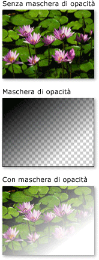
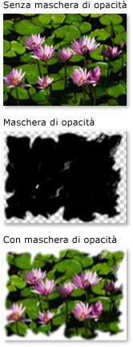
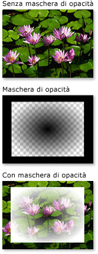

# Cenni preliminari sulle maschere di opacit&#224;
Le maschere di opacità consentono di rendere trasparenti o parzialmente trasparenti parti di un elemento o elemento visivo.  Per creare una maschera di opacità, applicare un oggetto <xref:System.Windows.Media.Brush> alla proprietà <xref:System.Windows.UIElement.OpacityMask%2A> di un elemento o <xref:System.Windows.Media.Visual>.  Il pennello viene mappato all'elemento o elemento visivo e il valore di opacità di ogni pixel del pennello viene utilizzato per determinare l'opacità risultante di ogni pixel corrispondente dell'elemento o elemento visivo.  
  
 Di seguito sono elencate le diverse sezioni di questo argomento.  
  
   
-   [Prerequisiti](#prereqs)  
  
-   [Creazione di effetti visivi con maschere di opacità](#opacitymasks)  
  
-   [Creazione di una maschera di opacità](#creatingopacitymasks)  
  
-   [Utilizzo di una sfumatura come maschera di opacità](#creatingopacitymaskswithgradients)  
  
-   [Definizione di cursori sfumatura per una maschera di opacità](#specifyinggradientcolors)  
  
-   [Utilizzo di un'immagine come maschera di opacità](#usingimageasopacitymask)  
  
-   [Creazione di una maschera di opacità da un disegno](#drawingbrushasopacitymask)  
  
-   [Argomenti correlati](#seeAlsoToggle)  
  
   
## Prerequisiti  
 In questi cenni preliminari si presuppone che l'utente abbia acquisito familiarità con gli oggetti <xref:System.Windows.Media.Brush>.  Per un'introduzione all'utilizzo dei pennelli, vedere [Cenni sul disegno con colori a tinta unita e sfumature](../../../../docs/framework/wpf/graphics-multimedia/painting-with-solid-colors-and-gradients-overview.md).  Per informazioni su <xref:System.Windows.Media.ImageBrush> e <xref:System.Windows.Media.DrawingBrush>, vedere [Disegnare con oggetti Image, Drawing e Visual](../../../../docs/framework/wpf/graphics-multimedia/painting-with-images-drawings-and-visuals.md).  
  
   
## Creazione di effetti visivi con maschere di opacità  
 Il funzionamento delle maschere di opacità è basato sul mapping del suo contenuto all'elemento o elemento visivo.  Il [canale alfa](GTMT) di ogni pixel del pennello viene utilizzato per determinare l'opacità risultante dei pixel corrispondenti dell'elemento o elemento visivo; il colore effettivo del pennello viene ignorato.  Se una parte del pennello è trasparente, la parte corrispondente dell'elemento o elemento visivo diventa trasparente.  Se una parte del pennello è opaca, l'opacità della parte corrispondente dell'elemento o elemento visivo rimane inalterata.  L'opacità specificata dalla maschera di opacità viene combinata a qualsiasi impostazione di opacità dell'elemento o elemento visivo.  Ad esempio, se un elemento è opaco al 25 percento e viene applicata una maschera di opacità che crea una transizione da opacità totale a trasparenza totale, il risultato è un elemento che passa dal 25 percento di opacità a una trasparenza totale.  
  
> [!NOTE]
>  Anche se negli esempi forniti in questi cenni preliminari viene illustrato l'utilizzo delle maschere di opacità su elementi di immagine, una maschera di opacità può essere applicata a qualsiasi elemento o <xref:System.Windows.Media.Visual>, inclusi i pannelli e i controlli.  
  
 Le maschere di opacità consentono di creare effetti visivi interessanti, ad esempio dissolvenze per immagini o pulsanti, aggiunta di trame agli elementi o combinazione di sfumature per ottenere il cosiddetto effetto cristallo.  Di seguito viene illustrato l'utilizzo di una maschera di opacità.  Per visualizzare le parti trasparenti della maschera viene utilizzato uno sfondo a scacchi.  
  
   
Esempio di maschera di opacità  
  
   
## Creazione di una maschera di opacità  
 Per creare una maschera di opacità, creare un oggetto <xref:System.Windows.Media.Brush> e applicarlo alla proprietà <xref:System.Windows.UIElement.OpacityMask%2A> di un elemento o elemento visivo.  È possibile utilizzare qualsiasi tipo di <xref:System.Windows.Media.Brush> come maschera di opacità.  
  
-   <xref:System.Windows.Media.LinearGradientBrush>, <xref:System.Windows.Media.RadialGradientBrush>: consente di creare l'effetto dissolvenza per un elemento o elemento visivo.  
  
     Di seguito viene illustrato un oggetto <xref:System.Windows.Media.LinearGradientBrush> utilizzato come maschera di opacità.  
  
       
Esempio di maschera di opacità LinearGradientBrush  
  
-   <xref:System.Windows.Media.ImageBrush>: consente di creare trame o effetti con bordi sfumati o frastagliati.  
  
     Di seguito viene illustrato un oggetto <xref:System.Windows.Media.ImageBrush> utilizzato come maschera di opacità.  
  
       
Esempio di maschera di opacità LinearGradientBrush  
  
-   <xref:System.Windows.Media.DrawingBrush>: consente di creare maschere di opacità complesse da pattern di forme, immagini e sfumature.  
  
     Di seguito viene illustrato un oggetto <xref:System.Windows.Media.DrawingBrush> utilizzato come maschera di opacità.  
  
       
Esempio di maschera di opacità DrawingBrush  
  
 I pennelli a sfumatura \(<xref:System.Windows.Media.LinearGradientBrush> e <xref:System.Windows.Media.RadialGradientBrush>\) sono particolarmente appropriati per essere utilizzati come maschera di opacità.  Poiché un oggetto <xref:System.Windows.Media.SolidColorBrush> riempie un'area con un colore uniforme, esso costituisce una maschera di opacità scarsamente efficace; l'utilizzo di un oggetto <xref:System.Windows.Media.SolidColorBrush> equivale all'impostazione della proprietà <xref:System.Windows.UIElement.OpacityMask%2A> dell'elemento o elemento visivo.  
  
   
## Utilizzo di una sfumatura come maschera di opacità  
 Per creare un riempimento sfumato, specificare due o più cursori sfumatura.  Ogni cursore sfumatura descrive un colore e una posizione. Per ulteriori informazioni sulla creazione e l'utilizzo di sfumature, vedere [Cenni sul disegno con colori a tinta unita e sfumature](../../../../docs/framework/wpf/graphics-multimedia/painting-with-solid-colors-and-gradients-overview.md).  Il processo equivale a quello relativo all'utilizzo di una sfumatura come maschera di opacità, ma, anziché miscelare i colori, la maschera di opacità miscela i valori del canale alfa.  Pertanto, ciò che è importante non è il colore effettivo del contenuto della sfumatura, bensì il canale alfa, o opacità, di ogni colore.  Di seguito è riportato un esempio.  
  
 <!-- TODO: review snippet reference [!code-xml[OpacityMasksExample#LinearGradientOpacityMaskonImage](../../../../samples/snippets/csharp/VS_Snippets_Wpf/OpacityMasksExample/CS/GradientBrushExample.xaml#lineargradientopacitymaskonimage)]  -->
 <!-- TODO: review snippet reference [!code-xml[OpacityMasksExample#LinearGradientOpacityMaskonImage](../../../../samples/snippets/xaml/VS_Snippets_Wpf/OpacityMasksExample/XAML/GradientBrushExample.xaml#lineargradientopacitymaskonimage)]  -->  
  
   
## Definizione di cursori sfumatura per una maschera di opacità  
 Nell'esempio precedente, il colore definito dal sistema <xref:System.Windows.Media.Colors.Black%2A> viene utilizzato come colore iniziale della sfumatura.  Poiché tutti i colori nella classe <xref:System.Windows.Media.Colors>, ad eccezione di <xref:System.Windows.Media.Colors.Transparent%2A>, sono completamente opachi, possono essere utilizzati per definire semplicemente un colore iniziale per una maschera di opacità con sfumatura.  
  
 Per un controllo maggiore su valori alfa quando si definisce una maschera di opacità, è possibile specificare il canale alfa dei colori utilizzando la notazione esadecimale [!INCLUDE[TLA#tla_argb](../../../../includes/tlasharptla-argb-md.md)] nel markup oppure il metodo <xref:System.Windows.Media.Color.FromScRgb%2A?displayProperty=fullName>.  
  
   
### Specifica dell'opacità di colore in "XAML"  
 In [!INCLUDE[TLA#tla_xaml](../../../../includes/tlasharptla-xaml-md.md)] viene utilizzata la notazione esadecimale [!INCLUDE[TLA2#tla_argb](../../../../includes/tla2sharptla-argb-md.md)] per specificare l'opacità di colori singoli.  La notazione esadecimale di [!INCLUDE[TLA2#tla_argb](../../../../includes/tla2sharptla-argb-md.md)] utilizza la sintassi seguente:  
  
 `#`**aa** *rrggbb*  
  
 *aa* nella riga precedente rappresenta un valore esadecimale a due cifre utilizzato per specificare l'opacità del colore.  *rr*, *gg*e *bb* rappresentano un valore esadecimale a due cifre che specifica rispettivamente la quantità di rosso, verde e blu nel colore.  Ogni cifra esadecimale può presentare un valore compreso tra 0 e 9 o tra A e F.  0 è il valore più basso, mentre F è il più elevato.  Un valore alfa pari a 00 indica un colore completamente trasparente, mentre un valore alfa pari a FF indica un colore completamente opaco.  Nell'esempio riportato di seguito, la notazione esadecimale [!INCLUDE[TLA2#tla_argb](../../../../includes/tla2sharptla-argb-md.md)] consente di specificare due colori.  Il primo è completamente opaco, mentre il secondo è completamente trasparente.  
  
 <!-- TODO: review snippet reference [!code-xml[OpacityMasksExample#AARRGGBBValueonOpacityMask](../../../../samples/snippets/csharp/VS_Snippets_Wpf/OpacityMasksExample/CS/GradientBrushExample.xaml#aarrggbbvalueonopacitymask)]  -->
 <!-- TODO: review snippet reference [!code-xml[OpacityMasksExample#AARRGGBBValueonOpacityMask](../../../../samples/snippets/xaml/VS_Snippets_Wpf/OpacityMasksExample/XAML/GradientBrushExample.xaml#aarrggbbvalueonopacitymask)]  -->  
  
   
## Utilizzo di un'immagine come maschera di opacità  
 È anche possibile utilizzare le immagini come maschere di opacità.  Di seguito è riportato un esempio.  Per visualizzare le parti trasparenti della maschera viene utilizzato uno sfondo a scacchi.  
  
   
Esempio di maschera di opacità  
  
 Per utilizzare un'immagine come maschera di opacità, utilizzare un oggetto <xref:System.Windows.Media.ImageBrush> che contenga l'immagine.  Quando si crea un'immagine da utilizzare come maschera di opacità, salvarla in un formato che supporti più livelli di trasparenza, ad esempio [!INCLUDE[TLA#tla_png](../../../../includes/tlasharptla-png-md.md)].  Nell'esempio riportato di seguito viene illustrato il codice utilizzato per creare la precedente illustrazione.  
  
 <!-- TODO: review snippet reference [!code-xml[OpacityMasksExample#UIElementOpacityMask](../../../../samples/snippets/csharp/VS_Snippets_Wpf/OpacityMasksExample/CS/ImageBrushExample.xaml#uielementopacitymask)]  -->
 <!-- TODO: review snippet reference [!code-xml[OpacityMasksExample#UIElementOpacityMask](../../../../samples/snippets/xaml/VS_Snippets_Wpf/OpacityMasksExample/XAML/ImageBrushExample.xaml#uielementopacitymask)]  -->  
  
   
### Utilizzo di un'immagine affiancata come maschera di opacità  
 Nell'esempio riportato di seguito, viene utilizzata la stessa immagine con un altro oggetto <xref:System.Windows.Media.ImageBrush>, ma le funzionalità di visualizzazione affiancata consentono di produrre tessere dell'immagine di 50 x 50 pixel.  
  
 <!-- TODO: review snippet reference [!code-xml[OpacityMasksExample#TiledImageasOpacityMask](../../../../samples/snippets/csharp/VS_Snippets_Wpf/OpacityMasksExample/CS/ImageBrushExample.xaml#tiledimageasopacitymask)]  -->
 <!-- TODO: review snippet reference [!code-xml[OpacityMasksExample#TiledImageasOpacityMask](../../../../samples/snippets/xaml/VS_Snippets_Wpf/OpacityMasksExample/XAML/ImageBrushExample.xaml#tiledimageasopacitymask)]  -->  
  
   
## Creazione di una maschera di opacità da un disegno  
 È possibile utilizzare i disegni per creare maschere di opacità.  Le forme contenute nel disegno possono essere riempite con sfumature, tinte unite, immagini o anche gli altri disegni.  Di seguito viene illustrato un esempio di disegno utilizzato come maschera di opacità.  Per visualizzare le parti trasparenti della maschera viene utilizzato uno sfondo a scacchi.  
  
   
Esempio di maschera di opacità DrawingBrush  
  
 Per utilizzare un disegno come maschera di opacità, utilizzare un oggetto <xref:System.Windows.Media.DrawingBrush> che contenga il disegno.  Nell'esempio riportato di seguito viene illustrato il codice utilizzato per creare la precedente illustrazione:  
  
 <!-- TODO: review snippet reference [!code-xml[OpacityMasksExample#OpacityMaskfromDrawing](../../../../samples/snippets/csharp/VS_Snippets_Wpf/OpacityMasksExample/CS/DrawingBrushExample.xaml#opacitymaskfromdrawing)]  -->
 <!-- TODO: review snippet reference [!code-xml[OpacityMasksExample#OpacityMaskfromDrawing](../../../../samples/snippets/xaml/VS_Snippets_Wpf/OpacityMasksExample/XAML/DrawingBrushExample.xaml#opacitymaskfromdrawing)]  -->  
  
   
### Utilizzo di un disegno affiancato come maschera di opacità  
 Analogamente all'oggetto <xref:System.Windows.Media.ImageBrush>, è possibile utilizzare <xref:System.Windows.Media.DrawingBrush> per affiancare il relativo disegno.  Nell'esempio riportato di seguito viene utilizzato un pennello da disegno per creare una maschera di opacità affiancata.  
  
 <!-- TODO: review snippet reference [!code-xml[OpacityMasksExample#TiledDrawingasOpacityMask](../../../../samples/snippets/csharp/VS_Snippets_Wpf/OpacityMasksExample/CS/DrawingBrushExample.xaml#tileddrawingasopacitymask)]  -->
 <!-- TODO: review snippet reference [!code-xml[OpacityMasksExample#TiledDrawingasOpacityMask](../../../../samples/snippets/xaml/VS_Snippets_Wpf/OpacityMasksExample/XAML/DrawingBrushExample.xaml#tileddrawingasopacitymask)]  -->  
  
## Vedere anche  
 [Disegnare con oggetti Image, Drawing e Visual](../../../../docs/framework/wpf/graphics-multimedia/painting-with-images-drawings-and-visuals.md)   
 [Cenni sul disegno con colori a tinta unita e sfumature](../../../../docs/framework/wpf/graphics-multimedia/painting-with-solid-colors-and-gradients-overview.md)