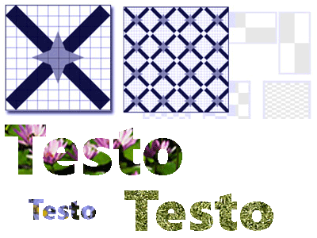

# Disegnare con oggetti Image, Drawing e Visual
In questo argomento viene descritto l'utilizzo degli oggetti <xref:System.Windows.Media.ImageBrush>, <xref:System.Windows.Media.DrawingBrush> e <xref:System.Windows.Media.VisualBrush> per disegnare un'area con un oggetto Image, <xref:System.Windows.Media.Drawing> o <xref:System.Windows.Media.Visual>.  
  
   
  
   
## Prerequisiti  
 Per comprendere questo argomento, è necessario conoscere i diversi tipi di pennelli forniti da [!INCLUDE[TLA#tla_winclient](../../../../includes/tlasharptla-winclient-md.md)] e le relative funzionalità di base.  Per un'introduzione, vedere [Cenni preliminari sui pennelli di WPF](../../../../docs/framework/wpf/graphics-multimedia/wpf-brushes-overview.md).  
  
   
## Disegnare un'area con un oggetto Image  
 <xref:System.Windows.Media.ImageBrush> disegna un'area utilizzando <xref:System.Windows.Media.ImageSource>.  Il tipo di <xref:System.Windows.Media.ImageSource> più comune da utilizzare con un oggetto <xref:System.Windows.Media.ImageBrush> è un <xref:System.Windows.Media.Imaging.BitmapImage>, che descrivere un grafico bitmap.  È possibile utilizzare <xref:System.Windows.Media.DrawingImage> per disegnare utilizzando un oggetto <xref:System.Windows.Media.Drawing>, ma è più semplice utilizzare <xref:System.Windows.Media.DrawingBrush>.  Per ulteriori informazioni sugli oggetti <xref:System.Windows.Media.ImageSource>, vedere [Cenni preliminari sulla creazione dell'immagine](../../../../docs/framework/wpf/graphics-multimedia/imaging-overview.md).  
  
 Per disegnare con <xref:System.Windows.Media.ImageBrush>, creare un oggetto <xref:System.Windows.Media.Imaging.BitmapImage> e utilizzarlo per caricare il contenuto bitmap.  Quindi, utilizzare <xref:System.Windows.Media.Imaging.BitmapImage> per impostare la proprietà <xref:System.Windows.Media.ImageBrush.ImageSource%2A> dell'oggetto <xref:System.Windows.Media.ImageBrush>.  Infine, applicare <xref:System.Windows.Media.ImageBrush> all'oggetto che si desidera disegnare.  In [!INCLUDE[TLA#tla_xaml](../../../../includes/tlasharptla-xaml-md.md)], è anche possibile impostare la proprietà <xref:System.Windows.Media.ImageBrush.ImageSource%2A> di <xref:System.Windows.Media.ImageBrush> con il percorso dell'immagine da caricare.  
  
 Analogamente a tutti gli oggetti <xref:System.Windows.Media.Brush>, <xref:System.Windows.Media.ImageBrush> può essere utilizzato per disegnare elementi come forme, panelli, controlli e testo.  Nella figura riportata di seguito vengono illustrati alcuni degli effetti che possono essere ottenuti utilizzando <xref:System.Windows.Media.ImageBrush>.  
  
   
Oggetti disegnati con un oggetto ImageBrush  
  
 Per impostazione predefinita, un oggetto <xref:System.Windows.Media.ImageBrush> estende la propria immagine in modo da riempire completamente l'area disegnata, eventualmente distorcendo l'immagine se tale area presenta proporzioni diverse rispetto all'immagine.  È possibile modificare tale comportamento impostando il valore predefinito <xref:System.Windows.Media.Stretch> della proprietà <xref:System.Windows.Media.TileBrush.Stretch%2A> su <xref:System.Windows.Media.Stretch>, <xref:System.Windows.Media.Stretch> o <xref:System.Windows.Media.Stretch>.  Poiché <xref:System.Windows.Media.ImageBrush> è un tipo di <xref:System.Windows.Media.TileBrush>, è possibile specificare esattamente in che modo un tratto con immagine riempie l'area di output e persino creare dei modelli.  Per ulteriori informazioni sulle funzionalità avanzate di <xref:System.Windows.Media.TileBrush>, vedere [Cenni preliminari sugli oggetti TileBrush](../../../../docs/framework/wpf/graphics-multimedia/tilebrush-overview.md).  
  
   
## Esempio: disegnare un oggetto con un'immagine bitmap  
 Nell'esempio riportato di seguito viene utilizzato <xref:System.Windows.Media.ImageBrush> per disegnare il <xref:System.Windows.Controls.Panel.Background%2A> di un oggetto <xref:System.Windows.Controls.Canvas>.  
  
 [!code-xml[BrushOverviewExamples_snip#GraphicsMMImageBrushAsCanvasBackgroundExampleWholePage](../../../../samples/snippets/xaml/VS_Snippets_Wpf/BrushOverviewExamples_snip/XAML/ImageBrushExample.xaml#graphicsmmimagebrushascanvasbackgroundexamplewholepage)]  
  
 [!code-csharp[BrushOverviewExamples_procedural_snip#GraphicsMMImageBrushAsCanvasBackgroundExampleWholePage](../../../../samples/snippets/csharp/VS_Snippets_Wpf/BrushOverviewExamples_procedural_snip/CSharp/ImageBrushExample.cs#graphicsmmimagebrushascanvasbackgroundexamplewholepage)]
 [!code-vb[BrushOverviewExamples_procedural_snip#GraphicsMMImageBrushAsCanvasBackgroundExampleWholePage](../../../../samples/snippets/visualbasic/VS_Snippets_Wpf/BrushOverviewExamples_procedural_snip/visualbasic/imagebrushexample.vb#graphicsmmimagebrushascanvasbackgroundexamplewholepage)]  
  
   
## Disegnare un'area con un oggetto Drawing  
 <xref:System.Windows.Media.DrawingBrush> consente di disegnare un'area con forme, testo, immagini e video.  Le forme contenute all'interno di un oggetto DrawingBrush possono a loro volta essere disegnate con colori a tinta unita, sfumature, immagini o persino altri oggetti <xref:System.Windows.Media.DrawingBrush>.  Nell'illustrazione riportata di seguito sono mostrati alcuni utilizzi di un oggetto <xref:System.Windows.Media.DrawingBrush>.  
  
   
Oggetti disegnati con un oggetto DrawingBrush  
  
 <xref:System.Windows.Media.DrawingBrush> disegna un'area con un oggetto <xref:System.Windows.Media.Drawing>.  Un oggetto <xref:System.Windows.Media.Drawing> descrive il contenuto visibile, ad esempio una forma, una bitmap, un video o una riga di testo.  Tipi diversi di disegni descrivono tipi diversi di contenuto.  Di seguito viene fornito un elenco dei diversi tipi di oggetti Drawing.  
  
-   <xref:System.Windows.Media.GeometryDrawing> \- Consente di disegnare una forma.  
  
-   <xref:System.Windows.Media.ImageDrawing> \- Consente di disegnare un'immagine.  
  
-   <xref:System.Windows.Media.GlyphRunDrawing> \- Consente di creare del testo.  
  
-   <xref:System.Windows.Media.VideoDrawing> \- Consente di riprodurre un file audio o video.  
  
-   <xref:System.Windows.Media.DrawingGroup> \- Consente di eseguire altri disegni.  Utilizzare un gruppo di disegni per combinare altri disegni in un unico disegno composto.  
  
 Per ulteriori informazioni sugli oggetti <xref:System.Windows.Media.Drawing>, vedere [Cenni preliminari sugli oggetti Drawing](../../../../docs/framework/wpf/graphics-multimedia/drawing-objects-overview.md).  
  
 Analogamente a <xref:System.Windows.Media.ImageBrush>, <xref:System.Windows.Media.DrawingBrush> estende il relativo oggetto <xref:System.Windows.Media.DrawingBrush.Drawing%2A> per riempire l'area di output.  È possibile eseguire l'override di tale comportamento modificando il valore predefinito <xref:System.Windows.Media.Stretch> della proprietà <xref:System.Windows.Media.TileBrush.Stretch%2A>.  Per ulteriori informazioni, vedere la proprietà <xref:System.Windows.Media.TileBrush.Stretch%2A>.  
  
   
## Esempio: disegnare un oggetto con un oggetto Drawing  
 Nell'esempio riportato di seguito viene illustrato come disegnare un oggetto con un oggetto Drawing di tre ellissi.  Per descrivere le ellissi viene utilizzato <xref:System.Windows.Media.GeometryDrawing>.  
  
 [!code-xml[BrushOverviewExamples_snip#GraphicsMMDrawingBrushAsButtonBackgroundExample](../../../../samples/snippets/xaml/VS_Snippets_Wpf/BrushOverviewExamples_snip/XAML/DrawingBrushExample.xaml#graphicsmmdrawingbrushasbuttonbackgroundexample)]  
  
 [!code-csharp[BrushOverviewExamples_procedural_snip#GraphicsMMDrawingBrushAsButtonBackgroundExample1](../../../../samples/snippets/csharp/VS_Snippets_Wpf/BrushOverviewExamples_procedural_snip/CSharp/DrawingBrushExample.cs#graphicsmmdrawingbrushasbuttonbackgroundexample1)]
 [!code-vb[BrushOverviewExamples_procedural_snip#GraphicsMMDrawingBrushAsButtonBackgroundExample1](../../../../samples/snippets/visualbasic/VS_Snippets_Wpf/BrushOverviewExamples_procedural_snip/visualbasic/drawingbrushexample.vb#graphicsmmdrawingbrushasbuttonbackgroundexample1)]  
  
   
## Disegnare un'area con un oggetto Visual  
 <xref:System.Windows.Media.VisualBrush> è il pennello più versatile e potente che disegna un'area con un oggetto <xref:System.Windows.Media.Visual>.  <xref:System.Windows.Media.Visual> è un tipo grafico di basso livello che serve da predecessore di molti componenti grafici utili.  Ad esempio, le classi <xref:System.Windows.Window>, <xref:System.Windows.FrameworkElement> e <xref:System.Windows.Controls.Control> sono tutti tipi di oggetti <xref:System.Windows.Media.Visual>.  <xref:System.Windows.Media.VisualBrush> consente di disegnare aree con quasi tutti gli oggetti grafici [!INCLUDE[TLA#tla_winclient](../../../../includes/tlasharptla-winclient-md.md)].  
  
> [!NOTE]
>  Sebbene <xref:System.Windows.Media.VisualBrush> sia un tipo di oggetto <xref:System.Windows.Freezable>, non è possibile bloccarlo \(impostarlo in sola lettura\) quando la relativa proprietà <xref:System.Windows.Media.VisualBrush.Visual%2A> è impostata su un valore diverso da `null`.  
  
 Esistono due modalità per specificare il contenuto <xref:System.Windows.Media.VisualBrush.Visual%2A> di un oggetto <xref:System.Windows.Media.VisualBrush>.  
  
-   Creare un nuovo oggetto <xref:System.Windows.Media.Visual> e utilizzarlo per impostare la proprietà <xref:System.Windows.Media.VisualBrush.Visual%2A> di <xref:System.Windows.Media.VisualBrush>.  Per un esempio, vedere la sezione [Esempio: disegnare un oggetto con un oggetto Visual](#examplevisualbrush1) riportata di seguito.  
  
-   Utilizzare un oggetto <xref:System.Windows.Media.Visual> esistente che crea un'immagine duplicata dell'oggetto <xref:System.Windows.Media.Visual> di destinazione.  È quindi possibile utilizzare <xref:System.Windows.Media.VisualBrush> per creare effetti interessanti, come ad esempio reflection e ingrandimento.  Per un esempio, vedere la sezione [Esempio: creare una reflection](#examplevisualbrush2).  
  
 Quando viene definito un nuovo oggetto <xref:System.Windows.Media.VisualBrush.Visual%2A> per <xref:System.Windows.Media.VisualBrush> e tale <xref:System.Windows.Media.Visual> è un oggetto <xref:System.Windows.UIElement> \(ad esempio un pannello o un controllo\), il sistema di layout viene eseguito su <xref:System.Windows.UIElement> e sui relativi elementi figlio quando la proprietà <xref:System.Windows.Media.VisualBrush.AutoLayoutContent%2A> è impostata su `true`.  Tuttavia, l'oggetto <xref:System.Windows.UIElement> radice viene essenzialmente isolato dal resto del sistema: gli stili e il layout esterno non possono superare tale limite.  Pertanto, è necessario specificare esplicitamente le dimensioni dell'oggetto <xref:System.Windows.UIElement> radice, poiché il suo unico elemento padre è <xref:System.Windows.Media.VisualBrush> e quindi non può essere ridimensionato automaticamente in base all'area disegnata.  Per ulteriori informazioni sul layout in [!INCLUDE[TLA#tla_winclient](../../../../includes/tlasharptla-winclient-md.md)], vedere [Layout](../../../../docs/framework/wpf/advanced/layout.md).  
  
 Analogamente a <xref:System.Windows.Media.ImageBrush> e <xref:System.Windows.Media.DrawingBrush>, <xref:System.Windows.Media.VisualBrush> estende il proprio contenuto per riempire la relativa area di output.  È possibile eseguire l'override di tale comportamento modificando il valore predefinito <xref:System.Windows.Media.Stretch> della proprietà <xref:System.Windows.Media.TileBrush.Stretch%2A>.  Per ulteriori informazioni, vedere la proprietà <xref:System.Windows.Media.TileBrush.Stretch%2A>.  
  
   
## Esempio: disegnare un oggetto con un oggetto Visual  
 Nell'esempio riportato di seguito vengono utilizzati numerosi controlli e un pannello per disegnare un rettangolo.  
  
 [!code-xml[BrushOverviewExamples_snip#GraphicsMMVisualBrushAsRectangleBackgroundExample](../../../../samples/snippets/xaml/VS_Snippets_Wpf/BrushOverviewExamples_snip/XAML/VisualBrushExample.xaml#graphicsmmvisualbrushasrectanglebackgroundexample)]  
  
 [!code-csharp[BrushOverviewExamples_procedural_snip#GraphicsMMVisualBrushAsRectangleBackgroundExample1](../../../../samples/snippets/csharp/VS_Snippets_Wpf/BrushOverviewExamples_procedural_snip/CSharp/VisualBrushExample.cs#graphicsmmvisualbrushasrectanglebackgroundexample1)]
 [!code-vb[BrushOverviewExamples_procedural_snip#GraphicsMMVisualBrushAsRectangleBackgroundExample1](../../../../samples/snippets/visualbasic/VS_Snippets_Wpf/BrushOverviewExamples_procedural_snip/visualbasic/visualbrushexample.vb#graphicsmmvisualbrushasrectanglebackgroundexample1)]  
  
   
## Esempio: creare una reflection  
 Nell'esempio precedente è stato mostrato come creare un nuovo oggetto <xref:System.Windows.Media.Visual> da utilizzare come sfondo.  È anche possibile utilizzare un oggetto <xref:System.Windows.Media.VisualBrush> per visualizzare un elemento visivo esistente. Questa funzionalità consente di produrre effetti visivi interessanti, come ad esempio reflection e ingrandimento.  Nell'esempio riportato di seguito viene utilizzato <xref:System.Windows.Media.VisualBrush> per creare la reflection di un oggetto <xref:System.Windows.Controls.Border> che contiene numerosi elementi.  Nella figura riportata di seguito viene illustrato l'output che si ottiene dall'esempio.  
  
   
Oggetto Visual riflesso  
  
 [!code-csharp[visualbrush_markup_snip#GraphicsMMVisualBrushReflectionExampleWholePage](../../../../samples/snippets/csharp/VS_Snippets_Wpf/visualbrush_markup_snip/CSharp/ReflectionExample.cs#graphicsmmvisualbrushreflectionexamplewholepage)]
 [!code-vb[visualbrush_markup_snip#GraphicsMMVisualBrushReflectionExampleWholePage](../../../../samples/snippets/visualbasic/VS_Snippets_Wpf/visualbrush_markup_snip/visualbasic/reflectionexample.vb#graphicsmmvisualbrushreflectionexamplewholepage)]
 [!code-xml[visualbrush_markup_snip#GraphicsMMVisualBrushReflectionExampleWholePage](../../../../samples/snippets/xaml/VS_Snippets_Wpf/visualbrush_markup_snip/XAML/ReflectionExample.xaml#graphicsmmvisualbrushreflectionexamplewholepage)]  
  
 Per ulteriori esempi che illustrano come ingrandire parti dello schermo e come creare reflection, vedere [Esempio VisualBrush](http://go.microsoft.com/fwlink/?LinkID=160049) \(la pagina potrebbe essere in inglese\).  
  
   
## Funzionalità degli oggetti TileBrush  
 <xref:System.Windows.Media.ImageBrush>, <xref:System.Windows.Media.DrawingBrush> e <xref:System.Windows.Media.VisualBrush> sono tipi di oggetti <xref:System.Windows.Media.TileBrush>.  Gli oggetti <xref:System.Windows.Media.TileBrush> forniscono un elevato livello di controllo sulla modalità di disegno di un'area con un'immagine, un disegno o un elemento visivo.  Ad esempio, anziché disegnare un'area con una sola immagine estesa, è possibile utilizzare una serie di immagini affiancate che creano un motivo.  
  
 <xref:System.Windows.Media.TileBrush> è costituito da tre componenti principali: contenuto, tessere e area di output.  
  
   
Componenti di un oggetto TileBrush con una sola tessera  
  
   
Componenti di un oggetto TileBrush con più tessere  
  
 Per ulteriori informazioni sulle funzionalità di affiancamento degli oggetti <xref:System.Windows.Media.TileBrush>, vedere [Cenni preliminari sugli oggetti TileBrush](../../../../docs/framework/wpf/graphics-multimedia/tilebrush-overview.md).  
  
## Vedere anche  
 <xref:System.Windows.Media.ImageBrush>   
 <xref:System.Windows.Media.DrawingBrush>   
 <xref:System.Windows.Media.VisualBrush>   
 <xref:System.Windows.Media.TileBrush>   
 [Cenni preliminari sugli oggetti TileBrush](../../../../docs/framework/wpf/graphics-multimedia/tilebrush-overview.md)   
 [Cenni preliminari sui pennelli di WPF](../../../../docs/framework/wpf/graphics-multimedia/wpf-brushes-overview.md)   
 [Cenni preliminari sulla creazione dell'immagine](../../../../docs/framework/wpf/graphics-multimedia/imaging-overview.md)   
 [Cenni preliminari sugli oggetti Drawing](../../../../docs/framework/wpf/graphics-multimedia/drawing-objects-overview.md)   
 [Cenni preliminari sulle maschere di opacità](../../../../docs/framework/wpf/graphics-multimedia/opacity-masks-overview.md)   
 [Cenni preliminari sul rendering della grafica WPF](../../../../docs/framework/wpf/graphics-multimedia/wpf-graphics-rendering-overview.md)   
 [Esempio ImageBrush](http://go.microsoft.com/fwlink/?LinkID=160005)   
 [Esempio VisualBrush](http://go.microsoft.com/fwlink/?LinkID=160049)