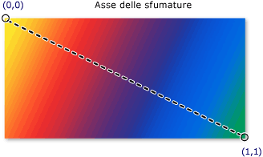

# Cenni sul disegno con colori a tinta unita e sfumature
In questo argomento viene illustrata la modalità di utilizzo degli oggetti <xref:System.Windows.Media.SolidColorBrush>, <xref:System.Windows.Media.LinearGradientBrush> e <xref:System.Windows.Media.RadialGradientBrush> per disegnare con colori a tinta unita, sfumature lineari e sfumature radiali.  
  
   
  
   
## Disegno di un'area con tinte unite  
 Una delle operazioni più frequenti in una piattaforma è disegnare un'area con un oggetto <xref:System.Windows.Media.Color> a tinta unita.  Per effettuare questa attività, in [!INCLUDE[TLA#tla_winclient](../../../../includes/tlasharptla-winclient-md.md)] viene fornita la classe <xref:System.Windows.Media.SolidColorBrush>.  Nelle sezioni seguenti vengono descritte le diverse modalità di disegno utilizzando una classe <xref:System.Windows.Media.SolidColorBrush>.  
  
   
### Utilizzo di una classe SolidColorBrush in "XAML"  
 Per disegnare un'area con tinte unite in [!INCLUDE[TLA2#tla_xaml](../../../../includes/tla2sharptla-xaml-md.md)], utilizzare una delle seguenti opzioni.  
  
-   Selezionare un pennello a tinta unita predefinito in base al nome.  Ad esempio, è possibile impostare un oggetto <xref:System.Windows.Controls.Control.Background%2A> del pulsante su "Red" o "MediumBlue".  Per un elenco di altri pennelli a tinta unita predefiniti, vedere le proprietà statiche della classe <xref:System.Windows.Media.Brushes>.  Di seguito è riportato un esempio.  
  
     [!code-xml[BrushOverviewExamples_snip#SolidColorBrushNamedColor1XAML](../../../../samples/snippets/xaml/VS_Snippets_Wpf/BrushOverviewExamples_snip/XAML/SolidColorBrushExample.xaml#solidcolorbrushnamedcolor1xaml)]  
  
-   Scegliere un colore dalla tavolozza dei colori a 32 bit specificando la quantità di rosso, verde e blu per combinare un'unica tinta unita.  Il formato per specificare un colore dalla tavolozza a 32 bit è "*\#rrggbb*", dove *rr* è un numero esadecimale a due cifre che indica la relativa quantità di rosso, *gg* indica la quantità di verde mentre *bb* indica la quantità di blu.  Inoltre, il colore può essere specificato come "\#*aarrggbb*" dove *aa* indica il valore *alfa*, o trasparenza, del colore.  In questo modo è possibile creare colori parzialmente trasparenti.  Nell'esempio riportato di seguito, l'oggetto <xref:System.Windows.Controls.Control.Background%2A> di <xref:System.Windows.Controls.Button> è impostato su un rosso completamente opaco mediante notazione esadecimale.  
  
     [!code-xml[BrushOverviewExamples_snip#SolidColorBrushHex1XAML](../../../../samples/snippets/xaml/VS_Snippets_Wpf/BrushOverviewExamples_snip/XAML/SolidColorBrushExample.xaml#solidcolorbrushhex1xaml)]  
  
-   Utilizzare la sintassi del tag della proprietà per descrivere una classe <xref:System.Windows.Media.SolidColorBrush>.  Questa sintassi è più dettagliata ma consente di specificare altre impostazioni, ad esempio, l'opacità del pennello.  Nell'esempio riportato di seguito, le proprietà <xref:System.Windows.Controls.Control.Background%2A> di due elementi <xref:System.Windows.Controls.Button> sono impostate su un rosso completamente opaco.  Il colore del primo pennello è descritto mediante un nome di colore predefinito.  Il colore del secondo pennello è descritto mediante una notazione esadecimale.  
  
     [!code-xml[BrushOverviewExamples_snip#SolidColorBrushPropertyTag1XAML](../../../../samples/snippets/xaml/VS_Snippets_Wpf/BrushOverviewExamples_snip/XAML/SolidColorBrushExample.xaml#solidcolorbrushpropertytag1xaml)]  
  
   
### Disegno mediante una classe SolidColorBrush nel codice  
 Per disegnare un'area con tinte unite nel codice, utilizzare una delle seguenti opzioni.  
  
-   Utilizzare uno dei pennelli predefiniti forniti dalla classe <xref:System.Windows.Media.Brushes>.  Nell'esempio riportato di seguito, l'oggetto <xref:System.Windows.Controls.Control.Background%2A> di <xref:System.Windows.Controls.Button> è impostato su <xref:System.Windows.Media.Brushes.Red%2A>.  
  
     [!code-csharp[BrushOverviewExamples_snip#SolidColorBrushPredefinedBrush1CSharp](../../../../samples/snippets/csharp/VS_Snippets_Wpf/BrushOverviewExamples_snip/CSharp/SolidColorBrushExample.cs#solidcolorbrushpredefinedbrush1csharp)]  
  
-   Creare una classe <xref:System.Windows.Media.SolidColorBrush> e impostare la relativa proprietà <xref:System.Windows.Media.SolidColorBrush.Color%2A> mediante una struttura <xref:System.Windows.Media.Color>.  È possibile utilizzare un colore predefinito dalla classe <xref:System.Windows.Media.Colors> oppure creare un oggetto <xref:System.Windows.Media.Color> mediante il metodo statico <xref:System.Windows.Media.Color.FromArgb%2A>.  
  
     Nell'esempio riportato di seguito viene illustrata la modalità per impostare la proprietà <xref:System.Windows.Media.SolidColorBrush.Color%2A> di <xref:System.Windows.Media.SolidColorBrush> mediante un colore predefinito.  
  
     [!code-csharp[BrushOverviewExamples_snip#SolidColorBrushPredefinedColor1CSharp](../../../../samples/snippets/csharp/VS_Snippets_Wpf/BrushOverviewExamples_snip/CSharp/SolidColorBrushExample.cs#solidcolorbrushpredefinedcolor1csharp)]  
  
 Il metodo statico <xref:System.Windows.Media.Color.FromArgb%2A> consente di specificare i valori [alfa](GTMT), rosso, verde e blu del colore.  L'intervallo tipico per ciascun valore è 0\-255.  Ad esempio, un valore [alfa](GTMT) pari a 0 indica che il colore è completamente trasparente, mentre un valore pari a 255 indica che il colore è completamente opaco.  Analogamente, un valore 0 relativo al colore rosso indica la totale assenza di rosso nel colore mentre un valore 255 indica la quantità di rosso massima contenuta.  Nell'esempio riportato di seguito, il colore di un pennello viene descritto specificando i valori alfa, rosso, verde e blu.  
  
 [!code-csharp[BrushOverviewExamples_snip#SolidColorBrushfromArgbExample1CSharp](../../../../samples/snippets/csharp/VS_Snippets_Wpf/BrushOverviewExamples_snip/CSharp/SolidColorBrushExample.cs#solidcolorbrushfromargbexample1csharp)]  
  
 Per conoscere ulteriori modi per specificare un colore, vedere l'argomento di riferimento <xref:System.Windows.Media.Color>.  
  
   
## Disegno di un'area mediante sfumature  
 Un pennello sfumato consente di disegnare un'area con più colori che si fondono tra loro lungo un asse.  È possibile utilizzarlo per generare luci e ombre fornendo un effetto tridimensionale.  È inoltre possibile utilizzarli per simulare l'effetto cristallo, cromato, acqua e altre superfici uniformi.  [!INCLUDE[TLA2#tla_winclient](../../../../includes/tla2sharptla-winclient-md.md)] fornisce due tipi di pennelli sfumati, ovvero <xref:System.Windows.Media.LinearGradientBrush> e <xref:System.Windows.Media.RadialGradientBrush>.  
  
   
## Sfumature lineari  
 Un oggetto <xref:System.Windows.Media.LinearGradientBrush> consente di disegnare un'area con una sfumatura definita lungo una linea, l'*asse delle sfumature*.  Specificare i colori delle sfumature e le relative posizioni lungo l'asse delle sfumature mediante gli oggetti <xref:System.Windows.Media.GradientStop>.  Inoltre è possibile modificare l'asse delle sfumature che consente di creare sfumature orizzontali e verticali e di invertire la direzione della sfumatura.  Tale asse viene descritto in dettaglio nella sezione seguente.  Per impostazione predefinita, viene creata una sfumatura diagonale.  
  
 Nell'esempio riportato di seguito viene illustrato il codice che crea una sfumatura lineare con quattro colori.  
  
 [!code-xml[GradientBrushExamples_snip#DiagonalGradient1XAML](../../../../samples/snippets/xaml/VS_Snippets_Wpf/GradientBrushExamples_snip/XAML/LinearGradientBrushExample.xaml#diagonalgradient1xaml)]  
  
 [!code-csharp[GradientBrushExamples_snip#DiagonalGradient1CSharp](../../../../samples/snippets/csharp/VS_Snippets_Wpf/GradientBrushExamples_snip/CSharp/LinearGradientBrushExample.cs#diagonalgradient1csharp)]  
  
 La sfumatura del codice è la seguente:  
  
   
  
 **Nota:** negli esempi di sfumature contenuti in questo argomento viene utilizzato il sistema di coordinate predefinito per impostare i punti iniziali e quelli finali.  Il sistema di coordinate predefinito è relativo a un riquadro delimitatore del testo. 0 e 1 indicano rispettivamente lo 0 e il 100% del riquadro delimitatore del testo.  Tale sistema di coordinate può essere modificato impostando la proprietà <xref:System.Windows.Media.GradientBrush.MappingMode%2A> sul valore <xref:System.Windows.Media.BrushMappingMode>.  Un sistema di coordinate assoluto non è relativo a un riquadro delimitatore del testo.  I valori vengono interpretati direttamente nello spazio locale.  
  
 L'oggetto <xref:System.Windows.Media.GradientStop> è il blocco predefinito di base di un pennello sfumato.  Un cursore sfumatura consente di specificare un oggetto <xref:System.Windows.Media.GradientStop.Color%2A> in <xref:System.Windows.Media.GradientStop.Offset%2A> lungo l'asse delle sfumature.  
  
-   La proprietà <xref:System.Windows.Media.GradientStop.Color%2A> del cursore sfumatura consente di specificare il colore di tale cursore.  È possibile impostare il colore utilizzando un colore predefinito \(fornito dalla classe <xref:System.Windows.Media.Colors>\) o specificando i valori ScRGB o ARGB.  In [!INCLUDE[TLA2#tla_xaml](../../../../includes/tla2sharptla-xaml-md.md)], è possibile utilizzare anche una notazione esedecimale per descrivere un colore.  Per ulteriori informazioni, vedere la struttura <xref:System.Windows.Media.Color>.  
  
-   La proprietà <xref:System.Windows.Media.GradientStop.Offset%2A> del cursore sfumatura consente di specificare il colore del cursore sfumatura sull'asse delle sfumature.  L'offset è un <xref:System.Double> il cui intervallo va da 0 a 1.  Più il valore offset del cursore sfumatura si avvicina a 0, più il colore è vicino all'inizio della sfumatura.  Più il valore offset del cursore sfumatura si avvicina a 1, più il colore è vicino alla fine delle sfumatura.  
  
 Il colore di ciascun punto tra i cursori sfumatura è linearmente interpolato come combinazione del colore specificato dai due cursori sfumatura di delimitazione.  Nell'immagine riportata di seguito vengono evidenziati i cursori sfumatura dell'esempio precedente.  I cerchi indicano la posizione dei cursori sfumatura mentre la linea tratteggiata indica l'asse delle sfumature.  
  
   
  
 Il primo cursore sfumatura specifica il colore giallo in un offset pari a `0.0`.  Il secondo cursore sfumatura specifica il colore rosso in un offset pari a `0.25`.  I punti tra questi due cursori cambiano gradualmente da giallo a rosso quando ci si sposta da sinistra verso destra lungo l'asse delle sfumature.  Il terzo cursore sfumatura specifica il colore blu in un offset pari a `0.75`.  I punti tra il secondo e il terzo cursore sfumature cambiano gradualmente da rosso a blu.  Il quarto cursore sfumatura specifica il colore giallo\-verde in un offset pari a `1.0`.  I punti tra il terzo e il quarto cursore sfumature cambiano gradualmente da blu a giallo\-verde.  
  
   
### Asse delle sfumature  
 Come accennato in precedenza, i cursori sfumatura del pennello sfumato lineare sono posizionati lungo una riga definita asse delle sfumature.  È possibile modificare l'orientamento e la dimensione della riga mediante le proprietà <xref:System.Windows.Media.LinearGradientBrush.StartPoint%2A> e <xref:System.Windows.Media.LinearGradientBrush.EndPoint%2A> del pennello.  Modificando le proprietà <xref:System.Windows.Media.LinearGradientBrush.StartPoint%2A> e <xref:System.Windows.Media.LinearGradientBrush.EndPoint%2A> del pennello, è possibile creare sfumature orizzontali e verticali, invertire la direzione della sfumatura, ridurre la distribuzione della sfumatura e altro ancora.  
  
 Per impostazione predefinita, le proprietà <xref:System.Windows.Media.LinearGradientBrush.StartPoint%2A> e <xref:System.Windows.Media.LinearGradientBrush.EndPoint%2A> del pennello sfumato lineare sono relative all'area da disegnare.  I punti \(0,0\) e \(1,1\) rappresentano rispettivamente l'angolo superiore sinistro e l'angolo inferiore destro dell'area da disegnare.  La proprietà <xref:System.Windows.Media.LinearGradientBrush.StartPoint%2A> predefinita di un oggetto <xref:System.Windows.Media.LinearGradientBrush> è \(0,0\) e la proprietà <xref:System.Windows.Media.LinearGradientBrush.EndPoint%2A> predefinita corrispondente è \(1,1\), che consente di creare una sfumatura diagonale partendo dall'angolo superiore sinistro fino all'angolo inferiore destro dell'area da disegnare.  Nell'immagine riportata di seguito viene mostrato l'asse delle sfumature di un pennello sfumato lineare con le proprietà predefinite <xref:System.Windows.Media.LinearGradientBrush.StartPoint%2A> e <xref:System.Windows.Media.LinearGradientBrush.EndPoint%2A>.  
  
   
  
 Nell'esempio riportato di seguito viene illustrato come creare una sfumatura orizzontale specificando le proprietà <xref:System.Windows.Media.LinearGradientBrush.StartPoint%2A> e <xref:System.Windows.Media.LinearGradientBrush.EndPoint%2A> del pennello.  Si noti che i cursori sfumatura sono gli stessi degli esempi precedenti. Modificando semplicemente le proprietà <xref:System.Windows.Media.LinearGradientBrush.StartPoint%2A> e <xref:System.Windows.Media.LinearGradientBrush.EndPoint%2A>, la sfumatura è cambiata da diagonale in orizzontale.  
  
 [!code-xml[GradientBrushExamples_snip#HorizontalGradient1XAML](../../../../samples/snippets/xaml/VS_Snippets_Wpf/GradientBrushExamples_snip/XAML/LinearGradientBrushExample.xaml#horizontalgradient1xaml)]  
  
 [!code-csharp[GradientBrushExamples_snip#HorizontalGradient1CSharp](../../../../samples/snippets/csharp/VS_Snippets_Wpf/GradientBrushExamples_snip/CSharp/LinearGradientBrushExample.cs#horizontalgradient1csharp)]  
  
 Nell'immagine riportata di seguito viene illustrata la sfumatura creata.  L'asse delle sfumature è contrassegnato da una linea tratteggiata mentre i cursori sfumatura da cerchi.  
  
   
  
 Nell'esempio riportato di seguito viene illustrato come creare una sfumatura verticale.  
  
 [!code-xml[GradientBrushExamples_snip#VerticalGradient1XAML](../../../../samples/snippets/xaml/VS_Snippets_Wpf/GradientBrushExamples_snip/XAML/LinearGradientBrushExample.xaml#verticalgradient1xaml)]  
  
 [!code-csharp[GradientBrushExamples_snip#VerticalGradient1CSharp](../../../../samples/snippets/csharp/VS_Snippets_Wpf/GradientBrushExamples_snip/CSharp/LinearGradientBrushExample.cs#verticalgradient1csharp)]  
  
 Nell'immagine riportata di seguito viene illustrata la sfumatura creata.  L'asse delle sfumature è contrassegnato da una linea tratteggiata mentre i cursori sfumatura da cerchi.  
  
   
  
   
## Sfumature radiali  
 Analogamente all'oggetto <xref:System.Windows.Media.LinearGradientBrush>, un oggetto <xref:System.Windows.Media.RadialGradientBrush> consente di disegnare un'area con colori che si fondono lungo un asse.  Negli esempi precedenti è stato illustrato come l'asse del pennello sfumato lineare sia una linea retta.  Un asse del pennello sfumato radiale è definito da un cerchio; i colori corrispondenti di irradiano verso l'esterno partendo dall'origine.  
  
 Nell'esempio riportato di seguito, un pennello sfumato radiale viene utilizzato per disegnare la parte interna di un rettangolo.  
  
 [!code-xml[GradientBrushExamples_snip#RadialGradient1XAML](../../../../samples/snippets/xaml/VS_Snippets_Wpf/GradientBrushExamples_snip/XAML/RadialGradientBrushExample.xaml#radialgradient1xaml)]  
  
 [!code-csharp[GradientBrushExamples_snip#RadialGradient1CSharp](../../../../samples/snippets/csharp/VS_Snippets_Wpf/GradientBrushExamples_snip/CSharp/RadialGradientBrushExample.cs#radialgradient1csharp)]  
  
 Nell'immagine riportata di seguito viene illustrata la sfumatura creata nell'esempio precedente.  I cursori sfumatura del pennello sono stati evidenziati.  Si noti che, anche se i risultati sono differenti, i cursori sfumatura nell'esempio sono identici a quelli degli esempi con pennello sfumato lineare riportati in precedenza.  
  
   
  
 L'oggetto <xref:System.Windows.Media.RadialGradientBrush.GradientOrigin%2A> specifica il punto iniziale dell'asse delle sfumature di un pennello sfumato radiale.  L'asse delle sfumature si irradia a partire dall'origine della sfumatura fino al cerchio della sfumatura.  Il cerchio della sfumatura di un pennello è definito dalle proprietà <xref:System.Windows.Media.RadialGradientBrush.Center%2A>, <xref:System.Windows.Media.RadialGradientBrush.RadiusX%2A> e <xref:System.Windows.Media.RadialGradientBrush.RadiusY%2A> corrispondenti.  
  
 Nell'immagine riportata di seguito vengono illustrate numerose sfumature radiali con impostazioni <xref:System.Windows.Media.RadialGradientBrush.GradientOrigin%2A>, <xref:System.Windows.Media.RadialGradientBrush.Center%2A>, <xref:System.Windows.Media.RadialGradientBrush.RadiusX%2A> e <xref:System.Windows.Media.RadialGradientBrush.RadiusY%2A> differenti.  
  
   
Oggetto RadialGradientBrushes con impostazioni GradientOrigin, Center, RadiusX RadiusY differenti.  
  
   
## Specifica dei cursori sfumatura trasparenti o parzialmente trasparenti  
 Dal momento che i cursori sfumatura non forniscono una proprietà relativa all'opacità, è necessario specificare il canale alfa dei colori utilizzando la notazione esadecimale [!INCLUDE[TLA#tla_argb](../../../../includes/tlasharptla-argb-md.md)] nel markup oppure utilizzare il metodo <xref:System.Windows.Media.Color.FromScRgb%2A?displayProperty=fullName> per creare cursori sfumatura che siano trasparenti o parzialmente trasparenti.  Nelle sezioni seguenti viene illustrato come creare cursori sfumatura parzialmente trasparenti in [!INCLUDE[TLA2#tla_xaml](../../../../includes/tla2sharptla-xaml-md.md)] e nel codice.  Per informazioni sull'impostazione dell'opacità dell'intero pennello, vedere la sezione [Specifica dell'opacità di un pennello](#brushesAndOpacity).  
  
   
### Specifica dell'opacità di colore in "XAML"  
 In [!INCLUDE[TLA2#tla_xaml](../../../../includes/tla2sharptla-xaml-md.md)], viene utilizzata la notazione esadecimale [!INCLUDE[TLA2#tla_argb](../../../../includes/tla2sharptla-argb-md.md)] per specificare l'opacità di colori singoli.  La notazione esadecimale di [!INCLUDE[TLA2#tla_argb](../../../../includes/tla2sharptla-argb-md.md)] utilizza la sintassi seguente:  
  
 `#`**aa** *rrggbb*  
  
 *aa* nella riga precedente rappresenta un valore esadecimale a due cifre utilizzato per specificare l'opacità del colore.  *rr*, *gg*e *bb* rappresentano un valore esadecimale a due cifre che specifica rispettivamente la quantità di rosso, verde e blu nel colore.  Ogni cifra esadecimale può presentare un valore compreso tra 0 e 9 o tra A e F.  0 è il valore più basso, mentre F è il più elevato.  Un valore alfa pari a 00 indica un colore completamente trasparente, mentre un valore alfa pari a FF indica un colore completamente opaco.  Nell'esempio riportato di seguito, la notazione esadecimale [!INCLUDE[TLA2#tla_argb](../../../../includes/tla2sharptla-argb-md.md)] consente di specificare due colori.  Il primo è parzialmente trasparente \(con valore alfa pari a x20\) mentre il secondo è completamente opaco.  
  
 [!code-xml[GradientBrushExamples_snip#TransparentGradientStopExample1XAML](../../../../samples/snippets/xaml/VS_Snippets_Wpf/GradientBrushExamples_snip/XAML/GradientStopsExample.xaml#transparentgradientstopexample1xaml)]  
  
   
### Specifica dell'opacità di colore nel codice  
 Quando si utilizza il codice, il metodo <xref:System.Windows.Media.Color.FromArgb%2A> statico consente di specificare un valore alfa quando si crea un colore.  Il metodo accetta quattro parametri di tipo <xref:System.Byte>.  Il primo parametro specifica il canale alfa del colore mentre gli altri tre parametri specificano i valori rosso, verde e blu del colore.  Ogni valore deve essere compreso tra 0 e 255 inclusi.  Un valore alfa pari a 0 indica un colore completamente trasparente, mentre un valore alfa pari a 255 indica un colore completamente opaco.  Nell'esempio riportato di seguito, il metodo <xref:System.Windows.Media.Color.FromArgb%2A> viene utilizzato per produrre due colori.  Il primo è parzialmente trasparente \(con valore alfa pari a 32\) mentre il secondo è completamente opaco.  
  
 [!code-csharp[GradientBrushExamples_snip#TransparentGradientStopExample1CSharp](../../../../samples/snippets/csharp/VS_Snippets_Wpf/GradientBrushExamples_snip/CSharp/GradientStopsExample.cs#transparentgradientstopexample1csharp)]  
  
 In alternativa, è possibile utilizzare il metodo <xref:System.Windows.Media.Color.FromScRgb%2A>, che consente di utilizzare i valori ScRGB per creare un colore.  
  
   
## Disegno con oggetti Images, Drawings, Visuals e Patterns  
 Le classi <xref:System.Windows.Media.ImageBrush>, <xref:System.Windows.Media.DrawingBrush> e <xref:System.Windows.Media.VisualBrush> consentono di disegnare un'area con immagini, disegni ed elementi visivi.  Per informazioni sul disegno con immagini, disegni e modelli, vedere [Disegnare con oggetti Image, Drawing e Visual](../../../../docs/framework/wpf/graphics-multimedia/painting-with-images-drawings-and-visuals.md).  
  
## Vedere anche  
 <xref:System.Windows.Media.Brush>   
 <xref:System.Windows.Media.SolidColorBrush>   
 <xref:System.Windows.Media.LinearGradientBrush>   
 <xref:System.Windows.Media.RadialGradientBrush>   
 [Disegnare con oggetti Image, Drawing e Visual](../../../../docs/framework/wpf/graphics-multimedia/painting-with-images-drawings-and-visuals.md)   
 [Cenni preliminari sulle proprietà di trasformazione Brush](../../../../docs/framework/wpf/graphics-multimedia/brush-transformation-overview.md)   
 [Livelli di rendering della grafica](../../../../docs/framework/wpf/advanced/graphics-rendering-tiers.md)