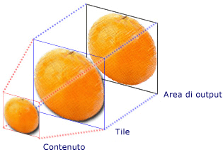
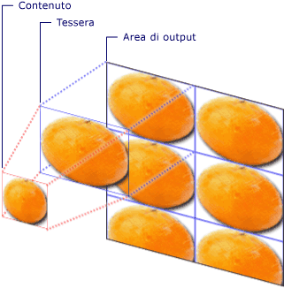

# Cenni preliminari sugli oggetti TileBrush
Gli oggetti <xref:System.Windows.Media.TileBrush> forniscono un elevato livello di controllo sulla modalità di disegno di un'area con un'immagine, un oggetto <xref:System.Windows.Media.Drawing> oppure un oggetto <xref:System.Windows.Media.Visual>.  In questo argomento viene descritto l'utilizzo delle funzionalità di <xref:System.Windows.Media.TileBrush> per acquisire un controllo maggiore sul modo in cui un'area viene disegnata utilizzando <xref:System.Windows.Media.ImageBrush>, <xref:System.Windows.Media.DrawingBrush> o <xref:System.Windows.Media.VisualBrush>.  
  
   
  
   
## Prerequisiti  
 Per la comprensione di questo argomento, è importante capire le modalità di utilizzo delle funzionalità di base della classe <xref:System.Windows.Media.ImageBrush>, <xref:System.Windows.Media.DrawingBrush> o <xref:System.Windows.Media.VisualBrush>.  Per un'introduzione a questi tipi, vedere la sezione [Disegnare con oggetti Image, Drawing e Visual](../../../../docs/framework/wpf/graphics-multimedia/painting-with-images-drawings-and-visuals.md).  
  
   
## Disegno di un'area mediante tessere  
 <xref:System.Windows.Media.ImageBrush>, <xref:System.Windows.Media.DrawingBrush> e <xref:System.Windows.Media.VisualBrush> sono tipi di oggetti <xref:System.Windows.Media.TileBrush>.  I pennelli tessera forniscono un elevato livello di controllo sulla modalità di disegno di un'area con un'immagine, un disegno o un elemento visivo.  Ad esempio, anziché disegnare un'area con una sola immagine estesa, è possibile utilizzare una serie di immagini affiancate che creano un motivo.  
  
 Il disegno di un'area con un pennello tessera include tre componenti: il contenuto, la tessera di base e l'area di output.  
  
   
Componenti di un oggetto TileBrush con una sola tessera  
  
   
Componenti di un oggetto TileBrush con TileMode impostata su Tile  
  
 Per area di output si intende l'area che viene disegnata, ad esempio l'oggetto <xref:System.Windows.Shapes.Shape.Fill%2A> di un oggetto <xref:System.Windows.Shapes.Ellipse> oppure l'oggetto <xref:System.Windows.Controls.Control.Background%2A> di un oggetto <xref:System.Windows.Controls.Button>.  Nelle sezioni successive vengono descritti gli altri due componenti di un oggetto <xref:System.Windows.Media.TileBrush>.  
  
   
## Contenuto del pennello  
 Esistono tre tipi diversi di <xref:System.Windows.Media.TileBrush>, ciascuno con un tipo di contenuto diverso.  
  
-   Se il pennello è di tipo <xref:System.Windows.Media.ImageBrush>, il contenuto sarà un'immagine. La proprietà <xref:System.Windows.Media.ImageBrush.ImageSource%2A> specifica il contenuto di <xref:System.Windows.Media.ImageBrush>.  
  
-   Se il pennello è di tipo <xref:System.Windows.Media.DrawingBrush>, il contenuto sarà un disegno.  La proprietà <xref:System.Windows.Media.DrawingBrush.Drawing%2A> specifica il contenuto della classe <xref:System.Windows.Media.DrawingBrush>.  
  
-   Se il pennello è una classe <xref:System.Windows.Media.VisualBrush>, il contenuto è un oggetto visivo.  La proprietà <xref:System.Windows.Media.VisualBrush.Visual%2A> specifica il contenuto della classe <xref:System.Windows.Media.VisualBrush>.  
  
 È possibile specificare la posizione e le dimensioni del contenuto di <xref:System.Windows.Media.TileBrush> utilizzando la proprietà <xref:System.Windows.Media.TileBrush.Viewbox%2A>, anche se in genere per la proprietà <xref:System.Windows.Media.TileBrush.Viewbox%2A> viene mantenuto il valore predefinito.  Per impostazione predefinita, la proprietà <xref:System.Windows.Media.TileBrush.Viewbox%2A> è configurata in modo da contenere completamente i contenuti del pennello.  Per ulteriori informazioni sulla configurazione di <xref:System.Windows.Controls.Viewbox>, vedere la pagina delle proprietà <xref:System.Windows.Controls.Viewbox>.  
  
   
## Tessera di base  
 Un oggetto <xref:System.Windows.Media.TileBrush> proietta il relativo contenuto su una tessera di base.  La proprietà <xref:System.Windows.Media.TileBrush.Stretch%2A> controlla la modalità di estensione del contenuto <xref:System.Windows.Media.TileBrush> all'interno della tessera di base.  La proprietà <xref:System.Windows.Media.TileBrush.Stretch%2A> accetta i seguenti valori, definiti dall'enumerazione <xref:System.Windows.Media.Stretch>:  
  
-   <xref:System.Windows.Media.Stretch>: il contenuto del pennello non viene esteso in modo tale da occupare l'intera tessera.  
  
-   <xref:System.Windows.Media.Stretch>: il contenuto del pennello viene ridimensionato in modo da adattarlo alla tessera.  Poiché l'altezza e la larghezza del contenuto vengono scalate in modo indipendente, le proporzioni originali del contenuto potrebbero non essere mantenute.  In atri termini, il contenuto del pennello potrebbe essere distorto allo scopo di riempire completamente la tessera di output.  
  
-   <xref:System.Windows.Media.Stretch>: il contenuto del pennello viene ridimensionato in modo da adattarlo completamente alla tessera.  Le proporzioni del contenuto vengono mantenute.  
  
-   <xref:System.Windows.Media.Stretch>: il contenuto del pennello viene ridimensionato in modo da riempire completamente l'area di output, rispettando al tempo stesso le proporzioni originali del contenuto.  
  
 Nell'immagine seguente sono illustrate le diverse impostazioni della proprietà <xref:System.Windows.Media.TileBrush.Stretch%2A>.  
  
   
  
 Nell'esempio riportato di seguito, il contenuto di un oggetto <xref:System.Windows.Media.ImageBrush> è impostato in modo da non consentirne il ridimensionamento per riempire l'area di output.  
  
 [!code-xml[BrushOverviewExamples_snip#GraphicsMMNoStretchExample](../../../../samples/snippets/xaml/VS_Snippets_Wpf/BrushOverviewExamples_snip/XAML/StretchExample.xaml#graphicsmmnostretchexample)]  
  
 [!code-csharp[BrushOverviewExamples_procedural_snip#GraphicsMMNoStretchExample](../../../../samples/snippets/csharp/VS_Snippets_Wpf/BrushOverviewExamples_procedural_snip/CSharp/StretchExample.cs#graphicsmmnostretchexample)]
 [!code-vb[BrushOverviewExamples_procedural_snip#GraphicsMMNoStretchExample](../../../../samples/snippets/visualbasic/VS_Snippets_Wpf/BrushOverviewExamples_procedural_snip/visualbasic/stretchexample.vb#graphicsmmnostretchexample)]  
  
 Per impostazione predefinita, un oggetto <xref:System.Windows.Media.TileBrush> genera una singola tessera \(la tessera di base\) e la estende in modo da riempire completamente l'area di output.  È possibile modificare le dimensioni e la posizione della tessera di base impostando le proprietà <xref:System.Windows.Media.TileBrush.Viewport%2A> e <xref:System.Windows.Media.TileBrush.ViewportUnits%2A>.  
  
   
### Dimensioni della tessera di base  
 La proprietà <xref:System.Windows.Media.TileBrush.Viewport%2A> determina le dimensioni e la posizione della tessera di base, mentre la proprietà <xref:System.Windows.Media.TileBrush.ViewportUnits%2A> consente di stabilire se la proprietà <xref:System.Windows.Media.TileBrush.Viewport%2A> viene specificata utilizzando coordinate assolute o relative.  Se le coordinate sono relative, sono condizionate dalle dimensioni dell'area di output.  I punti \(0,0\) e \(1,1\) rappresentano rispettivamente l'angolo superiore sinistro e l'angolo inferiore destro dell'area di output.  Per specificare che la proprietà <xref:System.Windows.Media.TileBrush.Viewport%2A> utilizza coordinate assolute, impostare la proprietà <xref:System.Windows.Media.TileBrush.ViewportUnits%2A> su <xref:System.Windows.Media.BrushMappingMode>.  
  
 Nell'immagine seguente è illustrata la differenza in termini di output tra un oggetto <xref:System.Windows.Media.TileBrush> con la proprietà <xref:System.Windows.Media.TileBrush.ViewportUnits%2A> impostata su un valore assoluto e lo stesso oggetto con la stessa proprietà impostata su un valore relativo.  Notare che in ogni immagine viene mostrato un modello affiancato; nella sezione successiva viene indicato come specificare il modello di affiancamento.  
  
   
  
 Nell'esempio riportato di seguito, viene utilizzata un'immagine per creare una tessera di larghezza pari al 50% dell'altezza.  La tessera di base viene posizionata nel punto \(0,0\) dell'area di output.  
  
 [!code-xml[BrushOverviewExamples_snip#GraphicsMMRelativeViewportUnitsExample1](../../../../samples/snippets/xaml/VS_Snippets_Wpf/BrushOverviewExamples_snip/XAML/TileSizeExample.xaml#graphicsmmrelativeviewportunitsexample1)]  
  
 [!code-csharp[BrushOverviewExamples_procedural_snip#GraphicsMMRelativeViewportUnitsExample1](../../../../samples/snippets/csharp/VS_Snippets_Wpf/BrushOverviewExamples_procedural_snip/CSharp/TileSizeExample.cs#graphicsmmrelativeviewportunitsexample1)]
 [!code-vb[BrushOverviewExamples_procedural_snip#GraphicsMMRelativeViewportUnitsExample1](../../../../samples/snippets/visualbasic/VS_Snippets_Wpf/BrushOverviewExamples_procedural_snip/visualbasic/tilesizeexample.vb#graphicsmmrelativeviewportunitsexample1)]  
  
 Nell'esempio successivo le tessere di un oggetto <xref:System.Windows.Media.ImageBrush> sono impostate su un numero di pixel[Device Independent Pixel](GTMT) pari a 25 per 25.  Poiché i valori di <xref:System.Windows.Media.TileBrush.ViewportUnits%2A> sono assoluti, le tessere <xref:System.Windows.Media.ImageBrush> saranno sempre di dimensioni 25 per 25 pixel, a prescindere dalle dimensioni dell'area disegnata.  
  
 [!code-xml[BrushOverviewExamples_snip#GraphicsMMAbsoluteViewportUnitsExample1](../../../../samples/snippets/xaml/VS_Snippets_Wpf/BrushOverviewExamples_snip/XAML/TileSizeExample.xaml#graphicsmmabsoluteviewportunitsexample1)]  
  
 [!code-csharp[BrushOverviewExamples_procedural_snip#GraphicsMMAbsoluteViewportUnitsExample1](../../../../samples/snippets/csharp/VS_Snippets_Wpf/BrushOverviewExamples_procedural_snip/CSharp/TileSizeExample.cs#graphicsmmabsoluteviewportunitsexample1)]
 [!code-vb[BrushOverviewExamples_procedural_snip#GraphicsMMAbsoluteViewportUnitsExample1](../../../../samples/snippets/visualbasic/VS_Snippets_Wpf/BrushOverviewExamples_procedural_snip/visualbasic/tilesizeexample.vb#graphicsmmabsoluteviewportunitsexample1)]  
  
   
### Comportamento dell'affiancamento  
 Un oggetto <xref:System.Windows.Media.TileBrush> genera un modello affiancato se la tessera di base non occupa completamente l'area di output e se viene specificata una modalità di affiancamento diversa da <xref:System.Windows.Media.TileMode>.  Se il pennello tessera non occupa completamente l'area di output, la relativa proprietà <xref:System.Windows.Media.TileBrush.TileMode%2A> specifica se è necessario duplicare la tessera in modo da riempire l'area di output e, in tal caso, il modo in cui la tessere deve essere duplicata.  La proprietà <xref:System.Windows.Media.TileBrush.TileMode%2A> accetta i seguenti valori, definiti dall'enumerazione <xref:System.Windows.Media.TileMode>:  
  
-   <xref:System.Windows.Media.TileMode>: viene disegnata solo la tessera di base.  
  
-   <xref:System.Windows.Media.TileMode>: viene disegnata la tessera di base, e la restante area viene riempita ripetendo la tessera di base in modo che il bordo destro di una tessera sia adiacente al bordo sinistro di quella successiva e che lo stesso avvenga per i bordi superiore e inferiore.  
  
-   <xref:System.Windows.Media.TileMode>: simile a <xref:System.Windows.Media.TileMode>, con la differenza che le tessere affiancate vengono capovolte in senso orizzontale a colonne alternate.  
  
-   <xref:System.Windows.Media.TileMode>: simile a <xref:System.Windows.Media.TileMode>, con la differenza che le tessere affiancate vengono capovolti in senso verticale a righe alternate.  
  
-   <xref:System.Windows.Media.TileMode>: combinazione delle modalità <xref:System.Windows.Media.TileMode> e <xref:System.Windows.Media.TileMode>.  
  
 Nell'immagine seguente sono illustrate le diverse modalità di affiancamento.  
  
   
  
 Nell'esempio seguente, viene utilizzata un'immagine per disegnare un rettangolo di larghezza e altezza pari a 100 pixel.  Impostando la proprietà <xref:System.Windows.Media.TileBrush.Viewport%2A> del pennello su 0;0;0,25;0,25, la tessera di base del pennello sarà uguale a 1\/4 dell'area di output.  La proprietà <xref:System.Windows.Media.TileBrush.TileMode%2A> del pennello è impostata su <xref:System.Windows.Media.TileMode>.  In questo modo il rettangolo viene riempito con righe di tessere.  
  
 [!code-xml[BrushOverviewExamples_snip#GraphicsMMFlipXYExample](../../../../samples/snippets/xaml/VS_Snippets_Wpf/BrushOverviewExamples_snip/XAML/TilingExample.xaml#graphicsmmflipxyexample)]  
  
 [!code-csharp[BrushOverviewExamples_procedural_snip#GraphicsMMFlipXYExample](../../../../samples/snippets/csharp/VS_Snippets_Wpf/BrushOverviewExamples_procedural_snip/CSharp/TilingExample.cs#graphicsmmflipxyexample)]
 [!code-vb[BrushOverviewExamples_procedural_snip#GraphicsMMFlipXYExample](../../../../samples/snippets/visualbasic/VS_Snippets_Wpf/BrushOverviewExamples_procedural_snip/visualbasic/tilingexample.vb#graphicsmmflipxyexample)]  
  
## Vedere anche  
 <xref:System.Windows.Media.ImageBrush>   
 <xref:System.Windows.Media.DrawingBrush>   
 <xref:System.Windows.Media.VisualBrush>   
 <xref:System.Windows.Media.TileBrush>   
 [Disegnare con oggetti Image, Drawing e Visual](../../../../docs/framework/wpf/graphics-multimedia/painting-with-images-drawings-and-visuals.md)   
 [Procedure relative](../../../../docs/framework/wpf/graphics-multimedia/brushes-how-to-topics.md)   
 [Cenni preliminari sugli oggetti Freezable](../../../../docs/framework/wpf/advanced/freezable-objects-overview.md)   
 [Esempio di ImageBrush](http://go.microsoft.com/fwlink/?LinkID=160005)   
 [Esempio di VisualBrush](http://go.microsoft.com/fwlink/?LinkID=160049)