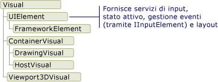
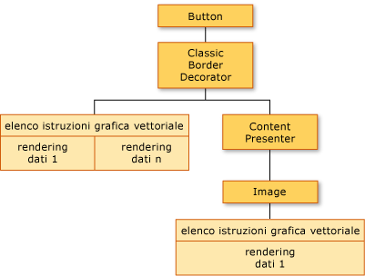
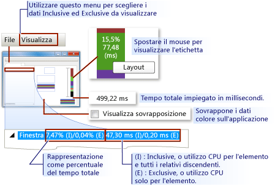
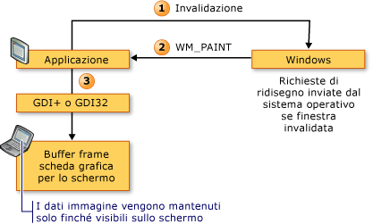
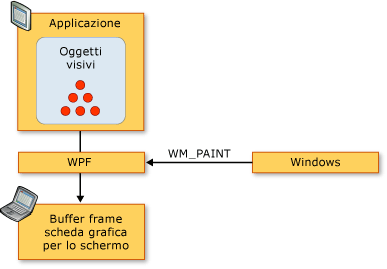
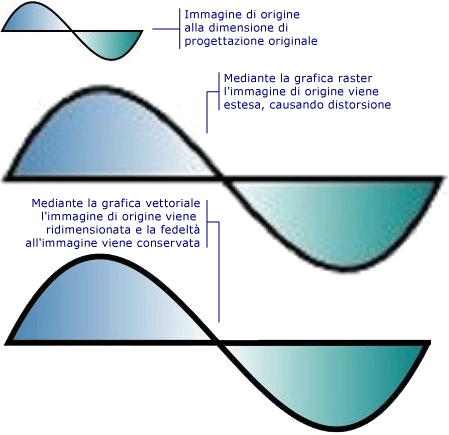
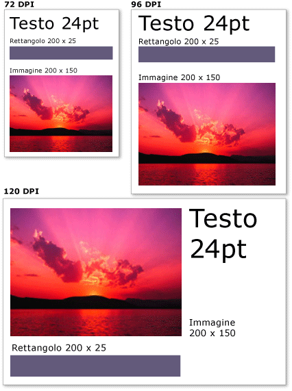

# Cenni preliminari sul rendering della grafica WPF
In questo argomento vengono forniti cenni preliminari sul livello visivo di [!INCLUDE[TLA2#tla_winclient](../../../../includes/tla2sharptla-winclient-md.md)].  Viene analizzato il ruolo della classe <xref:System.Windows.Media.Visual> per il supporto del rendering nel modello [!INCLUDE[TLA2#tla_winclient](../../../../includes/tla2sharptla-winclient-md.md)].  
  
   
  
   
## Ruolo dell'oggetto visivo  
 La classe <xref:System.Windows.Media.Visual> rappresenta l'astrazione base da cui deriva ogni oggetto <xref:System.Windows.FrameworkElement>.  Svolge anche la funzione di punto di ingresso per la scrittura di nuovi controlli in [!INCLUDE[TLA2#tla_winclient](../../../../includes/tla2sharptla-winclient-md.md)] e in molti casi può essere concepita come l'handle di finestra \(HWND\) nel modello di applicazione Win32.  
  
 <xref:System.Windows.Media.Visual> è un oggetto [!INCLUDE[TLA2#tla_winclient](../../../../includes/tla2sharptla-winclient-md.md)] principale, il cui ruolo primario è quello di fornire un supporto di rendering.  I controlli dell'interfaccia utente, ad esempio <xref:System.Windows.Controls.Button> e <xref:System.Windows.Controls.TextBox>, derivano dalla classe <xref:System.Windows.Media.Visual> e la utilizzano per salvare in modo permanente i dati di rendering.  L'oggetto <xref:System.Windows.Media.Visual> fornisce supporto per:  
  
-   Visualizzazione dell'output: eseguire il rendering del contenuto del disegno serializzato e salvato in modo permanente di un elemento visivo.  
  
-   Trasformazioni: esecuzione di trasformazioni su un elemento visivo.  
  
-   Area di visualizzazione: fornire supporto dell'area di visualizzazione per un elemento visivo.  
  
-   Hit test: stabilire se una coordinata o una geometria è contenuta entro i limiti di un elemento visivo.  
  
-   Calcoli del riquadro delimitatore: definire il rettangolo di delimitazione di un elemento visivo.  
  
 Tuttavia, l'oggetto <xref:System.Windows.Media.Visual> non include il supporto per le funzionalità non relative al rendering, ad esempio:  
  
-   Gestione degli eventi  
  
-   Layout  
  
-   Stili  
  
-   Associazione dati  
  
-   Globalizzazione  
  
 <xref:System.Windows.Media.Visual> è esposto come classe astratta pubblica da cui devono essere derivate le classi figlio.  Nella figura riportata di seguito viene illustrata la gerarchia degli oggetti visivi esposti in [!INCLUDE[TLA2#tla_winclient](../../../../includes/tla2sharptla-winclient-md.md)].  
  
   
Gerarchia delle classi visive  
  
### Classe DrawingVisual  
 <xref:System.Windows.Media.DrawingVisual> è una classe di disegno semplificata utilizzata per il rendering di forme, immagini o testo.  Questa classe è considerata semplice perché non fornisce la gestione del layout o degli eventi, migliorando in tal modo le prestazioni in fase di esecuzione.  Per questo motivo, i disegni sono ideali per gli sfondi e per ClipArt.  È possibile utilizzare <xref:System.Windows.Media.DrawingVisual> per creare un oggetto visivo personalizzato.  Per ulteriori informazioni, vedere [Utilizzo degli oggetti DrawingVisual](../../../../docs/framework/wpf/graphics-multimedia/using-drawingvisual-objects.md).  
  
### Classe Viewport3DVisual  
 <xref:System.Windows.Media.Media3D.Viewport3DVisual> crea un ponte tra gli oggetti <xref:System.Windows.Media.Visual> 2D e gli oggetti <xref:System.Windows.Media.Media3D.Visual3D>.  La classe <xref:System.Windows.Media.Media3D.Visual3D> è la classe base per tutti gli elementi visivi 3D.  <xref:System.Windows.Media.Media3D.Viewport3DVisual> richiede la definizione di un valore <xref:System.Windows.Media.Media3D.Viewport3DVisual.Camera%2A> e di un valore <xref:System.Windows.Media.Media3D.Viewport3DVisual.Viewport%2A>.  La fotocamera consente di visualizzare la scena.  Il riquadro di visualizzazione stabilisce il punto in cui la proiezione esegue il mapping sulla superficie 2D.  Per ulteriori informazioni sulle caratteristiche 3D in [!INCLUDE[TLA2#tla_winclient](../../../../includes/tla2sharptla-winclient-md.md)], vedere [Cenni preliminari sulla grafica tridimensionale](../../../../docs/framework/wpf/graphics-multimedia/3-d-graphics-overview.md).  
  
### Classe ContainerVisual  
 La classe <xref:System.Windows.Media.ContainerVisual> viene utilizzata come contenitore per una raccolta di oggetti <xref:System.Windows.Media.Visual>.  La classe <xref:System.Windows.Media.DrawingVisual> deriva dalla classe <xref:System.Windows.Media.ContainerVisual> e le consente di contenere una raccolta di oggetti visivi.  
  
### Contenuto del disegno negli oggetti visivi  
 Un oggetto <xref:System.Windows.Media.Visual> archivia i dati di rendering come **elenco di istruzioni di grafica vettoriale**.  Ciascun elemento nell'elenco di istruzioni rappresenta un insieme di dati di grafica di basso livello e risorse associate in un formato serializzato.  Esistono quattro tipi diversi di dati di rendering che possono ospitare contenuto di disegno.  
  
|Tipo di contenuto del disegno|Descrizione|  
|-----------------------------------|-----------------|  
|Grafica vettoriale|Rappresenta i dati di grafica vettoriale e tutte le informazioni relative agli oggetti <xref:System.Windows.Media.Brush> e <xref:System.Windows.Media.Pen> associati.|  
|Image|Rappresenta un'immagine in un'area definita da un oggetto <xref:System.Windows.Rect>.|  
|Glifo|Rappresenta un disegno che esegue il rendering di un oggetto <xref:System.Windows.Media.GlyphRun>, ovvero una sequenza di glifi di una risorsa di tipi di carattere specificata.  Il testo viene rappresentato nel modo seguente.|  
|Video|Rappresenta un disegno che esegue il rendering di contenuto video.|  
  
 <xref:System.Windows.Media.DrawingContext> consente di compilare <xref:System.Windows.Media.Visual> con contenuto visivo.  Quando si utilizzano i comandi di disegno di un oggetto <xref:System.Windows.Media.DrawingContext>, si archivia un insieme di dati di rendering che verranno in seguito utilizzati dal sistema di grafica, ma non si eseguono disegni sullo schermo in tempo reale.  
  
 Quando si crea un controllo [!INCLUDE[TLA2#tla_winclient](../../../../includes/tla2sharptla-winclient-md.md)], ad esempio <xref:System.Windows.Controls.Button>, il controllo genera dati di rendering in modo implicito per il disegno stesso.  Ad esempio, l'impostazione della proprietà <xref:System.Windows.Controls.ContentControl.Content%2A> dell'oggetto <xref:System.Windows.Controls.Button> determina l'archiviazione di una rappresentazione di rendering di un glifo nel controllo.  
  
 Un oggetto <xref:System.Windows.Media.Visual> descrive il proprio contenuto come uno o più oggetti <xref:System.Windows.Media.Drawing> contenuti in un oggetto <xref:System.Windows.Media.DrawingGroup>.  Un oggetto <xref:System.Windows.Media.DrawingGroup> descrive anche le maschere di opacità, le trasformazioni, gli effetti bitmap e altre operazioni applicate al relativo contenuto.  Quando viene eseguito il rendering del contenuto, le operazioni <xref:System.Windows.Media.DrawingGroup> vengono applicate nel seguente ordine: <xref:System.Windows.Media.DrawingGroup.OpacityMask%2A>, <xref:System.Windows.Media.DrawingGroup.Opacity%2A>, <xref:System.Windows.Media.DrawingGroup.BitmapEffect%2A>, <xref:System.Windows.Media.DrawingGroup.ClipGeometry%2A>, <xref:System.Windows.Media.DrawingGroup.GuidelineSet%2A>, quindi <xref:System.Windows.Media.DrawingGroup.Transform%2A>.  
  
 Nella figura riportata di seguito viene illustrato l'ordine in cui vengono applicate le operazioni <xref:System.Windows.Media.DrawingGroup> durante la sequenza di rendering.  
  
   
Ordine delle operazioni dell'oggetto DrawingGroup  
  
 Per ulteriori informazioni, vedere [Cenni preliminari sugli oggetti Drawing](../../../../docs/framework/wpf/graphics-multimedia/drawing-objects-overview.md).  
  
#### Contenuto del disegno a livello visivo  
 Non si crea mai direttamente un'istanza di <xref:System.Windows.Media.DrawingContext>, tuttavia è possibile acquisire un contesto di disegno tramite determinati metodi, ad esempio <xref:System.Windows.Media.DrawingGroup.Open%2A?displayProperty=fullName> e <xref:System.Windows.Media.DrawingVisual.RenderOpen%2A?displayProperty=fullName>.  Nell'esempio riportato di seguito un oggetto <xref:System.Windows.Media.DrawingContext> viene recuperato da un oggetto <xref:System.Windows.Media.DrawingVisual>, quindi viene utilizzato per disegnare un rettangolo.  
  
 [!code-csharp[drawingvisualsample#101](../../../../samples/snippets/csharp/VS_Snippets_Wpf/DrawingVisualSample/CSharp/Window1.xaml.cs#101)]
 [!code-vb[drawingvisualsample#101](../../../../samples/snippets/visualbasic/VS_Snippets_Wpf/DrawingVisualSample/visualbasic/window1.xaml.vb#101)]  
  
#### Enumerazione del contenuto del disegno a livello visivo  
 Oltre agli altri utilizzi, gli oggetti <xref:System.Windows.Media.Drawing> forniscono anche un modello a oggetti per l'enumerazione del contenuto di un oggetto <xref:System.Windows.Media.Visual>.  
  
> [!NOTE]
>  Quando viene enumerato il contenuto dell'oggetto visivo, vengono recuperati oggetti <xref:System.Windows.Media.Drawing> e non la rappresentazione sottostante dei dati di rendering come elenco di istruzioni della grafica vettoriale.  
  
 Nell’esempio riportato di seguito viene utilizzato il metodo <xref:System.Windows.Media.VisualTreeHelper.GetDrawing%2A> per recuperare il valore <xref:System.Windows.Media.DrawingGroup> di un oggetto <xref:System.Windows.Media.Visual> e per enumerarlo.  
  
 [!code-csharp[DrawingMiscSnippets_snip#GraphicsMMRetrieveDrawings](../../../../samples/snippets/csharp/VS_Snippets_Wpf/DrawingMiscSnippets_snip/CSharp/EnumerateDrawingsExample.xaml.cs#graphicsmmretrievedrawings)]  
  
   
## Utilizzo di oggetti visivi per la compilazione di controlli  
 Poiché molti oggetti disponibili in [!INCLUDE[TLA2#tla_winclient](../../../../includes/tla2sharptla-winclient-md.md)] sono composti da altri oggetti visivi, possono contenere gerarchie variabili di oggetti discendenti.  Molti elementi dell'interfaccia utente disponibili in [!INCLUDE[TLA2#tla_winclient](../../../../includes/tla2sharptla-winclient-md.md)], come i controlli, sono composti da più oggetti visivi, che rappresentano tipi diversi di elementi di rendering.  Ad esempio, il controllo <xref:System.Windows.Controls.Button> può contenere numerosi altri oggetti, tra cui <xref:Microsoft.Windows.Themes.ClassicBorderDecorator>, <xref:System.Windows.Controls.ContentPresenter> e <xref:System.Windows.Controls.TextBlock>.  
  
 Nel codice riportato di seguito viene illustrato un controllo <xref:System.Windows.Controls.Button> definito nel markup.  
  
 [!code-xml[VisualsOverview#VisualsOverviewSnippet1](../../../../samples/snippets/csharp/VS_Snippets_Wpf/VisualsOverview/CSharp/Window1.xaml#visualsoverviewsnippet1)]  
  
 Se si esegue l'enumerazione degli oggetti visivi che compongono il controllo <xref:System.Windows.Controls.Button> predefinito, si ottiene la gerarchia di oggetti visivi illustrata di seguito:  
  
   
Diagramma della gerarchia della struttura ad albero visuale  
  
 Il controllo <xref:System.Windows.Controls.Button> contiene un elemento <xref:Microsoft.Windows.Themes.ClassicBorderDecorator>, che a sua volta contiene un elemento <xref:System.Windows.Controls.ContentPresenter>.  L'elemento <xref:Microsoft.Windows.Themes.ClassicBorderDecorator> è responsabile del disegno di un bordo e di uno sfondo per <xref:System.Windows.Controls.Button>.  L'elemento <xref:System.Windows.Controls.ContentPresenter> è responsabile della visualizzazione del contenuto di <xref:System.Windows.Controls.Button>.  In questo caso, poiché viene visualizzato testo, l'elemento <xref:System.Windows.Controls.ContentPresenter> contiene un elemento <xref:System.Windows.Controls.TextBlock>.  Il fatto che il controllo <xref:System.Windows.Controls.Button> utilizzi un oggetto <xref:System.Windows.Controls.ContentPresenter> implica che sia possibile rappresentare il contenuto da altri elementi, ad esempio un oggetto <xref:System.Windows.Controls.Image> o una geometria, ad esempio un oggetto <xref:System.Windows.Media.EllipseGeometry>.  
  
### Modelli di controllo  
 La chiave per l'espansione di un controllo in una gerarchia di controlli è <xref:System.Windows.Controls.ControlTemplate>.  Un modello di controllo specifica la gerarchia visiva predefinita per un controllo.  Quando si fa riferimento in modo esplicito a un controllo, si fa riferimento in modo implicito alla relativa gerarchia visiva.  È possibile eseguire l'override dei valori predefiniti per un modello di controllo per dare un aspetto visivo personalizzato a un controllo.  Ad esempio, è possibile modificare il valore del colore di sfondo del controllo <xref:System.Windows.Controls.Button> in modo che utilizzi un valore di colore sfumato lineare anziché un valore di colore a tinta unita.  Per ulteriori informazioni, vedere [Stili e modelli di Button](../../../../docs/framework/wpf/controls/button-styles-and-templates.md).  
  
 Un elemento dell'interfaccia utente, ad esempio un controllo <xref:System.Windows.Controls.Button>, contiene numerosi elenchi di istruzioni della grafica vettoriale in cui viene descritta l'intera definizione di rendering di un controllo.  Nel codice riportato di seguito viene illustrato un controllo <xref:System.Windows.Controls.Button> definito nel markup.  
  
 [!code-xml[VisualsOverview#VisualsOverviewSnippet2](../../../../samples/snippets/csharp/VS_Snippets_Wpf/VisualsOverview/CSharp/Window1.xaml#visualsoverviewsnippet2)]  
  
 Se si eseguisse l'enumerazione degli oggetti visivi e degli elenchi di istruzioni della grafica vettoriale che compongono il controllo <xref:System.Windows.Controls.Button>, si otterrebbe la gerarchia di oggetti illustrata di seguito:  
  
   
Diagramma della struttura ad albero visuale e dei dati di rendering  
  
 Il controllo <xref:System.Windows.Controls.Button> contiene un elemento <xref:Microsoft.Windows.Themes.ClassicBorderDecorator>, che a sua volta contiene un elemento <xref:System.Windows.Controls.ContentPresenter>.  L'elemento <xref:Microsoft.Windows.Themes.ClassicBorderDecorator> è responsabile del disegno di tutti gli elementi grafici discreti che compongono il bordo e lo sfondo di un pulsante.  L'elemento <xref:System.Windows.Controls.ContentPresenter> è responsabile della visualizzazione del contenuto di <xref:System.Windows.Controls.Button>.  In questo caso, poiché viene visualizzata un'immagine, l'elemento <xref:System.Windows.Controls.ContentPresenter>contiene un elemento <xref:System.Windows.Controls.Image>.  
  
 È opportuno tenere in considerazione alcuni punti sulla gerarchia degli oggetti visivi e sugli elenchi di istruzioni della grafica vettoriale:  
  
-   L'ordinamento nella gerarchia rappresenta l'ordine di rendering delle informazioni di disegno.  Gli elementi figlio vengono attraversati da sinistra a destra, dall'alto in basso, a partire dall'elemento visivo radice.  Se un elemento dispone di elementi figlio visivi, essi vengono attraversati prima degli elementi di pari livello.  
  
-   Gli elementi dei nodi non foglia nella gerarchia, ad esempio <xref:System.Windows.Controls.ContentPresenter>, vengono utilizzati per contenere elementi figlio e non contengono elenchi di istruzioni.  
  
-   Se un elemento visivo contiene sia un elenco di istruzioni della grafica vettoriale sia un elemento visivo figlio, l'elenco di istruzioni nell'elemento visivo padre viene sottoposto a rendering prima dell'esecuzione di disegni in qualsiasi oggetto visivo figlio.  
  
-   Il rendering degli elementi nell'elenco di istruzioni della grafica vettoriale viene eseguito da sinistra a destra.  
  
   
## Struttura ad albero visuale  
 La struttura ad albero visuale contiene tutti gli elementi visivi utilizzati nell'interfaccia utente di un'applicazione.  Poiché un elemento visivo contiene informazioni di disegno salvate in modo permanente, è possibile considerare la struttura ad albero visuale come un grafico di scena, contenente tutte le informazioni di rendering necessarie per comporre l'output per il dispositivo di visualizzazione.  Questa struttura ad albero è la somma di tutti gli elementi visivi creati direttamente dall'applicazione, nel codice o nel markup.  La struttura ad albero visuale contiene inoltre tutti gli elementi visivi creati dall'espansione del modello di elementi, quali controlli e oggetti dati.  
  
 Nel codice riportato di seguito viene illustrato un elemento <xref:System.Windows.Controls.StackPanel> definito nel markup.  
  
 [!code-xml[VisualsOverview#VisualsOverviewSnippet3](../../../../samples/snippets/csharp/VS_Snippets_Wpf/VisualsOverview/CSharp/Window1.xaml#visualsoverviewsnippet3)]  
  
 Se si eseguisse l'enumerazione degli oggetti visivi che compongono l'elemento <xref:System.Windows.Controls.StackPanel> dell'esempio di markup, si otterrebbe la gerarchia di oggetti visivi illustrata di seguito:  
  
   
Diagramma della gerarchia della struttura ad albero visuale  
  
### Ordine di rendering  
 La struttura ad albero visuale determina l'ordine di rendering degli oggetti visivi e di disegno di [!INCLUDE[TLA2#tla_winclient](../../../../includes/tla2sharptla-winclient-md.md)].  L'ordine di scorrimento inizia con l'elemento visivo radice, ovvero il nodo di primo piano della struttura ad albero visuale.  Vengono quindi attraversati gli elementi figlio dell'elemento visivo radice, da sinistra a destra.  Se un elemento visivo ha elementi figlio, questi ultimi vengono attraversati prima degli elementi visivi di pari livello.  Ciò significa che il contenuto di un elemento visivo figlio viene sottoposto a rendering prima del contenuto dell'elemento visivo stesso.  
  
   
Diagramma dell'ordine di rendering della struttura ad albero visuale  
  
### Elemento visivo radice  
 L'**elemento visivo radice** è l'elemento di primo piano nella gerarchia di una struttura ad albero visuale.  Nella maggior parte delle applicazioni, la classe base dell'elemento visivo radice è <xref:System.Windows.Window> oppure <xref:System.Windows.Navigation.NavigationWindow>.  Tuttavia, se in un'applicazione Win32 venissero ospitati oggetti visivi, l'elemento visivo radice sarebbe l'elemento visivo di primo piano ospitato nella finestra Win32.  Per ulteriori informazioni, vedere [Esercitazione: hosting di oggetti visivi in un'applicazione Win32](../../../../docs/framework/wpf/graphics-multimedia/tutorial-hosting-visual-objects-in-a-win32-application.md).  
  
### Relazione con l'albero logico  
 L'albero logico in [!INCLUDE[TLA2#tla_winclient](../../../../includes/tla2sharptla-winclient-md.md)] rappresenta gli elementi di un'applicazione in fase di esecuzione.  Sebbene questa struttura ad albero non venga modificata direttamente, questa visualizzazione dell'applicazione è utile per comprendere l'ereditarietà delle proprietà e il routing degli eventi.  A differenza della struttura ad albero visuale, l'albero logico può rappresentare oggetti dati non visivi, ad esempio <xref:System.Windows.Documents.ListItem>.  In molti casi, il mapping dell'albero logico viene eseguito in modo molto simile alle definizioni di markup di un'applicazione.  Nel codice riportato di seguito viene illustrato un elemento <xref:System.Windows.Controls.DockPanel> definito nel markup.  
  
 [!code-xml[VisualsOverview#VisualsOverviewSnippet5](../../../../samples/snippets/csharp/VS_Snippets_Wpf/VisualsOverview/CSharp/Window1.xaml#visualsoverviewsnippet5)]  
  
 Se si eseguisse l'enumerazione degli oggetti logici che compongono l'elemento <xref:System.Windows.Controls.DockPanel> dell'esempio di markup, si otterrebbe la gerarchia di oggetti logici illustrata di seguito:  
  
   
Diagramma dell'albero logico  
  
 Sia la struttura ad albero visuale sia l'albero logico sono sincronizzati all'insieme corrente di elementi applicazione e riflettono qualsiasi operazione di aggiunta, cancellazione o modifica di elementi.  Tuttavia, presentano visualizzazioni diverse dell'applicazione.  A differenza della struttura ad albero visuale, l'albero logico non espande un elemento <xref:System.Windows.Controls.ContentPresenter> del controllo.  Ciò significa che non esiste una corrispondenza diretta uno\-a\-uno tra un albero logico e una struttura ad albero visuale per lo stesso insieme di oggetti.  Infatti, richiamando il metodo <xref:System.Windows.LogicalTreeHelper.GetChildren%2A> dell'oggetto **LogicalTreeHelper** e il metodo <xref:System.Windows.Media.VisualTreeHelper.GetChild%2A> dell'oggetto **VisualTreeHelper** con lo stesso elemento come parametro vengono restituiti risultati diversi.  
  
 Per ulteriori informazioni sull'albero logico, vedere [Strutture ad albero in WPF](../../../../docs/framework/wpf/advanced/trees-in-wpf.md).  
  
### Visualizzazione della struttura ad albero visuale con XamlPad  
 Lo strumento XamlPad di [!INCLUDE[TLA2#tla_winclient](../../../../includes/tla2sharptla-winclient-md.md)] offre un'opzione per la visualizzazione e l'esplorazione della struttura ad albero visuale che corrisponde al contenuto di [!INCLUDE[TLA#tla_titlexaml](../../../../includes/tlasharptla-titlexaml-md.md)] attualmente definito.  Fare clic sul pulsante **Show Visual Tree** sulla barra dei menu per visualizzare la struttura ad albero visuale.  Nella figura seguente viene illustrata l'espansione del contenuto [!INCLUDE[TLA#tla_titlexaml](../../../../includes/tlasharptla-titlexaml-md.md)] in nodi della struttura ad albero visuale nel pannello **Visual Tree Explorer** di XamlPad:  
  
   
Pannello Visual Tree Explorer in XamlPad  
  
 Si noti come in ognuno dei controlli <xref:System.Windows.Controls.Label>, <xref:System.Windows.Controls.TextBox> e <xref:System.Windows.Controls.Button> venga visualizzata una gerarchia di oggetti visivi separata nel pannello **Visual Tree Explorer** di XamlPad.  Questa situazione si verifica poiché i controlli [!INCLUDE[TLA2#tla_winclient](../../../../includes/tla2sharptla-winclient-md.md)] dispongono di un oggetto <xref:System.Windows.Controls.ControlTemplate> che contiene la struttura ad albero visuale di tale controllo.  Quando si fa riferimento in modo esplicito a un controllo, si fa riferimento in modo implicito alla relativa gerarchia visiva.  
  
### Analisi delle prestazioni visive  
 [!INCLUDE[TLA2#tla_winclient](../../../../includes/tla2sharptla-winclient-md.md)] fornisce una suite di strumenti di analisi delle prestazioni che consente di esaminare il comportamento dell'applicazione in fase di esecuzione e di determinare i tipi di ottimizzazione delle prestazioni che è possibile applicare.  Lo strumento Visual Profiler consente di ottenere una rappresentazione grafica completa dei dati relativi alle prestazioni eseguendo direttamente il mapping alla struttura ad albero visuale dell'applicazione.   In questa schermata, la sezione **CPU Usage** di Visual Profiler fornisce un'indicazione dettagliata dell'utilizzo dei servizi [!INCLUDE[TLA2#tla_winclient](../../../../includes/tla2sharptla-winclient-md.md)] da parte di un oggetto, ad esempio il rendering e il layout.  
  
   
Output visualizzato di Visual Profiler  
  
   
## Comportamento di rendering visivo  
 [!INCLUDE[TLA2#tla_winclient](../../../../includes/tla2sharptla-winclient-md.md)] offre numerose funzionalità che hanno effetto sul comportamento di rendering degli oggetti visivi: grafica in modalità differita, grafica vettoriale e grafica indipendente dal dispositivo.  
  
### Grafica in modalità differita  
 Uno dei fattori chiave per la comprensione del ruolo degli oggetti visivi è la differenza tra i sistemi di grafica in **modalità immediata** e in **modalità differita**.  Un'applicazione Win32 standard basata su GDI o GDI\+ utilizza un sistema di grafica in modalità immediata.  Ciò significa che è compito dell'applicazione ridisegnare la porzione dell'area client invalidata, a causa di un'azione come il ridimensionamento di una finestra o la modifica dell'aspetto visivo di un oggetto.  
  
   
Diagramma della sequenza di rendering di Win32  
  
 [!INCLUDE[TLA2#tla_winclient](../../../../includes/tla2sharptla-winclient-md.md)] utilizza invece un sistema in modalità differita.  Ciò significa che gli oggetti applicazione che presentano un aspetto visivo definiscono un insieme di dati di disegno serializzato.  Dopo aver definito i dati di disegno, il sistema è responsabile della successiva risposta a tutte le richieste di ridisegno per il rendering degli oggetti applicazione.  Anche in fase di esecuzione è possibile modificare o creare oggetti applicazione e affidarsi al sistema per rispondere alle richieste di disegno.  Il punto di forza di un sistema di grafica in modalità differita è dato dal fatto che le informazioni di disegno vengono sempre salvate in modo permanente in uno stato serializzato dall'applicazione, ma la responsabilità del rendering viene lasciata al sistema.  Nel diagramma riportato di seguito viene illustrato come l'applicazione si basi su [!INCLUDE[TLA2#tla_winclient](../../../../includes/tla2sharptla-winclient-md.md)] per la risposta alle richieste di disegno.  
  
   
Diagramma della sequenza di rendering WPF  
  
#### Ridisegno intelligente  
 Uno dei vantaggi maggiori dell'utilizzo della grafica in modalità differita consiste nella possibilità offerta da [!INCLUDE[TLA2#tla_winclient](../../../../includes/tla2sharptla-winclient-md.md)] di ottimizzare in modo efficace gli elementi da ridisegnare nell'applicazione.  Anche se si dispone di una scena complessa con livelli di opacità variabili, non è in genere necessario scrivere codice specifico per ottimizzare il ridisegno.  Confrontare questa caratteristica con la programmazione Win32 in cui sono richieste numerose operazioni per ottimizzare l'applicazione riducendo al minimo la quantità di ridisegno nell'area di aggiornamento.  Per un esempio della complessità dell'ottimizzazione del ridisegno in applicazioni Win32, vedere [Ridisegno nell'area di aggiornamento](_win32_Redrawing_in_the_Update_Region).  
  
### Grafica vettoriale  
 In [!INCLUDE[TLA2#tla_winclient](../../../../includes/tla2sharptla-winclient-md.md)] viene utilizzata la **grafica vettoriale** come formato per i dati di rendering.  La grafica vettoriale, che include Scalable Vector Graphics \(SVG\), metafile Windows \(.wmf\) e tipi di carattere TrueType, archivia i dati di rendering e li trasmette come elenco di istruzioni che descrive come ricreare un'immagine mediante primitive di grafica.  Ad esempio, i tipi di carattere TrueType sono caratteri in formato vettoriale che descrivono un insieme di righe, curve e comandi, anziché una matrice di pixel.  Uno dei vantaggi principali della grafica vettoriale è la possibilità di adattarsi a qualsiasi dimensione e risoluzione.  
  
 Diversamente dalla grafica vettoriale, la grafica bitmap archivia i dati di rendering come rappresentazione pixel per pixel di un'immagine, di cui è stato precedentemente eseguito il rendering per una risoluzione specifica.  Una delle differenze principali tra i formati di grafica bitmap e vettoriale è la fedeltà all'immagine originale.  Ad esempio, quando la dimensione di un'immagine di origine viene modificata, i sistemi di grafica bitmap allungano l'immagine, mentre i sistemi di grafica vettoriale la ridimensionano, conservando la fedeltà all'originale.  
  
 Nella figura seguente viene illustrata un'immagine di origine che è stata ridimensionata del 300%.  Si notino le distorsioni visualizzate quando l'immagine di origine viene allungata come immagine di grafica bitmap, anziché ridimensionata come immagine di grafica vettoriale.  
  
   
Differenze tra grafica raster e vettoriale  
  
 Nel markup riportato di seguito vengono illustrati due elementi <xref:System.Windows.Shapes.Path> definiti.  Nel secondo elemento viene utilizzato un oggetto <xref:System.Windows.Media.ScaleTransform> per ridimensionare le istruzioni di disegno del primo elemento del 300%.  Si noti che le istruzioni di disegno negli elementi <xref:System.Windows.Shapes.Path> rimangono invariate.  
  
 [!code-xml[VectorGraphicsSnippets#VectorGraphicsSnippet1](../../../../samples/snippets/csharp/VS_Snippets_Wpf/VectorGraphicsSnippets/CS/PageOne.xaml#vectorgraphicssnippet1)]  
  
### Informazioni sulla grafica indipendente dalla risoluzione e dal dispositivo  
 Esistono due fattori di sistema che determinano la dimensione del testo e della grafica sullo schermo, risoluzione e DPI.  La risoluzione indica il numero di pixel visualizzati sullo schermo.  Con l'aumento della risoluzione i pixel vengono rimpiccioliti, con la conseguente riduzione della dimensione di testo e grafica.  Un elemento grafico visualizzato su un monitor con impostazione 1024 x 768 avrà dimensioni inferiori con una risoluzione di 1600 x 1200.  
  
 L'altra impostazione di sistema, DPI, indica la dimensione di un pollice di schermo in pixel.  La maggior parte dei sistemi [!INCLUDE[TLA#tla_mswin](../../../../includes/tlasharptla-mswin-md.md)] hanno un valore DPI pari a 96, che indica un pollice di schermo pari a 96 pixel.  Con l'aumento dell'impostazione DPI le dimensioni del pollice di schermo aumentano, mentre con la riduzione del valore DPI le dimensioni del pollice di schermo diminuiscono.  Ciò significa che, nella maggior parte dei sistemi, un pollice di schermo non ha le stesse dimensioni di un pollice reale.  Quando si aumenta il valore DPI, le dimensioni della grafica e del testo compatibili con DPI aumentano poiché viene aumentata la dimensione del pollice di schermo.  L'aumento del valore DPI può rendere più agevole la lettura del testo, specialmente a risoluzioni elevate.  
  
 Non tutte le applicazioni sono compatibili con DPI. Poiché alcune utilizzano i pixel hardware come unità di misura primaria, la modifica del valore DPI di sistema non ha effetto su tali applicazioni.  Molte altre applicazioni utilizzano unità compatibili con DPI per indicare le dimensioni dei tipi di carattere, ma utilizzano i pixel per indicare ogni altro valore.  L'eccessiva riduzione o l'eccessivo aumento del valore DPI può causare problemi di layout in tali applicazioni, poiché il testo delle applicazioni viene ridimensionato con l'impostazione DPI del sistema, a differenza dell'interfaccia utente.  Questo problema è stato eliminato per le applicazioni sviluppate in [!INCLUDE[TLA2#tla_winclient](../../../../includes/tla2sharptla-winclient-md.md)].  
  
 In [!INCLUDE[TLA2#tla_winclient](../../../../includes/tla2sharptla-winclient-md.md)] il ridimensionamento automatico è supportato tramite l'utilizzo del pixel indipendente dal dispositivo come unità di misura primaria, anziché i pixel hardware. La grafica e il testo vengono ridimensionati correttamente senza la necessità di operazioni aggiuntive da parte dello sviluppatore dell'applicazione.  Nella figura riportata di seguito viene illustrato un esempio della modalità di visualizzazione di testo e grafica di [!INCLUDE[TLA2#tla_winclient](../../../../includes/tla2sharptla-winclient-md.md)] con impostazioni DPI diverse.  
  
   
Grafica e testo con impostazioni DPI diverse  
  
   
## Classe VisualTreeHelper  
 La classe <xref:System.Windows.Media.VisualTreeHelper> è una classe di supporto statica che fornisce funzionalità di basso livello per la programmazione a livello degli oggetti visivi, utile in scenari molto specifici, come lo sviluppo di controlli personalizzati dalle prestazioni elevate.  Nella maggior parte dei casi, gli oggetti del framework [!INCLUDE[TLA2#tla_winclient](../../../../includes/tla2sharptla-winclient-md.md)] di livello superiore, ad esempio <xref:System.Windows.Controls.Canvas> e <xref:System.Windows.Controls.TextBlock>, offrono caratteristiche di flessibilità e facilità di utilizzo superiori.  
  
### Hit testing  
 La classe <xref:System.Windows.Media.VisualTreeHelper> offre metodi per eseguire l'hit testing sugli oggetti visivi quando il supporto per l'hit testing predefinito non soddisfa esigenze specifiche.  È possibile utilizzare i metodi <xref:System.Windows.Media.VisualTreeHelper.HitTest%2A> della classe <xref:System.Windows.Media.VisualTreeHelper> per determinare se il valore di coordinata di un punto o di una geometria è compreso nei limiti di un determinato oggetto, ad esempio un controllo o un elemento grafico.  Ad esempio, è possibile utilizzare l'hit testing per determinare se un clic del mouse all'interno del rettangolo di delimitazione di un oggetto viene eseguito nella geometria di un cerchio. È inoltre possibile scegliere di eseguire l'override dell'implementazione predefinita dell'hit testing per eseguire calcoli di hit testing personalizzati.  
  
 Per ulteriori informazioni sull'hit testing, vedere [Hit testing a livello visivo](../../../../docs/framework/wpf/graphics-multimedia/hit-testing-in-the-visual-layer.md).  
  
### Enumerazione della struttura ad albero visuale  
 La classe <xref:System.Windows.Media.VisualTreeHelper> offre funzionalità per l'enumerazione dei membri di una struttura ad albero visuale.  Per recuperare un elemento padre, chiamare il metodo <xref:System.Windows.Media.VisualTreeHelper.GetParent%2A>.  Per recuperare un elemento figlio, o un discendente diretto, di un oggetto visivo, chiamare il metodo <xref:System.Windows.Media.VisualTreeHelper.GetChild%2A>.  Questo metodo restituisce un oggetto <xref:System.Windows.Media.Visual> figlio dell'elemento padre in corrispondenza dell'indice specificato.  
  
 Nell'esempio riportato di seguito viene illustrato come enumerare tutti i discendenti di un oggetto visivo. Si tratta di una tecnica che può risultare utile se si desidera serializzare tutte le informazioni di rendering relative a una gerarchia di oggetti visivi.  
  
 [!code-csharp[VisualsOverview#101](../../../../samples/snippets/csharp/VS_Snippets_Wpf/VisualsOverview/CSharp/Window1.xaml.cs#101)]
 [!code-vb[VisualsOverview#101](../../../../samples/snippets/visualbasic/VS_Snippets_Wpf/VisualsOverview/visualbasic/window1.xaml.vb#101)]  
  
 Nella maggior parte dei casi, l'albero logico è una rappresentazione più utile degli elementi in un'applicazione [!INCLUDE[TLA2#tla_winclient](../../../../includes/tla2sharptla-winclient-md.md)].  Sebbene l'albero logico non venga modificato direttamente, questa visualizzazione dell'applicazione è utile per comprendere l'ereditarietà delle proprietà e il routing degli eventi.  A differenza della struttura ad albero visuale, l'albero logico può rappresentare oggetti dati non visivi, ad esempio <xref:System.Windows.Documents.ListItem>.  Per ulteriori informazioni sull'albero logico, vedere [Strutture ad albero in WPF](../../../../docs/framework/wpf/advanced/trees-in-wpf.md).  
  
 La classe <xref:System.Windows.Media.VisualTreeHelper> offre metodi per la restituzione del rettangolo di delimitazione degli oggetti visivi.  È possibile restituire il rettangolo di delimitazione di un oggetto visivo chiamando <xref:System.Windows.Media.VisualTreeHelper.GetContentBounds%2A>.  È possibile restituire il rettangolo di delimitazione di tutti gli oggetti discendenti di un oggetto visivo, compreso l'oggetto visivo stesso, chiamando <xref:System.Windows.Media.VisualTreeHelper.GetDescendantBounds%2A>.  Nel codice riportato di seguito viene illustrato come calcolare il rettangolo di delimitazione di un oggetto visivo e di tutti i relativi discendenti .  
  
 [!code-csharp[VisualsOverview#102](../../../../samples/snippets/csharp/VS_Snippets_Wpf/VisualsOverview/CSharp/Window1.xaml.cs#102)]
 [!code-vb[VisualsOverview#102](../../../../samples/snippets/visualbasic/VS_Snippets_Wpf/VisualsOverview/visualbasic/window1.xaml.vb#102)]  
  
## Vedere anche  
 <xref:System.Windows.Media.Visual>   
 <xref:System.Windows.Media.VisualTreeHelper>   
 <xref:System.Windows.Media.DrawingVisual>   
 [Grafica bidimensionale e creazione di immagini](../../../../docs/framework/wpf/advanced/optimizing-performance-2d-graphics-and-imaging.md)   
 [Hit testing a livello visivo](../../../../docs/framework/wpf/graphics-multimedia/hit-testing-in-the-visual-layer.md)   
 [Utilizzo degli oggetti DrawingVisual](../../../../docs/framework/wpf/graphics-multimedia/using-drawingvisual-objects.md)   
 [Esercitazione: hosting di oggetti visivi in un'applicazione Win32](../../../../docs/framework/wpf/graphics-multimedia/tutorial-hosting-visual-objects-in-a-win32-application.md)   
 [Ottimizzazione delle prestazioni di applicazioni WPF](../../../../docs/framework/wpf/advanced/optimizing-wpf-application-performance.md)