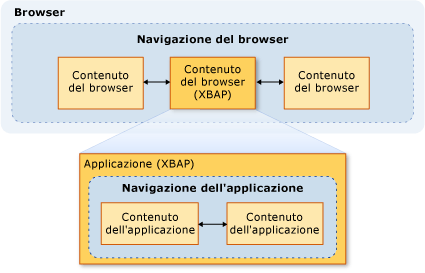
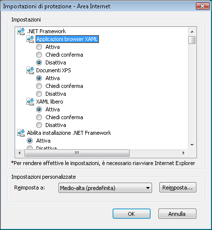

# Sicurezza (WPF)
 Durante lo sviluppo di applicazioni [!INCLUDE[TLA#tla_wpf](../../../includes/tlasharptla-wpf-md.md)] autonome e ospitate da browser, è necessario prendere in considerazione il modello di sicurezza. Indipendentemente dal fatto che vengano distribuite con Windows Installer \(con estensione msi\), XCOPY o [!INCLUDE[TLA2#tla_clickonce](../../../includes/tla2sharptla-clickonce-md.md)], le applicazioni [!INCLUDE[TLA2#tla_wpf](../../../includes/tla2sharptla-wpf-md.md)] autonome vengono eseguite con autorizzazioni complete, set di autorizzazioni [!INCLUDE[TLA2#tla_cas](../../../includes/tla2sharptla-cas-md.md)] **FullTrust**.  Non è supportata la distribuzione di applicazioni WPF autonome e parzialmente attendibili con ClickOnce.  Tuttavia, un'applicazione host con attendibilità totale può creare un oggetto <xref:System.AppDomain> parzialmente attendibile utilizzando il modello del componente aggiuntivo .NET Framework.  Per ulteriori informazioni, vedere [Cenni preliminari sui componenti aggiuntivi di WPF](../../../docs/framework/wpf/app-development/wpf-add-ins-overview.md).  
  
 L'hosting delle applicazioni [!INCLUDE[TLA2#tla_wpf](../../../includes/tla2sharptla-wpf-md.md)] ospitate da browser è garantito da [!INCLUDE[TLA#tla_iegeneric](../../../includes/tlasharptla-iegeneric-md.md)] o da Firefox. Le applicazioni possono essere di tipo [!INCLUDE[TLA#tla_xbap#plural](../../../includes/tlasharptla-xbapsharpplural-md.md)] o documenti [!INCLUDE[TLA#tla_xaml](../../../includes/tlasharptla-xaml-md.md)] separati. Per ulteriori informazioni, vedere [Panoramica delle applicazioni browser XAML di WPF](../../../docs/framework/wpf/app-development/wpf-xaml-browser-applications-overview.md).  
  
 Per impostazione predefinita, le applicazioni [!INCLUDE[TLA2#tla_wpf](../../../includes/tla2sharptla-wpf-md.md)] ospitate da browser vengono eseguite all'interno di un sandbox di sicurezza con attendibilità parziale, limitato al set predefinito di autorizzazioni [!INCLUDE[TLA2#tla_cas](../../../includes/tla2sharptla-cas-md.md)] dell'area **Internet**.  Grazie a questa impostazione, le applicazioni [!INCLUDE[TLA2#tla_wpf](../../../includes/tla2sharptla-wpf-md.md)] ospitate da browser vengono isolate in modo efficace dal computer client così come avviene per le applicazioni Web tipiche.  Un'applicazione XBAP può elevare il livello di privilegi fino ad Attendibilità totale a seconda dell'area di sicurezza dell'URL di distribuzione e della configurazione di sicurezza del client.  Per ulteriori informazioni, vedere [Sicurezza con attendibilità parziale in WPF](../../../docs/framework/wpf/wpf-partial-trust-security.md).  
  
 In questo argomento viene descritto il modello di sicurezza per le applicazioni [!INCLUDE[TLA#tla_wpf](../../../includes/tlasharptla-wpf-md.md)] autonome e ospitate da browser.  
  
 Di seguito sono elencate le diverse sezioni di questo argomento:  
  
-   [Navigazione sicura](#SafeTopLevelNavigation)  
  
-   [Impostazioni di sicurezza del software per l'esplorazione Web](#InternetExplorerSecuritySettings)  
  
-   [Controllo WebBrowser e controlli della funzionalità](#webbrowser_control_and_feature_controls)  
  
-   [Disabilitazione degli assembly APTCA per le applicazioni client parzialmente attendibili](#APTCA)  
  
-   [Comportamento del sandbox relativo ai file XAML separati](#LooseContentSandboxing)  
  
-   [Risorse per lo sviluppo di applicazioni WPF che garantiscano la sicurezza](#BestPractices)  
  
   
## Navigazione sicura  
 Per quanto riguarda le applicazioni [!INCLUDE[TLA2#tla_xbap#plural](../../../includes/tla2sharptla-xbapsharpplural-md.md)], in [!INCLUDE[TLA2#tla_wpf](../../../includes/tla2sharptla-wpf-md.md)] è possibile distinguere due tipi di navigazione: tramite applicazione e tramite browser.  
  
 La *navigazione tramite applicazione* consiste nel passaggio tra elementi di contenuto all'interno di un'applicazione ospitata da un browser.  La *navigazione tramite browser* implica la modifica del contenuto e dell'URL del percorso del browser stesso.  Nell'illustrazione seguente viene mostrata la relazione tra la navigazione tramite applicazione \(in genere XAML\) e la navigazione tramite browser \(in genere HTML\):  
  
   
  
 Il tipo di contenuto considerato sicuro per la navigazione da parte di un'applicazione [!INCLUDE[TLA2#tla_xbap](../../../includes/tla2sharptla-xbap-md.md)] viene determinato principalmente in base all'utilizzo della navigazione tramite applicazione o tramite browser.  
  
   
### Sicurezza della navigazione tramite applicazione  
 La navigazione tramite applicazione è considerata sicura se può essere identificata con un [!INCLUDE[TLA2#tla_uri](../../../includes/tla2sharptla-uri-md.md)] di tipo pack che supporta quattro tipi di contenuto:  
  
|Tipo di contenuto|Descrizione|Esempio di URI|  
|-----------------------|-----------------|--------------------|  
|Risorsa|File aggiunti a un progetto con un tipo di compilazione **Risorsa**.|`pack://application:,,,/MyResourceFile.xaml`|  
|Contenuto|File aggiunti a un progetto con un tipo di compilazione **Contenuto**.|`pack://application:,,,/MyContentFile.xaml`|  
|Sito di origine|File aggiunti a un progetto con un tipo di compilazione **Nessuno**.|`pack://siteoforigin:,,,/MySiteOfOriginFile.xaml`|  
|Codice dell'applicazione|Risorse XAML che dispongono di code\-behind compilato.   In alternativa   File XAML aggiunti a un progetto con un tipo di compilazione **Pagina**.|`pack://application:,,,/MyResourceFile` `.xaml`|  
  
> [!NOTE]
>  Per ulteriori informazioni sui file di dati applicazione e sugli [!INCLUDE[TLA2#tla_uri#plural](../../../includes/tla2sharptla-urisharpplural-md.md)] di tipo pack, vedere [File di dati e di risorse dell'applicazione WPF.](../../../docs/framework/wpf/app-development/wpf-application-resource-content-and-data-files.md).  
  
 La navigazione dei file di questi tipi di contenuto è possibile sia da parte dell'utente che a livello di codice:  
  
-   **Navigazione dell'utente**.  L'utente esegue la navigazione facendo clic su un elemento <xref:System.Windows.Documents.Hyperlink>.  
  
-   **Navigazione a livello di codice**.  Nell'applicazione la navigazione viene eseguita senza l'intervento dell'utente, ad esempio tramite l'impostazione della proprietà <xref:System.Windows.Navigation.NavigationWindow.Source%2A?displayProperty=fullName>.  
  
   
### Sicurezza della navigazione tramite browser  
 La navigazione tramite browser è considerata sicura solo nelle condizioni seguenti:  
  
-   **Navigazione dell'utente**.  L'utente esegue la navigazione facendo clic su un elemento <xref:System.Windows.Documents.Hyperlink> all'interno dell'oggetto <xref:System.Windows.Navigation.NavigationWindow> principale, non in un <xref:System.Windows.Controls.Frame> annidato.  
  
-   **Area**.  Il contenuto in corso di esplorazione risiede su Internet o nella rete Intranet locale.  
  
-   **Protocollo**.  Viene utilizzato uno dei protocolli seguenti: **http**, **https**, **file** o **mailto**.  
  
 Se in un'applicazione [!INCLUDE[TLA2#tla_xbap](../../../includes/tla2sharptla-xbap-md.md)] viene tentata l'esecuzione della navigazione del contenuto in modo non compatibile rispetto a queste condizioni, viene generata un'eccezione <xref:System.Security.SecurityException>.  
  
   
## Impostazioni di sicurezza del software per l'esplorazione Web  
 Le impostazioni di sicurezza sul computer in uso determinano l'accesso garantito a qualsiasi software per l'esplorazione Web.  Il software per l'esplorazione Web include qualsiasi applicazione o componente che utilizza API [WinINet](http://go.microsoft.com/fwlink/?LinkId=179379) o [UrlMon](http://go.microsoft.com/fwlink/?LinkId=179383), inclusi Internet Explorer e PresentationHost.exe.  
  
 In [!INCLUDE[TLA2#tla_iegeneric](../../../includes/tla2sharptla-iegeneric-md.md)] viene fornito un meccanismo con cui è possibile configurare la funzionalità che può essere eseguita da o in [!INCLUDE[TLA2#tla_iegeneric](../../../includes/tla2sharptla-iegeneric-md.md)], tra cui:  
  
-   Componenti basati su [!INCLUDE[TLA2#tla_winfx](../../../includes/tla2sharptla-winfx-md.md)]  
  
-   Controlli e plug\-in ActiveX  
  
-   Download  
  
-   Scripting  
  
-   Autenticazione utente  
  
 La raccolta delle funzionalità che può essere protetta in questo modo viene configurata secondo una base per area relativa alle aree **Internet**, **Intranet**, **Siti attendibili** e **Siti con restrizioni**.  Nei passaggi seguenti viene descritto come configurare le impostazioni di sicurezza:  
  
1.  Aprire il **Pannello di controllo**.  
  
2.  Fare clic su **Rete e Internet** e quindi su **Opzioni Internet**.  
  
     Verrà visualizzata la finestra di dialogo Opzioni Internet.  
  
3.  Nella scheda **Sicurezza** selezionare l'area per cui configurare le impostazioni di sicurezza.  
  
4.  Fare clic sul pulsante **Livello personalizzato**.  
  
     Verrà visualizzata la finestra di dialogo **Impostazioni sicurezza** è sarà possibile configurare le impostazioni di sicurezza per l'area selezionata.  
  
       
  
> [!NOTE]
>  È anche possibile passare alla finestra di dialogo Opzioni Internet tramite Internet Explorer.  Scegliere **Opzioni Internet** dal menu **Strumenti**.  
  
 A partire da [!INCLUDE[TLA#tla_ie7](../../../includes/tlasharptla-ie7-md.md)], sono incluse le seguenti impostazioni di sicurezza specifiche per [!INCLUDE[TLA2#tla_winfx](../../../includes/tla2sharptla-winfx-md.md)]:  
  
-   **XAML separato**.  Controlla se in [!INCLUDE[TLA2#tla_iegeneric](../../../includes/tla2sharptla-iegeneric-md.md)] è possibile eseguire un'esplorazione e separare i file [!INCLUDE[TLA2#tla_xaml](../../../includes/tla2sharptla-xaml-md.md)].  \(opzioni Abilita, Disabilita e Chiedi conferma\).  
  
-   **Applicazioni browser XAML**.  Controlla se in [!INCLUDE[TLA2#tla_iegeneric](../../../includes/tla2sharptla-iegeneric-md.md)] è possibile eseguire un'esplorazione ed eseguire le [!INCLUDE[TLA2#tla_xbap#plural](../../../includes/tla2sharptla-xbapsharpplural-md.md)].  \(opzioni Abilita, Disabilita e Chiedi conferma\).  
  
 Per impostazione predefinita, queste impostazioni vengono tutte abilitate per le aree **Internet**, **Intranet locale** e **Siti attendibili**, mentre vengono disabilitate per l'area **Siti con restrizioni**.  
  
   
### Impostazioni del Registro di sistema WPF correlate alla sicurezza  
 Oltre alle impostazioni di sicurezza disponibili tramite Opzioni Internet, sono disponibili i seguenti valori del Registro di sistema per bloccare in modo selettivo alcune funzionalità WPF relative alla sicurezza.  I valori sono definiti nella chiave seguente:  
  
 `HKEY_LOCAL_MACHINE\SOFTWARE\Microsoft\.NETFramework\Windows Presentation Foundation\Features`  
  
 Nella tabella seguente sono elencati i valori che è possibile impostare.  
  
|Nome del valore|Tipo di valore|Dati del valore|  
|---------------------|--------------------|---------------------|  
|XBAPDisallow|REG\_DWORD|1 per non consentire; 0 per consentire.|  
|LooseXamlDisallow|REG\_DWORD|1 per non consentire; 0 per consentire.|  
|WebBrowserDisallow|REG\_DWORD|1 per non consentire; 0 per consentire.|  
|MediaAudioDisallow|REG\_DWORD|1 per non consentire; 0 per consentire.|  
|MediaImageDisallow|REG\_DWORD|1 per non consentire; 0 per consentire.|  
|MediaVideoDisallow|REG\_DWORD|1 per non consentire; 0 per consentire.|  
|ScriptInteropDisallow|REG\_DWORD|1 per non consentire; 0 per consentire.|  
  
   
## Controllo WebBrowser e controlli della funzionalità  
 Il controllo WPF <xref:System.Windows.Controls.WebBrowser> può essere utilizzato per ospitare contenuto Web.  Il controllo WPF <xref:System.Windows.Controls.WebBrowser> esegue il wrapping del controllo ActiveX WebBrowser sottostante.  WPF fornisce supporto per proteggere l'applicazione quando si utilizza il controllo WPF <xref:System.Windows.Controls.WebBrowser> per ospitare contenuto Web non attendibile.  Tuttavia, alcune funzionalità di sicurezza devono essere applicate direttamente dalle applicazioni tramite il controllo <xref:System.Windows.Controls.WebBrowser>.  Per ulteriori informazioni sul controllo ActiveX WebBrowser, vedere [Cenni preliminari ed esercitazioni relativi al controllo WebBrowser](http://go.microsoft.com/fwlink/?LinkId=179388) \(la pagina potrebbe essere in inglese\).  
  
> [!NOTE]
>  Questa sezione si applica anche al controllo <xref:System.Windows.Controls.Frame> in quanto utilizza <xref:System.Windows.Controls.WebBrowser> per passare al contenuto HTML.  
  
 Se il controllo WPF <xref:System.Windows.Controls.WebBrowser> è utilizzato per ospitare contenuto Web non attendibile, l'applicazione deve utilizzare un <xref:System.AppDomain> parzialmente attendibile per consentire l'isolamento del codice dell'applicazione dal codice di script HTML potenzialmente dannoso.  Questa procedura è consigliata soprattutto nel caso in cui l'applicazione interagisca con lo script ospitato tramite il metodo <xref:System.Windows.Controls.WebBrowser.InvokeScript%2A> e la proprietà <xref:System.Windows.Controls.WebBrowser.ObjectForScripting%2A>.  Per ulteriori informazioni, vedere [Cenni preliminari sui componenti aggiuntivi di WPF](../../../docs/framework/wpf/app-development/wpf-add-ins-overview.md).  
  
 Se l'applicazione utilizza il controllo WPF <xref:System.Windows.Controls.WebBrowser>, un'altra possibilità per aumentare la sicurezza e ridurre gli attacchi consiste nell'abilitare i controlli della funzionalità di Internet Explorer.  I controlli della funzionalità sono aggiunte a Internet Explorer che consentono agli amministratori e agli sviluppatori di configurare funzionalità di Internet Explorer e applicazioni che ospitano il controllo ActiveX WebBrowser di cui il controllo WPF <xref:System.Windows.Controls.WebBrowser> esegue il wrapping.  È possibile configurare i controlli della funzionalità tramite la funzione [CoInternetSetFeatureEnabled](http://go.microsoft.com/fwlink/?LinkId=179394) o tramite la modifica dei valori nel Registro di sistema.  Per ulteriori informazioni sui controlli della funzionalità, vedere [Introduzione ai controlli della funzionalità](http://go.microsoft.com/fwlink/?LinkId=179390) e [Controlli della funzionalità Internet](http://go.microsoft.com/fwlink/?LinkId=179392) \(le pagine potrebbero essere in inglese\).  
  
 Se si sviluppa un'applicazione WPF autonoma che utilizza il controllo WPF <xref:System.Windows.Controls.WebBrowser>, WPF abilita automaticamente i controlli della funzionalità seguenti per l'applicazione.  
  
|Controllo della funzionalità|  
|----------------------------------|  
|FEATURE\_MIME\_HANDLING|  
|FEATURE\_MIME\_SNIFFING|  
|FEATURE\_OBJECT\_CACHING|  
|FEATURE\_SAFE\_BINDTOOBJECT|  
|FEATURE\_WINDOW\_RESTRICTIONS|  
|FEATURE\_ZONE\_ELEVATION|  
|FEATURE\_RESTRICT\_FILEDOWNLOAD|  
|FEATURE\_RESTRICT\_ACTIVEXINSTALL|  
|FEATURE\_ADDON\_MANAGEMENT|  
|FEATURE\_HTTP\_USERNAME\_PASSWORD\_DISABLE|  
|FEATURE\_SECURITYBAND|  
|FEATURE\_UNC\_SAVEDFILECHECK|  
|FEATURE\_VALIDATE\_NAVIGATE\_URL|  
|FEATURE\_DISABLE\_TELNET\_PROTOCOL|  
|FEATURE\_WEBOC\_POPUPMANAGEMENT|  
|FEATURE\_DISABLE\_LEGACY\_COMPRESSION|  
|FEATURE\_SSLUX|  
  
 Poiché questi controlli della funzionalità vengono abilitati incondizionatamente, potrebbero danneggiare un'applicazione con attendibilità totale.  In questo caso, se non sono presenti rischi per la sicurezza relativi all'applicazione specifica e al contenuto che ospita, è possibile disabilitare il controllo della funzionalità corrispondente.  
  
 I controlli della funzionalità sono applicati dal processo che crea un'istanza dell'oggetto ActiveX WebBrowser.  Pertanto, se si crea un'applicazione autonoma in grado di passare a contenuto non attendibile, è assolutamente opportuno abilitare controlli della funzionalità aggiuntivi.  
  
> [!NOTE]
>  Questa indicazione è basata sui suggerimenti generali per la sicurezza host MSHTML e SHDOCVW.  Per ulteriori informazioni, vedere [Domande frequenti relative alla sicurezza host MSHTML: parte I di II](http://go.microsoft.com/fwlink/?LinkId=179396) e [Domande frequenti relative alla sicurezza host MSHTML: parte II di II](http://go.microsoft.com/fwlink/?LinkId=179415) \(le pagine potrebbero essere in inglese\).  
  
 Per il file eseguibile, abilitare i controlli della funzionalità riportati di seguito impostando il valore del Registro di sistema su 1.  
  
|Controllo della funzionalità|  
|----------------------------------|  
|FEATURE\_ACTIVEX\_REPURPOSEDETECTION|  
|FEATURE\_BLOCK\_LMZ\_IMG|  
|FEATURE\_BLOCK\_LMZ\_OBJECT|  
|FEATURE\_BLOCK\_LMZ\_SCRIPT|  
|FEATURE\_RESTRICT\_RES\_TO\_LMZ|  
|FEATURE\_RESTRICT\_ABOUT\_PROTOCOL\_IE7|  
|FEATURE\_SHOW\_APP\_PROTOCOL\_WARN\_DIALOG|  
|FEATURE\_LOCALMACHINE\_LOCKDOWN|  
|FEATURE\_FORCE\_ADDR\_AND\_STATUS|  
|FEATURE\_RESTRICTED\_ZONE\_WHEN\_FILE\_NOT\_FOUND|  
  
 Per il file eseguibile, disabilitare il controllo della funzionalità riportato di seguito impostando il valore del Registro di sistema su 0.  
  
|Controllo della funzionalità|  
|----------------------------------|  
|FEATURE\_ENABLE\_SCRIPT\_PASTE\_URLACTION\_IF\_PROMPT|  
  
 Se si esegue un'applicazione [!INCLUDE[TLA#tla_xbap](../../../includes/tlasharptla-xbap-md.md)] parzialmente attendibile che include un controllo WPF <xref:System.Windows.Controls.WebBrowser> in [!INCLUDE[TLA#tla_iegeneric](../../../includes/tlasharptla-iegeneric-md.md)], WPF ospita il controllo ActiveX WebBrowser nello spazio degli indirizzi del processo di Internet Explorer.  Poiché il controllo ActiveX WebBrowser è ospitato nel processo di [!INCLUDE[TLA2#tla_iegeneric](../../../includes/tla2sharptla-iegeneric-md.md)], anche tutti i controlli della funzionalità per Internet Explorer vengono abilitati per il controllo ActiveX WebBrowser.  
  
 Le applicazioni XBAP in esecuzione in Internet Explorer ottengono anche un livello di sicurezza aggiuntivo rispetto alle applicazioni autonome normali.  Questo livello di sicurezza aggiuntivo è determinato dal fatto che Internet Explorer, e di conseguenza il controllo ActiveX WebBrowser, per impostazione predefinita viene eseguito in modalità protetta su [!INCLUDE[TLA#tla_winvista](../../../includes/tlasharptla-winvista-md.md)] e [!INCLUDE[win7](../../../includes/win7-md.md)].  Per ulteriori informazioni sulla modalità protetta, vedere [Informazioni e utilizzo della modalità protetta di Internet Explorer](http://go.microsoft.com/fwlink/?LinkId=179393) \(la pagina potrebbe essere in inglese\).  
  
> [!NOTE]
>  Se mentre ci si trova nell'area Internet si tenta di eseguire in Firefox un'applicazione XBAP che include un controllo WPF <xref:System.Windows.Controls.WebBrowser>, verrà generata un'eccezione <xref:System.Security.SecurityException>.  Tale eccezione è determinata dai criteri di sicurezza WPF.  
  
   
## Disabilitazione degli assembly APTCA per le applicazioni client parzialmente attendibili  
 Quando gli assembly gestiti vengono installati nella [!INCLUDE[TLA#tla_gac](../../../includes/tlasharptla-gac-md.md)], diventano completamente attendibili poiché l'utente deve fornire un'autorizzazione esplicita per installarli.  Dal momento che sono completamente attendibili, possono essere utilizzati solo dalle applicazioni client gestite completamente attendibili.  Per consentirne l'utilizzo da parte di applicazioni parzialmente attendibili, devono essere contrassegnati con <xref:System.Security.AllowPartiallyTrustedCallersAttribute> \(APTCA\).  Solo gli assembly per cui il test di sicurezza per l'esecuzione ha dato come esito un'attendibilità parziale possono essere contrassegnati con questo attributo.  
  
 Tuttavia, un assembly APTCA può presentare un difetto nel sistema di sicurezza dopo essere stato installato nella [!INCLUDE[TLA2#tla_gac](../../../includes/tla2sharptla-gac-md.md)].  Quando viene individuato un difetto nel sistema di sicurezza, gli editori dell'assembly possono creare un aggiornamento della sicurezza per risolvere il problema nelle installazioni esistenti e per proteggersi da installazioni eseguite dopo l'individuazione del problema.  Un'opzione dell'aggiornamento è la disinstallazione dell'assembly, tuttavia in questo modo può essere compromessa la funzionalità di altre applicazioni client completamente attendibili che utilizzano l'assembly.  
  
 In [!INCLUDE[TLA2#tla_wpf](../../../includes/tla2sharptla-wpf-md.md)] viene fornito un meccanismo che consente di disabilitare un assembly APTCA per applicazioni [!INCLUDE[TLA2#tla_xbap#plural](../../../includes/tla2sharptla-xbapsharpplural-md.md)] parzialmente attendibili, senza necessità di disinstallare l'assembly APTCA.  
  
 Per disabilitare un assembly APTCA, è necessario creare una chiave speciale del Registro di sistema:  
  
 `HKEY_LOCAL_MACHINE\SOFTWARE\Microsoft\.NETFramework\policy\APTCA\<AssemblyFullName>, FileVersion=<AssemblyFileVersion>`  
  
 Di seguito viene riportato un esempio:  
  
 `HKEY_LOCAL_MACHINE\SOFTWARE\Microsoft\.NETFramework\policy\APTCA\aptcagac, Version=1.0.0.0, Culture=neutral, PublicKeyToken=215e3ac809a0fea7, FileVersion=1.0.0.0`  
  
 Questa chiave stabilisce una voce per l'assembly APTCA.  È inoltre necessario creare un valore di questa chiave che abiliti o disabiliti l'assembly.  Di seguito sono riportati i dettagli del valore:  
  
-   Nome del valore: **APTCA\_FLAG**.  
  
-   Tipo di valore: **REG\_DWORD**.  
  
-   Dati del valore: **1** per disabilitare; **0** per abilitare.  
  
 Se è necessario disabilitare un assembly per applicazioni client parzialmente attendibili, è possibile scrivere un aggiornamento per creare la chiave del Registro di sistema e il valore.  
  
> [!NOTE]
>  Gli assembly [!INCLUDE[TLA2#tla_winfx](../../../includes/tla2sharptla-winfx-md.md)] principali non vengono influenzati da questa disabilitazione, poiché sono necessari per l'esecuzione delle applicazioni gestite.  Il supporto per la disabilitazione degli assembly APTCA è destinato principalmente alle applicazioni di terze parti.  
  
   
## Comportamento del sandbox relativo ai file XAML separati  
 I file [!INCLUDE[TLA2#tla_xaml](../../../includes/tla2sharptla-xaml-md.md)] separati sono file XAML solo markup che non dipendono da alcun code\-behind, gestore eventi o assembly specifico dell'applicazione.  Quando si passa ai file [!INCLUDE[TLA2#tla_xaml](../../../includes/tla2sharptla-xaml-md.md)] separati direttamente dal browser, i file vengono caricati in un sandbox di sicurezza basato sul set di autorizzazioni predefinito dell'area Internet.  
  
 Tuttavia, il comportamento di sicurezza è diverso quando l'esplorazione dei file [!INCLUDE[TLA2#tla_xaml](../../../includes/tla2sharptla-xaml-md.md)] separati viene eseguita da <xref:System.Windows.Navigation.NavigationWindow> o <xref:System.Windows.Controls.Frame> in un'applicazione autonoma.  
  
 In entrambi i casi, il file [!INCLUDE[TLA2#tla_xaml](../../../includes/tla2sharptla-xaml-md.md)] separato che viene esplorato eredita le autorizzazioni dell'applicazione host.  Tuttavia, dal punto di vista della sicurezza non si tratta di un comportamento desiderabile, in modo particolare se è stato creato un file [!INCLUDE[TLA2#tla_xaml](../../../includes/tla2sharptla-xaml-md.md)] separato mediante un'entità non affidabile o sconosciuta  Questo tipo di contenuto è noto come *contenuto esterno* e sia l'oggetto <xref:System.Windows.Controls.Frame>, sia l'oggetto <xref:System.Windows.Navigation.NavigationWindow> possono essere configurati in modo da isolarlo durante l'esplorazione.  L'isolamento viene raggiunto impostando la proprietà **SandboxExternalContent** su true, come illustrato negli esempi seguenti per <xref:System.Windows.Controls.Frame> e <xref:System.Windows.Navigation.NavigationWindow>:  
  
 [!code-xml[SecurityOverviewSnippets#FrameMARKUP](../../../samples/snippets/csharp/VS_Snippets_Wpf/SecurityOverviewSnippets/CS/Window2.xaml#framemarkup)]  
  
 [!code-xml[SecurityOverviewSnippets#NavigationWindowMARKUP](../../../samples/snippets/csharp/VS_Snippets_Wpf/SecurityOverviewSnippets/CS/Window1.xaml#navigationwindowmarkup)]  
  
 Con questa impostazione, il contenuto esterno sarà caricato in un processo separato da quello in cui è ospitata l'applicazione.  Questo processo è limitato al set di autorizzazioni predefinito dell'area Internet, in questo modo l'area viene isolata efficacemente dall'applicazione host e dal computer client.  
  
> [!NOTE]
>  Anche se in un'applicazione autonoma il passaggio ai file [!INCLUDE[TLA2#tla_xaml](../../../includes/tla2sharptla-xaml-md.md)] separati da <xref:System.Windows.Navigation.NavigationWindow> o da <xref:System.Windows.Controls.Frame> viene implementato in base all'infrastruttura che ospita il browser WPF coinvolgendo il processo PresentationHost, il livello di sicurezza è leggermente inferiore rispetto al caso in cui il contenuto viene caricato direttamente in Internet Explorer su [!INCLUDE[wiprlhext](../../../includes/wiprlhext-md.md)] e su [!INCLUDE[win7](../../../includes/win7-md.md)], ovvero ancora tramite PresentationHost. Ciò si verifica in quanto un'applicazione WPF autonoma che utilizza un browser Web non fornisce la funzionalità di sicurezza di modalità protetta aggiuntiva di Internet Explorer.  
  
   
## Risorse per lo sviluppo di applicazioni WPF che garantiscano la sicurezza  
 Di seguito alcune risorse aggiuntive per facilitare lo sviluppo di applicazioni [!INCLUDE[TLA2#tla_wpf](../../../includes/tla2sharptla-wpf-md.md)] che garantiscano la sicurezza:  
  
|Area|Risorsa|  
|----------|-------------|  
|Codice gestito|[Modelli e indicazioni sulla sicurezza per applicazioni](http://go.microsoft.com/fwlink/?LinkId=117426)|  
|[!INCLUDE[TLA2#tla_cas](../../../includes/tla2sharptla-cas-md.md)]|[Sicurezza dall'accesso di codice](../../../docs/framework/misc/code-access-security.md)|  
|[!INCLUDE[TLA2#tla_clickonce](../../../includes/tla2sharptla-clickonce-md.md)]|[Sicurezza e distribuzione di ClickOnce](../Topic/ClickOnce%20Security%20and%20Deployment.md)|  
|[!INCLUDE[TLA2#tla_wpf](../../../includes/tla2sharptla-wpf-md.md)]|[Sicurezza con attendibilità parziale in WPF](../../../docs/framework/wpf/wpf-partial-trust-security.md)|  
  
## Vedere anche  
 [Sicurezza con attendibilità parziale in WPF](../../../docs/framework/wpf/wpf-partial-trust-security.md)   
 [Strategia di sicurezza di WPF \- Sicurezza della piattaforma](../../../docs/framework/wpf/wpf-security-strategy-platform-security.md)   
 [Strategia di sicurezza WPF \- Progettazione di sicurezza](../../../docs/framework/wpf/wpf-security-strategy-security-engineering.md)   
 [Modelli e indicazioni sulla sicurezza per applicazioni](http://go.microsoft.com/fwlink/?LinkId=117426)   
 [Sicurezza dall'accesso di codice](../../../docs/framework/misc/code-access-security.md)   
 [Sicurezza e distribuzione di ClickOnce](../Topic/ClickOnce%20Security%20and%20Deployment.md)   
 [Cenni preliminari su XAML \(WPF\)](../../../docs/framework/wpf/advanced/xaml-overview-wpf.md)