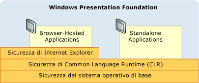
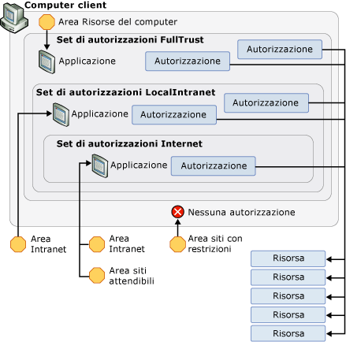

# Strategia di sicurezza di WPF - Sicurezza della piattaforma
Oltre a fornire molteplici servizi di sicurezza, [!INCLUDE[TLA#tla_wpf](../../../includes/tlasharptla-wpf-md.md)] sfrutta le funzionalità di sicurezza della piattaforma sottostante, ovvero del sistema operativo, di [!INCLUDE[TLA2#tla_clr](../../../includes/tla2sharptla-clr-md.md)] e di [!INCLUDE[TLA2#tla_ie](../../../includes/tla2sharptla-ie-md.md)].  Questi livelli forniscono a [!INCLUDE[TLA2#tla_wpf](../../../includes/tla2sharptla-wpf-md.md)] un modello di sicurezza in profondità solido e dettagliato per evitare ogni singola vulnerabilità, come illustrato nella figura seguente:  
  
   
  
 Nella parte rimanente di questo argomento verranno illustrate le funzionalità specifiche di questi livelli che riguardano in modo specifico [!INCLUDE[TLA2#tla_wpf](../../../includes/tla2sharptla-wpf-md.md)].  
  
   
  
   
## Sicurezza del sistema operativo  
 Il livello minimo di sistema operativo richiesto da [!INCLUDE[TLA2#tla_wpf](../../../includes/tla2sharptla-wpf-md.md)] è [!INCLUDE[TLA2#tla_winxpsp2](../../../includes/tla2sharptla-winxpsp2-md.md)].  In [!INCLUDE[TLA2#tla_winxpsp2](../../../includes/tla2sharptla-winxpsp2-md.md)] sono disponibili numerose funzionalità di sicurezza che insieme costituiscono il modello di sicurezza di base di tutte le applicazioni [!INCLUDE[TLA2#tla_win](../../../includes/tla2sharptla-win-md.md)], incluse quelle compilate con [!INCLUDE[TLA2#tla_wpf](../../../includes/tla2sharptla-wpf-md.md)].  [!INCLUDE[TLA#tla_longhorn](../../../includes/tlasharptla-longhorn-md.md)] incorpora, ed estende, le funzionalità di sicurezza di [!INCLUDE[TLA2#tla_wpf](../../../includes/tla2sharptla-wpf-md.md)].  Questo argomento mostra quali di queste funzionalità di sicurezza sono importanti per [!INCLUDE[TLA2#tla_wpf](../../../includes/tla2sharptla-wpf-md.md)] e descrive come si integrano in [!INCLUDE[TLA2#tla_wpf](../../../includes/tla2sharptla-wpf-md.md)] per formare un solido sistema di difesa in profondità.  
  
   
### Microsoft Windows XP Service Pack 2 \(SP2\)  
 Oltre a fornire una revisione generale e un approfondimento su [!INCLUDE[TLA2#tla_win](../../../includes/tla2sharptla-win-md.md)], in questo argomento verranno illustrate tre funzionalità chiave disponibili in [!INCLUDE[TLA2#tla_winxpsp2](../../../includes/tla2sharptla-winxpsp2-md.md)]:  
  
-   Compilazione \/GS  
  
-   [!INCLUDE[TLA#tla_win_update](../../../includes/tlasharptla-win-update-md.md)].  
  
#### Compilazione \/GS  
 [!INCLUDE[TLA2#tla_winxpsp2](../../../includes/tla2sharptla-winxpsp2-md.md)] offre protezione ricompilando molte librerie di sistema principali, incluse tutte le dipendenze [!INCLUDE[TLA2#tla_wpf](../../../includes/tla2sharptla-wpf-md.md)] quali [!INCLUDE[TLA2#tla_clr](../../../includes/tla2sharptla-clr-md.md)], per limitare i sovraccarichi del buffer.  A tale scopo, è necessario usare il parametro \/GS con il compilatore da riga di comando di C\/C\+\+.  Anche se i sovraccarichi del buffer dovrebbero essere evitati in modo esplicito, la compilazione \/GS rappresenta un esempio di difesa da potenziali vulnerabilità create accidentalmente o intenzionalmente.  
  
 In passato i sovraccarichi del buffer sono stati causa di molte violazioni della sicurezza a impatto elevato.  Si verifica un sovraccarico del buffer quando un utente malintenzionato sfrutta una vulnerabilità del codice per introdurre codice dannoso che viene scritto oltre i limiti di un buffer.  Il malintenzionato sarà così in grado di assumere il controllo del processo in cui il codice è in esecuzione, sovrascrivendo l'indirizzo di ritorno di una funzione per indurre l'esecuzione del proprio codice dannoso.  Il risultato sarà l'esecuzione di codice arbitrario attraverso codice dannoso con gli stessi privilegi del processo di cui è stato assunto il controllo.  
  
 In generale, il flag del compilatore \/GS protegge da alcuni potenziali sovraccarichi del buffer introducendo uno speciale cookie di sicurezza per proteggere l'indirizzo di ritorno di una funzione dotata di buffer di stringhe locali.  Dopo la restituzione di un risultato da parte di una funzione, il cookie di sicurezza viene confrontato con il suo valore precedente.  Se il valore è cambiato, è possibile che si sia verificato un sovraccarico del buffer e che il processo venga interrotto con una condizione di errore.  L'interruzione del processo impedisce l'esecuzione di codice potenzialmente dannoso.  Per informazioni dettagliate, vedere [\/GS \(Controllo sicurezza buffer\)](http://msdn.microsoft.com/library/8dbf701c.aspx).  
  
 [!INCLUDE[TLA2#tla_wpf](../../../includes/tla2sharptla-wpf-md.md)] è compilato con il flag \/GS per aggiungere un ulteriore livello di difesa alle applicazioni [!INCLUDE[TLA2#tla_wpf](../../../includes/tla2sharptla-wpf-md.md)].  
  
#### Miglioramenti a Microsoft Windows Update  
 Anche [!INCLUDE[TLA#tla_win_update](../../../includes/tlasharptla-win-update-md.md)] è stato migliorato in [!INCLUDE[TLA2#tla_winxpsp2](../../../includes/tla2sharptla-winxpsp2-md.md)] per semplificare il processo di download e installazione degli aggiornamenti.  Queste modifiche migliorano in modo sostanziale la sicurezza per i clienti [!INCLUDE[TLA2#tla_wpf](../../../includes/tla2sharptla-wpf-md.md)] in quanto contribuiscono a garantire che i sistemi siano sempre aggiornati, in modo specifico per quanto riguarda la sicurezza.  
  
   
### Windows Vista  
 Gli utenti [!INCLUDE[TLA2#tla_wpf](../../../includes/tla2sharptla-wpf-md.md)] in [!INCLUDE[TLA#tla_longhorn](../../../includes/tlasharptla-longhorn-md.md)] trarranno numerosi vantaggi dai miglioramenti apportati alla sicurezza del sistema operativo, inclusi l'accesso utente con privilegi minimi, i controlli di integrità del codice e l'isolamento dei privilegi.  
  
#### Controllo dell'account utente  
 Gli utenti di [!INCLUDE[TLA2#tla_win](../../../includes/tla2sharptla-win-md.md)] accedono sempre più spesso con privilegi di amministratore perché per eseguire e\/o installare molte applicazioni sono oggi necessari tali privilegi.  La scrittura delle impostazioni predefinite di un'applicazione nel Registro di sistema ne è un esempio.  
  
 Usare i privilegi di amministratore per eseguire un'applicazione significa che l'applicazione viene eseguita da processi a cui sono stati concessi i privilegi di amministratore.  In termini di sicurezza, ciò significa che eventuale codice dannoso che assume il controllo di un processo eseguito con privilegi di amministratore erediterà automaticamente quei privilegi, incluso l'accesso a risorse di sistema critiche.  
  
 Un modo per proteggersi da una tale minaccia per la sicurezza consiste nell'eseguire le applicazioni con la quantità minima necessaria di privilegi.  Questo concetto è noto come il principio dei privilegi minimi ed è una funzionalità principale del sistema operativo [!INCLUDE[TLA#tla_longhorn](../../../includes/tlasharptla-longhorn-md.md)].  Tale funzionalità è nota come Controllo dell'account utente \(UAC, User Account Control\) e viene usata da [!INCLUDE[TLA#tla_longhorn](../../../includes/tlasharptla-longhorn-md.md)] in due modi principali:  
  
-   Per eseguire la maggior parte delle applicazioni con privilegi UAC per impostazione predefinita, anche se l'utente è un amministratore. Solo le applicazioni che richiedono i privilegi di amministratore verranno eseguite con i privilegi di amministratore.  Per essere eseguite con i privilegi di amministratore, le applicazioni devono essere contrassegnate in modo esplicito nel manifesto dell'applicazione o come voce nei criteri di sicurezza.  
  
-   Per fornire soluzioni di compatibilità come la virtualizzazione.  Molte applicazioni, ad esempio, provano a scrivere in percorsi limitati, come C:\\Programmi.  Per le applicazioni eseguite in ambito UAC, esiste un percorso alternativo specifico di ogni utente in cui è possibile scrivere senza disporre dei privilegi di amministratore.  Per le applicazioni eseguite in ambito UAC, il percorso C:\\Programmi viene virtualizzato affinché le applicazioni scrivano direttamente nel percorso alternativo specifico di ogni utente.  Questa soluzione di compatibilità consente di eseguire molte applicazioni che in passato non sarebbe stato possibile eseguire in base al principio UAC.  
  
#### Controlli di integrità del codice  
 [!INCLUDE[TLA#tla_longhorn](../../../includes/tlasharptla-longhorn-md.md)] incorpora controlli di integrità del codice più accurati per impedire che venga introdotto codice dannoso nei file di sistema o nel kernel in fase di esecuzione\/caricamento.  Questo va oltre la protezione dei file di sistema.  
  
   
### Processo con diritti limitati per le applicazioni ospitate nei browser  
 Le applicazioni [!INCLUDE[TLA2#tla_wpf](../../../includes/tla2sharptla-wpf-md.md)] ospitate nei browser vengono eseguite nella sandbox dell'area Internet.  L'integrazione di [!INCLUDE[TLA2#tla_wpf](../../../includes/tla2sharptla-wpf-md.md)] con [!INCLUDE[TLA#tla_ie](../../../includes/tlasharptla-ie-md.md)] migliora ulteriormente questa protezione con supporto aggiuntivo.  
  
#### Internet Explorer 6 Service Pack 2 e Internet Explorer 7 per XP  
 Per fornire funzionalità di sicurezza ancora più avanzate, [!INCLUDE[TLA2#tla_wpf](../../../includes/tla2sharptla-wpf-md.md)] sfrutta il modello di sicurezza del sistema operativo limitando i privilegi del processo per le [!INCLUDE[TLA#tla_winfxwebapp#plural](../../../includes/tlasharptla-winfxwebappsharpplural-md.md)].  Prima che venga avviata un'applicazione [!INCLUDE[TLA2#tla_wpf](../../../includes/tla2sharptla-wpf-md.md)] ospitata da un browser, il sistema operativo crea un processo host che rimuove i privilegi non necessari dal token del processo.  Alcuni esempi di privilegi rimossi includono le autorizzazioni ad arrestare il computer dell'utente, a caricare i driver e ad accedere in lettura a tutti i file nel computer.  
  
#### Internet Explorer 7 per Vista  
 In [!INCLUDE[TLA#tla_ie7](../../../includes/tlasharptla-ie7-md.md)], le applicazioni [!INCLUDE[TLA2#tla_wpf](../../../includes/tla2sharptla-wpf-md.md)] vengono eseguite in modalità protetta.  In modo specifico, le [!INCLUDE[TLA#tla_xbap#plural](../../../includes/tlasharptla-xbapsharpplural-md.md)] vengono eseguite con integrità di livello medio.  
  
#### Livello di difesa in profondità  
 Poiché le [!INCLUDE[TLA#tla_winfxwebapp#plural](../../../includes/tlasharptla-winfxwebappsharpplural-md.md)] vengono in genere eseguite in una sandbox in base al set di autorizzazioni dell'area Internet, la rimozione di questi privilegi non danneggia, da un punto di vista della compatibilità, tali [!INCLUDE[TLA#tla_winfxwebapp#plural](../../../includes/tlasharptla-winfxwebappsharpplural-md.md)].  Viene invece creato un livello di difesa aggiuntivo; se un'applicazione eseguita in una sandbox è in grado di sfruttare altri livelli e di assumere il controllo del processo, il processo disporrà comunque unicamente di privilegi limitati.  
  
 Vedere [Uso di un account utente con privilegi minimi](https://technet.microsoft.com/it-it/library/cc700846.aspx).  
  
   
## Sicurezza di Common Language Runtime \(CLR\)  
 [!INCLUDE[TLA#tla_clr](../../../includes/tlasharptla-clr-md.md)] offre numerose funzionalità di sicurezza tra cui convalida e verifica, [!INCLUDE[TLA#tla_cas](../../../includes/tlasharptla-cas-md.md)] e metodologia critica per la sicurezza.  
  
   
### Convalida e verifica  
 Per garantire l'integrità e l'isolamento degli assembly, [!INCLUDE[TLA2#tla_clr](../../../includes/tla2sharptla-clr-md.md)] si basa su un processo di convalida.  La convalida di [!INCLUDE[TLA2#tla_clr](../../../includes/tla2sharptla-clr-md.md)] garantisce che gli assembly vengano isolati convalidando il loro formato di file eseguibile di tipo PE \(Portable Executable\) per indirizzi che puntano all'esterno dell'assembly.  La convalida di [!INCLUDE[TLA2#tla_clr](../../../includes/tla2sharptla-clr-md.md)] esegue inoltre la convalida dell'integrità dei metadati incorporati in un assembly.  
  
 Per assicurare l'indipendenza dai tipi, impedire che si verifichino i problemi di sicurezza più comuni, ad esempio  i sovraccarichi del buffer, e abilitare l'uso delle sandbox tramite l'isolamento dei processi secondari, la sicurezza di [!INCLUDE[TLA2#tla_clr](../../../includes/tla2sharptla-clr-md.md)] si basa sul concetto di verifica.  
  
 Le applicazioni gestite vengono compilate in Microsoft Intermediate Language \(MSIL\).  Quando vengono eseguiti metodi in un'applicazione gestita, il relativo MSIL viene compilato in codice nativo tramite la compilazione JIT.  La compilazione JIT include un processo di verifica riguardante molte regole di sicurezza e affidabilità per garantire che il codice:  
  
-   non violi contratti di tipo  
  
-   non causi sovraccarichi del buffer  
  
-   non acceda alla memoria in modo irregolare o eccessivo.  
  
 Il codice gestito che non rispetta le regole di verifica non verrà eseguito, a meno che non venga considerato codice attendibile.  
  
 I vantaggi derivanti dall'uso di codice verificabile sono i motivi principali per cui [!INCLUDE[TLA2#tla_wpf](../../../includes/tla2sharptla-wpf-md.md)] viene compilato in [!INCLUDE[TLA2#tla_winfx](../../../includes/tla2sharptla-winfx-md.md)].  Pertanto, più esteso sarà l'uso di codice verificabile, minori saranno le possibilità di sfruttare le vulnerabilità del sistema.  
  
   
### Sicurezza per l'accesso al codice  
 Un computer client espone un'ampia varietà di risorse a cui un'applicazione gestita ha accesso, ad esempio il file system, il Registro di sistema, i servizi di stampa, l'interfaccia utente, la reflection e le variabili di ambiente.  Per poter accedere a queste risorse in un computer client, un'applicazione deve ottenere la necessaria autorizzazione [!INCLUDE[TLA#tla_cas](../../../includes/tlasharptla-cas-md.md)] [!INCLUDE[TLA2#tla_winfx](../../../includes/tla2sharptla-winfx-md.md)].  Un'autorizzazione in [!INCLUDE[TLA2#tla_cas](../../../includes/tla2sharptla-cas-md.md)] è una sottoclasse di <xref:System.Security.CodeAccessPermission>; [!INCLUDE[TLA2#tla_cas](../../../includes/tla2sharptla-cas-md.md)] implementa una sottoclasse per ogni risorsa a cui possono accedere le applicazioni gestite.  
  
 Le autorizzazioni concesse a un'applicazione gestita da [!INCLUDE[TLA2#tla_cas](../../../includes/tla2sharptla-cas-md.md)] all'avvio vengono collettivamente definite set di autorizzazioni e tale set è determinato dalle evidenze fornite dall'applicazione.  Per le applicazioni [!INCLUDE[TLA2#tla_wpf](../../../includes/tla2sharptla-wpf-md.md)], le evidenze fornite sono il percorso, o area, da cui vengono avviate.  [!INCLUDE[TLA2#tla_cas](../../../includes/tla2sharptla-cas-md.md)] identifica le aree seguenti:  
  
-   **Risorse del computer**.  Applicazioni avviate dal computer client \(completamente attendibili\).  
  
-   **Intranet locale**.  Applicazioni avviate da Intranet  \(parzialmente attendibili\).  
  
-   **Internet**.  Applicazioni avviate da Internet  \(meno attendibili\).  
  
-   **Siti attendibili**.  Applicazioni identificate da un utente come attendibili  \(meno attendibili\).  
  
-   **Siti non attendibili**.  Applicazioni identificate da un utente come non attendibili  \(non attendibili\).  
  
 Per ognuna di queste zone, [!INCLUDE[TLA2#tla_cas](../../../includes/tla2sharptla-cas-md.md)] fornisce un set di autorizzazioni predefinito che include le autorizzazioni corrispondenti al livello di attendibilità associato a ognuna,  tra cui:  
  
-   **FullTrust**.  Per le applicazioni avviate dall'area **Risorse del computer**.  Sono concesse tutte le autorizzazioni possibili.  
  
-   **LocalIntranet**.  Per le applicazioni avviate dall'area **Intranet locale**.  Viene concesso un sottoinsieme di autorizzazioni per fornire un accesso moderato alle risorse di un computer client, tra cui spazio di memorizzazione isolato, accesso dell'interfaccia utente senza restrizioni, finestre di dialogo di file senza restrizioni, reflection limitata, accesso limitato alle variabili di ambiente.  Le autorizzazioni per risorse critiche come il Registro di sistema non vengono concesse.  
  
-   **Internet**.  Per le applicazioni avviate dall'area **Internet** o **siti attendibili**.  Viene concesso un sottoinsieme di autorizzazioni per fornire accesso limitato alle risorse di un computer client, tra cui spazio di memorizzazione isolato, solo apertura di file e interfaccia utente limitata.  Sostanzialmente, questo set di autorizzazioni isola le applicazioni dal computer client.  
  
 Alle applicazioni identificate come provenienti dall'area **Siti non attendibili**, [!INCLUDE[TLA2#tla_cas](../../../includes/tla2sharptla-cas-md.md)] non concede alcuna autorizzazione.  Di conseguenza, queste non dispongono di alcun set di autorizzazioni predefinito.  
  
 La figura seguente illustra la relazione tra aree, set di autorizzazioni, autorizzazioni e risorse.  
  
   
  
 Le restrizioni della sandbox di sicurezza dell'area Internet sono ugualmente applicabili a qualsiasi codice che un'applicazione [!INCLUDE[TLA2#tla_winfxwebapp](../../../includes/tla2sharptla-winfxwebapp-md.md)] importa da una libreria di sistema, compreso [!INCLUDE[TLA2#tla_wpf](../../../includes/tla2sharptla-wpf-md.md)].  In questo modo, ogni frammento di codice viene bloccato, anche [!INCLUDE[TLA2#tla_wpf](../../../includes/tla2sharptla-wpf-md.md)].  Purtroppo, per poter essere eseguita, un'applicazione [!INCLUDE[TLA2#tla_winfxwebapp](../../../includes/tla2sharptla-winfxwebapp-md.md)] deve eseguire funzionalità che richiedono molte più autorizzazioni rispetto a quelle abilitate dalla sandbox di sicurezza dell'area Internet.  
  
 Si consideri un'applicazione [!INCLUDE[TLA2#tla_winfxwebapp](../../../includes/tla2sharptla-winfxwebapp-md.md)] contenente la seguente pagina:  
  
 [!code-csharp[WPFPlatformSecuritySnippets#Permission](../../../samples/snippets/csharp/VS_Snippets_Wpf/WPFPlatformSecuritySnippets/CSharp/Page1.xaml.cs#permission)]
 [!code-vb[WPFPlatformSecuritySnippets#Permission](../../../samples/snippets/visualbasic/VS_Snippets_Wpf/WPFPlatformSecuritySnippets/VisualBasic/Page1.xaml.vb#permission)]  
  
 Per eseguire questa applicazione [!INCLUDE[TLA2#tla_winfxwebapp](../../../includes/tla2sharptla-winfxwebapp-md.md)], il codice [!INCLUDE[TLA2#tla_wpf](../../../includes/tla2sharptla-wpf-md.md)] sottostante deve eseguire molte più funzionalità di quelle disponibili all'applicazione [!INCLUDE[TLA2#tla_winfxwebapp](../../../includes/tla2sharptla-winfxwebapp-md.md)] chiamante, tra cui:  
  
-   Creazione di un handle di finestra \(hWnd\) per il rendering  
  
-   Invio di messaggi  
  
-   Caricamento del tipo di carattere Tahoma  
  
 Da un punto di vista della sicurezza, consentire l'accesso diretto a queste operazioni dall'applicazione eseguita in una sandbox avrebbe conseguenze devastanti.  
  
 Fortunatamente, [!INCLUDE[TLA2#tla_wpf](../../../includes/tla2sharptla-wpf-md.md)] affronta questa situazione consentendo di eseguire le operazioni con privilegi elevati per conto dell'applicazione eseguita in una sandbox.  Mentre tutte le operazioni [!INCLUDE[TLA2#tla_wpf](../../../includes/tla2sharptla-wpf-md.md)] vengono controllate a fronte delle autorizzazioni di sicurezza limitate dell'area Internet del dominio dell'applicazione [!INCLUDE[TLA2#tla_winfxwebapp](../../../includes/tla2sharptla-winfxwebapp-md.md)], a [!INCLUDE[TLA2#tla_wpf](../../../includes/tla2sharptla-wpf-md.md)] \(come ad altre librerie di sistema\) viene concesso un set di autorizzazioni contenente tutte le autorizzazioni possibili.  
  
 È quindi necessario che [!INCLUDE[TLA2#tla_wpf](../../../includes/tla2sharptla-wpf-md.md)] riceva privilegi elevati, ma è altresì fondamentale impedire che tali privilegi vengano determinati dal set di autorizzazioni dell'area Internet del dominio dell'applicazione host.  
  
 A questo scopo, [!INCLUDE[TLA2#tla_wpf](../../../includes/tla2sharptla-wpf-md.md)] usa il metodo **Assert** di un'autorizzazione.  Nel codice riportato di seguito viene illustrata questa operazione.  
  
 [!code-csharp[WPFPlatformSecuritySnippets#Permission](../../../samples/snippets/csharp/VS_Snippets_Wpf/WPFPlatformSecuritySnippets/CSharp/Page1.xaml.cs#permission)]
 [!code-vb[WPFPlatformSecuritySnippets#Permission](../../../samples/snippets/visualbasic/VS_Snippets_Wpf/WPFPlatformSecuritySnippets/VisualBasic/Page1.xaml.vb#permission)]  
  
 Sostanzialmente, **Assert** impedisce che le autorizzazioni illimitate richieste da [!INCLUDE[TLA2#tla_wpf](../../../includes/tla2sharptla-wpf-md.md)] vengano limitate dalle autorizzazioni dell'area Internet dell'applicazione [!INCLUDE[TLA2#tla_winfxwebapp](../../../includes/tla2sharptla-winfxwebapp-md.md)].  
  
 Da un punto di vista della piattaforma, [!INCLUDE[TLA2#tla_wpf](../../../includes/tla2sharptla-wpf-md.md)] è responsabile dell'uso corretto di **Assert**; un uso non corretto di **Assert** potrebbe consentire a codice dannoso di elevare i privilegi.  Di conseguenza, è fondamentale chiamare **Assert** solo quando realmente necessario e assicurarsi che le restrizioni della sandbox rimangano inalterate.  Ad esempio, al codice sandbox non è consentita l'apertura di file casuali, ma è consentito l'uso dei tipi di carattere.  [!INCLUDE[TLA2#tla_wpf](../../../includes/tla2sharptla-wpf-md.md)] consente alle applicazioni sandbox di usare la funzionalità dei tipi di carattere chiamando **Assert** e a [!INCLUDE[TLA2#tla_wpf](../../../includes/tla2sharptla-wpf-md.md)] di leggere i file che contengono tali caratteri per conto dell'applicazione sandbox.  
  
   
### Distribuzione ClickOnce  
 [!INCLUDE[TLA#tla_clickonce](../../../includes/tlasharptla-clickonce-md.md)] è una tecnologia di distribuzione completa inclusa in [!INCLUDE[TLA2#tla_winfx](../../../includes/tla2sharptla-winfx-md.md)] e integrata in [!INCLUDE[TLA#tla_visualstu](../../../includes/tlasharptla-visualstu-md.md)]. Per informazioni dettagliate, vedere [Panoramica della distribuzione ClickOnce](http://msdn.microsoft.com/library/142dbbz4.aspx).  Le applicazioni [!INCLUDE[TLA2#tla_wpf](../../../includes/tla2sharptla-wpf-md.md)] autonome possono essere distribuite tramite [!INCLUDE[TLA#tla_clickonce](../../../includes/tlasharptla-clickonce-md.md)], mentre le applicazioni ospitate da un browser devono essere distribuite con [!INCLUDE[TLA2#tla_clickonce](../../../includes/tla2sharptla-clickonce-md.md)].  
  
 Alle applicazioni distribuite tramite [!INCLUDE[TLA2#tla_clickonce](../../../includes/tla2sharptla-clickonce-md.md)] viene fornito un ulteriore livello di sicurezza su[!INCLUDE[TLA#tla_cas](../../../includes/tlasharptla-cas-md.md)]; sostanzialmente, le applicazioni distribuite tramite [!INCLUDE[TLA#tla_clickonce](../../../includes/tlasharptla-clickonce-md.md)] richiedono le autorizzazioni di cui hanno bisogno.  A tali applicazioni vengono concesse solo quelle autorizzazioni se non superano l'insieme di autorizzazioni dell'area da cui vengono distribuite.  Riducendo il set di autorizzazioni solo a quelle necessarie, anche se inferiori a quelle fornite dal set di autorizzazioni dell'area di avvio, il numero di risorse a cui l'applicazione ha accesso viene ridotto al minimo.  Di conseguenza, se si perde il controllo dell'applicazione, le vulnerabilità del computer client saranno ridotte.  
  
   
### Metodologia critica per la sicurezza  
 Il codice [!INCLUDE[TLA2#tla_wpf](../../../includes/tla2sharptla-wpf-md.md)] che usa autorizzazioni per abilitare la sandbox dell'area Internet per le applicazioni [!INCLUDE[TLA2#tla_winfxwebapp](../../../includes/tla2sharptla-winfxwebapp-md.md)] deve essere mantenuto al livello più elevato possibile di controllo della sicurezza.  A questo scopo, [!INCLUDE[TLA2#tla_winfx](../../../includes/tla2sharptla-winfx-md.md)] fornisce un nuovo supporto per la gestione del codice che eleva i privilegi.  In modo specifico, [!INCLUDE[TLA2#tla_clr](../../../includes/tla2sharptla-clr-md.md)] consente di identificare il codice che eleva i privilegi e di contrassegnarlo con <xref:System.Security.SecurityCriticalAttribute>; qualsiasi codice non contrassegnato con <xref:System.Security.SecurityCriticalAttribute> diventa *trasparente* usando questa metodologia.  Viceversa, il codice gestito non contrassegnato con <xref:System.Security.SecurityCriticalAttribute> non può elevare i privilegi.  
  
 La metodologia critica per la sicurezza consente di organizzare il codice [!INCLUDE[TLA2#tla_wpf](../../../includes/tla2sharptla-wpf-md.md)] che eleva i privilegi nel *kernel critico per la sicurezza*, mentre il resto diventa trasparente.  Isolando il codice critico per la sicurezza, si consente al team di progettazione di [!INCLUDE[TLA2#tla_wpf](../../../includes/tla2sharptla-wpf-md.md)] di rivolgere l'attenzione al controllo del codice sorgente e all'analisi della sicurezza nel kernel critico per la sicurezza, oltre alle procedure di sicurezza standard \(vedere [Strategia di sicurezza WPF \- Progettazione di sicurezza](../../../docs/framework/wpf/wpf-security-strategy-security-engineering.md)\).  
  
 Si noti che [!INCLUDE[TLA2#tla_winfx](../../../includes/tla2sharptla-winfx-md.md)] consente al codice attendibile di estendere la sandbox dell'area Internet delle [!INCLUDE[TLA2#tla_winfxwebapp](../../../includes/tla2sharptla-winfxwebapp-md.md)] consentendo agli sviluppatori di scrivere assembly gestiti contrassegnati con <xref:System.Security.AllowPartiallyTrustedCallersAttribute> \(APTCA\) e distribuiti nella Global Assembly Cache \(GAC\) dell'utente.  Contrassegnare un assembly con APTCA è un'operazione estremamente delicata dal punto di vista della sicurezza in quanto consente a qualsiasi codice di chiamare quell'assembly, incluso eventuale codice dannoso proveniente da Internet.  È necessario esercitare massima cautela, seguire le procedure consigliate e gli utenti devono scegliere di considerare attendibile un programma software per poterlo installare.  
  
   
## Sicurezza di Microsoft Internet Explorer  
 Oltre a ridurre i problemi di sicurezza e a semplificare la configurazione della sicurezza, [!INCLUDE[TLA#tla_ie6sp2](../../../includes/tlasharptla-ie6sp2-md.md)] contiene molte funzionalità che migliorano la sicurezza degli utenti di [!INCLUDE[TLA#tla_winfxwebapp#plural](../../../includes/tlasharptla-winfxwebappsharpplural-md.md)].  Tramite queste funzionalità si tenta di fornire agli utenti un maggiore controllo sulla loro esperienza di esplorazione.  
  
 Prima di [!INCLUDE[TLA2#tla_ie6sp2](../../../includes/tla2sharptla-ie6sp2-md.md)], gli utenti potevano riscontrare le situazioni elencate di seguito:  
  
-   Finestre popup casuali.  
  
-   Reindirizzamento di script non chiaro.  
  
-   Numerose finestre di dialogo di sicurezza in alcuni siti Web.  
  
 In alcuni casi, i siti Web non attendibili provano a ingannare gli utenti effettuando lo spoofing della [!INCLUDE[TLA#tla_ui](../../../includes/tlasharptla-ui-md.md)] di installazione o visualizzando ripetutamente una finestra di dialogo di installazione di [!INCLUDE[TLA#tla_actx](../../../includes/tlasharptla-actx-md.md)], anche se l'utente la ha annullata.  Tramite queste tecniche, è possibile che un numero significativo di utenti sia stato indotto a prendere decisioni che hanno causato l'installazione di applicazioni spyware.  
  
 [!INCLUDE[TLA2#tla_ie6sp2](../../../includes/tla2sharptla-ie6sp2-md.md)] include molte funzionalità per contenere questi tipi di problemi, che vertono sul concetto di inizializzazione da parte dell'utente.  [!INCLUDE[TLA2#tla_ie6sp2](../../../includes/tla2sharptla-ie6sp2-md.md)] è in grado di rilevare quando un utente ha fatto clic su un collegamento o un elemento della pagina prima di un'azione *inizializzazione da parte dell'utente* ed espone un comportamento diverso rispetto a quando un'azione simile viene attivata tramite script in una pagina.  Ad esempio, [!INCLUDE[TLA2#tla_ie6sp2](../../../includes/tla2sharptla-ie6sp2-md.md)] incorpora un **blocco popup** per rilevare quando un utente fa clic su un pulsante prima che la pagina crei appunto un popup.  In questo modo, [!INCLUDE[TLA2#tla_ie6sp2](../../../includes/tla2sharptla-ie6sp2-md.md)] consente i popup più innocui, mentre blocca quelli non richiesti né desiderati dagli utenti.  I popup bloccati vengono intercettati sotto la nuova **barra informazioni** che consente all'utente di eseguire manualmente l'override del blocco e di visualizzare il popup.  
  
 La stessa logica di inizializzazione da parte dell'utente viene applicata alle richieste di sicurezza **Apri**\/**Salva**.  Le finestre di dialogo di installazione di [!INCLUDE[TLA2#tla_actx](../../../includes/tla2sharptla-actx-md.md)] vengono sempre intercettate sotto la barra informazioni, a meno che non rappresentino un aggiornamento da un controllo installato in precedenza.  Queste misure consentono agli utenti un'esperienza più controllata e sicura, perché sono protetti da quei siti che con l'inganno inducono a installare software indesiderato o dannoso.  
  
 Queste funzionalità proteggono inoltre i clienti che usano [!INCLUDE[TLA2#tla_ie6sp2](../../../includes/tla2sharptla-ie6sp2-md.md)] per esplorare siti Web che consentono loro di scaricare e installare applicazioni [!INCLUDE[TLA2#tla_wpf](../../../includes/tla2sharptla-wpf-md.md)].  In particolare, [!INCLUDE[TLA2#tla_ie6sp2](../../../includes/tla2sharptla-ie6sp2-md.md)] consente una migliore esperienza che riduce le possibilità di installare applicazioni dannose indipendentemente dalla tecnologia usata per compilarle, incluso [!INCLUDE[TLA2#tla_wpf](../../../includes/tla2sharptla-wpf-md.md)].  [!INCLUDE[TLA2#tla_wpf](../../../includes/tla2sharptla-wpf-md.md)] migliora ulteriormente la sicurezza poiché si basa sull'uso di [!INCLUDE[TLA#tla_clickonce](../../../includes/tlasharptla-clickonce-md.md)] per facilitare il download di applicazioni da Internet.  Poiché le [!INCLUDE[TLA#tla_winfxwebapp#plural](../../../includes/tlasharptla-winfxwebappsharpplural-md.md)] vengono eseguite all'interno di una sandbox di sicurezza dell'area Internet, possono essere avviate senza problemi.  Al contrario, l'esecuzione delle applicazioni [!INCLUDE[TLA2#tla_wpf](../../../includes/tla2sharptla-wpf-md.md)] autonome richiede attendibilità completa.  Per queste applicazioni, [!INCLUDE[TLA#tla_clickonce](../../../includes/tlasharptla-clickonce-md.md)] visualizza una finestra di dialogo di sicurezza durante il processo di avvio, per notificare l'uso dei requisiti di sicurezza aggiuntivi dell'applicazione.  Questa operazione, che deve essere avviata dall'utente, verrà determinata dalla logica avviata dall'utente e potrà essere annullata.  
  
 [!INCLUDE[TLA2#tla_ie7](../../../includes/tla2sharptla-ie7-md.md)] incorpora ed estende le funzionalità di sicurezza di [!INCLUDE[TLA2#tla_ie6sp2](../../../includes/tla2sharptla-ie6sp2-md.md)] in un impegno costante rivolto alla sicurezza.  
  
## Vedere anche  
 [Understanding Security in Microsoft Internet Explorer 6 in Windows XP SP2](http://www.microsoft.com/downloads/details.aspx?FamilyId=E550F940-37A0-4541-B5E2-704AB386C3ED&displaylang=en)   
 [Understanding and Working in Protected Mode Internet Explorer](http://msdn.microsoft.com/library/bb250462.aspx)   
 [Windows XP Service Pack 3](http://www.microsoft.com/windows/products/windowsxp/sp3/default.mspx)   
 [Windows Vista Security Guide](http://www.microsoft.com/downloads/details.aspx?familyid=a3d1bbed-7f35-4e72-bfb5-b84a526c1565&displaylang=en)   
 [Sicurezza dall'accesso di codice](../../../docs/framework/misc/code-access-security.md)   
 [Sicurezza](../../../docs/framework/wpf/security-wpf.md)   
 [Sicurezza con attendibilità parziale in WPF](../../../docs/framework/wpf/wpf-partial-trust-security.md)   
 [Strategia di sicurezza WPF \- Progettazione di sicurezza](../../../docs/framework/wpf/wpf-security-strategy-security-engineering.md)