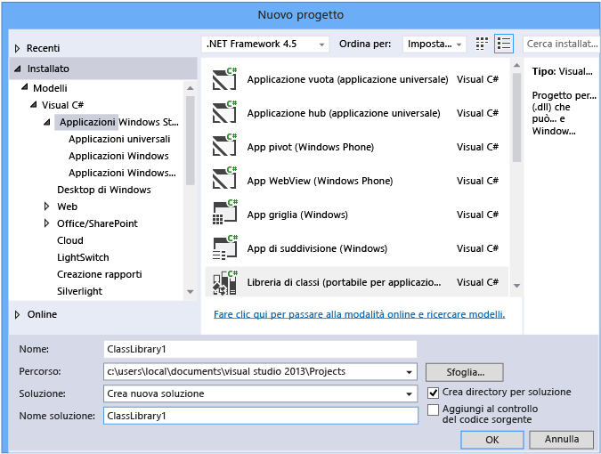
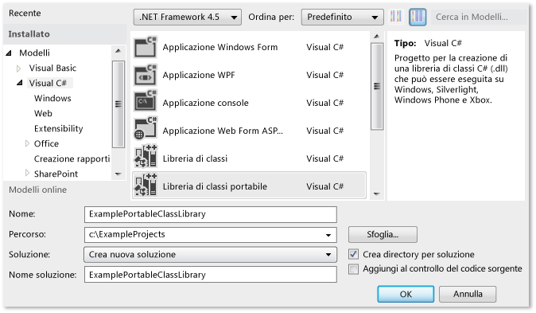
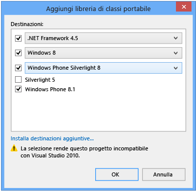
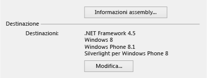
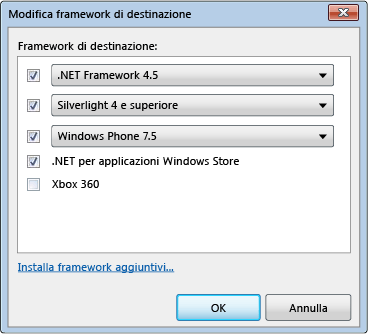
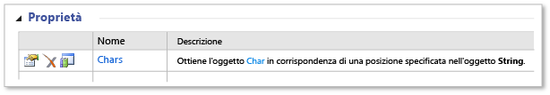
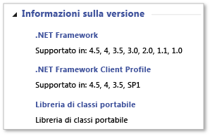

# Sviluppo multipiattaforma con la libreria di classi portabile
Il tipo di progetto Libreria di classi portabile di .NET Framework in Visual Studio consente di creare in modo semplice e veloce app e librerie compatibili con più piattaforme per le piattaforme Microsoft.  
  
 Le librerie di classi portabili consentono di ridurre il tempo e i costi di sviluppo e test del codice. Usare questo tipo di progetto per scrivere e compilare assembly .NET Framework portabili e farvi riferimento da app destinate a più piattaforme, ad esempio Windows e Windows Phone.  
  
 Anche dopo aver creato un progetto Libreria di classi portabile in Visual Studio e aver iniziato lo sviluppo, è possibile modificare le piattaforme di destinazione. Visual Studio compilerà la libreria con i nuovi assembly, semplificando l'identificazione delle modifiche da apportare al codice.  
  
 Questo articolo illustra lo sviluppo di app in Visual Studio, ma Microsoft fornisce anche assembly di riferimento per Libreria di classi portabile che è possibile usare per lo sviluppo di app e librerie con altri strumenti, ad esempio Xamarin. Queste app e librerie possono essere usate su qualsiasi runtime basato su .NET Framework o su piattaforme non Microsoft. Per ulteriori informazioni sugli assembly di riferimento, vedere il post di blog [PCL Portable Class Library () ora disponibile in tutte le piattaforme](http://blogs.msdn.com/b/dotnet/archive/2013/10/14/portable-class-library-pcl-now-available-on-all-platforms.aspx). Per scaricare gli assembly, vedere [assembly di riferimento di Microsoft .NET portabile libreria](http://www.microsoft.com/download/details.aspx?id=40727) in Microsoft Download Center. Per ulteriori informazioni su come utilizzare gli assembly con Xamarin, vedere il post di blog [PCL e librerie NuGet .NET per Xamarin](http://blogs.msdn.com/b/dotnet/archive/2013/11/13/pcl-and-net-nuget-libraries-are-now-enabled-for-xamarin.aspx).  
  
 In Visual Studio sono disponibili modelli che semplificano lo sviluppo di un progetto Libreria di classi portabile. In base alla versione di Visual Studio in uso, i modelli e i menu disponibili possono variare rispetto a quanto descritto in questo articolo.  
  
> [!WARNING]
>  [Visual Studio 2013 Update 2](http://go.microsoft.com/fwlink/p/?LinkId=393658) include aggiornamenti ai modelli di libreria di classi portabile. Se si dispone di una versione precedente di Visual Studio e Visual Studio 2013 installato nello stesso computer, e si installa l'Update 2, le modifiche per il **Framework di destinazione** scelte verranno applicate a entrambe le versioni di Visual Studio.  
  
 Contenuto dell'argomento:  
  
 [Supporto di Visual Studio](#vs_support)   
 [Creazione di un progetto libreria di classi portabile](#create_pcl)   
 [Opzioni di destinazione](#platforms)   
 [Modifica delle destinazioni](#change_targets)   
 [Funzionalità supportate](#features)   
 [Tipi e membri supportati](#members)   
 [Differenze tra API nella libreria di classi portabile](#API_diff)   
 [Utilizzo della libreria di classi portabile](#using)  
  
<a name="vs_support"></a>   
## <a name="visual-studio-support"></a>Supporto di Visual Studio  
 Il supporto di Visual Studio per il progetto Libreria di classi portabile dipende dalla versione di Visual Studio in uso. In alcuni casi si disporrà già di tutto quello che occorre, in altri sarà necessario installare elementi aggiuntivi, come illustrato nella tabella seguente.  
  
|SKU di Visual Studio|Supporto per la creazione di un progetto Libreria di classi portabile|  
|-----------------------|---------------------------------------------------|  
|Visual Studio 2010, Professional, Premium o Ultimate|Sì, quando si installa il [strumenti della libreria portabile](http://go.microsoft.com/fwlink/?LinkId=210823).|  
|Versioni di Visual Studio Express 2010|No.|  
|Visual Studio 2012 Professional, Premium o Ultimate|Sì. Per il supporto telefonico, installare il [Windows Phone SDK 8.0](http://go.microsoft.com/fwlink/?LinkId=265772).|  
|Versioni di Visual Studio Express 2012|No.|  
|Visual Studio 2013 Professional, Premium o Ultimate|Sì. Per il supporto di Windows Phone 8.1, installare [Visual Studio 2013 Update 2](http://go.microsoft.com/fwlink/p/?LinkId=393658).|  
|Visual Studio 2013 Express per Windows|Sì, quando si installa il [versione più recente di Visual Studio Express](http://go.microsoft.com/fwlink/p/?LinkId=394629), che include l'Update 2 o si aggiunge [Visual Studio 2013 Update 2](http://go.microsoft.com/fwlink/p/?LinkId=393658).|  
  
<a name="create_pcl"></a>   
## <a name="creating-a-portable-class-library-project"></a>Creazione di un progetto Libreria di classi portabile  
 Per creare un progetto Libreria di classi portabile è consigliabile usare uno dei modelli disponibili in Visual Studio. Creare un nuovo progetto e il **nuovo progetto** nella finestra di dialogo **modelli**, selezionare la lingua di destinazione (in c# o Visual Basic) e quindi selezionare una delle piattaforme di destinazione. Sarà possibile selezionare piattaforme aggiuntive nel passaggio successivo.  
  
 In Visual Studio 2013 Update 2, è possibile scegliere di **libreria di classi (portabile)** modello per la lingua scelta e la piattaforma per creare una libreria di classi portabile. Questo modello verrà visualizzato per le piattaforme seguenti:  
  
-   Applicazioni Windows Store  
  
-   Windows Desktop  
  
-   Silverlight  
  
 Se si desidera creare una libreria con destinazione Windows Phone 8.1 e Windows 8.1 in c#, è possibile scegliere **applicazioni Windows Store**, quindi scegliere **libreria di classi (portabile per applicazioni universali)**.  
  
   
  
 Questo modello seleziona automaticamente come destinazioni Windows 8.1 e Windows Phone 8.1. Se si crea una libreria che ha come destinazione solo Windows Phone 8.1 o Windows 8.1, sarà possibile modificare le piattaforme di destinazione e aggiungere piattaforme in un momento successivo.  
  
 Se si utilizza Visual Studio 2012 o Visual Studio 2013 senza Update 2, si crea un nuovo progetto e scegliere il **libreria di classi portabile** modello in Visual c# o Visual Basic.  
  
   
  
 Il **Aggiungi libreria di classi portabile** viene visualizzata la finestra di dialogo e sarà possibile selezionare ulteriori piattaforme. La finestra di dialogo mostrerà avvisi di compatibilità in base alle destinazioni selezionate.  
  
   
Finestra di dialogo Aggiungi libreria di classi portabile per Visual Studio 2013 Update 2  
  
 Indipendentemente dal fatto che si usi Visual Studio 2012 o Visual Studio 2013, è possibile selezionare le piattaforme al momento della creazione di un progetto Libreria di classi portabile, oppure usare le proprietà del progetto per modificare le piattaforme di destinazione dopo la creazione.  
  
<a name="platforms"></a>   
## <a name="target-options"></a>Opzioni di destinazione  
 Quando si crea un progetto Libreria di classi portabile, è possibile scegliere il sistema operativo e la versione di .NET Framework di destinazione. Se si utilizza Visual Studio 2013 e installate Update 2 o versioni successive, è possibile scegliere di **libreria di classi (portabile per applicazioni universali)** modello per creare una libreria di classi portabile con destinazione Windows 8.1 e Windows Phone 8.1. Nella tabella seguente sono illustrate le destinazioni disponibili in base alla versione di Visual Studio in uso.  
  
|||||  
|-|-|-|-|  
|Opzione di destinazione|Visual Studio 2012|Visual Studio 2013|Visual Studio 2013 Update 2 o versioni successive|  
|.NET Framework|-.NET framework 4 e versioni successive<br /><br /> -.NET framework 4.0.3 e versioni successive<br /><br /> -.NET framework 4.5|-.NET framework 4 e versioni successive<br /><br /> -.NET framework 4.0.3 e versioni successive<br /><br /> : .NET framework 4.5 e versioni successive<br /><br /> -.NET framework 4.5.1|-.NET framework 4<br /><br /> -.NET framework 4.0.3<br /><br /> -.NET framework 4.5<br /><br /> -.NET framework 4.5.1|  
|Windows Phone|-Windows Phone 7 e versioni successive<br /><br /> -Windows Phone 7.5 e versioni successive<br /><br /> -Windows Phone 8|-Windows Phone 8|-Windows Phone Silverlight 8<br /><br /> -Windows Phone Silverlight 8.1<br /><br /> Per il supporto di Windows Runtime e XAML, selezionare:<br /><br /> -Windows Phone 8.1|  
|Windows Store|-.NET per applicazioni Windows Store|-Applicazioni Windows Store (Windows 8) e versioni successive<br /><br /> -Applicazioni di Windows Store (Windows 8.1)|-Windows 8<br /><br /> -Windows 8.1|  
|-Silverlight|-Silverlight 4 e versioni successive<br /><br /> -Silverlight 5|-Silverlight 5|-Silverlight 5|  
|Xbox|-Xbox 360|N/D|N/D|  
  
<a name="change_targets"></a>   
## <a name="changing-targets"></a>Modifica delle destinazioni  
 Quando si sceglie un modello di Libreria di classi portabile, le piattaforme di destinazione vengono selezionate automaticamente, ma le impostazioni predefinite varieranno in base alla versione di Visual Studio installata e alle destinazioni selezionate in precedenza. È possibile modificare le piattaforme al momento della creazione del progetto Libreria di classi portabile o anche dopo aver iniziato lo sviluppo del progetto.  
  
 Se si desidera modificare le destinazioni dopo aver creato il progetto, in **Esplora**, aprire il menu di scelta rapida per il progetto libreria di classi portabile (non sulla soluzione) e quindi scegliere **proprietà**. Nella pagina delle proprietà del progetto, il **libreria** scheda Mostra le piattaforme di destinazione del progetto attualmente.  
  
   
Pagina delle proprietà di Libreria di classi portabile per Visual Studio 2013 Update 2  
  
 Per aggiungere o rimuovere destinazioni, scegliere il **modifica** , quindi selezionare e deselezionare le caselle di controllo appropriate.  
  
 Quando si modificano le destinazioni, le API disponibili per lo sviluppo del progetto cambiano in base alla selezione. Visual Studio segnala gli avvisi e gli errori che possono verificarsi in seguito alla modifica delle destinazioni.  
  
 Se si desidera valutare la portabilità degli assembly prima di apportare modifiche in Visual Studio, è possibile utilizzare il [.NET Portability Analyzer](http://visualstudiogallery.msdn.microsoft.com/1177943e-cfb7-4822-a8a6-e56c7905292b).  
  
 Le opzioni di menu varieranno in base alla versione di Visual Studio in uso.  
  
   
Finestra di dialogo Modifica destinazioni in Visual Studio 2012  
  
<a name="features"></a>   
## <a name="supported-features"></a>Funzionalità supportate  
 Nella tabella seguente vengono elencate le funzionalità supportate sulle piattaforme e versioni disponibili. In alcuni casi, Microsoft ha aggiunto supporto con il rilascio di un pacchetto NuGet e il fatto è stato segnalato. Per ulteriori informazioni sui pacchetti NuGet per .NET Framework, vedere [di .NET Framework e rilascio Out-of-Band](../../../docs/framework/get-started/the-net-framework-and-out-of-band-releases.md).  
  
|Funzionalità|.NET Framework|.NET Framework|.NET Framework|Windows Store|Windows Store|Windows Phone Store|Silverlight per Windows Phone|Silverlight per Windows Phone|Silverlight per Windows Phone|Silverlight|Silverlight|Xbox 360|  
|-------------|--------------------|--------------------|--------------------|-------------------|-------------------|-------------------------|-------------------------------|-------------------------------|-------------------------------|-----------------|-----------------|--------------|  
||**4**|**4.0.3**|**4.5**|**8**|**8.1**|**8.1**|**7.5**|**8**|**8.1**|**4**|**5**||  
|Librerie di base|✓|✓|✓|✓|✓|✓|✓|✓|✓|✓|✓|✓|  
|Supporto di Async|➊|➊|✓|✓|✓|✓|➊|➊|✓|➊|➊||  
|Compressione|||✓|✓|✓|✓||➋|➋||||  
|Annotazioni dati||✓|✓|✓|✓|||||✓|✓||  
|Parola chiave dinamica|✓|✓|✓|✓|✓|||||✓|✓||  
|HTTPClient|➌|➌|✓|✓|✓|✓|➌|➌|➌|➌|➌||  
|IQueryable|✓|✓|✓|✓|✓|✓|✓|✓|✓|✓|✓||  
|LINQ (Language-Integrated Query)|✓|✓|✓|✓|✓|✓|✓|✓|✓|✓|✓||  
|Managed Extensibility Network (MEF)|✓|✓|✓|✓|✓|||||✓|✓||  
|Network Class Library (NCL)|✓|✓|✓|✓|✓|✓|✓|✓|✓|✓|✓||  
|Serializzazione (contratto dati, XML e JSON)|✓|✓|✓|✓|✓|✓|✓|✓|✓|✓|✓||  
|System.Numerics|✓|✓|✓|✓|✓|||||✓|✓||  
|Modelli di visualizzazione (MVVM)|||✓|✓|✓|✓|✓|✓|✓|✓|✓||  
|Windows Communication Foundation (WCF)|✓|✓|✓|✓|✓||✓|✓|✓|✓|✓||  
|API di Windows Runtime|||||✓|✓|||||||  
|Windows.UI.XAML|||||✓|✓|||||||  
|XLINQ||✓|✓|✓|✓|✓|✓|✓|✓|✓|✓|✓|  
  
 ➊ Richiede [Microsoft Async](https://www.nuget.org/packages/Microsoft.Bcl.Async/) pacchetto  
 ➋ Richiede [Microsoft Compression](https://www.nuget.org/packages/Microsoft.Bcl.Compression) pacchetto  
 ➌ Richiede [librerie Client HTTP Microsoft](http://www.nuget.org/packages/Microsoft.Net.Http) pacchetto  
  
> [!WARNING]
>  Si potrebbero verificare errori quando si fa riferimento il [Microsoft Compression](https://www.nuget.org/packages/Microsoft.Bcl.Compression) e [librerie Client HTTP Microsoft](http://www.nuget.org/packages/Microsoft.Net.Http) pacchetti da una libreria portatile usata da un'app di Windows Phone Silverlight 8.1. Per ulteriori informazioni, vedere [compatibilità delle piattaforme e per le applicazioni Windows Phone Silverlight 8.1 modifiche di rilievo](http://go.microsoft.com/fwlink/p/?LinkId=394744).  
  
<a name="members"></a>   
## <a name="supported-types-and-members"></a>Tipi e membri supportati  
 I tipi e i membri disponibili nei progetti Libreria di classi portabile sono limitati da diversi fattori di compatibilità:  
  
-   Devono essere condivisi tra le destinazioni selezionate.  
  
-   Devono comportarsi in modo analogo tra le destinazioni.  
  
-   Non devono essere candidati per la deprecazione.  
  
-   Devono essere utili in un ambiente portabile, specialmente quando i membri di supporto non lo sono.  
  
 Ad esempio, il progetto Libreria di classi portabile contiene tipi correlati all'interfaccia utente solo quando si scelgono come destinazione Windows 8.1 e Windows Phone 8.1. Possono inoltre esistere limitazioni se le piattaforme scelte come destinazione, ad esempio Xbox, .NET Framework 4 e Windows Phone 7, sono state rilasciate prima dell'introduzione di Libreria di classi portabile. .NET Framework rilascia tramite NuGet pacchetti che migliorano il supporto di Libreria di classi portabile per alcune di queste piattaforme precedenti. Per ulteriori informazioni e un elenco di pacchetti NuGet, vedere [di .NET Framework e rilascio Out-of-Band](../../../docs/framework/get-started/the-net-framework-and-out-of-band-releases.md).  
  
 Se un membro è supportato in Libreria di classi portabile e per le destinazioni selezionate, verrà visualizzato nel progetto in IntelliSense. Inoltre, l'icona di libreria di classi portabile  nelle tabelle dei membri, è presente il [libreria di classi .NET Framework](http://go.microsoft.com/fwlink/?LinkId=211358) accanto ai membri supportati. Ad esempio, la tabella dei membri seguente mostra che il <xref:System.String.Chars%2A> proprietà di <xref:System.String> classe è supportata in libreria di classi portabile:  
  
   
Icona di Libreria di classi portabile  
  
 È inoltre possibile controllare il **informazioni sulla versione** sezione di un argomento di riferimento di una nota che indica che un tipo o membro è supportato nel progetto libreria di classi portabile:  
  
   
Esempio di informazioni sulla versione  
  
 Tenere presente, tuttavia, che un'API può essere supportata in Libreria di classi portabile, ma la possibilità di usarla dipende dalle destinazioni selezionate.  
  
<a name="API_diff"></a>   
## <a name="api-differences-in-the-portable-class-library"></a>Differenze tra API in Libreria di classi portabile  
 Per rendere compatibili gli assembly Libreria di classi portabile su tutte le piattaforme supportate, alcuni membri sono stati leggermente modificati in Libreria di classi portabile.  
  
<a name="using"></a>   
## <a name="using-the-portable-class-library"></a>Uso di Libreria di classi portabile  
 Dopo avere compilato il progetto Libreria di classi portabile, è sufficiente farvi riferimento da altri progetti. È possibile fare riferimento al progetto o ad assembly specifici che contengono le classi a cui si desidera accedere.  
  
 Per eseguire un'app che faccia riferimento a un assembly Libreria di classi portabile, la versione richiesta (o successiva) delle piattaforme di destinazione deve essere installata nel computer. Visual Studio contiene tutti i framework richiesti, quindi è possibile eseguire l'app senza ulteriori modifiche nel computer usato per sviluppare l'app.  
  
### <a name="deploying-a-windows-store-or-windows-phone-app"></a>Distribuzione di un'app Windows Store o Windows Phone  
 Quando si crea un'app Windows Store o Windows Phone che fa riferimento a un assembly Libreria di classi portabile, tutto il necessario per la distribuzione dell'app è incluso nel pacchetto dell'app e non sono necessari ulteriori passaggi.  
  
### <a name="deploying-a-net-framework-app"></a>Distribuzione di un'app .NET Framework  
 Quando si distribuisce un'app .NET Framework che fa riferimento a un assembly Libreria di classi portabile, è necessario specificare una dipendenza dalla versione corretta di .NET Framework. Specificando questa dipendenza, ci si assicura che la versione richiesta per l'app sia installata. Se la destinazione di .NET Framework 4 o versioni successive, il computer deve disporre di .NET Framework 4 con un [aggiornamento](http://go.microsoft.com/fwlink/?LinkId=210824), aggiornamento 4.0.3 per .NET Framework 4 o .NET Framework 4.5.  
  
-   Per creare una dipendenza con la distribuzione ClickOnce: In **Esplora**, scegliere il nodo di progetto per il progetto che si desidera pubblicare. (Si tratta del progetto che fa riferimento al progetto Libreria di classi portabile.) Nella barra dei menu, scegliere **progetto**, **proprietà**, quindi scegliere il **pubblica** scheda. Nel **pubblica** , scegliere pagina **prerequisiti**. Selezionare la versione di .NET Framework richiesta (o l'aggiornamento di .NET Framework 4) come prerequisito.  
  
-   Per creare una dipendenza con un progetto di installazione: In **Esplora**, scegliere il progetto di installazione. Nella barra dei menu, scegliere **progetto**, **proprietà**, **prerequisiti**. Selezionare la versione di .NET Framework richiesta come prerequisito.  
  
 Per ulteriori informazioni sulla distribuzione di applicazioni .NET Framework, vedere [Guida alla distribuzione per gli sviluppatori](../../../docs/framework/deployment/deployment-guide-for-developers.md).  
  
### <a name="deploying-a-silverlight-based-app"></a>Distribuzione di un'app basata su Silverlight  
 Quando si distribuisce un'app basata su Silverlight che fa riferimento a un assembly Libreria di classi portabile, è necessario assicurarsi che la versione di runtime minima richiesta per l'app corrisponda alla versione di destinazione. Se la piattaforma di destinazione è Silverlight 4, la versione deve essere la 4.0.60129.0 o successive. Impostare la versione includendo `<param name="minRuntimeVersion" value="4.0.60129.0" />` nella pagina Web che ospita l'app basata su Silverlight, come illustrato di seguito:  
  
```xaml  
<div id="silverlightControlHost">  
    <object data="data:application/x-silverlight-2,"   
           type="application/x-silverlight-2" width="100%" height="100%">  
    <param name="source" value="ClientBin/SilverlightApplication.xap"/>  
    <param name="onError" value="onSilverlightError" />  
    <param name="background" value="white" />  
    <param name="minRuntimeVersion" value="4.0.60129.0" />  
    <param name="autoUpgrade" value="true" />  
    <a href="http://go.microsoft.com/fwlink/?LinkID=149156&v=4.0.50826.0"   
             style="text-decoration:none">  
        
    </a>  
  </object>  
   <iframe id="_sl_historyFrame"   
              style="visibility:hidden;height:0px;width:0px;border:0px">  
   </iframe>  
</div>  
  
```  
  
## <a name="see-also"></a>Vedere anche  
 [Utilizzo della libreria di classi portabile con MVVM](../../../docs/standard/cross-platform/using-portable-class-library-with-model-view-view-model.md)   
 [Risorse App per librerie destinate a piattaforme Multiple](../../../docs/standard/cross-platform/app-resources-for-libraries-that-target-multiple-platforms.md)   
 [.NET portability Analyzer](http://visualstudiogallery.msdn.microsoft.com/1177943e-cfb7-4822-a8a6-e56c7905292b)   
 [Supporto per .NET framework per applicazioni Windows Store e Windows Runtime](../../../docs/standard/cross-platform/support-for-windows-store-apps-and-windows-runtime.md)   
 [Distribuzione](../../../docs/framework/deployment/net-framework-and-applications.md)