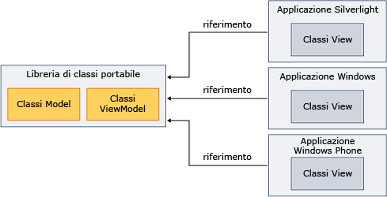

# Utilizzo della libreria di classi portabile con MVVM (Model-View-View Model)
È possibile utilizzare .NET Framework [Libreria di classi portabile](../../../docs/standard/cross-platform/cross-platform-development-with-the-portable-class-library.md) per implementare gli assembly del modello e della condivisione di \(MVVM\) del modello di visualizzazione consente a più piattaforme.  
  
 MVVM è un modello applicazione che consente dell'interfaccia utente dalla logica di business sottostante.  In un progetto [!INCLUDE[net_portable](../../../includes/net-portable-md.md)] in [!INCLUDE[vs_dev11_long](../../../includes/vs-dev11-long-md.md)] è possibile implementare classi di modello e di visualizzazione, quindi creare visualizzazioni personalizzate per piattaforme diverse.  Questo approccio consente di scrivere una sola volta il modello dati e la logica di business ed utilizzare tale codice dalle applicazioni .NET Framework, Silverlight, Windows Phone e [!INCLUDE[win8_appname_long](../../../includes/win8-appname-long-md.md)], come illustrato di seguito.  
  
   
  
 Questa sezione non fornisce informazioni generali sul modello MVVM.  Fornisce solo informazioni su come utilizzare la [!INCLUDE[net_portable](../../../includes/net-portable-md.md)] per implementare MVVM.  Per ulteriori informazioni su MVVM, vedere [MVVM Quickstart](http://go.microsoft.com/fwlink/?LinkId=234934) nella Libreria MSDN.  
  
## Classi che supportano MVVM  
 Quando si utilizza [!INCLUDE[net_v45](../../../includes/net-v45-md.md)], [!INCLUDE[net_win8_profile](../../../includes/net-win8-profile-md.md)], Silverlight, o Windows Phone 7.5 per il progetto tramite la [!INCLUDE[net_portable](../../../includes/net-portable-md.md)], sono disponibili le seguenti classi per implementare il modello MVVM:  
  
-   Classe <xref:System.Collections.ObjectModel.ObservableCollection%601?displayProperty=fullName>  
  
-   Classe <xref:System.Collections.ObjectModel.ReadOnlyObservableCollection%601?displayProperty=fullName>  
  
-   Classe <xref:System.Collections.Specialized.INotifyCollectionChanged?displayProperty=fullName>  
  
-   Classe <xref:System.Collections.Specialized.NotifyCollectionChangedAction?displayProperty=fullName>  
  
-   Classe <xref:System.Collections.Specialized.NotifyCollectionChangedEventArgs?displayProperty=fullName>  
  
-   Classe <xref:System.Collections.Specialized.NotifyCollectionChangedEventHandler?displayProperty=fullName>  
  
-   Classe <xref:System.ComponentModel.DataErrorsChangedEventArgs?displayProperty=fullName>  
  
-   Classe <xref:System.ComponentModel.INotifyDataErrorInfo?displayProperty=fullName>  
  
-   Classe <xref:System.ComponentModel.INotifyPropertyChanged?displayProperty=fullName>  
  
-   Classe <xref:System.Windows.Input.ICommand?displayProperty=fullName>  
  
-   Tutte le classi in <xref:System.ComponentModel.DataAnnotations?displayProperty=fullName>.  
  
## Implementazione MVVM  
 Per distribuire MVVM, si crea in genere sia il modello che il modello di visualizzazione in un progetto con la [!INCLUDE[net_portable](../../../includes/net-portable-md.md)], perché un progetto che utilizza la [!INCLUDE[net_portable](../../../includes/net-portable-md.md)] non può fare riferimento ad un progetto non portabile.  Il modello e il modello di visualizzazione possono trovarsi nello stesso progetto o in progetti separati.  Se si utilizzano progetti distinti, bisogna aggiungere un riferimento dal modello di visualizzazione al progetto del modello.  
  
 Dopo la compilazione dei progetti del modello e del modello di visualizzazione, bisogna aggiungere un riferimento a tali assembly nell'applicazione contenente la visualizzazione.  Se la visualizzazione interagisce solo con il modello di visualizzazione, è possibile fare riferimento solo all'assembly che contiene il modello di visualizzazione.  
  
### Modello  
 Nell'esempio seguente viene illustrata una classe semplificata del modello che potrebbe trovarsi in un progetto [!INCLUDE[net_portable](../../../includes/net-portable-md.md)].  
  
 [!code-csharp[PortableClassLibraryMVVM#1](../../../samples/snippets/csharp/VS_Snippets_CLR/portableclasslibrarymvvm/cs/customer.cs#1)]
 [!code-vb[PortableClassLibraryMVVM#1](../../../samples/snippets/visualbasic/VS_Snippets_CLR/portableclasslibrarymvvm/vb/customer.vb#1)]  
  
 Nell'esempio seguente viene illustrato un modo semplice per popolare, recuperare e aggiornare i dati in un progetto [!INCLUDE[net_portable](../../../includes/net-portable-md.md)].  In un'applicazione reale, recuperereste i dati da un'origine come servizio di Windows Communication Foundation \(WCF\).  
  
 [!code-csharp[PortableClassLibraryMVVM#2](../../../samples/snippets/csharp/VS_Snippets_CLR/portableclasslibrarymvvm/cs/customerrepository.cs#2)]
 [!code-vb[PortableClassLibraryMVVM#2](../../../samples/snippets/visualbasic/VS_Snippets_CLR/portableclasslibrarymvvm/vb/customerrepository.vb#2)]  
  
### Modello di visualizzazione  
 Quando si implementa il modello MVVM, viene spesso aggiunta una classe base per i modelli di visualizzazione.  Nell'esempio seguente viene illustrata una classe base.  
  
 [!code-csharp[PortableClassLibraryMVVM#3](../../../samples/snippets/csharp/VS_Snippets_CLR/portableclasslibrarymvvm/cs/viewmodelbase.cs#3)]
 [!code-vb[PortableClassLibraryMVVM#3](../../../samples/snippets/visualbasic/VS_Snippets_CLR/portableclasslibrarymvvm/vb/viewmodelbase.vb#3)]  
  
 Con il modello MVVM viene spesso utilizzata l'implementazione dell'interfaccia <xref:System.Windows.Input.ICommand>.  Nell'esempio seguente viene illustrata un'implementazione dell'interfaccia <xref:System.Windows.Input.ICommand>.  
  
 [!code-csharp[PortableClassLibraryMVVM#4](../../../samples/snippets/csharp/VS_Snippets_CLR/portableclasslibrarymvvm/cs/relaycommand.cs#4)]
 [!code-vb[PortableClassLibraryMVVM#4](../../../samples/snippets/visualbasic/VS_Snippets_CLR/portableclasslibrarymvvm/vb/relaycommand.vb#4)]  
  
 Nell'esempio seguente viene illustrato un modello di visualizzazione semplificato.  
  
 [!code-csharp[PortableClassLibraryMVVM#5](../../../samples/snippets/csharp/VS_Snippets_CLR/portableclasslibrarymvvm/cs/mainpageviewmodel.cs#5)]
 [!code-vb[PortableClassLibraryMVVM#5](../../../samples/snippets/visualbasic/VS_Snippets_CLR/portableclasslibrarymvvm/vb/customerviewmodel.vb#5)]  
  
### Visualizzazione  
 Da un'applicazione [!INCLUDE[net_v45](../../../includes/net-v45-md.md)], [!INCLUDE[win8_appname_long](../../../includes/win8-appname-long-md.md)], basata su Silverlight, o Windows Phone 7.5, è possibile fare riferimento all'assembly che contiene i progetti del modello di visualizzazione e del modello.  Quindi creare una visualizzazione che interagisca con il modello di visualizzazione.  Nell'esempio seguente viene illustrata un'applicazione semplificata Windows Presentation Foundation \(WPF\) che recupera e aggiorna i dati dal modello di visualizzazione.  È possibile creare visualizzazioni simili in Silverlight, Windows Phone, o applicazioni [!INCLUDE[win8_appname_long](../../../includes/win8-appname-long-md.md)].  
  
 [!code-xml[PortableClassLibraryMVVM#6](../../../samples/snippets/csharp/VS_Snippets_CLR/portableclasslibrarymvvm/cs/mainwindow.xaml#6)]  
  
## Vedere anche  
 [Libreria di classi portabile](../../../docs/standard/cross-platform/cross-platform-development-with-the-portable-class-library.md)