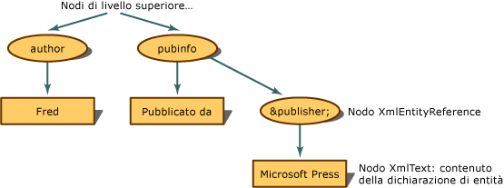

# Riferimenti alle entit&#224; conservati
Se il riferimento all'entità non viene espanso, ma conservato, il modello DOM \(Document Object Model\) XML compila un nodo **XmlEntityReference** quando rileva un riferimento all'entità.  
  
 Usando il seguente codice XML,  
  
```  
<author>Fred</author>  
<pubinfo>Published by &publisher;</pubinfo>  
```  
  
 il modello DOM compila un nodo **XmlEntityReference** quando rileva il riferimento `&publisher;` .  Il nodo **XmlEntityReference** contiene nodi figlio copiati dal contenuto della dichiarazione di entità.  Nell'esempio di codice precedente è contenuto del testo nella dichiarazione di entità, quindi viene creato un nodo **XmlText** come nodo figlio del nodo del riferimento all'entità.  
  
   
Struttura ad albero per i riferimenti alle entità conservati  
  
 I nodi figlio di **XmlEntityReference** sono copie di tutti i nodi figlio creati dal nodo **XmlEntity** quando è stata rilevata la dichiarazione di entità.  
  
> [!NOTE]
>  I nodi copiati da **XmlEntity** non sono sempre copie esatte una volta posizionati sotto il nodo del riferimento all'entità.  Nell'ambito del nodo del riferimento all'entità possono essere presenti spazi dei nomi che incidono sulla configurazione finale dei nodi figlio.  
  
 Per impostazione predefinita, le entità generali quali `&abc;` vengono conservate e vengono sempre creati nodi **XmlEntityReference**.  
  
## Vedere anche  
 [Modello DOM \(Document Object Model\) XML](../../../../docs/standard/data/xml/xml-document-object-model-dom.md)