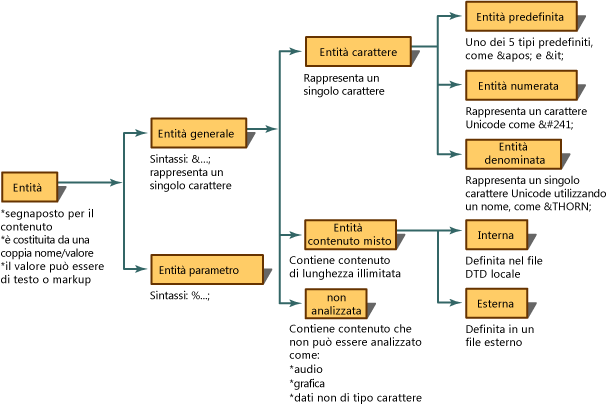
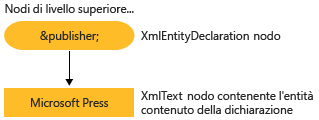

# Lettura delle dichiarazioni di entit&#224; e dei riferimenti a entit&#224; nel DOM
Un'entità è una dichiarazione che stabilisce il nome da usare in XML al posto del contenuto o del markup.  Le entità sono composte da due parti.  Innanzitutto, è necessario associare un nome al contenuto di sostituzione tramite una dichiarazione di entità.  La dichiarazione di entità viene creata mediante la sintassi `<!ENTITY name "value">` in una DTD \(Document Type Definition\) o in uno schema XML.  Successivamente, il nome definito nella dichiarazione di entità viene usato in XML  e, in questo caso, viene denominato riferimento all'entità.  Ad esempio, la dichiarazione di entità seguente dichiara un'entità il cui nome `publisher` viene associato al contenuto di "Microsoft Press".  
  
```  
<!ENTITY publisher "Microsoft Press">  
```  
  
 Nel seguente esempio è illustrato l'uso di questa dichiarazione di entità in XML come riferimento all'entità.  
  
```  
<author>Fred</author>  
<pubinfo>Published by &publisher;</pubinfo>  
```  
  
 Alcuni parser consentono di espandere automaticamente le entità quando viene caricato un documento in memoria.  Quindi, quando l'XML viene letto in memoria, le dichiarazioni di entità vengono memorizzate e salvate.  Durante il successivo rilevamento dei caratteri `&;`, che identificano un riferimento a un'entità generale, il parser ricercherà quel determinato nome in una tabella delle dichiarazioni di entità.  Il riferimento `&publisher;` verrà sostituito dal contenuto che rappresenta.  Usando il seguente codice XML,  
  
```  
<author>Fred</author>  
<pubinfo>Published by &publisher;</pubinfo>  
```  
  
 espandendo il riferimento all'entità e sostituendo `&publisher;` con il contenuto di Microsoft Press viene fornito il seguente codice XML espanso.  
  
 **Output**  
  
```  
<author>Fred</author>  
<pubinfo>Published by Microsoft Press</pubinfo>  
```  
  
 Esistono molti tipi di entità.  Nel diagramma seguente è riportata la suddivisione dei tipi di entità e della terminologia.  
  
   
  
 Per impostazione predefinita, nell'implementazione Microsoft .NET Framework del DOM XML, i riferimenti alle entità vengono conservati e le entità non vengono espanse quando si carica l'XML.  Di conseguenza quando un documento viene caricato nel DOM, viene creato un nodo **XmlEntityReference** contenente la variabile di riferimento `&publisher;` con tutti i nodi figlio che rappresentano il contenuto dell'entità dichiarata nella DTD.  
  
 Usando la dichiarazione di entità `<!ENTITY publisher "Microsoft Press">`, nel diagramma seguente vengono mostrati i nodi **XmlEntity** e **XmlText** creati da questa dichiarazione.  
  
   
  
 Il fatto che i riferimenti alle entità vengano espansi o meno determina quali nodi vengono generati nell'albero del DOM, in memoria.  La differenza tra i nodi generati è descritta negli argomenti [Riferimenti alle entità conservati](../../../../docs/standard/data/xml/entity-references-are-preserved.md) e [Riferimenti alle entità espansi e non conservati](../../../../docs/standard/data/xml/entity-references-are-expanded-and-not-preserved.md).  
  
## Vedere anche  
 [Modello DOM \(Document Object Model\) XML](../../../../docs/standard/data/xml/xml-document-object-model-dom.md)