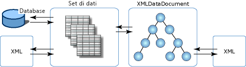

# Integrazione di XML con dati relazionali e ADO.NET
La classe **XmlDataDocument** è una classe derivata di **XmlDocument** e contiene dati XML.  Il principale vantaggio è costituito dal fatto che **XmlDataDocument** fornisce un collegamento tra i dati relazionali e quelli gerarchici.  Si tratta infatti di un elemento di **XmlDocument** che può essere associato a un **DataSet** ed entrambe le classi sono in grado di sincronizzare le modifiche apportate ai dati in esse contenuti.  Usando un elemento di **XmlDocument** associato a un **DataSet** è possibile integrare l'XML con i dati relazionali senza dover rappresentare i dati in formato relazionale o XML.  È possibile usare entrambe le rappresentazioni di dati, senza essere costretti a usarne una sola.  
  
 La possibilità di visualizzare i dati in due modi diversi comporta i seguenti vantaggi:  
  
-   È possibile associare la parte strutturata di un documento XML a un dataset per aumentare l'efficacia delle operazioni di archiviazione, indicizzazione e ricerca.  
  
-   Le operazioni di trasformazione, convalida e navigazione possono essere eseguite in modo efficace tramite un modello a cursore per i dati XML archiviati in modo relazionale.  A volte queste operazioni si rivelano più efficaci se eseguite in strutture relazionali, anziché con dati XML archiviati in un modello **XmlDocument**.  
  
-   È possibile archiviare in un **DataSet** solo una parte dei dati XML.  Questo significa che è possibile usare **XPath** o **XslTransform** per archiviare in un **DataSet** solo gli elementi e gli attributi desiderati.  Pertanto, è possibile apportare le modifiche a un subset di dati filtrato e di dimensioni minori, quindi propagarle a gruppi di dati di dimensioni maggiori nella classe **XmlDataDocument**.  
  
 È inoltre possibile eseguire una trasformazione dei dati caricati in un **DataSet** da SQL Server  e associare controlli gestiti Web Form e Windows Form, costituiti da classi .NET Framework, a un **DataSet** compilato da un flusso di input XML.  
  
 Oltre a supportare **XslTransform**, una classe **XmlDataDocument** consente di esporre i dati relazionali alle operazioni di convalida e query **XPath**.  Fondamentalmente, per i dati relazionali sono disponibili tutti i servizi XML. Le funzionalità relazionali, quali l'associazione dei controlli, la chiamata CODEGEN e così via sono inoltre disponibili nelle proiezioni strutturate di XML, senza compromettere la fedeltà al documento XML.  
  
 Dal momento che è ereditata dalla classe **XmlDocument**, la classe **XmlDataDocument** fornisce un'implementazione del modello DOM di W3C.  L'associazione di **XmlDataDocument** a un **DataSet** e il fatto che un subset dei dati di questa classe sia archiviato in un **DataSet** non ne limitano né modificano in alcun modo l'uso come XmlDocument.  Il codice scritto per usare **XmlDocument** funziona anche con **XmlDataDocument**.  Il **DataSet** consente una visualizzazione relazionale degli stessi dati mediante la definizione di tabelle, colonne, relazioni e vincoli. Rappresenta inoltre un archivio dei dati utente autonomo e residente in memoria.  
  
 Nella figura seguente sono illustrate le diverse associazioni dei dati XML con gli oggetti **DataSet** e **XmlDataDocument**.  
  
   
  
 Nella figura viene mostrato che i dati XML possono essere caricati direttamente in un **DataSet**, per consentirne un'elaborazione diretta con i dati XML in modo relazionale.  In alternativa, i dati XML possono essere caricati in una classe derivata del DOM, la classe **XmlDataDocument**, quindi possono essere caricati e sincronizzati con il **DataSet** in un secondo momento.  Dal momento che gli oggetti **DataSet** e **XmlDataDocument** sono sincronizzati rispetto a un unico set di dati, le modifiche apportate ai dati di un archivio si riflettono nell'altro archivio.  
  
 **XmlDataDocument** eredita tutte le funzionalità di modifica e di navigazione da **XmlDocument**.  A volte può risultare più conveniente usare un elemento **XmlDataDocument** con le relative funzionalità ereditate, sincronizzato con un **DataSet**, anziché caricare i dati XML direttamente in un **DataSet**.  Nella tabella seguente sono indicati gli elementi da considerare nella scelta del metodo di caricamento del **DataSet**.  
  
|Quando caricare i dati XML direttamente in un DataSet|Quando sincronizzare una classe XmlDataDocument con un DataSet|  
|-----------------------------------------------------------|--------------------------------------------------------------------|  
|È più semplice eseguire query di dati in un **DataSet** usando SQL anziché XPath.|È necessario eseguire query XPath nei dati del **DataSet**.|  
|Non è necessario conservare l'ordine degli elementi nel documento XML di origine.|È necessario conservare l'ordine degli elementi nel documento XML di origine.|  
|Non è necessario conservare gli spazi vuoti tra gli elementi e la formattazione nel documento XML di origine.|È necessario conservare gli spazi vuoti tra gli elementi e la formattazione nel documento XML di origine.|  
  
 Per informazioni sul caricamento e la scrittura dei dati XML direttamente in e da un **DataSet**, vedere [Caricamento di un DataSet da XML](../../../../docs/framework/data/adonet/dataset-datatable-dataview/loading-a-dataset-from-xml.md) e [Scrittura di un DataSet sotto forma di dati XML](../../../../docs/framework/data/adonet/dataset-datatable-dataview/writing-dataset-contents-as-xml-data.md).  
  
 Per informazioni sul caricamento di un **DataSet** da una classe **XmlDataDocument**, vedere [Sincronizzazione di un Dataset con un XmlDataDocument](../../../../docs/framework/data/adonet/dataset-datatable-dataview/dataset-and-xmldatadocument-synchronization.md).  
  
## Vedere anche  
 [Utilizzo di XML in un DataSet](../../../../docs/framework/data/adonet/dataset-datatable-dataview/using-xml-in-a-dataset.md)