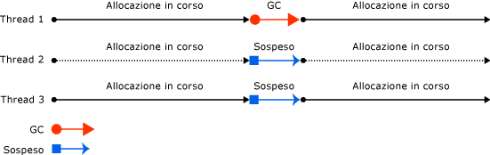
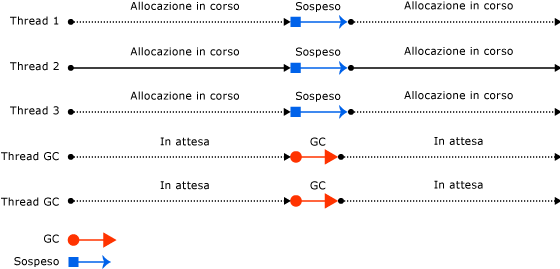
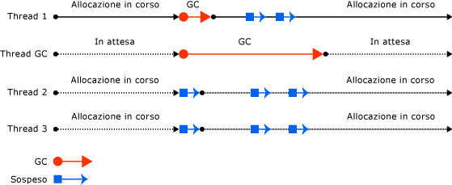
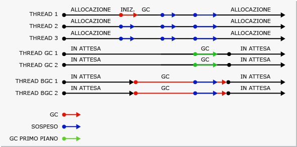

# Fundamentals of Garbage Collection
 In Common Language Runtime \(CLR\) il Garbage Collector funge da gestore di memoria automatico, offrendo i seguenti vantaggi:  
  
-   Consente di sviluppare un'applicazione senza alcun bisogno di liberare memoria.  
  
-   Alloca gli oggetti nell'heap gestito in maniera efficiente.  
  
-   Recupera gli oggetti inutilizzati, ne cancella la memoria e tiene la memoria a disposizione per le future allocazioni. Gli oggetti gestiti ottengono automaticamente contenuto pulito con il quale iniziare, pertanto i costruttori non devono inizializzare ogni campo dati.  
  
-   Garantisce protezione per la memoria assicurando che un oggetto non possa usare il contenuto di un altro oggetto.  
  
 In questo argomento vengono descritti i concetti principali di Garbage Collection. Include le sezioni seguenti:  
  
-   [Nozioni fondamentali sulla memoria](#fundamentals_of_memory)  
  
-   [Condizioni per un'operazione di Garbage Collection](#conditions_for_a_garbage_collection)  
  
-   [Heap gestito](#the_managed_heap)  
  
-   [Generazioni](#generations)  
  
-   [Fasi di un'operazione di Garbage Collection](#what_happens_during_a_garbage_collection)  
  
-   [Modifica delle risorse non gestite](#manipulating_unmanaged_resources)  
  
-   [Operazione di Garbage Collection per workstation e server](#workstation_and_server_garbage_collection)  
  
-   [Garbage Collection contemporanea](#concurrent_garbage_collection)  
  
-   [Garbage Collection della workstation in background](#background_garbage_collection)  
  
-   [Garbage Collection del server in background](#background_server_garbage_collection)  
  
   
## Nozioni fondamentali sulla memoria  
 Nell'elenco seguente sono riepilogati concetti importanti relativi alla memoria CLR.  
  
-   Ogni processo dispone di un proprio spazio degli indirizzi virtuali distinto. Tutti i processi nello stesso computer condividono la stessa memoria fisica e condividono il file di paging, se presente.  
  
-   Per impostazione predefinita, nei computer a 32 bit ogni processo dispone di uno spazio degli indirizzi virtuali in modalità utente da 2 GB.  
  
-   Uno sviluppatore di applicazioni usa solo lo spazio degli indirizzi virtuali e non modifica mai direttamente la memoria fisica. Il Garbage Collector alloca e libera automaticamente la memoria virtuale nell'heap gestito.  
  
     Se si sta scrivendo in codice nativo, si usano funzioni Win32 per lavorare con lo spazio degli indirizzi virtuali. Queste funzioni allocano e liberano automaticamente la memoria virtuale negli heap nativi.  
  
-   La memoria virtuale può trovarsi in tre stati:  
  
    -   Libero. Non vi sono riferimenti al blocco di memoria, che è disponibile per l'allocazione.  
  
    -   Riservato. Il blocco di memoria è disponibile per l'utilizzo e non può essere usato da un'altra richiesta di allocazione. Non è tuttavia possibile archiviare i dati in questo blocco di memoria fino a quando non viene eseguito il commit.  
  
    -   Eseguito. Il blocco di memoria è assegnato all'archiviazione fisica.  
  
-   Lo spazio degli indirizzi virtuali può diventare frammentato. Ciò significa che sono presenti blocchi liberi, noti anche come buchi, nello spazio degli indirizzi. Quando viene richiesta un'allocazione della memoria virtuale, il gestore di memoria virtuale deve trovare un singolo blocco libero con dimensioni sufficienti per soddisfare la richiesta di allocazione. Anche se si dispone di 2 GB di spazio disponibile, l'allocazione che richiede 2 GB avrà esito negativo a meno che tutto lo spazio si trovi in un unico blocco di indirizzi.  
  
-   È possibile esaurire la memoria se si esaurisce lo spazio degli indirizzi virtuali da riservare o lo spazio fisico di cui eseguire il commit.  
  
 Il file di paging viene usato anche se la pressione della memoria fisica \(ovvero, la richiesta di memoria fisica\) è bassa. La prima volta che la pressione della memoria fisica è elevata, il sistema operativo deve fare spazio nella memoria fisica per archiviare i dati ed esegue il backup di alcuni dei dati che si trovano nella memoria fisica nel file di paging. Il paging dei dati non viene eseguito fino a quando non è necessario, pertanto è possibile riscontrare il paging in situazioni in cui la pressione della memoria fisica è molto bassa.  
  
 [Torna all'inizio](#top)  
  
   
## Condizioni per un'operazione di Garbage Collection  
 Le operazioni di Garbage Collection vengono eseguite in presenza di una delle seguenti condizioni:  
  
-   La memoria fisica del sistema è insufficiente.  
  
-   La memoria usata dagli oggetti allocati nell'heap gestito supera una soglia accettabile. Questa soglia viene continuamente modificata durante l'esecuzione del processo.  
  
-   Viene chiamato il metodo <xref:System.GC.Collect%2A?displayProperty=fullName>. Nella quasi totalità dei casi non è necessario chiamare questo metodo, in quanto il Garbage Collector viene eseguito senza interruzioni. Il metodo viene usato principalmente in situazioni eccezionali e per scopi di test.  
  
 [Torna all'inizio](#top)  
  
   
## Heap gestito  
 Dopo essere stato inizializzato da CLR, il Garbage Collector alloca un segmento di memoria per archiviare e gestire oggetti. Questa memoria è definita heap gestito, in contrapposizione a un heap nativo presente nel sistema operativo.  
  
 Per ogni processo gestito esiste un heap gestito. Tutti i thread nel processo allocano memoria per gli oggetti sullo stesso heap.  
  
 Per riservare memoria, il Garbage Collector chiama la funzione [VirtualAlloc](http://go.microsoft.com/fwlink/?LinkId=179047) Win32 e riserva un segmento di memoria alla volta per le applicazioni gestite. Il Garbage Collector riserva inoltre i segmenti secondo le esigenze e li rilascia al sistema operativo dopo aver cancellato tutti gli oggetti, chiamando la funzione [VirtualFree](http://go.microsoft.com/fwlink/?LinkId=179050) Win32.  
  
> [!IMPORTANT]
>  La dimensione dei segmenti allocati dal Garbage Collector è specifica dell'implementazione ed è soggetta a modifiche in qualsiasi momento, tra cui aggiornamenti periodici. L'applicazione non deve dare per scontata o dipendere da una particolare dimensione del segmento, né provare a configurare la quantità di memoria disponibile per le allocazioni di segmenti.  
  
 Minore è il numero di oggetti allocati nell'heap, minore sarà il lavoro del Garbage Collector. Quando si allocano oggetti, non usare valori arrotondati per eccesso che superino le proprie esigenze, ad esempio non allocare una matrice di 32 byte se sono necessari solo 15 byte.  
  
 Quando viene attivata un'operazione di Garbage Collection, il Garbage Collector recupera la memoria occupata dagli oggetti inutilizzati. Durante il processo di recupero, gli oggetti attivi vengono compattati in modo da poter essere spostati insieme e lo spazio inutilizzato viene rimosso, riducendo le dimensioni dell'heap. In questo modo si garantisce che gli oggetti allocati insieme restino uniti nell'heap gestito, preservandone la vicinanza.  
  
 L'impatto \(frequenza e durata\) delle operazioni di Garbage Collection è il risultato del volume di allocazioni e della quantità di memoria esclusa nell'heap gestito.  
  
 L'heap può essere considerato l'insieme di due heap: l'heap degli oggetti grandi e l'heap degli oggetti piccoli.  
  
 L'heap oggetti grandi contiene oggetti di dimensioni pari o superiori a 85.000 byte. Gli oggetti sull'heap oggetti grandi sono in genere matrici. È raro che un oggetto istanza sia particolarmente grande.  
  
 [Torna all'inizio](#top)  
  
   
## Generazioni  
 L'heap è organizzato in generazioni, così da poter gestire oggetti di lunga durata e di breve durata. Durante un'operazione di Garbage Collection vengono recuperati per primi gli oggetti di breve durata, che in genere occupano solo una piccola parte dell'heap. Esistono tre generazioni di oggetti nell'heap:  
  
-   **Generazione 0**. È la generazione più recente e contiene oggetti di breve durata. Un esempio di oggetto di breve durata è una variabile temporanea. Le operazioni di Garbage Collection vengono eseguite il più delle volte in questa generazione.  
  
     Gli oggetti appena allocati formano una nuova generazione di oggetti e sono implicitamente raccolte di generazione 0, a meno che non siano oggetti grandi, nel qual caso vengono inseriti nell'heap degli oggetti grandi in una raccolta di generazione 2.  
  
     Gran parte degli oggetti vengono recuperati tramite Garbage Collection nella generazione 0 e non passano alla generazione successiva.  
  
-   **Generazione 1**. Questa generazione contiene oggetti di breve durata e funge da buffer tra gli oggetti di breve durata e gli oggetti di lunga durata.  
  
-   **Generazione 2**. Questa generazione contiene oggetti di lunga durata. Un esempio di oggetto di lunga durata è un oggetto in un'applicazione server contenente dati statici che restano attivi per la durata del processo.  
  
 Le operazioni di Garbage Collection vengono eseguite in generazioni specifiche a seconda delle condizioni. Raccogliere una generazione significa raccogliere gli oggetti in quella generazione e in tutte le generazioni più recenti. Un'operazione di Garbage Collection di generazione 2 viene definita completa, in quanto recupera tutti gli oggetti in tutte le generazioni, vale a dire tutti gli oggetti nell'heap gestito.  
  
### Esclusione e promozioni  
 Gli oggetti che non vengono recuperati durante un'operazione di Garbage Collection sono definiti oggetti esclusi e vengono promossi alla generazione successiva. Gli oggetti esclusi da un'operazione di Garbage Collection di generazione 0 vengono promossi alla generazione 1; gli oggetti esclusi da un'operazione di Garbage Collection di generazione 1 vengono promossi alla generazione 2; gli oggetti esclusi da un'operazione di Garbage Collection di generazione 2 restano nella generazione 2.  
  
 Quando il Garbage Collector rileva un tasso di esclusione elevato in una generazione, aumenta la relativa soglia delle allocazioni, in modo che la raccolta successiva generi un recupero di memoria sostanziale. CLR bilancia continuamente due priorità: impedire che il working set di un'applicazione diventi troppo grande e limitare la durata delle operazioni di Garbage Collection.  
  
### Generazioni e segmenti temporanei  
 Poiché gli oggetti nelle generazioni 0 e 1 sono di breve durata, queste vengono definite generazioni temporanee.  
  
 Le generazioni temporanee devono essere allocate nel segmento di memoria noto come segmento temporaneo. Ogni nuovo segmento acquisito dal Garbage Collector diventa il nuovo segmento temporaneo e contiene gli oggetti esclusi da un'operazione di Garbage Collection di generazione 0. Il segmento temporaneo precedente diventa il nuovo segmento di generazione 2.  
  
 La dimensione del segmento temporaneo varia a seconda del sistema, a 32 o a 64 bit, e al tipo di procedura di Garbage Collector in esecuzione. Nella tabella che segue sono riportati i valori predefiniti.  
  
||32 bit|64 bit|  
|-|------------|------------|  
|GC workstation|16 MB|256 MB|  
|GC server|64 MB|4 GB|  
|GC server con \> 4 CPU logiche|32 MB|2 GB|  
|GC server con \> 8 CPU logiche|16 MB|1 GB|  
  
 Il segmento temporaneo può includere oggetti di generazione 2, i quali possono usare più segmenti \(nella misura richiesta dal processo e consentita dalla memoria\).  
  
 La quantità di memoria liberata da un'operazione di Garbage Collection temporanea è limitata alla dimensione del segmento temporaneo. Tale quantità di memoria è proporzionale allo spazio occupato dagli oggetti inutilizzati.  
  
 [Torna all'inizio](#top)  
  
   
## Fasi di un'operazione di Garbage Collection  
 Un'operazione di Garbage Collection si compone delle seguenti fasi:  
  
-   Una fase di contrassegno in cui vengono individuati tutti gli oggetti attivi e ne viene creato un elenco.  
  
-   Una fase di rilocazione in cui vengono aggiornati i riferimenti agli oggetti che saranno compattati.  
  
-   Una fase di compattazione in cui lo spazio occupato dagli oggetti inutilizzati viene recuperato e gli oggetti esclusi compattati. Durante questa fase, gli oggetti rimasti dopo un'operazione di Garbage Collection vengono spostati verso l'estremità meno recente del segmento.  
  
     Poiché le raccolte di generazione 2 possono occupare più segmenti, gli oggetti promossi alla generazione 2 possono essere spostati in un segmento meno recente. Gli oggetti esclusi di generazione 1 e 2 possono essere spostati in un segmento diverso, in quanto vengono promossi alla generazione 2.  
  
     L'heap oggetti grandi non viene in genere compresso perché la copia di oggetti grandi impone un calo delle prestazioni. Tuttavia, a partire da [!INCLUDE[net_v451](../../../includes/net-v451-md.md)], è possibile usare la proprietà <xref:System.Runtime.GCSettings.LargeObjectHeapCompactionMode%2A?displayProperty=fullName> per comprimere l'heap oggetti grandi su richiesta.  
  
 Per stabilire se gli oggetti sono attivi, il Garbage Collector usa le seguenti informazioni:  
  
-   **Radici dello stack**. Variabili dello stack fornite dal compilatore JIT e dal percorso di chiamate nello stack.  
  
-   **Handle di Garbage Collection**. Handle che puntano agli oggetti gestiti e che possono essere allocati mediante codice utente o Common Language Runtime.  
  
-   **Dati statici**. Oggetti statici nei domini applicazione che possono fare riferimento ad altri oggetti. Ogni dominio applicazione tiene traccia dei rispettivi oggetti statici.  
  
 Prima di eseguire un'operazione di Garbage Collection, tutti i thread gestiti vengono sospesi, eccetto il thread che attiva l'operazione.  
  
 Nell'illustrazione seguente viene illustrato un thread che attiva un'operazione di Garbage Collection causando la sospensione degli altri thread.  
  
   
Thread che attiva un'operazione di Garbage Collection  
  
 [Torna all'inizio](#top)  
  
   
## Modifica delle risorse non gestite  
 Se gli oggetti gestiti fanno riferimento a oggetti non gestiti tramite i relativi handle di file nativi, è necessario liberare in modo esplicito gli oggetti non gestiti, poiché il Garbage Collector tiene traccia della memoria solo sull'heap gestito.  
  
 È possibile che gli utenti dell'oggetto gestito non eliminino le risorse native usate dall'oggetto. Per eseguire la pulizia, è possibile rendere l'oggetto gestito finalizzabile. La finalizzazione consiste in azioni di pulizia che si eseguono quando l'oggetto non è più usato. Quando l'oggetto gestito cessa di essere usato, esegue azioni di pulizia specificate nel metodo del relativo finalizzatore.  
  
 Quando viene individuato un oggetto finalizzabile inutilizzato, il relativo finalizzatore viene inserito in una coda in modo che vengano eseguite le azioni di pulizia, mentre l'oggetto stesso viene promosso alla generazione successiva. Sarà pertanto necessario attendere l'operazione di Garbage Collection successiva eseguita in tale generazione, che non sarà necessariamente l'operazione immediatamente successiva, per stabilire se l'oggetto è stato recuperato.  
  
 [Torna all'inizio](#top)  
  
   
## Operazione di Garbage Collection per workstation e server  
 Il Garbage Collector si regola da sé e può funzionare in un'ampia varietà di scenari. È possibile usare un'impostazione del file di configurazione per impostare il tipo di operazione di Garbage Collection, in base alle caratteristiche del carico di lavoro. CLR fornisce i seguenti tipi di Garbage Collection:  
  
-   Garbage Collection per workstation, per tutte le workstation client e i PC autonomi. Si tratta dell'impostazione predefinita per l'[elemento \<gcServer\>](../../../docs/framework/configure-apps/file-schema/runtime/gcserver-element.md) nello schema di configurazione di runtime.  
  
     Le operazioni di Garbage Collection per workstation possono essere eseguite in modalità simultanea o non simultanea. La modalità simultanea consente ai thread gestiti di continuare le operazioni durante un'operazione di Garbage Collection.  
  
     A partire da [!INCLUDE[net_v40_long](../../../includes/net-v40-long-md.md)], la modalità simultanea è sostituita dalla modalità in background.  
  
-   Garbage Collection per server, per le applicazioni server che richiedono scalabilità e velocità effettiva elevata. L'operazione di Garbage Collection per server può essere eseguita non in modalità di concorrenza o in background.  
  
 La seguente illustrazione mostra i thread dedicati che eseguono l'operazione di Garbage Collection in un server.  
  
   
Garbage Collection nel server  
  
### Configurazione dell'operazione di Garbage Collection  
 È possibile usare l'[elemento \<gcServer\>](../../../docs/framework/configure-apps/file-schema/runtime/gcserver-element.md) dello schema di configurazione di runtime per specificare il tipo di operazione di Garbage Collection da eseguire tramite CLR. Quando l'attributo `enabled` di questo elemento è impostato su `false` \(impostazione predefinita\), CLR esegue un'operazione di Garbage Collection per workstation. Quando si imposta l'attributo `enabled` su `true`, CLR esegue un'operazione di Garbage Collection per server.  
  
 La modalità di concorrenza viene specificata con l'[elemento \<gcConcurrent\>](../../../docs/framework/configure-apps/file-schema/runtime/gcconcurrent-element.md) dello schema di configurazione di runtime. L'impostazione predefinita è `enabled`. Questa impostazione controlla sia l'operazione di Garbage Collection simultanea che quella in background.  
  
 È anche possibile specificare operazioni di Garbage Collection per server con interfacce di hosting non gestite. Si noti che ASP.NET e SQL Server abilitano automaticamente le operazioni di Garbage Collection per server se l'applicazione è ospitata in uno di questi ambienti.  
  
### Confronto tra operazioni di Garbage Collection per workstation e server  
 Di seguito sono riportate alcune considerazioni su threading e prestazioni per l'operazione di Garbage Collection per workstation:  
  
-   La raccolta viene eseguita nel thread dell'utente che ha attivato l'operazione di Garbage Collection e mantiene la stessa priorità. Poiché i thread dell'utente vengono in genere eseguiti con priorità normale, il Garbage Collector \(eseguito in un thread con priorità normale\) deve competere con altri thread per il tempo CPU.  
  
     I thread che eseguono codice nativo non vengono sospesi.  
  
-   Le operazioni di Garbage Collection per workstation vengono sempre eseguite in computer con un solo processore, indipendentemente dall'impostazione [\<gcServer\>](../../../docs/framework/configure-apps/file-schema/runtime/gcserver-element.md). Se si specifica un'operazione di Garbage Collection per server, tramite CLR viene usata la modalità per workstation, con la modalità simultanea disabilitata.  
  
 Di seguito sono riportate alcune considerazioni su threading e prestazioni per l'operazione di Garbage Collection per server:  
  
-   La raccolta viene eseguita in più thread dedicati eseguiti con livello di priorità `THREAD_PRIORITY_HIGHEST`.  
  
-   Per ogni CPU vengono forniti un heap e un thread dedicato per l'esecuzione dell'operazione di Garbage Collection. Gli heap vengono raccolti contemporaneamente. Ogni heap contiene un heap degli oggetti piccoli e un heap degli oggetti grandi; è possibile accedere a tutti gli heap tramite codice utente. Gli oggetti contenuti in heap diversi possono fare riferimento l'un l'altro.  
  
-   Grazie all'utilizzo congiunto di più thread di Garbage Collection, le operazioni di Garbage Collection per server saranno più veloci delle operazioni per workstation in un heap di pari dimensioni.  
  
-   I segmenti di Garbage Collection per server sono spesso di dimensioni maggiori. Si noti, tuttavia, che è solo una generalizzazione: le dimensioni dei segmenti sono specifiche dell'implementazione e soggette a modifiche. È consigliabile non fare supposizioni sulle dimensioni dei segmenti allocati dal Garbage Collector durante l'ottimizzazione dell'app.  
  
-   Le operazioni di Garbage Collection per server possono richiedere un utilizzo di risorse elevato. Ad esempio, se si hanno 12 processi in esecuzione in un computer dotato di 4 processori, si avranno 48 thread di Garbage Collection dedicati, a condizione che tutti utilizzino operazioni di Garbage Collection per server. In una situazione di caricamento di memoria elevato, se tutti i processi eseguono operazioni di Garbage Collection, il Garbage Collector avrà 48 thread da pianificare.  
  
 Se si eseguono centinaia di istanze di un'applicazione, è consigliabile usare operazioni di Garbage Collection per workstation con la modalità simultanea disabilitata. Si avranno meno cambi di contesto e un possibile miglioramento delle prestazioni.  
  
 [Torna all'inizio](#top)  
  
   
## Garbage Collection contemporanea  
 Nelle operazioni di Garbage Collection per workstation o server è possibile abilitare la modalità di concorrenza che consente l'esecuzione dei thread contemporaneamente a un thread dedicato che esegue l'operazione di Garbage Collection per la maggior parte della durata dell'operazione. Questa opzione riguarda solo le operazioni di Garbage Collection nella generazione 2; le generazioni 0 e 1 sono sempre non simultanee in quanto terminano molto velocemente.  
  
 La modalità simultanea consente alle applicazioni interattive una maggiore efficienza di risposta riducendo al minimo le pause di una raccolta. È possibile continuare a eseguire i thread gestiti per la maggior parte del tempo in cui viene eseguito il thread di Garbage Collection in modalità simultanea. Il risultato saranno pause più brevi durante l'esecuzione di un'operazione di Garbage Collection.  
  
 Per migliorare le prestazioni in caso di esecuzione di numerosi processi, disabilitare la modalità simultanea. Questo scopo, è possibile aggiungere un [elemento \< gcConcurrent \>](../../../docs/framework/configure-apps/file-schema/runtime/gcconcurrent-element.md) al file di configurazione dell'app e impostare il valore del relativo attributo `enabled` su `"false"`.  
  
 La modalità simultanea di Garbage Collection viene eseguita in un thread dedicato. Per impostazione predefinita, CLR esegue le operazioni di Garbage Collection per workstation con la modalità simultanea abilitata. Ciò vale tanto per i computer a processore singolo quanto per quelli multiprocessore.  
  
 La possibilità di allocare piccoli oggetti nell'heap durante un'operazione di Garbage Collection simultanea è limitata dagli oggetti che rimangono nel segmento temporaneo quando ha inizio tale operazione. Non appena si raggiunge la fine del segmento, sarà necessario attendere il termine dell'operazione di Garbage Collection simultanea, mentre i thread gestiti responsabili delle allocazioni degli oggetti piccoli vengono sospesi.  
  
 Le operazioni di Garbage Collection simultanee dispongono di un working set leggermente più ampio rispetto alle operazioni non simultanee, in quanto durante la raccolta simultanea è possibile allocare oggetti. Tuttavia questo può influire sulle prestazioni, poiché gli oggetti allocati diventano parte del working set. Essenzialmente, la modalità simultanea sacrifica parte della CPU e della memoria in favore di pause più brevi.  
  
 Nell'illustrazione riportata di seguito viene mostrata l'esecuzione simultanea di un'operazione di Garbage Collection in un thread dedicato separato.  
  
   
Garbage Collection contemporanea  
  
 [Torna all'inizio](#top)  
  
   
## Garbage Collection della workstation in background  
 In un'operazione di Garbage Collection in background, le generazioni temporanee \(0 e 1\) vengono raccolte in base alle esigenze mentre è in corso la raccolta di generazione 2. La modalità Garbage Collection in background non prevede impostazioni; viene abilitata automaticamente con la modalità simultanea. Le operazioni di Garbage Collection in background vengono usate in sostituzione delle operazioni simultanee. Al pari di queste ultime, le operazioni di Garbage Collection in background vengono eseguite in un thread dedicato e sono applicabili unicamente alle raccolte di generazione 2.  
  
> [!NOTE]
>  Le operazioni di Garbage Collection in background sono disponibili solo in [!INCLUDE[net_v40_short](../../../includes/net-v40-short-md.md)] e versioni successive. In [!INCLUDE[net_v40_short](../../../includes/net-v40-short-md.md)] è supportato solo per l'operazione di Garbage Collection per workstation. A partire da .NET Framework 4.5, l'operazione di Garbage Collection in background è disponibile sia per workstation sia per server.  
  
 Una raccolta nelle generazioni temporanee durante un'operazione in background è definita Garbage Collection in primo piano. Durante l'esecuzione di un'operazione di Garbage Collection in primo piano, tutti i thread gestiti vengono sospesi.  
  
 Quando è in corso un'operazione in background ed è stato allocato un numero sufficiente di oggetti nella generazione 0, CLR esegue un'operazione di Garbage Collection in primo piano della generazione 0 o 1. Il thread di Garbage Collection in background dedicato esegue controlli in corrispondenza di punti sicuri frequenti per stabilire se vi sia una richiesta di Garbage Collection in primo piano. In caso affermativo, la raccolta in background si autosospende in modo che possa essere eseguita l'operazione in primo piano. Una volta completata tale operazione, si ha la ripresa del thread di Garbage Collection in background dedicato e dei thread dell'utente.  
  
 La modalità in background elimina le restrizioni di allocazione imposte dalla modalità simultanea, dal momento che durante un'operazione di Garbage Collection in background è possibile eseguire operazioni temporanee. Ciò significa che, durante un'operazione di Garbage Collection di generazione 1, la modalità in background è in grado di rimuovere gli oggetti inutilizzati nelle generazioni temporanee ed anche espandere l'heap in base alle esigenze.  
  
 Nell'illustrazione riportata di seguito viene mostrata l'esecuzione in background di un'operazione di Garbage Collection in un thread dedicato separato in una workstation.  
  
   
Garbage Collection della workstation in background  
  
 [Torna all'inizio](#top)  
  
   
## Garbage Collection del server in background  
 A partire da .NET Framework 4.5, l'operazione di Garbage Collection in background per server è la modalità predefinita per l'operazione di Garbage Collection per server. Per scegliere questa modalità, impostare l'attributo `enabled` dell'elemento [\<gcServer\>](../../../docs/framework/configure-apps/file-schema/runtime/gcserver-element.md) su `true` nello schema di configurazione di runtime. Questa modalità è simile alla modalità in background descritta nella sezione precedente, ma con alcune differenze. La modalità in background dell'operazione di Garbage Collection per workstation usa un thread di Garbage Collection in background dedicato, mentre quella dell'operazione di Garbage Collection per server usa più thread, in genere un thread dedicato per ogni processore logico. A differenza del thread di Garbage Collection in background per workstation, questi thread non scadono.  
  
 Nell'illustrazione riportata di seguito viene mostrata l'esecuzione di un'operazione di Garbage Collection in background in un thread dedicato separato in un server.  
  
   
Garbage Collection del server in background  
  
## Vedere anche  
 [Garbage Collection](../../../docs/standard/garbage-collection/index.md)