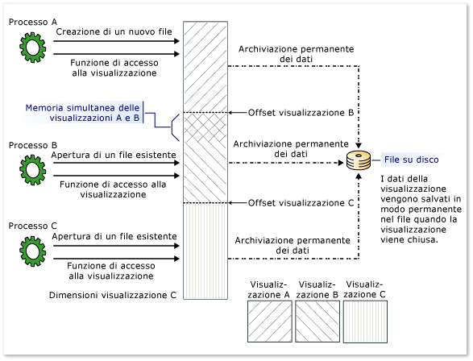

# File mappati alla memoria
Un file mappato alla memoria include il contenuto di un file nella memoria virtuale.  Questo mapping tra un file e lo spazio di memoria consente a un'applicazione, con più processi, di modificare il file leggendo e scrivendo direttamente nella memoria.  A partire da [!INCLUDE[net_v40_long](../../../includes/net-v40-long-md.md)], è possibile utilizzare il codice gestito per accedere ai file mappati in memoria nello stesso modo in cui le funzioni Windows native accedono ai file mappati in memoria, come descritto nella [Gestione di file mappati in memoria in Win32](http://go.microsoft.com/fwlink/?linkid=180801) \(la pagina potrebbe essere in inglese\) nella libreria MSDN.  
  
 Vi sono due tipi di file mappati alla memoria:  
  
-   File mappati alla memoria salvati in modo permanente  
  
     I file persistenti sono file mappati alla memoria associati a un file di origine su un disco.  Quando l'utilizzo del file da parte dell'ultimo processo termina, i dati vengono salvati nel file di origine sul disco.  Questi file mappati alla memoria sono adatti per l'utilizzo di file di origine di dimensioni molto grandi.  
  
-   File mappati alla memoria non salvati in modo permanente  
  
     I file non persistenti sono file mappati alla memoria non associati a un file di origine su un disco.  Quando l'utilizzo del file da parte dell'ultimo processo termina, i dati vengono persi e il file viene recuperato dalla procedura di Garbage Collection.  Questi file sono adatti alla creazione di memoria condivisa per le comunicazioni interprocesso \(IPC\).  
  
## Processi, visualizzazioni e gestione della memoria  
 I file mappati alla memoria possono essere condivisi tra più processi.  I processi possono eseguire il mapping allo stesso file mappato alla memoria utilizzando un nome comune assegnato dal processo che ha creato il file.  
  
 Per utilizzare un file mappato alla memoria, è necessario creare una vista dell'intero file o di parte di esso.  È inoltre possibile creare più viste della stessa parte del file mappato alla memoria, creando in questo modo memoria simultanea.  Affinché due viste rimangano simultanee, è necessario che vengano create dallo stesso file mappato alla memoria.  
  
 L'utilizzo di più visualizzazioni può essere necessario anche se il file è più grande della dimensione dello spazio in memoria logico dell'applicazione disponibile per il mapping di memoria \(2 GB in un computer a 32 bit\).  
  
 Esistono due tipi di visualizzazioni: visualizzazione di accesso al flusso e visualizzazione di accesso casuale.  Utilizzare le visualizzazioni di accesso al flusso per un accesso sequenziale a un file, consigliabile per i file non persistenti e la comunicazione interprocesso \(IPC\).  Le visualizzazioni di accesso casuale sono preferibili per l'utilizzo di file persistenti.  
  
 L'accesso ai file mappati alla memoria viene eseguito tramite il gestore della memoria del sistema operativo, pertanto il file viene partizionato automaticamente in un numero di pagine e all'occorrenza viene eseguito l'accesso.  Non è necessario gestire manualmente la gestione della memoria.  
  
 Nell'illustrazione riportata di seguito viene mostrato come più processi possono disporre di visualizzazioni multiple e sovrapposte contemporaneamente nello stesso file mappato alla memoria.  
  
   
Visualizzazioni multiple e sovrapposte in un file mappato alla memoria  
  
## Programmazione con file mappati alla memoria  
 Nella tabella seguente viene fornita una guida per l'utilizzo di oggetti file mappati alla memoria e dei relativi membri.  
  
|Task|Metodi o proprietà da utilizzare|  
|----------|--------------------------------------|  
|Per ottenere un oggetto <xref:System.IO.MemoryMappedFiles.MemoryMappedFile> che rappresenta un file mappato alla memoria persistente da un file su disco.|Metodo <xref:System.IO.MemoryMappedFiles.MemoryMappedFile.CreateFromFile%2A?displayProperty=fullName>.|  
|Per ottenere un oggetto <xref:System.IO.MemoryMappedFiles.MemoryMappedFile> che rappresenta un file mappato alla memoria non persistente \(non associato a un file su disco\).|Metodo <xref:System.IO.MemoryMappedFiles.MemoryMappedFile.CreateNew%2A?displayProperty=fullName>.<br /><br /> \- oppure \-<br /><br /> Metodo <xref:System.IO.MemoryMappedFiles.MemoryMappedFile.CreateOrOpen%2A?displayProperty=fullName>.|  
|Per ottenere un oggetto <xref:System.IO.MemoryMappedFiles.MemoryMappedFile> di un file mappato alla memoria esistente \(persistente o non persistente\).|Metodo <xref:System.IO.MemoryMappedFiles.MemoryMappedFile.OpenExisting%2A?displayProperty=fullName>.|  
|Per ottenere un oggetto <xref:System.IO.UnmanagedMemoryStream> per una visualizzazione di accesso sequenziale al file mappato alla memoria.|Metodo <xref:System.IO.MemoryMappedFiles.MemoryMappedFile.CreateViewStream%2A?displayProperty=fullName>.|  
|Per ottenere un oggetto <xref:System.IO.UnmanagedMemoryAccessor> per una visualizzazione di accesso casuale a un file mappato alla memoria.|Metodo <xref:System.IO.MemoryMappedFiles.MemoryMappedFile.CreateViewAccessor%2A?displayProperty=fullName>.|  
|Per ottenere un oggetto <xref:Microsoft.Win32.SafeHandles.SafeMemoryMappedViewHandle> da utilizzare con codice non gestito.|Proprietà <xref:System.IO.MemoryMappedFiles.MemoryMappedFile.SafeMemoryMappedFileHandle%2A?displayProperty=fullName>.<br /><br /> \- oppure \-<br /><br /> Proprietà <xref:System.IO.MemoryMappedFiles.MemoryMappedViewAccessor.SafeMemoryMappedViewHandle%2A?displayProperty=fullName>.<br /><br /> \- oppure \-<br /><br /> Proprietà <xref:System.IO.MemoryMappedFiles.MemoryMappedViewStream.SafeMemoryMappedViewHandle%2A?displayProperty=fullName>.|  
|Per ritardare l'allocazione della memoria fino alla creazione di una visualizzazione \(solo file non persistenti\)<br /><br /> Per determinare la dimensione corrente di paging del sistema, utilizzare la proprietà <xref:System.Environment.SystemPageSize%2A?displayProperty=fullName>.|Metodo <xref:System.IO.MemoryMappedFiles.MemoryMappedFile.CreateNew%2A> con il valore <xref:System.IO.MemoryMappedFiles.MemoryMappedFileOptions?displayProperty=fullName>.<br /><br /> \- oppure \-<br /><br /> Metodi <xref:System.IO.MemoryMappedFiles.MemoryMappedFile.CreateOrOpen%2A> che dispongono di un'enumerazione <xref:System.IO.MemoryMappedFiles.MemoryMappedFileOptions> come parametro.|  
  
### Protezione  
 Quando si crea un file mappato alla memoria, è possibile applicare le autorizzazioni di accesso tramite i metodi seguenti che accettano un'enumerazione <xref:System.IO.MemoryMappedFiles.MemoryMappedFileAccess> come parametro:  
  
-   <xref:System.IO.MemoryMappedFiles.MemoryMappedFile.CreateFromFile%2A?displayProperty=fullName>  
  
-   <xref:System.IO.MemoryMappedFiles.MemoryMappedFile.CreateNew%2A?displayProperty=fullName>  
  
-   <xref:System.IO.MemoryMappedFiles.MemoryMappedFile.CreateOrOpen%2A?displayProperty=fullName>  
  
 È possibile specificare le autorizzazioni di accesso per l'apertura di un file mappato alla memoria esistente utilizzando i metodi <xref:System.IO.MemoryMappedFiles.MemoryMappedFile.OpenExisting%2A> che accettano <xref:System.IO.MemoryMappedFiles.MemoryMappedFileRights> come parametro.  
  
 Inoltre, è possibile includere un oggetto <xref:System.IO.MemoryMappedFiles.MemoryMappedFileSecurity> che contiene regole di accesso predefinite.  
  
 Per applicare nuove regole di accesso a un file mappato alla memoria, utilizzare il metodo <xref:System.IO.MemoryMappedFiles.MemoryMappedFile.SetAccessControl%2A>.  Per recuperare regole di accesso o di controllo da un file esistente, utilizzare il metodo <xref:System.IO.MemoryMappedFiles.MemoryMappedFile.GetAccessControl%2A>.  
  
## Esempi  
  
### File mappati alla memoria salvati in modo permanente  
 I metodi <xref:System.IO.MemoryMappedFiles.MemoryMappedFile.CreateFromFile%2A> consentono di creare un file mappato alla memoria da un file esistente nel disco.  
  
 Nell'esempio seguente viene creata una vista mappata alla memoria di una parte di un file di dimensioni estremamente grandi e ne viene modificata una parte.  
  
 [!code-csharp[MemoryMappedFiles.MemoryMappedFile.CreateFromFile#1](../../../samples/snippets/csharp/VS_Snippets_CLR/memorymappedfiles.memorymappedfile.createfromfile/cs/program.cs#1)]
 [!code-vb[MemoryMappedFiles.MemoryMappedFile.CreateFromFile#1](../../../samples/snippets/visualbasic/VS_Snippets_CLR/memorymappedfiles.memorymappedfile.createfromfile/vb/program.vb#1)]  
  
 Nell'esempio seguente viene aperto lo stesso file mappato alla memoria per un altro processo.  
  
 [!code-csharp[MemoryMappedFiles.MemoryMappedFile.OpenExisting#1](../../../samples/snippets/csharp/VS_Snippets_CLR/memorymappedfiles.memorymappedfile.openexisting/cs/program.cs#1)]
 [!code-vb[MemoryMappedFiles.MemoryMappedFile.OpenExisting#1](../../../samples/snippets/visualbasic/VS_Snippets_CLR/memorymappedfiles.memorymappedfile.openexisting/vb/program.vb#1)]  
  
### File mappati alla memoria non salvati in modo permanente  
 I metodi <xref:System.IO.MemoryMappedFiles.MemoryMappedFile.CreateNew%2A> e <xref:System.IO.MemoryMappedFiles.MemoryMappedFile.CreateOrOpen%2A> consentono di creare un file mappato alla memoria non mappato a un file esistente nel disco.  
  
 L'esempio seguente è composto da tre processi separati \(applicazioni console\) che scrivono valori booleani in un file mappato alla memoria.  Si verifica la sequenza di azioni seguente:  
  
1.  `Process A` crea il file mappato alla memoria e scrive un valore in tale file.  
  
2.  `Process B` apre il file mappato alla memoria e scrive un valore in tale file.  
  
3.  `Process C` apre il file mappato alla memoria e scrive un valore in tale file.  
  
4.  `Process A` legge e visualizza i valori del file mappato alla memoria.  
  
5.  Dopo che il `Process A` ha terminato di utilizzare il file mappato alla memoria, il file viene recuperato immediatamente tramite Garbage Collection.  
  
 Per eseguire l'esempio, effettuare le operazioni seguenti:  
  
1.  Compilare le applicazioni e aprire tre finestre Prompt dei comandi.  
  
2.  Nella prima finestra Prompt dei comandi, eseguire il `Process A`.  
  
3.  Nella seconda finestra Prompt dei comandi, eseguire il `Process B`.  
  
4.  Tornare al `Process A` e premere INVIO.  
  
5.  Nella terza finestra Prompt dei comandi, eseguire il `Process C`.  
  
6.  Tornare al `Process A` e premere INVIO.  
  
 L'output di `Process A` è indicato di seguito:  
  
```  
Start Process B and press ENTER to continue.  
Start Process C and press ENTER to continue.  
Process A says: True  
Process B says: False  
Process C says: True  
```  
  
 **Processo A**  
  
 [!code-csharp[System.IO.MemoryMappedFiles_IPC_X#1](../../../samples/snippets/csharp/VS_Snippets_CLR_System/system.io.memorymappedfiles_ipc_x/cs/program.cs#1)]
 [!code-vb[System.IO.MemoryMappedFiles_IPC_X#1](../../../samples/snippets/visualbasic/VS_Snippets_CLR_System/system.io.memorymappedfiles_ipc_x/vb/program.vb#1)]  
  
 **Processo B**  
  
 [!code-csharp[System.IO.MemoryMappedFiles_IPC_A#1](../../../samples/snippets/csharp/VS_Snippets_CLR_System/system.io.memorymappedfiles_ipc_a/cs/program.cs#1)]
 [!code-vb[System.IO.MemoryMappedFiles_IPC_A#1](../../../samples/snippets/visualbasic/VS_Snippets_CLR_System/system.io.memorymappedfiles_ipc_a/vb/program.vb#1)]  
  
 **Processo C**  
  
 [!code-csharp[System.IO.MemoryMappedFiles_IPC_B#1](../../../samples/snippets/csharp/VS_Snippets_CLR_System/system.io.memorymappedfiles_ipc_b/cs/program.cs#1)]
 [!code-vb[System.IO.MemoryMappedFiles_IPC_B#1](../../../samples/snippets/visualbasic/VS_Snippets_CLR_System/system.io.memorymappedfiles_ipc_b/vb/program.vb#1)]  
  
## Vedere anche  
 [I\/O di file e di flussi](../../../docs/standard/io/index.md)