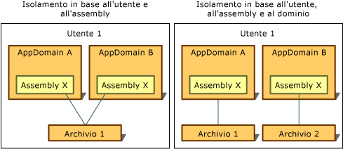

# Tipi di isolamento
L'accesso all'archiviazione isolata è sempre limitato all'utente che l'ha creata.  Per implementare questo tipo di isolamento, Common Language Runtime utilizza la stessa nozione di identità utente riconosciuta dal sistema operativo, ovvero l'identità associata al processo in cui il codice è in esecuzione quando l'archivio viene aperto.  Tale identità è un'identità utente autenticata, ma la rappresentazione può causare la modifica dinamica dell'identità dell'utente corrente.  
  
 L'accesso all'archiviazione isolata viene limitato anche in base all'identità associata all'assembly e al dominio applicazione oppure solo all'assembly.  Il runtime ottiene tali identità nei seguenti modi:  
  
-   L'identità del dominio rappresenta l'evidenza dell'applicazione, che nel caso di un'applicazione Web può coincidere con l'URL completo.  Per il codice su shell, l'identità del dominio può essere basata sul percorso di directory dell'applicazione.  Se ad esempio il file eseguibile viene eseguito da C:\\Office\\MyApp.exe, l'identità del dominio sarà C:\\Office\\MyApp.exe.  
  
-   L'identità dell'assembly è l'evidenza dell'assembly.  Può derivare da una firma digitale crittografica, che può corrispondere al [nome sicuro](../../../docs/framework/app-domains/strong-named-assemblies.md) dell'assembly, all'editore dell'assembly oppure all'identità del relativo URL.  Se un assembly dispone sia dell'identità fornita dal nome sicuro che di quella fornita dall'editore, verrà utilizzata l'identità fornita dall'editore.  Se l'assembly proviene da Internet e non è firmato, verrà utilizzata l'identità dell'URL.  Per ulteriori informazioni sugli assembly e sui nomi sicuri, vedere [Programmazione con gli assembly](../../../docs/framework/app-domains/programming-with-assemblies.md).  
  
-   Gli archivi roaming si spostano con un utente che dispone di un profilo di utente roaming.  I file vengono scritti in una directory di rete e ne viene eseguito il download su qualsiasi computer a cui l'utente accede.  Per ulteriori informazioni sui profili utente comune, vedere <xref:System.IO.IsolatedStorage.IsolatedStorageScope?displayProperty=fullName>.  
  
 Combinando i concetti di identità di utente, dominio e assembly, l'archiviazione isolata può isolare i dati nei seguenti modi, ciascuno dei quali presenta scenari di utilizzo propri:  
  
-   [Isolamento in base all'utente e all'assembly](#UserAssembly)  
  
-   [Isolamento in base all'utente, al dominio e all'assembly](#UserDomainAssembly)  
  
 Tali isolamenti possono essere combinati con un profilo di utente roaming.  Per ulteriori informazioni, vedere la sezione [Spazio di memorizzazione isolato e Roaming](#Roaming).  
  
 Nell'illustrazione che segue viene indicato il modo in cui gli archivi vengono isolati in ambiti diversi.  
  
   
Tipi di archiviazione isolata  
  
 Si osservi che, fatta eccezione per gli archivi roaming, l'archiviazione isolata viene sempre isolata implicitamente in base al computer, poiché utilizza le funzioni di archiviazione che sono locali ad un determinato computer.  
  
> [!IMPORTANT]
>  Lo spazio di memorizzazione isolato non è disponibile per le applicazioni di [!INCLUDE[win8_appname_long](../../../includes/win8-appname-long-md.md)].  Al contrario, utilizzare le classi di dati dell'applicazione negli spazi dei nomi `Windows.Storage` inclusi nell'API [!INCLUDE[wrt](../../../includes/wrt-md.md)] per archiviare i dati locali e file.  Per ulteriori informazioni, vedere [Dati dell'applicazione](http://go.microsoft.com/fwlink/?LinkId=229175) in Windows Dev Center.  
  
   
## Isolamento in base all'utente e all'assembly  
 L'isolamento in base all'utente e all'assembly è indicato quando si desidera che l'assembly che utilizza l'archivio dati sia accessibile da qualsiasi dominio applicazione.  In genere, in tale situazione, l'archiviazione isolata viene utilizzata per memorizzare dati che riguardano più applicazioni e non una sola applicazione specifica, quali ad esempio il nome utente e le informazioni sulla licenza.  Perché il codice possa accedere a un'archiviazione il cui isolamento si basa sull'utente e sull'assembly, occorre che sia considerato attendibile ai fini del trasferimento di informazioni tra applicazioni diverse.  Di norma, l'isolamento in base all'utente e all'assembly è consentito in reti Intranet, ma non in Internet.  Chiamando il metodo <xref:System.IO.IsolatedStorage.IsolatedStorageFile.GetStore%2A?displayProperty=fullName> di <xref:System.IO.IsolatedStorage.IsolatedStorageScope> e passando un utente e un assembly viene restituita un'archiviazione con questo tipo di isolamento.  
  
 Nell'esempio di codice seguente viene recuperato un archivio che è isolato in base all'utente e all'assembly.  L'archivio è possibile accedere tramite l'oggetto di `isoFile`.  
  
 [!code-cpp[Conceptual.IsolatedStorage#17](../../../samples/snippets/cpp/VS_Snippets_CLR/conceptual.isolatedstorage/cpp/source11.cpp#17)]
 [!code-csharp[Conceptual.IsolatedStorage#17](../../../samples/snippets/csharp/VS_Snippets_CLR/conceptual.isolatedstorage/cs/source11.cs#17)]
 [!code-vb[Conceptual.IsolatedStorage#17](../../../samples/snippets/visualbasic/VS_Snippets_CLR/conceptual.isolatedstorage/vb/source11.vb#17)]  
  
 Per un esempio che utilizza i parametri di evidenza, vedere il metodo <xref:System.IO.IsolatedStorage.IsolatedStorageFile.GetStore%28System.IO.IsolatedStorage.IsolatedStorageScope%2CSystem.Security.Policy.Evidence%2CSystem.Type%2CSystem.Security.Policy.Evidence%2CSystem.Type%29>.  
  
 Come alternativa è disponibile il metodo <xref:System.IO.IsolatedStorage.IsolatedStorageFile.GetUserStoreForAssembly%2A>, come illustrato nell'esempio di codice riportato di seguito.  Questa alternativa non può essere utilizzata per aprire archivi che sono utilizzati come roaming; In questi casi, utilizzare il metodo <xref:System.IO.IsolatedStorage.IsolatedStorageFile.GetStore%2A>.  
  
 [!code-cpp[Conceptual.IsolatedStorage#18](../../../samples/snippets/cpp/VS_Snippets_CLR/conceptual.isolatedstorage/cpp/source11.cpp#18)]
 [!code-csharp[Conceptual.IsolatedStorage#18](../../../samples/snippets/csharp/VS_Snippets_CLR/conceptual.isolatedstorage/cs/source11.cs#18)]
 [!code-vb[Conceptual.IsolatedStorage#18](../../../samples/snippets/visualbasic/VS_Snippets_CLR/conceptual.isolatedstorage/vb/source11.vb#18)]  
  
   
## Isolamento in base all'utente, al dominio e all'assembly  
 Se la tua applicazione utilizza un assembly di altri produttori che richiede un archivio dati privato, è possibile utilizzare lo spazio di memorizzazione isolato per archiviare i dati privati.  L'isolamento in base all'utente, al dominio e all'assembly garantisce che ai dati possa accedere solo il codice di un determinato assembly, solo quando l'assembly viene utilizzato dall'applicazione che era in esecuzione nel momento in cui l'assembly ha creato l'archivio e solo quando l'applicazione viene eseguita dall'utente per il quale l'archivio è stato creato.  L'isolamento in base all'utente, al dominio e all'assembly impedisce che l'assembly passi i dati ad altre applicazioni.  È opportuno scegliere questo tipo di isolamento se si desidera utilizzare l'archiviazione isolata, ma non si è sicuri del tipo di isolamento da utilizzare.  Chiamando il metodo statico <xref:System.IO.IsolatedStorage.IsolatedStorageFile.GetStore%2A> di <xref:System.IO.IsolatedStorage.IsolatedStorageFile> e passando un utente, un dominio e un assembly <xref:System.IO.IsolatedStorage.IsolatedStorageScope> restituisce un'archiviazione con questo tipo di isolamento.  
  
 Nell'esempio di codice che segue viene recuperato un archivio isolato in base all'utente, al dominio e all'assembly.  È possibile accedere all'archivio mediante l'oggetto `isoFile`.  
  
 [!code-cpp[Conceptual.IsolatedStorage#14](../../../samples/snippets/cpp/VS_Snippets_CLR/conceptual.isolatedstorage/cpp/source10.cpp#14)]
 [!code-csharp[Conceptual.IsolatedStorage#14](../../../samples/snippets/csharp/VS_Snippets_CLR/conceptual.isolatedstorage/cs/source10.cs#14)]
 [!code-vb[Conceptual.IsolatedStorage#14](../../../samples/snippets/visualbasic/VS_Snippets_CLR/conceptual.isolatedstorage/vb/source10.vb#14)]  
  
 Come alternativa rapida è disponibile un altro metodo, come illustrato nell'esempio di codice che segue.  Questa alternativa non può essere utilizzata per aprire archivi che sono utilizzati come roaming; In questi casi, utilizzare il metodo <xref:System.IO.IsolatedStorage.IsolatedStorageFile.GetStore%2A>.  
  
 [!code-cpp[Conceptual.IsolatedStorage#15](../../../samples/snippets/cpp/VS_Snippets_CLR/conceptual.isolatedstorage/cpp/source10.cpp#15)]
 [!code-csharp[Conceptual.IsolatedStorage#15](../../../samples/snippets/csharp/VS_Snippets_CLR/conceptual.isolatedstorage/cs/source10.cs#15)]
 [!code-vb[Conceptual.IsolatedStorage#15](../../../samples/snippets/visualbasic/VS_Snippets_CLR/conceptual.isolatedstorage/vb/source10.vb#15)]  
  
   
## Spazio di memorizzazione isolato e roaming  
 I profili di utente roaming sono una funzionalità di Windows che consente ad un utente di installare un'identità in una rete e utilizzare tale identità per accedere in qualsiasi computer della rete, conservando tutte le impostazioni personalizzate.  Un assembly che utilizza l'archiviazione isolata può richiedere che l'archiviazione isolata dell'utente dovrebbe spostarsi con il profilo di utente roaming.  Il roaming può essere utilizzato con l'isolamento in base all'utente e all'assembly oppure con l'isolamento in base all'utente, al dominio e all'assembly.  Se non viene utilizzato un ambito di roaming, gli archivi non si sposteranno con l'eventuale profilo di utente roaming.  
  
 Nell'esempio di codice che segue viene recuperato un archivio roaming isolato in base all'utente e all'assembly.  L'archivio è possibile accedere tramite l'oggetto di `isoFile`.  
  
 [!code-cpp[Conceptual.IsolatedStorage#11](../../../samples/snippets/cpp/VS_Snippets_CLR/conceptual.isolatedstorage/cpp/source9.cpp#11)]
 [!code-csharp[Conceptual.IsolatedStorage#11](../../../samples/snippets/csharp/VS_Snippets_CLR/conceptual.isolatedstorage/cs/source9.cs#11)]
 [!code-vb[Conceptual.IsolatedStorage#11](../../../samples/snippets/visualbasic/VS_Snippets_CLR/conceptual.isolatedstorage/vb/source9.vb#11)]  
  
 È possibile aggiungere un ambito di dominio per creare un archivio roaming isolato in base all'utente, al dominio e all'applicazione.  Nell'esempio di codice che segue viene illustrata questa possibilità.  
  
 [!code-cpp[Conceptual.IsolatedStorage#12](../../../samples/snippets/cpp/VS_Snippets_CLR/conceptual.isolatedstorage/cpp/source9.cpp#12)]
 [!code-csharp[Conceptual.IsolatedStorage#12](../../../samples/snippets/csharp/VS_Snippets_CLR/conceptual.isolatedstorage/cs/source9.cs#12)]
 [!code-vb[Conceptual.IsolatedStorage#12](../../../samples/snippets/visualbasic/VS_Snippets_CLR/conceptual.isolatedstorage/vb/source9.vb#12)]  
  
## Vedere anche  
 <xref:System.IO.IsolatedStorage.IsolatedStorageScope>   
 [Spazio di memorizzazione isolato](../../../docs/standard/io/isolated-storage.md)