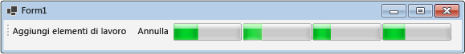

# How to: Cancel a Dataflow Block
In questo documento viene illustrato come abilitare l'annullamento nell'applicazione.  Questo esempio utilizza Windows Form per visualizzare dove gli elementi di lavoro sono attivi in una pipeline di dati e gli effetti dell'annullamento.  
  
> [!TIP]
>  La libreria del flusso di dati TPL \(spazio dei nomi <xref:System.Threading.Tasks.Dataflow?displayProperty=fullName>\) non viene distribuita con [!INCLUDE[net_v45](../../../includes/net-v45-md.md)].  Per installare lo spazio dei nomi <xref:System.Threading.Tasks.Dataflow>, aprire il progetto in [!INCLUDE[vs_dev11_long](../../../includes/vs-dev11-long-md.md)], scegliere dal menu del progetto **Gestisci pacchetti NuGet** e scegliere cerca online il pacchetto `Microsoft.Tpl.Dataflow`.  
  
### Per creare la nuova applicazione Windows Form  
  
1.  Creare un progetto **Windows Form Application** C\# o Visual Basic.  Nei passaggi seguenti, il progetto viene denominato `CancellationWinForms`.  
  
2.  Nella finestra di progettazione del form principale, Form1.cs \(Form1.vb per [!INCLUDE[vbprvb](../../../includes/vbprvb-md.md)]\), aggiungere un controllo <xref:System.Windows.Forms.ToolStrip>.  
  
3.  Aggiungere un controllo <xref:System.Windows.Forms.ToolStripButton> al controllo <xref:System.Windows.Forms.ToolStrip>.  Impostare la proprietà <xref:System.Windows.Forms.ToolStripItem.DisplayStyle%2A> a <xref:System.Windows.Forms.ToolStripItemDisplayStyle> e la proprietà <xref:System.Windows.Forms.ToolStripItem.Text%2A> per aggiungere elementi di lavoro.  
  
4.  Aggiungere un secondo controllo <xref:System.Windows.Forms.ToolStripButton> al controllo <xref:System.Windows.Forms.ToolStrip>.  Impostare la proprietà <xref:System.Windows.Forms.ToolStripItem.DisplayStyle%2A> a <xref:System.Windows.Forms.ToolStripItemDisplayStyle>, la proprietà <xref:System.Windows.Forms.ToolStripItem.Text%2A> per annullare, e la proprietà <xref:System.Windows.Forms.ToolStripItem.Enabled%2A> a `False`.  
  
5.  Aggiungere quattro oggetti <xref:> System.Windows.Forms.ToolStripProgressBar?qualifyHint=False&autoUpgrade=True al controllo <xref:System.Windows.Forms.ToolStrip>.  
  
## Creazione di una pipeline del flusso di dati  
 In questa sezione viene descritto come creare la pipeline di dati che elabora gli elementi di lavoro e aggiorna le barre di stato.  
  
#### Per creare la pipeline del flusso di dati  
  
1.  Nel progetto, aggiungere un riferimento a System.Threading.Tasks.Dataflow.dll.  
  
2.  Assicurarsi che Form1.cs \(Form1.vb per [!INCLUDE[vbprvb](../../../includes/vbprvb-md.md)]\) contenga le seguenti istruzioni `using` \(`Imports` in [!INCLUDE[vbprvb](../../../includes/vbprvb-md.md)]\).  
  
     [!code-csharp[TPLDataflow_CancellationWinForms#1](../../../samples/snippets/csharp/VS_Snippets_Misc/tpldataflow_cancellationwinforms/cs/cancellationwinforms/form1.cs#1)]
     [!code-vb[TPLDataflow_CancellationWinForms#1](../../../samples/snippets/visualbasic/VS_Snippets_Misc/tpldataflow_cancellationwinforms/vb/cancellationwinforms/form1.vb#1)]  
  
3.  Aggiungere la classe `WorkItem` come tipo interno della classe `Form1`.  
  
     [!code-csharp[TPLDataflow_CancellationWinForms#2](../../../samples/snippets/csharp/VS_Snippets_Misc/tpldataflow_cancellationwinforms/cs/cancellationwinforms/form1.cs#2)]
     [!code-vb[TPLDataflow_CancellationWinForms#2](../../../samples/snippets/visualbasic/VS_Snippets_Misc/tpldataflow_cancellationwinforms/vb/cancellationwinforms/form1.vb#2)]  
  
4.  Aggiungere i seguenti membri dati alla classe `Form1`.  
  
     [!code-csharp[TPLDataflow_CancellationWinForms#3](../../../samples/snippets/csharp/VS_Snippets_Misc/tpldataflow_cancellationwinforms/cs/cancellationwinforms/form1.cs#3)]
     [!code-vb[TPLDataflow_CancellationWinForms#3](../../../samples/snippets/visualbasic/VS_Snippets_Misc/tpldataflow_cancellationwinforms/vb/cancellationwinforms/form1.vb#3)]  
  
5.  Aggiungere il seguente metodo, `CreatePipeline`, alla classe `Form1`.  
  
     [!code-csharp[TPLDataflow_CancellationWinForms#4](../../../samples/snippets/csharp/VS_Snippets_Misc/tpldataflow_cancellationwinforms/cs/cancellationwinforms/form1.cs#4)]
     [!code-vb[TPLDataflow_CancellationWinForms#4](../../../samples/snippets/visualbasic/VS_Snippets_Misc/tpldataflow_cancellationwinforms/vb/cancellationwinforms/form1.vb#4)]  
  
 Poiché i blocchi di dati di `decrementProgress` e `incrementProgress` agiscono sull'interfaccia utente, è importante che tali azioni si verifichino sul thread dell'interfaccia utente.  A tale scopo, durante la costruzione questi oggetti forniscono ognuno un oggetto di <xref:System.Threading.Tasks.Dataflow.ExecutionDataflowBlockOptions> che dispone della proprietà <xref:System.Threading.Tasks.Dataflow.DataflowBlockOptions.TaskScheduler%2A> impostata a <xref:System.Threading.Tasks.TaskScheduler.FromCurrentSynchronizationContext%2A?displayProperty=fullName>.  Il metodo <xref:System.Threading.Tasks.TaskScheduler.FromCurrentSynchronizationContext%2A?displayProperty=fullName> crea un oggetto <xref:System.Threading.Tasks.TaskScheduler> che esegue il lavoro nel contesto di sincronizzazione corrente.  Poiché il costruttore di `Form1` viene chiamato dal thread dell'interfaccia utente, le azioni per i blocchi di dati `decrementProgress` e `incrementProgress` vengono eseguiti sul thread dell'interfaccia utente.  
  
 Questo esempio consente di impostare la proprietà <xref:System.Threading.Tasks.Dataflow.DataflowBlockOptions.CancellationToken%2A> quando si ostruiscono i membri della pipeline.  Poiché la proprietà <xref:System.Threading.Tasks.Dataflow.DataflowBlockOptions.CancellationToken%2A> annulla in modo permanente l'esecuzione del blocco del flusso di dati, l'intera pipeline deve essere ricreata dopo che l'utente annulla l'operazione e desidera aggiungere più elementi di lavoro alla pipeline.  Per un esempio che illustra una soluzione alternativa per annullare un blocco di dati in modo da poter eseguire altro lavoro dopo che un'operazione viene annullata, vedere [Walkthrough: Using Dataflow in a Windows Forms Application](../../../docs/standard/parallel-programming/walkthrough-using-dataflow-in-a-windows-forms-application.md).  
  
## Connettere la pipeline del flusso di dati all'interfaccia utente  
 In questa sezione viene descritto come connettere la pipeline di dati all'interfaccia utente.  Sia creare la pipeline che aggiungere elementi di lavoro alla pipeline sono controllati dal gestore eventi per il pulsante Work Items aggiungi.  L'annullamento è avviato dal pulsante Annulla.  Quando l'utente fa clic su uno di questi pulsanti, l'azione appropriata viene avviata in modo asincrono.  
  
#### Per connettere la pipeline del flusso di dati all'interfaccia utente  
  
1.  Nella finestra di progettazione del form per il form principale, creare un gestore eventi per l'evento <xref:System.Windows.Forms.ToolStripItem.Click> per il pulsante Aggiungi Work Items.  
  
2.  Implementare l'evento di <xref:System.Windows.Forms.ToolStripItem.Click> per il pulsante Aggiungi Work Items.  
  
     [!code-csharp[TPLDataflow_CancellationWinForms#5](../../../samples/snippets/csharp/VS_Snippets_Misc/tpldataflow_cancellationwinforms/cs/cancellationwinforms/form1.cs#5)]
     [!code-vb[TPLDataflow_CancellationWinForms#5](../../../samples/snippets/visualbasic/VS_Snippets_Misc/tpldataflow_cancellationwinforms/vb/cancellationwinforms/form1.vb#5)]  
  
3.  Nella finestra di progettazione del form per il form principale, creare un gestore eventi per il gestore eventi <xref:System.Windows.Forms.ToolStripItem.Click> per il pulsante Annulla.  
  
4.  Implementare il gestore eventi di <xref:System.Windows.Forms.ToolStripItem.Click> per il pulsante Annulla.  
  
     [!code-csharp[TPLDataflow_CancellationWinForms#6](../../../samples/snippets/csharp/VS_Snippets_Misc/tpldataflow_cancellationwinforms/cs/cancellationwinforms/form1.cs#6)]
     [!code-vb[TPLDataflow_CancellationWinForms#6](../../../samples/snippets/visualbasic/VS_Snippets_Misc/tpldataflow_cancellationwinforms/vb/cancellationwinforms/form1.vb#6)]  
  
## Esempio  
 Nell'esempio seguente viene illustrato il codice completo per Form1.cs \(Form1.vb per [!INCLUDE[vbprvb](../../../includes/vbprvb-md.md)]\).  
  
 [!code-csharp[TPLDataflow_CancellationWinForms#100](../../../samples/snippets/csharp/VS_Snippets_Misc/tpldataflow_cancellationwinforms/cs/cancellationwinforms/form1.cs#100)]
 [!code-vb[TPLDataflow_CancellationWinForms#100](../../../samples/snippets/visualbasic/VS_Snippets_Misc/tpldataflow_cancellationwinforms/vb/cancellationwinforms/form1.vb#100)]  
  
 Nell'immagine riportata di seguito viene illustrata l'applicazione in esecuzione.  
  
   
  
## Programmazione efficiente  
  
## Vedere anche  
 [Flusso di dati](../../../docs/standard/parallel-programming/dataflow-task-parallel-library.md)