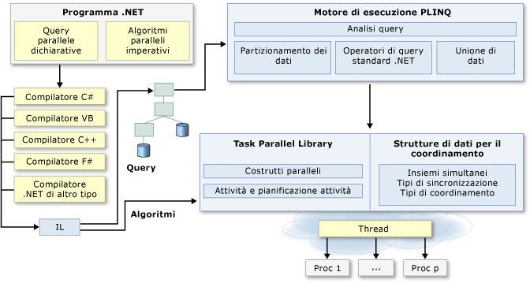

# Programmazione parallela in .NET Framework
Un numero elevato di personal computer e workstation è dotato di due o quattro core (ovvero CPU) che consentono l'esecuzione simultanea di più thread. Ci si aspetta di qui a breve che i computer saranno dotati di un numero di core significativamente più elevato. Per sfruttare l'hardware di oggi e quello del futuro, è possibile parallelizzare il codice per distribuire il lavoro su più processori. In passato la parallelizzazione richiedeva la modifica di basso livello di thread e blocchi. [!INCLUDE[vs_dev10_long](../../../includes/vs-dev10-long-md.md)] e [!INCLUDE[net_v40_short](../../../includes/net-v40-short-md.md)] migliorano il supporto per la programmazione parallela fornendo un nuovo runtime, nuovi tipi di librerie di classi e i nuovi strumenti diagnostici. Tali funzionalità semplificano lo sviluppo parallelo consentendo di scrivere codice parallelo efficiente, con granularità fine e scalabile in un linguaggio naturale senza dover usare direttamente i thread o il pool di thread. Nell'illustrazione seguente viene fornita una panoramica dettagliata dell'architettura di programmazione parallela in [!INCLUDE[net_v40_short](../../../includes/net-v40-short-md.md)].  
  
   
  
## Argomenti correlati  
  
|Tecnologia|Descrizione|  
|----------------|-----------------|  
|[Task Parallel Library (TPL)](../../../docs/standard/parallel-programming/task-parallel-library-tpl.md)|Viene fornita documentazione per la classe <xref:System.Threading.Tasks.Parallel?displayProperty=fullName> che include versioni parallele dei cicli `For` e `ForEach`, nonché per la classe <xref:System.Threading.Tasks.Task?displayProperty=fullName> che rappresenta la modalità preferita per l'espressione di operazioni asincrone.|  
|[Parallel LINQ (PLINQ)](../../../docs/standard/parallel-programming/parallel-linq-plinq.md)|Un'implementazione parallela di LINQ to Objects che migliora significativamente le prestazioni in molti scenari.|  
|[Strutture di dati per la programmazione in parallelo](../../../docs/standard/parallel-programming/data-structures-for-parallel-programming.md)|Vengono forniti collegamenti alla documentazione per classi di raccolte thread-safe, tipi di sincronizzazioni leggere e tipi per l'inizializzazione differita.|  
|[Strumenti di diagnostica in parallelo](../../../docs/standard/parallel-programming/parallel-diagnostic-tools.md)|Vengono forniti collegamenti alla documentazione per le finestre del debugger di Visual Studio per le attività e stack paralleli e il [visualizzatore di concorrenza](http://msdn.microsoft.com/library/ae5879a0-1e1a-455a-ba72-148e57f59289), che è costituito da un set di visualizzazioni nel profiler [!INCLUDE[vsprvsts](../../../includes/vsprvsts-md.md)] utilizzabili per eseguire il debug e ottimizzare le prestazioni del codice parallelo.|  
|[Partitioner personalizzati per PLINQ e TPL](../../../docs/standard/parallel-programming/custom-partitioners-for-plinq-and-tpl.md)|Viene descritto come funzionano i partitioner e come configurare i partitioner predefiniti o creare un nuovo partitioner.|  
|[Utilità di pianificazione delle attività](http://msdn.microsoft.com/library/638f8ea5-21db-47a2-a934-86e1e961bf65)|Viene descritto come funziona l'utilità di pianificazione e come possono essere configurate le utilità di pianificazione predefinite.|  
|[Espressioni lambda in PLINQ e TPL](../../../docs/standard/parallel-programming/lambda-expressions-in-plinq-and-tpl.md)|Viene fornita una breve panoramica delle espressioni lambda in C# e Visual Basic e ne viene mostrato l'utilizzo in PLINQ e Task Parallel Library.|  
|[Ulteriori letture](../../../docs/standard/parallel-programming/for-further-reading-parallel-programming.md)|Vengono forniti collegamenti a documentazione aggiuntiva e risorse di esempio per la programmazione parallela in .NET Framework.|  
  
## Vedere anche  
 [Documento contenente una panoramica dei modelli per la programmazione parallela, ovvero come comprendere e applicare modelli paralleli con .NET Framework 4](http://go.microsoft.com/fwlink/?LinkID=185142)   
 [Esempi di programmazione parallela con .NET Framework](http://code.msdn.microsoft.com/Samples-for-Parallel-b4b76364)
