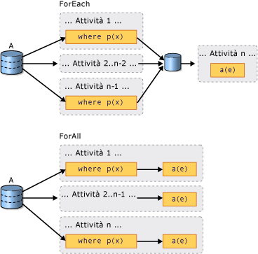

# Introduction to PLINQ
## Definizione di query parallela  
 LINQ \(Language\-Integrated Query\) è stato introdotto in [!INCLUDE[net_v35_long](../../../includes/net-v35-long-md.md)].  Offre un modello unificato per l'esecuzione di query su qualsiasi origine dati <xref:System.Collections.Generic.IEnumerable%601?displayProperty=fullName> o <xref:System.Collections.IEnumerable?displayProperty=fullName> in modo indipendente dai tipi.  LINQ to Objects è il nome dato alle query LINQ eseguite su raccolte in memoria quali gli oggetti <xref:System.Collections.Generic.List%601> e le matrici.  Questo articolo presuppone che si conoscano le nozioni di base di LINQ.  Per ulteriori informazioni, vedere [LINQ \(Language\-Integrated Query\)](../Topic/LINQ%20\(Language-Integrated%20Query\).md).  
  
 Parallel LINQ \(PLINQ\) è un'implementazione in parallelo del modello LINQ.  Sotto molti aspetti una query PLINQ assomiglia a una query LINQ to Objects non parallela.  Le query PLINQ, analogamente alle query [!INCLUDE[vbteclinq](../../../includes/vbteclinq-md.md)] sequenziali, funzionano su qualsiasi origine dati in memoria <xref:System.Collections.IEnumerable> o <xref:System.Collections.Generic.IEnumerable%601>. Vengono inoltre eseguite in modo posticipato, ovvero solo dopo l'enumerazione della query.  La differenza principale è che PLINQ tenta di sfruttare al massimo tutti i processori del sistema.  A tale scopo esegue il partizionamento dell'origine dati in segmenti e quindi esegue la query su ogni segmento in thread di lavoro distinti e in parallelo su più processori.  In molti casi, quando si utilizza l'esecuzione parallela la query viene eseguita in tempi significativamente minori.  
  
 Tramite l'esecuzione parallela, PLINQ può garantire per determinati tipi di query prestazioni significativamente migliori rispetto al codice legacy, spesso con la sola aggiunta dell'operazione di query <xref:System.Linq.ParallelEnumerable.AsParallel%2A>all'origine dati.  Tuttavia, il parallelismo può introdurre complessità intrinseche e non tutte le operazioni di query presentano un'esecuzione più veloce in PLINQ.  Di fatto, per determinate query la parallelizzazione comporta un'esecuzione più lenta.  È pertanto necessario comprendere il modo in cui alcuni punti, quale l'ordinamento, influiscono sulle query parallele.  Per ulteriori informazioni, vedere [Understanding Speedup in PLINQ](../../../docs/standard/parallel-programming/understanding-speedup-in-plinq.md).  
  
> [!NOTE]
>  Questa documentazione utilizza espressioni lambda per definire delegati in PLINQ.  Se non si ha familiarità con le espressioni lambda in C\# o Visual Basic, vedere [Lambda Expressions in PLINQ and TPL](../../../docs/standard/parallel-programming/lambda-expressions-in-plinq-and-tpl.md).  
  
 Nella parte restante di questo articolo vengono fornite informazioni generali sulle classi PLINQ principali. Inoltre, viene descritto come creare query PLINQ.  Ogni sezione contiene collegamenti a informazioni ed esempi di codice più dettagliati.  
  
## Classe ParallelEnumerable  
 La classe <xref:System.Linq.ParallelEnumerable?displayProperty=fullName> espone quasi tutte le funzionalità di PLINQ.  Tale classe e il resto dei tipi dello spazio dei nomi <xref:System.Linq?displayProperty=fullName> vengono compilati nell'assembly System.Core.dll.  In Visual Studio entrambi i progetti C\# e Visual Basic predefiniti fanno riferimento all'assembly e importano lo spazio dei nomi.  
  
 L'oggetto <xref:System.Linq.ParallelEnumerable> include le implementazioni di tutti gli operatori di query standard supportati da LINQ to Objects, anche se non tenta di parallelizzare ognuno di essi.  Se non si ha familiarità con [!INCLUDE[vbteclinq](../../../includes/vbteclinq-md.md)], vedere [Introduction to LINQ](../../../ocs/visual-basic/programming-guide/language-features/linq/introduction-to-linq.md).  
  
 Oltre agli operatori di query standard, la classe <xref:System.Linq.ParallelEnumerable> contiene un set di metodi che rendono possibili comportamenti specifici dell'esecuzione parallela.  Questi metodi specifici di PLINQ sono elencati nella tabella seguente.  
  
|Operatore ParallelEnumerable|Descrizione|  
|----------------------------------|-----------------|  
|<xref:System.Linq.ParallelEnumerable.AsParallel%2A>|Punto di ingresso di PLINQ.  Specifica che il resto della query deve essere parallelizzato, se è possibile.|  
|<xref:System.Linq.ParallelEnumerable.AsSequential%2A>|Specifica che il resto della query deve essere eseguito in sequenza, come una query LINQ non parallela.|  
|<xref:System.Linq.ParallelEnumerable.AsOrdered%2A>|Specifica che PLINQ deve conservare l'ordine della sequenza di origine per il resto della query oppure finché non venga modificato l'ordine, ad esempio tramite la clausola orderby \(Order By in Vlsual Basic\).|  
|<xref:System.Linq.ParallelEnumerable.AsUnordered%2A>|Specifica che non è necessario che PLINQ conservi l'ordine della sequenza di origine per il resto della query.|  
|<xref:System.Linq.ParallelEnumerable.WithCancellation%2A>|Specifica che PLINQ deve monitorare periodicamente lo stato del token di annullamento fornito e, se richiesto, annullare l'esecuzione.|  
|<xref:System.Linq.ParallelEnumerable.WithDegreeOfParallelism%2A>|Specifica il numero massimo di processori che PLINQ deve utilizzare per parallelizzare la query.|  
|<xref:System.Linq.ParallelEnumerable.WithMergeOptions%2A>|Fornisce un suggerimento su come PLINQ deve unire i risultati paralleli in un'unica sequenza nel thread consumer qualora tale unione risulti possibile.|  
|<xref:System.Linq.ParallelEnumerable.WithExecutionMode%2A>|Specifica se PLINQ deve parallelizzare la query anche quando il comportamento predefinito ne prevede l'esecuzione sequenziale.|  
|<xref:System.Linq.ParallelEnumerable.ForAll%2A>|Metodo di enumerazione multithreading che, a differenza dello scorrimento dei risultati della query, consente ai risultati di essere elaborati in parallelo senza prima essere uniti nel thread consumer.|  
|Overload di <xref:System.Linq.ParallelEnumerable.Aggregate%2A>|Overload esclusivo di PLINQ che consente l'aggregazione intermedia su partizioni di thread locali e che offre una funzione di aggregazione finale per combinare i risultati di tutte le partizioni.|  
  
## Modello basato su scelta esplicita  
 Quando si scrive una query è possibile scegliere esplicitamente PLINQ richiamando il metodo di estensione <xref:System.Linq.ParallelEnumerable.AsParallel%2A?displayProperty=fullName> sull'origine dati, come mostrato nell'esempio seguente.  
  
 [!code-csharp[PLINQ#1](../../../samples/snippets/csharp/VS_Snippets_Misc/plinq/cs/plinq2_cs.cs#1)]
 [!code-vb[PLINQ#1](../../../samples/snippets/visualbasic/VS_Snippets_Misc/plinq/vb/plinq2_vb.vb#1)]  
  
 Il metodo di estensione <xref:System.Linq.ParallelEnumerable.AsParallel%2A> associa gli operatori di query successivi, in questo caso `where` e `select`, alle implementazioni di <xref:System.Linq.ParallelEnumerable?displayProperty=fullName>.  
  
## Modalità di esecuzione  
 Per impostazione predefinita, PLINQ è conservativo.  In fase di esecuzione, l'infrastruttura PLINQ analizza la struttura complessiva della query.  Se è probabile che la parallelizzazione della query comporti una maggiore velocità di esecuzione, PLINQ esegue il partizionamento della sequenza di origine in attività eseguibili simultaneamente.  Se non è sicuro parallelizzare una query, PLINQ si limita ad eseguire la query in modo sequenziale.  Se occorre scegliere fra un algoritmo in parallelo potenzialmente dispendioso e un algoritmo sequenziale poco dispendioso, per impostazione predefinita PLINQ sceglie l'algoritmo sequenziale.  È possibile utilizzare il metodo <xref:System.Linq.ParallelEnumerable.WithExecutionMode%2A> e l'enumerazione <xref:System.Linq.ParallelExecutionMode?displayProperty=fullName> per indicare a PLINQ di scegliere l'algoritmo in parallelo.  Ciò si rivela utile quando si rileva tramite test e misurazioni che una determinata query risulta più veloce quando viene eseguita in parallelo.  Per ulteriori informazioni, vedere [How to: Specify the Execution Mode in PLINQ](../../../docs/standard/parallel-programming/how-to-specify-the-execution-mode-in-plinq.md).  
  
## Livello di parallelismo  
 Per impostazione predefinita, PLINQ utilizza tutti i processori nel computer host fino a un massimo di 64.  Tramite il metodo <xref:System.Linq.ParallelEnumerable.WithDegreeOfParallelism%2A> è possibile indicare a PLINQ di utilizzare al massimo un numero specificato di processori.  Ciò si rivela utile quando si desidera garantire che gli altri processi in esecuzione nel computer ricevano una determinata quantità di tempo CPU.  Nel frammento seguente si consente alla query di utilizzare al massimo due processori.  
  
 [!code-csharp[PLINQ#5](../../../samples/snippets/csharp/VS_Snippets_Misc/plinq/cs/plinqsamples.cs#5)]
 [!code-vb[PLINQ#5](../../../samples/snippets/visualbasic/VS_Snippets_Misc/plinq/vb/plinq2_vb.vb#5)]  
  
 Nei casi in cui una query stia eseguendo una quantità significativa di lavoro privo di vincoli di calcolo, ad esempio l'I\/O dei file, può risultare vantaggioso specificare un livello di parallelismo maggiore del numero di core nel computer.  
  
## Confronto fra query parallele ordinate e non ordinate  
 In alcune query, un operatore di query deve produrre risultati che conservino l'ordine della sequenza di origine.  A tale scopo, PLINQ fornisce l'operatore <xref:System.Linq.ParallelEnumerable.AsOrdered%2A>.  <xref:System.Linq.ParallelEnumerable.AsOrdered%2A> è diverso da <xref:System.Linq.ParallelEnumerable.AsSequential%2A>.  Una sequenza <xref:System.Linq.ParallelEnumerable.AsOrdered%2A> viene comunque elaborata in parallelo, ma i relativi risultati vengono memorizzati nel buffer e ordinati.  Poiché la conservazione dell'ordine comporta in genere un lavoro aggiuntivo, è possibile che una sequenza <xref:System.Linq.ParallelEnumerable.AsOrdered%2A> venga elaborata più lentamente rispetto alla sequenza <xref:System.Linq.ParallelEnumerable.AsUnordered%2A> predefinita.  La possibilità che una determinata operazione in parallelo ordinata risulti più veloce di una versione sequenziale dell'operazione dipende da molti fattori.  
  
 Nell'esempio di codice seguente viene mostrato come scegliere esplicitamente la conservazione dell'ordine.  
  
 [!code-csharp[PLINQ#3](../../../samples/snippets/csharp/VS_Snippets_Misc/plinq/cs/plinq2_cs.cs#3)]
 [!code-vb[PLINQ#3](../../../samples/snippets/visualbasic/VS_Snippets_Misc/plinq/vb/plinq2_vb.vb#3)]  
  
 Per ulteriori informazioni, vedere [Order Preservation in PLINQ](../../../docs/standard/parallel-programming/order-preservation-in-plinq.md).  
  
## Query parallele e sequenziali  
 Alcune operazioni richiedono che i dati di origine vengano recapitati in modo sequenziale.  Quando occorre, gli operatori di query <xref:System.Linq.ParallelEnumerable> ripristinano automaticamente la modalità sequenziale.  Per gli operatori di query definiti dall'utente e i delegati dell'utente che richiedono l'esecuzione sequenziale, PLINQ fornisce il metodo <xref:System.Linq.ParallelEnumerable.AsSequential%2A>.  Quando si utilizza <xref:System.Linq.ParallelEnumerable.AsSequential%2A>, tutti gli operatori successivi nella query vengono eseguiti in modo sequenziale finché <xref:System.Linq.ParallelEnumerable.AsParallel%2A> non viene chiamato nuovamente.  Per ulteriori informazioni, vedere [How to: Combine Parallel and Sequential LINQ Queries](../../../docs/standard/parallel-programming/how-to-combine-parallel-and-sequential-linq-queries.md).  
  
## Opzioni relative all'unione dei risultati di query  
 Quando una query PLINQ viene eseguita in parallelo, i relativi risultati ottenuti da ogni thread di lavoro devono essere uniti nel thread principale affinché vengano utilizzati da un ciclo `foreach` \(`For Each` in [!INCLUDE[vbprvb](../../../includes/vbprvb-md.md)]\) o vengano inseriti in un elenco o in una matrice.  In alcuni casi può essere vantaggioso specificare un determinato tipo di operazione di unione, ad esempio per cominciare a produrre risultati più velocemente.  A tale scopo, PLINQ supporta il metodo <xref:System.Linq.ParallelEnumerable.WithMergeOptions%2A> e l'enumerazione <xref:System.Linq.ParallelMergeOptions>.  Per ulteriori informazioni, vedere [Merge Options in PLINQ](../../../docs/standard/parallel-programming/merge-options-in-plinq.md).  
  
## Operatore ForAll  
 Nelle query di [!INCLUDE[vbteclinq](../../../includes/vbteclinq-md.md)] sequenziali l'esecuzione viene posticipata finché la query non viene enumerata in un ciclo `foreach` \(`For Each` in [!INCLUDE[vbprvb](../../../includes/vbprvb-md.md)]\) o tramite la chiamata di un metodo quale <xref:System.Linq.ParallelEnumerable.ToList%2A>, <xref:System.Linq.ParallelEnumerable.ToArray%2A> o <xref:System.Linq.ParallelEnumerable.ToDictionary%2A>.  In PLINQ è anche possibile utilizzare `foreach` per eseguire la query e scorrere i risultati.  Tuttavia, poiché di per sé non viene eseguito in parallelo, `foreach` richiede che l'output di tutte le attività in parallelo venga unito di nuovo nel thread in cui il ciclo è in esecuzione.  In PLINQ è possibile utilizzare `foreach` quando è necessario conservare l'ordine finale dei risultati della query nonché quando si elaborano i risultati in modo seriale, ad esempio quando si chiama `Console.WriteLine` per ogni elemento.  Per eseguire più velocemente una query quando la conservazione dell'ordine non è richiesta e quando la stessa elaborazione dei risultati può essere parallelizzata, utilizzare il metodo <xref:System.Linq.ParallelEnumerable.ForAll%2A> per eseguire una query PLINQ.  <xref:System.Linq.ParallelEnumerable.ForAll%2A> non esegue questo passaggio di unione finale.  Nell'esempio di codice riportato di seguito viene illustrato come utilizzare il metodo <xref:System.Linq.ParallelEnumerable.ForAll%2A>.  <xref:System.Collections.Concurrent.ConcurrentBag%601?displayProperty=fullName> viene qui utilizzato poiché è ottimizzato per l'aggiunta simultanea di più thread senza il tentativo di rimuovere elementi.  
  
 [!code-csharp[PLINQ#4](../../../samples/snippets/csharp/VS_Snippets_Misc/plinq/cs/plinq2_cs.cs#4)]
 [!code-vb[PLINQ#4](../../../samples/snippets/visualbasic/VS_Snippets_Misc/plinq/vb/plinq2_vb.vb#4)]  
  
 Nell'illustrazione seguente viene illustrata la differenza tra `foreach` e <xref:System.Linq.ParallelEnumerable.ForAll%2A> per quanto riguarda l'esecuzione di una query.  
  
   
  
## Annullamento  
 PLINQ è integrato con i tipi di annullamento in [!INCLUDE[net_v40_short](../../../includes/net-v40-short-md.md)]. Per ulteriori informazioni, vedere [Cancellation in Managed Threads](../../../docs/standard/threading/cancellation-in-managed-threads.md). Pertanto, a differenza delle query LINQ to Objects sequenziali, le query PLINQ possono essere annullate.  Per creare una query PLINQ annullabile, utilizzare l'operatore <xref:System.Linq.ParallelEnumerable.WithCancellation%2A> nella query e fornire un'istanza <xref:System.Threading.CancellationToken> come argomento.  Quando la proprietà <xref:System.Threading.CancellationToken.IsCancellationRequested%2A> nel token viene impostata su true, PLINQ lo rileverà, interromperà l'elaborazione in tutti i thread e genererà un oggetto <xref:System.OperationCanceledException>.  
  
 È possibile che una query PLINQ continui a elaborare alcuni elementi dopo l'impostazione del token di annullamento.  
  
 Per garantire una maggiore capacità di risposta, è possibile rispondere alle richieste di annullamento anche nei delegati dell'utente di lunga durata.  Per ulteriori informazioni, vedere [How to: Cancel a PLINQ Query](../../../docs/standard/parallel-programming/how-to-cancel-a-plinq-query.md).  
  
## Eccezioni  
 Quando una query PLINQ viene eseguita è possibile che vengano generate simultaneamente più eccezioni da thread diversi.  Inoltre, il codice per gestire l'eccezione e quello che ha generato l'eccezione potrebbero trovarsi in thread diversi.  PLINQ utilizza il tipo <xref:System.AggregateException> per incapsulare tutte le eccezioni generate da una query e quindi eseguirne il marshalling nel thread chiamante.  Nel thread chiamante è necessario un unico blocco try\-catch.  Tuttavia è possibile scorrere tutte le eccezioni incapsulate in <xref:System.AggregateException> e rilevare tutte quelle gestibili in modo sicuro.  In casi rari, alcune eccezioni possono essere generate senza wrapping in un oggetto <xref:System.AggregateException>. Inoltre, gli oggetti <xref:System.Threading.ThreadAbortException> non prevedono wrapping.  
  
 Quando alle eccezioni è consentita la propagazione fino al thread di unione, è possibile che una query continui a elaborare alcuni elementi dopo la generazione dell'eccezione.  
  
 Per ulteriori informazioni, vedere [How to: Handle Exceptions in a PLINQ Query](../../../docs/standard/parallel-programming/how-to-handle-exceptions-in-a-plinq-query.md).  
  
## Partitioner personalizzati  
 In alcuni casi è possibile migliorare le prestazioni delle query scrivendo un partitioner personalizzato che sfrutta alcune caratteristiche dei dati di origine.  Nella query, il partitioner personalizzato stesso è l'oggetto enumerabile su cui viene eseguita la query.  
  
 [!code-csharp[PLINQ#2](../../../samples/snippets/csharp/VS_Snippets_Misc/plinq/cs/plinq2_cs.cs#2)]
 [!code-vb[PLINQ#2](../../../samples/snippets/visualbasic/VS_Snippets_Misc/plinq/vb/plinq3.vb#2)]  
  
 PLINQ supporta un numero fisso di partizioni. È tuttavia possibile che in fase di esecuzione i dati vengano riassegnati dinamicamente a tali partizioni per il bilanciamento del carico.  <xref:System.Threading.Tasks.Parallel.For%2A> e <xref:System.Threading.Tasks.Parallel.ForEach%2A> supportano solo il partizionamento dinamico, il che significa che il numero di partizioni cambia in fase di esecuzione.  Per ulteriori informazioni, vedere [Custom Partitioners for PLINQ and TPL](../../../docs/standard/parallel-programming/custom-partitioners-for-plinq-and-tpl.md).  
  
## Misura delle prestazioni di PLINQ  
 In molti casi una query può essere parallelizzata, ma le risorse necessarie per configurare la query parallela rappresentano uno svantaggio superiore al vantaggio ottenuto in termini di prestazioni.  Se una query non esegue molto calcolo o se l'origine dati è di dimensioni ridotte, è possibile che una query PLINQ sia più lenta di una query LINQ to Objects sequenziale.  È possibile utilizzare Parallel Performance Analyzer in Visual Studio Team Server per confrontare le prestazioni di varie query, per individuare colli di bottiglia di elaborazione e determinare se l'esecuzione di una query è in parallelo o sequenziale.  Per ulteriori informazioni, vedere [Visualizzatore di concorrenze](../Topic/Concurrency%20Visualizer.md) e [How to: Measure PLINQ Query Performance](../../../docs/standard/parallel-programming/how-to-measure-plinq-query-performance.md).  
  
## Vedere anche  
 [Parallel LINQ \(PLINQ\)](../../../docs/standard/parallel-programming/parallel-linq-plinq.md)   
 [Understanding Speedup in PLINQ](../../../docs/standard/parallel-programming/understanding-speedup-in-plinq.md)