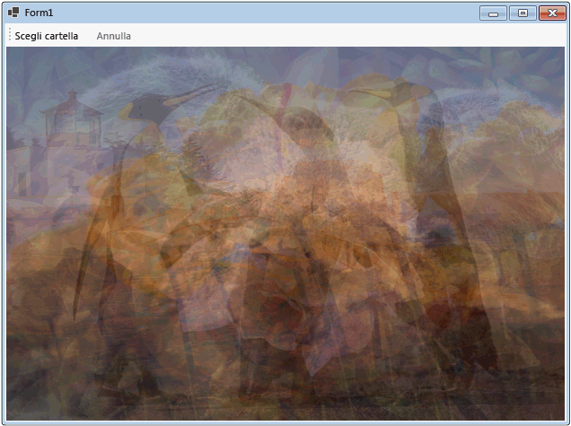

# Walkthrough: Using Dataflow in a Windows Forms Application
Questo documento illustra come creare una rete di blocchi del flusso di dati che esegue l'elaborazione di immagini in un'applicazione Windows Form.  
  
 Questo esempio carica i file di immagine dalla cartella specificata, crea un'immagine composta e visualizza il risultato.  L'esempio viene utilizzato il modello di flusso di dati per instradare le immagini tramite la rete.  Nel modello di flusso di dati i componenti indipendenti di un programma comunicano tra loro inviando messaggi.  Quando un componente riceve un messaggio, esegue una determinata azione e quindi passa il risultato a un altro componente.  Confrontare questo modello con il modello di flusso di controllo, in cui un'applicazione utilizza le strutture di controllo, ad esempio le istruzioni condizionali, i cicli e così via, per controllare l'ordine delle operazioni in un programma.  
  
## Prerequisiti  
 Prima di iniziare questa procedura dettagliata, leggere l'argomento [Flusso di dati](../../../docs/standard/parallel-programming/dataflow-task-parallel-library.md).  
  
> [!TIP]
>  La libreria del flusso di dati TPL \(spazio dei nomi <xref:System.Threading.Tasks.Dataflow?displayProperty=fullName>\) non viene distribuita con [!INCLUDE[net_v45](../../../includes/net-v45-md.md)].  Per installare lo spazio dei nomi <xref:System.Threading.Tasks.Dataflow>, aprire il progetto in [!INCLUDE[vs_dev11_long](../../../includes/vs-dev11-long-md.md)], scegliere dal menu del progetto **Gestisci pacchetti NuGet** e scegliere cerca online il pacchetto `Microsoft.Tpl.Dataflow`.  
  
> [!TIP]
>  La libreria del flusso di dati TPL \(spazio dei nomi <xref:System.Threading.Tasks.Dataflow?displayProperty=fullName>\) non viene distribuita con [!INCLUDE[net_v45](../../../includes/net-v45-md.md)].  Per installare lo spazio dei nomi <xref:System.Threading.Tasks.Dataflow>, aprire il progetto in [!INCLUDE[vs_dev11_long](../../../includes/vs-dev11-long-md.md)], scegliere dal menu del progetto **Gestisci pacchetti NuGet** e scegliere cerca online il pacchetto `Microsoft.Tpl.Dataflow`.  
  
## Sezioni  
 In questa procedura dettagliata sono contenute le sezioni seguenti:  
  
-   [Creazione dell'applicazione Windows Form](#winforms)  
  
-   [Creare la rete del flusso di dati](#network)  
  
-   [Connettere la rete del flusso di dati all'interfaccia utente](#ui)  
  
-   [Esempio completo](#complete)  
  
   
## Creazione dell'applicazione Windows Form  
 In questa sezione viene descritto come creare l'applicazione Windows Form di base e aggiungere i controlli al form principale.  
  
#### Per creare la nuova applicazione Windows Form  
  
1.  In [!INCLUDE[vsprvs](../../../includes/vsprvs-md.md)], creare un progetto [!INCLUDE[csprcs](../../../includes/csprcs-md.md)] o **Windows Forms Application** di Visual Basic.  In questo documento, il progetto viene denominato `CompositeImages`.  
  
2.  Nella finestra di progettazione del form principale, Form1.cs \(Form1.vb per [!INCLUDE[vbprvb](../../../includes/vbprvb-md.md)]\), aggiungere un controllo <xref:System.Windows.Forms.ToolStrip>.  
  
3.  Aggiungere un controllo <xref:System.Windows.Forms.ToolStripButton> al controllo <xref:System.Windows.Forms.ToolStrip>.  Impostare la proprietà <xref:System.Windows.Forms.ToolStripItem.DisplayStyle%2A> su <xref:System.Windows.Forms.ToolStripItemDisplayStyle> e la proprietà <xref:System.Windows.Forms.ToolStripItem.Text%2A> su Choose Folder.  
  
4.  Aggiungere un secondo controllo <xref:System.Windows.Forms.ToolStripButton> al controllo <xref:System.Windows.Forms.ToolStrip>.  Impostare la proprietà <xref:System.Windows.Forms.ToolStripItem.DisplayStyle%2A> a <xref:System.Windows.Forms.ToolStripItemDisplayStyle>, la proprietà <xref:System.Windows.Forms.ToolStripItem.Text%2A> per annullare, e la proprietà <xref:System.Windows.Forms.ToolStripItem.Enabled%2A> a `False`.  
  
5.  Aggiungere un oggetto <xref:System.Windows.Forms.PictureBox> al form principale.  Impostare la proprietà <xref:System.Windows.Forms.Control.Dock%2A> su <xref:System.Windows.Forms.DockStyle>.  
  
   
## Creare la rete del flusso di dati  
 In questa sezione viene descritto come creare una rete del flusso di dati che esegue l'elaborazione di immagini.  
  
#### Per creare la rete del flusso di dati  
  
1.  Aggiungere un riferimento a System.Threading.Tasks.Dataflow.dll al progetto.  
  
2.  Assicurarsi che Form1.cs \(Form1.vb per [!INCLUDE[vbprvb](../../../includes/vbprvb-md.md)]\) contenga le seguenti istruzioni `using` \(`Using` in [!INCLUDE[vbprvb](../../../includes/vbprvb-md.md)]\):  
  
     [!code-csharp[TPLDataflow_CompositeImages#1](../../../samples/snippets/csharp/VS_Snippets_Misc/tpldataflow_compositeimages/cs/compositeimages/form1.cs#1)]  
  
3.  Aggiungere i seguenti membri dati alla classe `Form1`:  
  
     [!code-csharp[TPLDataflow_CompositeImages#2](../../../samples/snippets/csharp/VS_Snippets_Misc/tpldataflow_compositeimages/cs/compositeimages/form1.cs#2)]  
  
4.  Aggiungere il seguente metodo, `CreateImageProcessingNetwork`, alla classe `Form1`.  Questo metodo crea la rete di elaborazione di immagini.  
  
     [!code-csharp[TPLDataflow_CompositeImages#3](../../../samples/snippets/csharp/VS_Snippets_Misc/tpldataflow_compositeimages/cs/compositeimages/form1.cs#3)]  
  
5.  Implementare il metodo `LoadBitmaps`.  
  
     [!code-csharp[TPLDataflow_CompositeImages#4](../../../samples/snippets/csharp/VS_Snippets_Misc/tpldataflow_compositeimages/cs/compositeimages/form1.cs#4)]  
  
6.  Implementare il metodo `CreateCompositeBitmap`.  
  
     [!code-csharp[TPLDataflow_CompositeImages#5](../../../samples/snippets/csharp/VS_Snippets_Misc/tpldataflow_compositeimages/cs/compositeimages/form1.cs#5)]  
  
    > [!NOTE]
    >  La versione C\# del metodo `CreateCompositeBitmap` utilizza puntatori per abilitare l'elaborazione efficiente degli oggetti <xref:System.Drawing.Bitmap?displayProperty=fullName>.  Pertanto, è necessario abilitare l'opzione **Consenti codice di tipo unsafe** nel progetto per utilizzare la parola chiave [unsafe](../Topic/unsafe%20\(C%23%20Reference\).md).  Per ulteriori informazioni su come abilitare il codice unsafe in un progetto [!INCLUDE[csprcs](../../../includes/csprcs-md.md)], vedere [Pagina Compilazione, Progettazione progetti \(C\#\)](../Topic/Build%20Page,%20Project%20Designer%20\(C%23\).md).  
  
 Nella tabella seguente sono descritti i membri della rete.  
  
|Membro|Type|Descrizione|  
|------------|----------|-----------------|  
|`loadBitmaps`|<xref:System.Threading.Tasks.Dataflow.TransformBlock%602>|Accetta un percorso della cartella come input e produce una raccolta di oggetti <xref:System.Drawing.Bitmap> come output.|  
|`createCompositeBitmap`|<xref:System.Threading.Tasks.Dataflow.TransformBlock%602>|Accetta una raccolta di oggetti <xref:System.Drawing.Bitmap> come input e produce una bitmap composito come output.|  
|`displayCompositeBitmap`|<xref:System.Threading.Tasks.Dataflow.ActionBlock%601>|Visualizza il bitmap composito nel form.|  
|`operationCancelled`|<xref:System.Threading.Tasks.Dataflow.ActionBlock%601>|Visualizza un'immagine per indicare che l'operazione è annullata e consente all'utente di selezionare un'altra cartella.|  
  
 Per connettere i blocchi del flusso di dati per formare una rete, in questo esempio viene utilizzato il metodo <xref:System.Threading.Tasks.Dataflow.ISourceBlock%601.LinkTo%2A>.  Il metodo <xref:System.Threading.Tasks.Dataflow.ISourceBlock%601.LinkTo%2A> contiene una versione di overload che accetta un oggetto <xref:System.Predicate%601> che stabilisce se il blocco di destinazione accetta o rifiuta un messaggio.  Questo processo di filtraggio consente ai blocchi di messaggi di ricevere solo certi valori.  In questo esempio, la rete può creare un ramo in due modi.  Il ramo principale carica le immagini dal disco, consente di creare un'immagine composta e visualizza tale immagine nel form.  Il ramo alternativo annulla l'operazione in corso.  Gli oggetti <xref:System.Predicate%601> consentono ai blocchi di dati lungo il ramo principale di passare al ramo alternativo rifiutando determinati messaggi.  Ad esempio, se l'utente annulla l'operazione, il blocco del flusso di dati `createCompositeBitmap` produce `null` \(`Nothing` in [!INCLUDE[vbprvb](../../../includes/vbprvb-md.md)]\) come output.  Il blocco del flusso di dati `displayCompositeBitmap` rifiuta i valori di input `null` e pertanto, il messaggio viene offerto a `operationCancelled`.  Il blocco del flusso di dati `operationCancelled` accetta tutti i messaggi, pertanto visualizza un'immagine per indicare che l'operazione viene annullata.  
  
 Nella figura seguente viene illustrata la rete di elaborazione di immagini.  
  
   
  
 Poiché i blocchi di dati di `operationCancelled` e `displayCompositeBitmap` agiscono sull'interfaccia utente, è importante che tali azioni si verifichino sul thread dell'interfaccia utente.  A tale scopo, durante la costruzione, questi oggetti forniscono ognuno un oggetto di <xref:System.Threading.Tasks.Dataflow.ExecutionDataflowBlockOptions> che dispone della proprietà <xref:System.Threading.Tasks.Dataflow.DataflowBlockOptions.TaskScheduler%2A> impostata a <xref:System.Threading.Tasks.TaskScheduler.FromCurrentSynchronizationContext%2A?displayProperty=fullName>.  Il metodo <xref:System.Threading.Tasks.TaskScheduler.FromCurrentSynchronizationContext%2A?displayProperty=fullName> crea un oggetto <xref:System.Threading.Tasks.TaskScheduler> che esegue il lavoro nel contesto di sincronizzazione corrente.  Poiché il metodo `CreateImageProcessingNetwork` viene chiamato dal gestore del pulsante Scelta Cartella, in esecuzione sul thread dell'interfaccia utente, le azioni per i blocchi di dati `operationCancelled` e `displayCompositeBitmap` vengono eseguiti anche sul thread dell'interfaccia utente.  
  
 In questo esempio viene utilizzato un token di annullamento condiviso anziché impostare la proprietà <xref:System.Threading.Tasks.Dataflow.DataflowBlockOptions.CancellationToken%2A> in quanto la proprietà <xref:System.Threading.Tasks.Dataflow.DataflowBlockOptions.CancellationToken%2A> annulla in modo permanente l'esecuzione del blocco di dati.  Un token di annullamento consente a questo esempio di riutilizzare più volte la stessa rete del flusso di dati, anche quando l'utente annulla una o più operazioni.  Per un esempio che utilizza <xref:System.Threading.Tasks.Dataflow.DataflowBlockOptions.CancellationToken%2A> annullare in modo permanente l'esecuzione di un blocco di dati, vedere [How to: Cancel a Dataflow Block](../../../docs/standard/parallel-programming/how-to-cancel-a-dataflow-block.md).  
  
   
## Connettere la rete del flusso di dati all'interfaccia utente  
 In questa sezione viene descritto come connettere la rete di dati all'interfaccia utente.  La creazione di un'immagine composta e l'annullamento dell'operazione vengono avviati dai pulsanti Scelta Cartella e Annulla.  Quando l'utente sceglie uno di questi pulsanti, l'azione appropriata viene avviata in modo asincrono.  
  
#### Per connettere la rete del flusso di dati all'interfaccia utente  
  
1.  Nella finestra di progettazione del form per il form principale, creare un gestore eventi per il gestore eventi <xref:System.Windows.Forms.ToolStripItem.Click> per il pulsante Scelta Cartella.  
  
2.  Implementare l'evento <xref:System.Windows.Forms.ToolStripItem.Click> per il pulsante Scelta Cartella.  
  
     [!code-csharp[TPLDataflow_CompositeImages#6](../../../samples/snippets/csharp/VS_Snippets_Misc/tpldataflow_compositeimages/cs/compositeimages/form1.cs#6)]  
  
3.  Nella finestra di progettazione del form per il form principale, creare un gestore eventi per il gestore eventi <xref:System.Windows.Forms.ToolStripItem.Click> per il pulsante Annulla.  
  
4.  Implementare il gestore eventi di <xref:System.Windows.Forms.ToolStripItem.Click> per il pulsante Annulla.  
  
     [!code-csharp[TPLDataflow_CompositeImages#7](../../../samples/snippets/csharp/VS_Snippets_Misc/tpldataflow_compositeimages/cs/compositeimages/form1.cs#7)]  
  
   
## Esempio completo  
 Nell'esempio riportato di seguito viene illustrato il codice completo per questa procedura guidata.  
  
 [!code-csharp[TPLDataflow_CompositeImages#100](../../../samples/snippets/csharp/VS_Snippets_Misc/tpldataflow_compositeimages/cs/compositeimages/form1.cs#100)]  
  
 Di seguito viene illustrato l'output tipico della cartella \\Sample Pictures\\.  
  
   
  
## Passaggi successivi  
  
## Vedere anche  
 [Flusso di dati](../../../docs/standard/parallel-programming/dataflow-task-parallel-library.md)