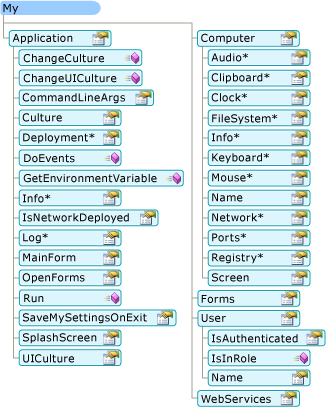
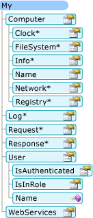

# Dipendenza di My dal tipo di progetto (Visual Basic)
`My`espone solo gli oggetti richiesti da un particolare tipo di progetto. Ad esempio, il `My.Forms` oggetto è disponibile in un'applicazione Windows Form, ma non è disponibile in un'applicazione console. Questo argomento viene descritto che `My` gli oggetti sono disponibili in diversi tipi di progetto.  
  
## In Windows le applicazioni e siti Web  
 `My`espone solo gli oggetti che sono utili per il tipo di progetto corrente. esso Elimina gli oggetti che non sono applicabili. Ad esempio, di seguito viene illustrato il `My` modello a oggetti in un progetto Windows Form.  
  
   
  
 In un progetto di sito Web, `My` espone gli oggetti che sono rilevanti per gli sviluppatori Web (ad esempio il `My.Request` e `My.Response` oggetti), eliminando gli oggetti che non sono importanti (ad esempio il `My.Forms` oggetto). La figura seguente mostra il `My` modello a oggetti in un progetto di sito Web:  
  
   
  
## Dettagli di progetto  
 Nella tabella seguente viene illustrato che `My` gli oggetti sono abilitati per impostazione predefinita per otto tipi di progetti: applicazione Windows, libreria di classi, applicazione console, libreria di controlli Windows, libreria di controlli Web, servizio Windows, vuoto e sito Web.  
  
 Sono disponibili tre versioni della `My.Application` oggetto, le due versioni della `My.Computer` oggetto e due versioni di `My.User` dell'oggetto; informazioni dettagliate su queste versioni sono espressi nel piè di pagina dopo la tabella.  
  
|My (oggetto)|Applicazione Windows|Libreria di classi|Applicazione console|Libreria di controlli Windows|Libreria di controlli Web|Servizio Windows|Empty|Sito Web|  
|---|---|---|---|---|---|---|---|---|  
|`My.Application`|**Yes** 1|**Yes** 2|**Yes** 3|**Yes** 2|No|**Yes** 3|No|No|  
|`My.Computer`|**Yes** 4|**Yes** 4|**Yes** 4|**Yes** 4|**Yes** 5|**Yes** 4|No|**Yes** 5|  
|`My.Forms`|**Sì**|No|No|**Sì**|No|No|No|No|  
|`My.Log`|No|No|No|No|No|No|No|**Sì**|  
|`My.Request`|No|No|No|No|No|No|No|**Sì**|  
|`My.Resources`|**Sì**|**Sì**|**Sì**|**Sì**|**Sì**|**Sì**|No|No|  
|`My.Response`|No|No|No|No|No|No|No|**Sì**|  
|`My.Settings`|**Sì**|**Sì**|**Sì**|**Sì**|**Sì**|**Sì**|No|No|  
|`My.User`|**Yes** 6|**Yes** 6|**Yes** 6|**Yes** 6|**Yes** 7|**Yes** 6|No|**Yes** 7|  
|`My.WebServices`|**Sì**|**Sì**|**Sì**|**Sì**|**Sì**|**Sì**|No|No|  
  
 1 versione di Windows Form di `My.Application`. Deriva dalla versione console (vedere nota 3); Aggiunge il supporto per l'interazione con le finestre dell'applicazione e fornisce il [!INCLUDE[vbprvb](../../../csharp/programming-guide/concepts/linq/includes/vbprvb_md.md)] modello di applicazione.  
  
 2 versione della libreria `My.Application`. Fornisce la funzionalità di base necessaria a un'applicazione: fornisce membri per la scrittura nel registro applicazione e l'accesso a informazioni sull'applicazione.  
  
 3 versione console di `My.Application`. Deriva dalla versione della libreria (vedere nota 2), e aggiunge membri aggiuntivi per l'accesso ad argomenti della riga di comando dell'applicazione e informazioni sulla distribuzione ClickOnce.  
  
 4 versione di Windows `My.Computer`. Deriva dalla versione del Server (vedere nota 5) e fornisce l'accesso a oggetti utili in un computer client, ad esempio la tastiera, schermo e del mouse.  
  
 5 versione server di `My.Computer`. Fornisce informazioni di base relative al computer, ad esempio il nome, l'accesso per l'orologio e così via.  
  
 6 versione di Windows `My.User`. Questo oggetto è associato l'identità del thread corrente.  
  
 7 versione web del `My.User`. Questo oggetto è associato l'identità dell'utente della richiesta HTTP corrente dell'applicazione.  
  
## Vedere anche  
 <xref:Microsoft.VisualBasic.ApplicationServices.ApplicationBase></xref:Microsoft.VisualBasic.ApplicationServices.ApplicationBase>   
 <xref:Microsoft.VisualBasic.Devices.Computer></xref:Microsoft.VisualBasic.Devices.Computer>   
 <xref:Microsoft.VisualBasic.Logging.Log></xref:Microsoft.VisualBasic.Logging.Log>   
 <xref:Microsoft.VisualBasic.ApplicationServices.User></xref:Microsoft.VisualBasic.ApplicationServices.User>   
 [Personalizzazione degli oggetti sono disponibili in My](../../../visual-basic/developing-apps/customizing-extending-my/customizing-which-objects-are-available-in-my.md)   
 [Compilazione condizionale](../../../visual-basic/programming-guide/program-structure/conditional-compilation.md)   
 [/define (Visual Basic)](../../../visual-basic/reference/command-line-compiler/define.md)   
 [Forms (oggetto)](../../../visual-basic/language-reference/objects/my-forms-object.md)   
 [Oggetto My. Request](../../../visual-basic/language-reference/objects/my-request-object.md)   
 [Oggetto My. Response](../../../visual-basic/language-reference/objects/my-response-object.md)   
 [Oggetto My.WebServices](../../../visual-basic/language-reference/objects/my-webservices-object.md)
