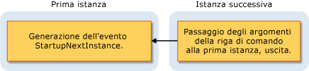

# Overview of the Visual Basic Application Model
[!INCLUDE[vs2017banner](../../../csharp/includes/vs2017banner.md)]

[!INCLUDE[vbprvb](../../../csharp/programming-guide/concepts/linq/includes/vbprvb_md.md)] fornisce un modello ben definito per il controllo del comportamento delle applicazioni Windows Form: il modello applicativo di [!INCLUDE[vbprvb](../../../csharp/programming-guide/concepts/linq/includes/vbprvb_md.md)].  In tale modello sono compresi gli eventi per la gestione dell'avvio e della chiusura dell'applicazione, nonché gli eventi per l'intercettazione di eccezioni non gestite.  Inoltre, viene fornito il supporto per lo sviluppo di applicazioni a singola istanza.  Il modello dell'applicazione è estensibile; quindi gli sviluppatori che desiderano disporre di un maggiore controllo possono personalizzare i metodi sovrascrivibili contenuti nel modello.  
  
## Utilizzi del modello Applicazione  
 Un'applicazione tipica viene utilizzata per eseguire delle attività quando viene avviata e quando viene chiusa.  Ad esempio, in un'applicazione avviata è possibile visualizzare una schermata iniziale, creare connessioni di database, caricare uno stato salvato e così via.  Quando si chiude un'applicazione, è possibile chiudere le connessioni del database, salvare lo stato corrente e così via.  Inoltre, l'applicazione consente di eseguire un codice specifico quando si interrompe improvvisamente, ad esempio durante un'eccezione non gestita.  
  
 Il modello applicativo di [!INCLUDE[vbprvb](../../../csharp/programming-guide/concepts/linq/includes/vbprvb_md.md)] semplifica la creazione di un'applicazione *a istanza singola*.  Diversamente da una normale applicazione, in un'applicazione a singola istanza è possibile eseguire una sola istanza per volta.  Se si tenta di avviare un'altra istanza di un'applicazione a singola istanza, viene inviata una notifica all'istanza originale, attraverso un evento `StartupNextInstance`, per comunicare il tentativo di avvio.  Nella notifica sono compresi gli argomenti della riga di comando della seconda istanza.  La seconda istanza dell'applicazione viene quindi chiusa prima dell'esecuzione dell'inizializzazione.  
  
 Quando viene avviata, un'applicazione a singola istanza verifica se è la prima o la seconda istanza dell'applicazione:  
  
-   Se è la prima istanza, l'applicazione viene eseguita normalmente.  
  
-   Tutti i tentativi successivi di avvio dell'applicazione, durante l'esecuzione della prima istanza, provocano un comportamento molto diverso.  Il secondo tentativo notifica alla prima istanza gli argomenti della riga di comando e viene immediatamente interrotto.  La prima istanza gestisce l'evento `StartupNextInstance` per individuare gli argomenti della riga di comando della seconda istanza, e prosegue l'esecuzione.  
  
     In questo diagramma viene mostrato il modo in cui la seconda istanza comunica con la prima istanza.  
  
       
  
 Gestendo l'evento `StartupNextInstance`, è possibile controllare il comportamento dell'applicazione a singola istanza.  Ad esempio, Microsoft Outlook di solito viene eseguito come applicazione a singola istanza; quando Outlook è in esecuzione e si tenta di avviarlo nuovamente, lo stato attivo viene spostato sull'istanza originale ma l'altra istanza non viene aperta.  
  
## Eventi nel modello Applicazione  
 Nel modello applicazione sono presenti i seguenti eventi:  
  
-   **Avvio dell'applicazione**.  L'applicazione genera l'evento <xref:Microsoft.VisualBasic.ApplicationServices.WindowsFormsApplicationBase.Startup> all'avvio.  Gestendo questo evento, è possibile aggiungere un codice per l'inizializzazione dell'applicazione prima di caricare il form principale.  L'evento `Startup` consente anche di annullare l'esecuzione dell'applicazione durante quella fase del processo di avvio, se necessario.  
  
     È possibile configurare l'applicazione in modo da mostrare la schermata iniziale durante l'esecuzione del codice di avvio dell'applicazione.  Per impostazione predefinita, il modello dell'applicazione elimina la schermata iniziale quando viene utilizzato l'argomento della riga di comando `/nosplash` o `-nosplash`.  
  
-   **Applicazioni a singola istanza**.  L'evento <xref:Microsoft.VisualBasic.ApplicationServices.WindowsFormsApplicationBase.StartupNextInstance> viene generato quando viene avviata un'istanza successiva di un'applicazione a singola istanza.  Gli argomenti della riga di comando della seconda istanza vengono inviati dall'evento.  
  
-   **Eccezioni non gestite**.  Se l'applicazione rileva un'eccezione non gestita, genera l'evento <xref:Microsoft.VisualBasic.ApplicationServices.WindowsFormsApplicationBase.UnhandledException>.  Il gestore di quell'evento consente di esaminare l'eccezione e di stabilire se continuare l'esecuzione.  
  
     In alcuni casi l'evento `UnhandledException` non viene generato.  Per ulteriori informazioni, vedere <xref:Microsoft.VisualBasic.ApplicationServices.WindowsFormsApplicationBase.UnhandledException>.  
  
-   **Modifiche alla connettività della rete**.  Se la disponibilità di rete del computer cambia, l'applicazione genera l'evento <xref:Microsoft.VisualBasic.ApplicationServices.WindowsFormsApplicationBase.NetworkAvailabilityChanged>.  
  
     In alcuni casi l'evento `NetworkAvailabilityChanged` non viene generato.  Per ulteriori informazioni, vedere <xref:Microsoft.VisualBasic.ApplicationServices.WindowsFormsApplicationBase.NetworkAvailabilityChanged>.  
  
-   **Chiusura dell'applicazione**.  L'applicazione fornisce l'evento <xref:Microsoft.VisualBasic.ApplicationServices.WindowsFormsApplicationBase.Shutdown> per indicare quando sta per essere arrestata.  Nel gestore di quell'evento, è possibile assicurarsi che le operazioni necessarie per l'applicazione, come la chiusura e il salvataggio, siano state completate.  È possibile configurare l'applicazione affinché venga chiusa quando viene chiuso il form principale oppure solo quando vengono chiusi tutti i form.  
  
## Disponibilità  
 Per impostazione predefinita, il modello applicativo di [!INCLUDE[vbprvb](../../../csharp/programming-guide/concepts/linq/includes/vbprvb_md.md)] è disponibile per i progetti Windows Form.  Se si configura l'applicazione in modo da utilizzare un diverso oggetto di avvio, oppure da avviare il codice dell'applicazione con `Sub Main` personalizzato, può essere richiesto all'oggetto o alla classe di fornire un'implementazione della classe <xref:Microsoft.VisualBasic.ApplicationServices.WindowsFormsApplicationBase> per utilizzare il modello dell'applicazione.  Per informazioni sulla modifica dell'oggetto di avvio, vedere [Pagina Applicazione, Creazione progetti \(Visual Basic\)](/visual-studio/ide/reference/application-page-project-designer-visual-basic).  
  
## Vedere anche  
 <xref:Microsoft.VisualBasic.ApplicationServices.WindowsFormsApplicationBase>   
 <xref:Microsoft.VisualBasic.ApplicationServices.WindowsFormsApplicationBase.Startup>   
 <xref:Microsoft.VisualBasic.ApplicationServices.WindowsFormsApplicationBase.StartupNextInstance>   
 <xref:Microsoft.VisualBasic.ApplicationServices.WindowsFormsApplicationBase.UnhandledException>   
 <xref:Microsoft.VisualBasic.ApplicationServices.WindowsFormsApplicationBase.Shutdown>   
 <xref:Microsoft.VisualBasic.ApplicationServices.WindowsFormsApplicationBase.NetworkAvailabilityChanged>   
 <xref:Microsoft.VisualBasic.ApplicationServices.WindowsFormsApplicationBase>   
 [Extending the Visual Basic Application Model](../../../visual-basic/developing-apps/customizing-extending-my/extending-the-visual-basic-application-model.md)