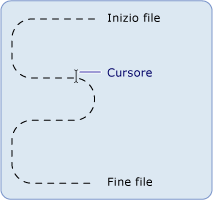

# Nozioni fondamentali sul file system e sulla funzionalit&#224; di I/O di file di .NET Framework (Visual Basic)
[!INCLUDE[vs2017banner](../../../../visual-basic/developing-apps/includes/vs2017banner.md)]

Le classi dello spazio dei nomi <xref:System.IO> si usano per lavorare con unità, file e directory.  
  
 Lo spazio dei nomi <xref:System.IO> contiene le classi <xref:System.IO.File> e <xref:System.IO.Directory> che forniscono la funzionalità [!INCLUDE[dnprdnshort](../../../../csharp/getting-started/includes/dnprdnshort-md.md)] per la gestione di file e directory. Poiché i metodi di questi oggetti sono membri statici o condivisi, è possibile usarli direttamente senza prima creare un'istanza della classe. Associate a queste classi sono le classi <xref:System.IO.FileInfo> e <xref:System.IO.DirectoryInfo> che saranno note agli utenti della funzionalità `My`. Per usare queste classi è necessario specificare in modo completo i nomi oppure importare gli spazi dei nomi appropriati, includendo le istruzioni `Imports` all'inizio del codice in questione. Per altre informazioni, vedere [Istruzione Imports (tipo e spazio dei nomi .NET)](../../../../visual-basic/language-reference/statements/imports-statement-net-namespace-and-type.md).  
  
> [!NOTE]
>  Altri argomenti di questa sezione usano l'oggetto `My.Computer.FileSystem` anziché le classi `System.IO` per lavorare con unità, file e directory. L'oggetto `My.Computer.FileSystem` è destinato principalmente all'uso nei programmi [!INCLUDE[vbprvb](../../../../csharp/programming-guide/concepts/linq/includes/vbprvb-md.md)]. Le classi `System.IO` sono destinate all'uso da parte di qualsiasi linguaggio che supporta il [!INCLUDE[dnprdnshort](../../../../csharp/getting-started/includes/dnprdnshort-md.md)], tra cui [!INCLUDE[vbprvb](../../../../csharp/programming-guide/concepts/linq/includes/vbprvb-md.md)].  
  
## Definizione di un flusso  
 Il [!INCLUDE[dnprdnshort](../../../../csharp/getting-started/includes/dnprdnshort-md.md)] usa i flussi per supportare la lettura e scrittura su file. Un flusso è paragonabile a un set unidimensionale di dati contigui, con un inizio e una fine, e in cui il cursore indica la posizione corrente nel flusso.  
  
   
  
## Operazioni di flusso  
 I dati contenuti nel flusso possono provenire dalla memoria, da un file o da un socket TCP/IP. Ai flussi è possibile applicare alcune operazioni fondamentali:  
  
-   Lettura. È possibile leggere da un flusso, trasferendo i dati dal flusso in una struttura di dati, ad esempio una stringa o una matrice di byte.  
  
-   **Scrittura**. È possibile scrivere in un flusso, trasferendo i dati da un'origine dati nel flusso.  
  
-   **Ricerca**. È possibile eseguire una query e modificare la propria posizione nel flusso.  
  
 Per altre informazioni, vedere [Composing Streams](../Topic/Composing%20Streams.md).  
  
## Tipi di flussi  
 In [!INCLUDE[dnprdnshort](../../../../csharp/getting-started/includes/dnprdnshort-md.md)] un flusso è rappresentato dalla classe <xref:System.IO.Stream> che costituisce la classe astratta per tutti i flussi. Non è possibile creare direttamente un'istanza della classe <xref:System.IO.Stream> ma è necessario usare una delle classi che essa implementa.  
  
 Esistono molti tipi di flussi, ma per lavorare con l'input/output (I/O) su file, i tipi più importanti sono la classe <xref:System.IO.FileStream>, che fornisce un modo per leggere e scrivere sui file, e la classe <xref:System.IO.IsolatedStorage.IsolatedStorageFileStream>, che consente di creare file e directory in uno spazio di memorizzazione isolato. Altri flussi che possono essere usati quando si lavora con l'I/O su file includono:  
  
-   <xref:System.IO.BufferedStream>  
  
-   <xref:System.Security.Cryptography.CryptoStream>  
  
-   <xref:System.IO.MemoryStream>  
  
-   <xref:System.Net.Sockets.NetworkStream>.  
  
 La tabella seguente elenca le attività comunemente eseguite con un flusso:  
  
|||  
|-|-|  
|Per|Vedere|  
|Leggere e scrivere in un file di dati|[Procedura: Leggere e scrivere su un file di dati appena creato](../Topic/How%20to:%20Read%20and%20Write%20to%20a%20Newly%20Created%20Data%20File.md)|  
|Leggere testo da un file|[Procedura: Leggere testo da un file](../Topic/How%20to:%20Read%20Text%20from%20a%20File.md)|  
|Scrivere testo in un file|[Procedura: Scrivere un testo in un file](../Topic/How%20to:%20Write%20Text%20to%20a%20File.md)|  
|Leggere caratteri da una stringa|[Procedura: Leggere caratteri da una stringa](../Topic/How%20to:%20Read%20Characters%20from%20a%20String.md)|  
|Scrivere caratteri in una stringa|[Procedura: Scrivere caratteri in una stringa](../Topic/How%20to:%20Write%20Characters%20to%20a%20String.md)|  
|Crittografare i dati|[Crittografia di dati](../Topic/Encrypting%20Data.md)|  
|Decrittografare i dati|[Decrittografia di dati](../Topic/Decrypting%20Data.md)|  
  
## Accesso ai file e attributi  
 È possibile controllare in che modo i file vengono creati, aperti e condivisi con le enumerazioni <xref:System.IO.FileAccess>, <xref:System.IO.FileMode>, e <xref:System.IO.FileShare>, che contengono i flag usati dai costruttori della classe <xref:System.IO.FileStream>. Ad esempio, quando si apre o si crea una nuova classe <xref:System.IO.FileStream>, l'enumerazione <xref:System.IO.FileMode> consente di specificare se il file viene aperto per operazioni di accodamento, se viene creato un nuovo file quando il file specificato non esiste, se il file viene sovrascritto e così via.  
  
 L'enumerazione <xref:System.IO.FileAttributes> consente la raccolta di informazioni specifiche del file. L'enumerazione <xref:System.IO.FileAttributes> restituisce gli attributi del file archiviato, ad esempio se è compresso, crittografato, nascosto, in sola lettura, un archivio, una directory, un file di sistema o un file temporaneo.  
  
 La tabella seguente elenca le attività che coinvolgono l'accesso ai file e gli attributi di file:  
  
|||  
|-|-|  
|**Per**|**Vedere**|  
|Aprire e accodare testo in un file di log|[Procedura: Aprire e accodare un file di log](../Topic/How%20to:%20Open%20and%20Append%20to%20a%20Log%20File.md)|  
|Determinare gli attributi di un file|<xref:System.IO.FileAttributes>|  
  
## Autorizzazioni di file  
 Il controllo dell'accesso ai file e alle directory può essere eseguito con la classe <xref:System.Security.Permissions.FileIOPermission>. Questo può essere particolarmente importante per gli sviluppatori che lavorano con i Web Form che, per impostazione predefinita, vengono eseguiti nel contesto di un account utente locale speciale denominato ASPNET, che viene creato come parte delle installazioni di [!INCLUDE[vstecasp](../../../../csharp/language-reference/preprocessor-directives/includes/vstecasp-md.md)] e [!INCLUDE[dnprdnshort](../../../../csharp/getting-started/includes/dnprdnshort-md.md)] . Quando una tale applicazione richiede l'accesso a una risorsa, l'account utente ASPNET dispone di autorizzazioni limitate, che potrebbero impedire all'utente di eseguire azioni quali la scrittura in un file da un'applicazione Web. Per altre informazioni, vedere [Autorizzazioni di sicurezza](http://msdn.microsoft.com/it-it/b03757b4-e926-4196-b738-3733ced2bda0) e <xref:System.Security.Permissions.FileIOPermission>.  
  
## Archiviazione di file isolati  
 Lo spazio di archiviazione isolato è un tentativo di risolvere i problemi creati durante l'uso dei file in cui l'utente o il codice non dispone delle autorizzazioni necessarie. Lo spazio di archiviazione isolato assegna a ciascun utente un raggruppamento di dati che può contenere uno o più archivi. Gli archivi possono essere isolati gli uni dagli altri per utente e per assembly. Solo l'utente e l'assembly che ha creato l'archivio può accedervi. Un archivio opera come un file system virtuale completo: all'interno di un archivio è possibile creare e modificare directory e file.  
  
 La tabella seguente elenca le attività comunemente associate all'archiviazione di file isolati.  
  
|||  
|-|-|  
|Per|Vedere|  
|Creare un spazio di memorizzazione isolato|[Procedura: Recuperare archivi per lo spazio di memorizzazione isolato](../Topic/How%20to:%20Obtain%20Stores%20for%20Isolated%20Storage.md)|  
|Enumerare gli spazi di memorizzazione isolati|[Procedura: Enumerare gli archivi per lo spazio di memorizzazione isolato](../Topic/How%20to:%20Enumerate%20Stores%20for%20Isolated%20Storage.md)|  
|Eliminare un spazio di memorizzazione isolato|[Procedura: Eliminare gli archivi nello spazio di memorizzazione isolato](../Topic/How%20to:%20Delete%20Stores%20in%20Isolated%20Storage.md)|  
|Creare un file o una directory in un spazio di memorizzazione isolato|[Procedura: Creare file e directory nello spazio di memorizzazione isolato](../Topic/How%20to:%20Create%20Files%20and%20Directories%20in%20Isolated%20Storage.md)|  
|Trovare un file in un spazio di memorizzazione isolato|[Procedura: Trovare file e directory esistenti nello spazio di memorizzazione isolato](../Topic/How%20to:%20Find%20Existing%20Files%20and%20Directories%20in%20Isolated%20Storage.md)|  
|Leggere o scrivere su un file in un spazio di memorizzazione isolato|[Procedura: Leggere e scrivere sui file nello spazio di memorizzazione isolato](../Topic/How%20to:%20Read%20and%20Write%20to%20Files%20in%20Isolated%20Storage.md)|  
|Eliminare un file o una directory in un spazio di memorizzazione isolato|[Procedura: Eliminare file e directory nello spazio di memorizzazione isolato](../Topic/How%20to:%20Delete%20Files%20and%20Directories%20in%20Isolated%20Storage.md)|  
  
## Eventi di file  
 Il componente <xref:System.IO.FileSystemWatcher> consente di controllare le modifiche nei file e nelle directory del sistema o in qualsiasi computer a cui si ha accesso dalla rete. Ad esempio, se un file viene modificato, è consigliabile inviare all'utente un avviso che la modifica ha avuto luogo. Quando vengono apportate modifiche, vengono generati uno o più eventi, che vengono archiviati in un buffer e consegnati al componente <xref:System.IO.FileSystemWatcher> per l'elaborazione.  
  
## Vedere anche  
 [Composizione dei flussi](../Topic/Composing%20Streams.md)   
 [I/O di file e di flussi](../Topic/File%20and%20Stream%20I-O.md)   
 [I/O di file asincrono](../Topic/Asynchronous%20File%20I-O.md)   
 [Classes Used in .NET Framework File I/O and the File System (Visual Basic)](../../../../visual-basic/developing-apps/programming/drives-directories-files/classes-used-in-net-framework-file-io-and-the-file-system.md) (Classi usate nel file system e nella funzionalità di I/O di file di .NET Framework (Visual Basic))